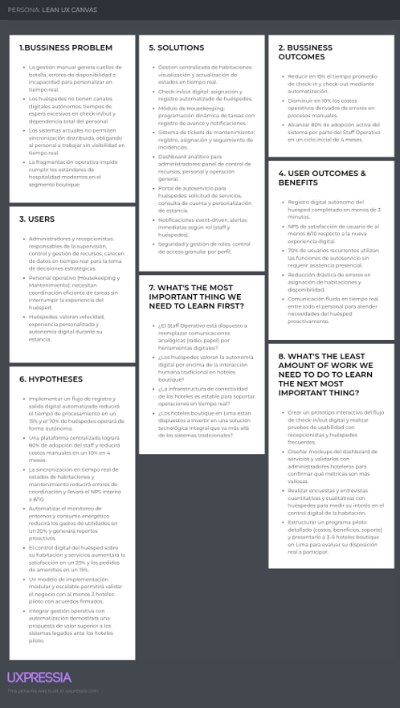

# Chapter I: Introduction

## 1.1. Startup Profile

### 1.1.1 Descripción de la Startup

La startup Smart Stay surge con el objetivo de transformar la gestión hotelera mediante el uso de tecnologías digitales e Internet of Things (IoT). Nuestra propuesta integra en una sola solución la administración de huéspedes, control de habitaciones y servicios mediante una arquitectura de microservicios y conectividad constante.

A diferencia de soluciones tradicionales, Smart Stay se enfoca en una experiencia móvil robusta, ofreciendo una aplicación nativa en Android (Kotlin) para la gestión operativa del personal y una aplicación multiplataforma en Flutter para el autoservicio y confort del huésped. A través de estas interfaces, el hotel puede optimizar recursos y, al mismo tiempo, ofrecer experiencias personalizadas y automatizadas que elevan el estándar de hospitalidad.

Entre sus principales características destacan:
- Gestión de Acceso Digital: Registro automático y control de acceso a habitaciones desde dispositivos móviles.
- Control de Entorno IoT: Monitoreo y ajuste de temperatura, iluminación y consumo energético de forma remota.
- Servicios Personalizados: Integración de room service y programación de limpieza con notificaciones en tiempo real.
- Optimización Operativa: Tableros de estado para identificación inmediata de habitaciones libres o en mantenimiento.

### 1.1.2 Perfiles de integrantes del equipo

<table border="1" cellspacing="0" cellpadding="2">
<thead>
<tr>

<th>
Integrantes
</th>
<th>
Código
</th>
<th>
Descripción
</th>

</tr>
</thead>

<tbody>

<tr>
<th>

</th>
<th>
Howard Robles Guillermo Arturo - U202222275
</th>
<th>
Soy estudiante de Ingeniería de Software, enfocado y en constante aprendizaje. Me apasiona investigar y analizar problemas para proponer soluciones innovadoras. Busco desarrollar software integral, aplicando las buenas prácticas y tecnologías modernas que aseguren eficiencia, escalabilidad, calidad y mejora continua en cada proyecto.</th>
</tr>

<tr>
<th>

</th>
<th>
Santur Tello Andrea Elizabeth - U202310988
</th>
<th>
Estoy cursando el octavo ciclo de mi carrera Ingeniería de Software, soy una persona responsable que le gusta resolver desafíos a la par con el trabajo responsable y en equipo tengo la capacidad de líder y me gusta aprender nuevas cosas dia a dia.</th>
</tr>

<tr>
<th>

</th>
<th>
Verona Flores, Ítalo Sebastián - U20221E617
</th>
<th>
Soy un estudiante con experiencia en programación y diseño de bases de datos. Tengo capacidad para resolver problemas técnicos complejos y dominio de herramientas de desarrollo que facilitan la integración de servicios RESTful.</th>
</tr>

<tr>
<th>

</th>
<th>
Arévalo Meza, John Telesforo - U202117377
</th>
<th>
Soy estudiante de Ingeniería de Software, con experiencia y gusto por las ramas de programación y redes. Busco ceñirme a estándares y lineamientos a fin de garantizar la calidad del trabajo.</th>
</tr>

</tbody>
</table>

## 1.2 Solution Profile

### 1.2.1 Antecedentes y problemática

Who? (¿Quiénes?) El problema afecta al Staff Operativo (limpieza, administración, mantenimiento y recepción) y a los huéspedes que buscan autonomía. El Staff Operativo depende de procesos manuales que fragmentan la comunicación interna. Los huéspedes, por su parte, enfrentan una experiencia desconectada que limita su control sobre el entorno de la habitación y la interacción con los servicios del hotel.

What? (¿Qué?) El problema central es la nula movilidad y falta de integración digital en la gestión hotelera integral. Esto se traduce en una dependencia de terminales fijas, control ineficiente de habitaciones por falta de datos en tiempo real (IoT), y una experiencia del huésped desconectada de los servicios del hotel.

Where? (¿Dónde?) Ocurre en hoteles de tamaño mediano a grande, donde la complejidad operativa y el volumen de huéspedes hacen que los procesos manuales sean ineficientes. La falta de movilidad afecta tanto a las áreas de servicio como a las habitaciones, generando cuellos de botella en la gestión diaria.

When? (¿Cuándo?) Ocurre de manera continua las 24 horas. La ineficiencia se agudiza en momentos críticos como los procesos de check-in/check-out, horas pico de solicitudes de servicios, y temporadas de alta ocupación donde la respuesta inmediata es vital para la satisfacción.

Why? (¿Por qué?) Se debe a la dependencia de sistemas tradicionales (Legacy Systems) que no permiten la interoperabilidad. Existe una carencia de una arquitectura de software moderna que integre servicios RESTful con tecnología IoT, impidiendo el monitoreo de recursos y la personalización del confort del huésped de forma remota y automatizada.

How? (¿Cómo?) La falta de una solución móvil integrada genera ineficiencias operativas, pérdida de productividad y una experiencia del huésped fragmentada. El personal del hotel no puede acceder a información en tiempo real ni gestionar las habitaciones de manera eficiente, mientras que los huéspedes no pueden controlar su entorno ni interactuar con los servicios del hotel desde sus dispositivos móviles.

How Much? (¿Cuánto?) La ineficiencia genera una pérdida estimada del 15-20% en la productividad operativa y un aumento innecesario en los costos de suministros y energía por falta de monitoreo. Además, la baja calificación en la experiencia de usuario (User Experience) se traduce en una disminución de la lealtad del cliente y una pérdida de competitividad frente a hoteles tecnológicamente avanzados.

### 1.2.2 Lean UX Process

#### 1.2.2.1. Lean UX Problem Statements

Problem Statement: Optimización de la Gestión Operativa y Experiencia del Huésped

El servicio de Smart Stay busca transformar la gestión hotelera mediante una solución móvil integral que conecte al Staff Operativo con las necesidades en tiempo real de los huéspedes. A través de nuestras aplicaciones móviles, el personal puede administrar de manera eficiente las habitaciones y servicios, mientras que los huéspedes obtienen el control total de su estancia.

Hemos identificado que la dependencia de procesos manuales y sistemas estáticos genera errores críticos en la disponibilidad de habitaciones, tiempos de respuesta lentos en servicios de limpieza y una falta de personalización inmediata. Actualmente, el Staff Operativo carece de una herramienta móvil centralizada que permita la automatización y el monitoreo en tiempo real de los recursos del hotel.

¿Cómo podríamos digitalizar y automatizar la interacción entre el Staff Operativo y los huéspedes a través de aplicaciones móviles para reducir errores, optimizar la coordinación interna y ofrecer una experiencia personalizada basada en datos en tiempo real?

Proposed Solutions (Features)

Para abordar esta problemática, la solución se centrará en las siguientes funcionalidades integradas en las aplicaciones móviles:

- Gestión de Inventario de Habitaciones (Staff App): Visualización centralizada del estado de cada habitación (disponible, ocupada, en mantenimiento) con actualizaciones instantáneas.
- Check-in y Check-out Digital: Proceso automatizado para que el huésped registre su entrada y salida desde su dispositivo, sincronizándose con el sistema del hotel.
- Gestión de Housekeeping (Staff App): Asignación y seguimiento de tareas de limpieza en tiempo real, con notificaciones al personal cuando una habitación requiere atención.
- Control de Incidencias de Mantenimiento: Registro fotográfico y seguimiento de averías reportadas por el personal o el huésped, con flujo de resolución asignado.
- Dashboard Operativo para el Staff: Panel de control dentro de la aplicación para que el Staff Operativo gestione recursos, personal y métricas de ocupación diaria.
- Centro de Servicios al Huésped (Guest App): Interfaz para solicitar amenities, servicios de habitación o asistencia técnica de manera autónoma.
- Motor de Notificaciones Inteligentes: Alertas en tiempo real para el personal sobre nuevas solicitudes y confirmaciones de servicio para los huéspedes.
- Control de Acceso y Seguridad: Gestión de llaves digitales y roles de usuario (Staff Operativo vs. Huésped) con permisos diferenciados.

Business Outcomes

Objetivo: Incrementar la eficiencia operativa y reducir costos por procesos manuales en un periodo de 4 meses.

Key Results (KR):

- Reducir en un 20% el tiempo de respuesta del Staff Operativo ante solicitudes de servicios.
- Disminuir en un 10% los errores en el registro de disponibilidad de habitaciones.
- Lograr que el 85% de las tareas de limpieza se reporten y completen a través de la aplicación móvil.

User Outcomes

Objetivo: Proporcionar una experiencia de usuario fluida y autónoma que maximice la satisfacción del huésped y la productividad del staff.

Key Results (KR):

- Lograr que los huéspedes realicen solicitudes de servicios en menos de 45 segundos a través de la aplicación.
- Obtener una calificación promedio de satisfacción de 4.5/5 estrellas en las tiendas de aplicaciones sobre la facilidad de uso.
- Reducir en un 50% la necesidad de que el huésped acuda físicamente a recepción para consultas básicas.

#### 1.2.2.2. Lean UX Assumptions

Business Assumptions:

1.- Creo que mis clientes necesitan: Una solución integral de gestión hotelera que automatice procesos mediante aplicaciones móviles, optimice el uso de recursos y proporcione una experiencia personalizada a los huéspedes a través de tecnología IoT.

2.- Estas necesidades se pueden resolver con: Un ecosistema de aplicaciones móviles (Android y Flutter) integradas con servicios RESTful y dispositivos IoT que permitan el monitoreo en tiempo real de habitaciones y el control personalizado del ambiente.

3.- Mis clientes iniciales son (o serán): Hoteles boutique y de lujo (3-5 estrellas) con una infraestructura de 50 a 200 habitaciones ubicados en zonas turísticas de Lima Metropolitana.

4.- El valor #1 que un cliente quiere de mi servicio es: Optimización operativa mediante movilidad que reduzca costos y mejore la eficiencia del Staff Operativo, junto con una experiencia tecnológica diferenciada para los huéspedes.

5.- El cliente también puede obtener estos beneficios adicionales:

- Reducción del 20-30% en costos de energía y servicios públicos mediante monitoreo IoT.
- Visualización de datos operativos en tiempo real desde dispositivos móviles.
- Sincronización inmediata entre las tareas de limpieza y el estado de recepción.
- Reportes automatizados de ocupación y rendimiento de recursos.

6.- Voy a adquirir la mayoría de mis clientes a través de: Marketing directo a gerentes hoteleros, presencia en ferias de hospitalidad (como la Feria Gastronómica y Hotelera de Perú) y alianzas estratégicas con proveedores de hardware IoT.

7.- Haré dinero a través de: Un modelo de suscripción mensual basado en el número de habitaciones gestionadas (SaaS), sumado a una tarifa inicial por implementación de infraestructura IoT y configuración del servicio.

8.- Mi competencia principal en el mercado será: Sistemas de gestión hotelera tradicionales (PMS) que carecen de movilidad nativa, y startups de hotel-tech que no integran el control de la habitación (IoT) en su oferta core.

9.- Los venceremos debido a: Nuestra especialización en movilidad dual (Staff/Huésped), la integración nativa con sensores IoT para personalización del confort y una interfaz diseñada bajo principios de arquitectura de información móvil.

10.- Mi mayor riesgo de producto es: La inestabilidad de la conectividad WiFi en infraestructuras antiguas y la resistencia del Staff Operativo a sustituir métodos manuales por flujos totalmente digitales en dispositivos móviles.

11.- Resolveremos esto a través de:

- Implementación de un programa piloto con soporte técnico presencial 24/7.
- Capacitación intensiva enfocada en la facilidad de uso de las aplicaciones móviles.
- Modelos de financiamiento para la actualización de la infraestructura de red del hotel.

12.- ¿Qué otras suposiciones tenemos que, si se prueba que es falso, causará que nuestro negocio/proyecto no funcione?

- Los hoteles cuentan con una red estable para soportar el tráfico de datos de sensores IoT.
- El Staff Operativo puede portar dispositivos móviles durante toda su jornada laboral sin inconvenientes.
- Los huéspedes valoran la interacción digital por encima de la interacción humana tradicional en servicios de habitación.

User Assumptions:

1.- ¿Quién es el usuario? Los usuarios son el Staff Operativo (limpieza, mantenimiento y recepción) y los huéspedes. El staff busca agilizar la coordinación de tareas sin depender de bases fijas, mientras que los huéspedes buscan autonomía en el control de su estancia.

2.- ¿Dónde encaja nuestro producto en su trabajo o vida? Smart Stay se integra en el flujo diario de trabajo: el Staff Operativo recibe órdenes de servicio y actualiza estados de habitaciones en su aplicación Android mientras se desplaza por el hotel. El huésped usa la aplicación en Flutter para gestionar su confort y servicios desde su llegada hasta el check-out.

3.- ¿Qué problemas tiene nuestro producto y cómo se puede resolver? El problema principal es la fragmentación de la información y los tiempos muertos en la comunicación interna. Se resuelve mediante notificaciones automáticas entre aplicaciones y la visualización instantánea del estado de los recursos capturados por IoT.

4.- ¿Cuándo y cómo es usado nuestro producto? Es usado continuamente: el Staff Operativo lo utiliza al iniciar turnos de limpieza o al detectar averías; los huéspedes lo activan durante su estancia para ajustar temperatura, iluminación o solicitar servicios de habitación de forma digital.

5.- ¿Qué características son importantes?

- Actualización en tiempo real de disponibilidad de habitaciones (Staff App).
- Gestión de tareas de limpieza y mantenimiento (Staff App).
- Control de dispositivos de habitación mediante IoT (Guest App).
- Solicitud digital de servicios y contacto rápido (Guest App).
- Roles y permisos de seguridad diferenciados.

6.- ¿Cómo debe verse nuestro producto y cómo debe comportarse? Debe verse profesional, moderno y ser extremadamente intuitivo (UX móvil). Debe comportarse de forma fluida, con tiempos de respuesta mínimos y ser accesible para usuarios con distintos niveles de alfabetización digital, siguiendo guías de Material Design.

#### 1.2.2.3. Lean UX Hypothesis Statements

Hypothesis 1: Mobile Check-in/Check-out Autonomy

We believe that implementing an automated digital check-in and check-out system within the Guest App (Flutter) will reduce the average time for these processes by 15%.

We will know we are successful when we see that guests complete their registration in less than 3 minutes and 70% of them use the mobile system without needing assistance from the reception staff.

Hypothesis 2: Staff Operativo Efficiency and Adoption

We believe that providing an intuitive native Android application for the Staff Operativo (housekeeping and maintenance) will achieve at least 80% adoption of the system for their daily coordination tasks.

We will know this is true when we see consistent daily use of the Staff App and a 10% reduction in manual operational costs after the first 4 months of implementation.

Hypothesis 3: Digital Service Satisfaction

We believe that offering a faster and clearer mobile management experience for both guests and the Staff Operativo will significantly improve overall service satisfaction.

We will know we are successful when we see a satisfaction score (NPS) of at least 8/10 and that 70% of returning users interact with hotel services via the App without physical intervention.

Hypothesis 4: IoT-Driven Resource Optimization

We believe that integrating IoT devices for monitoring temperature and energy consumption, accessible via the Staff App, will optimize the hotel's resource usage.

We will know this is true when we see a 20% reduction in utility expenses and the generation of detailed consumption reports through the RESTful API services.

Hypothesis 5: In-Room Experience Personalization

We believe that allowing guests to directly control their room's environment (lighting, temperature) and schedule services through the Guest App will increase the consumption of additional hotel services.

We will know we are successful when we see a 25% increase in satisfaction scores regarding room comfort and a 15% increase in digital room service orders.

Hypothesis 6: Boutique Hotel Market Fit

We believe that offering a scalable subscription model focused on boutique hotels in Lima will generate valid interest for our pilot program.

We will know this is true when we see the participation of at least 3 local hotels in our pilot phase with signed collaboration agreements for post-development implementation.

Hypothesis 7: Mobile-IoT Competitive Advantage

We believe that our complete integration between native mobile applications and IoT technology will provide a superior advantage over legacy hotel management systems.

We will know we are successful when we see that pilot hotels report specific operational improvements and express a preference for our mobile solution over traditional manual management.

#### 1.2.2.4. Lean UX Canvas

## 1.3. Segmentos Objetivo

Esta sección describe los segmentos asociados al dominio del problema de gestión hotelera manual e ineficiente. Se detallan sus características demográficas e información estadística que sustenta la viabilidad de la solución Smart Stay en el mercado de Lima Metropolitana.

—------------------------------------------------------------------

Segmento Primario: Staff Operativo de Hoteles Boutique y Pequeños en Lima

Este segmento comprende al personal encargado de la ejecución y supervisión de las operaciones diarias del hotel, quienes utilizarán la aplicación nativa en Android para la gestión de tareas y monitoreo de recursos.

Perfil Demográfico y Profesional:

- Roles Incluidos: Personal de recepción, supervisores de limpieza (housekeeping), técnicos de mantenimiento y coordinadores de servicios.
- Edad: Entre 25 y 45 años.
- Nivel Educativo: Técnico o universitario en turismo, hotelería, mantenimiento industrial o administración.
- Habilidades Tecnológicas: Usuarios habituales de smartphones con sistema operativo Android; familiarizados con herramientas de mensajería y gestión de tareas básicas.

Desafíos Operativos:

- Dependencia Manual: Uso de bitácoras físicas o comunicación verbal para reportar estados de habitaciones, lo que genera errores de disponibilidad.
- Fragmentación de la Información: Falta de un sistema centralizado para conocer en tiempo real si una habitación requiere mantenimiento o limpieza inmediata.
- Carga Administrativa: Tiempo excesivo dedicado a la coordinación entre áreas, reduciendo la eficiencia en la atención directa al huésped.

Sustento del Segmento:

- En Lima Metropolitana existen más de 300 hoteles pequeños y boutique (de 20 a 100 habitaciones) que operan con procesos manuales en áreas de servicios y mantenimiento.
- La ineficiencia operativa en este segmento puede representar pérdidas de entre el 15% y 20% en la productividad del personal debido a fallos en la coordinación interna.

—--------------------------------------------------------------------

Segmento Secundario: Huéspedes de Hoteles

Este segmento abarca a los usuarios finales que buscan una estancia moderna y autónoma, interactuando con el hotel mediante la aplicación multiplataforma desarrollada en Flutter.

Perfil Demográfico:

- Edad: Entre 25 y 50 años (predominancia de Millennials y Generación X).
- Nivel Socioeconómico: Medio-alto a alto.
- Procedencia: Turistas internacionales (40% provenientes de EE.UU., Europa y Latinoamérica) y viajeros nacionales (60% enfocados en viajes de negocios o experiencias urbanas).

Preferencias y Comportamiento Tecnológico:

- Digital-First: El 68% de estos huéspedes selecciona hoteles basándose en su reputación digital y facilidades tecnológicas.
- Demanda de Autonomía: Alta disposición a utilizar aplicaciones móviles para realizar check-in/check-out sin contacto y gestionar servicios de habitación.
- Interés en IoT: Valoran la capacidad de controlar el ambiente de su habitación (iluminación, temperatura) desde su smartphone, asociándolo con una experiencia de lujo y confort.

Uso de Tecnología durante la Estancia:

- Dispositivo Principal: Smartphone personal como herramienta única para gestionar toda la experiencia de viaje.
- Expectativas de Conectividad: Requisito de WiFi de alta velocidad e integración con servicios digitales para solicitudes de asistencia inmediata.

—------------------------------------------------

Datos de Sustento Estadístico y Oportunidad de Mercado

- Potencial de Adopción: Los ingresos por servicios adicionales y "upgrades" pueden incrementarse hasta en un 20% en hoteles que implementan soluciones digitales de autoservicio para el huésped.
- Optimización de Recursos: La integración con dispositivos IoT permite una reducción proyectada del 20-30% en el consumo energético al monitorear habitaciones desocupadas o ajustar sistemas de climatización automáticamente.
- Impacto en Satisfacción: El uso de herramientas digitales para el registro y solicitud de servicios reduce los tiempos de espera en recepción en un 15%, impactando directamente en la fidelización y reseñas positivas.

Esta segmentación confirma la existencia de una necesidad clara: el Staff Operativo requiere movilidad para coordinar el trabajo, mientras que los Huéspedes demandan una interfaz moderna para personalizar su estancia, validando el enfoque dual de la solución móvil de Smart Stay.
