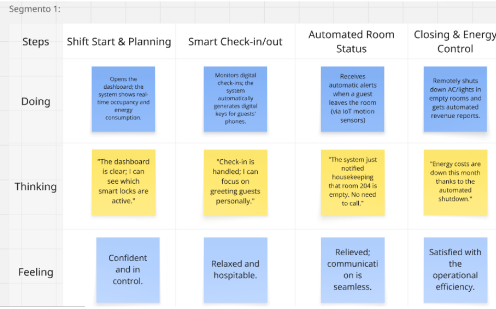
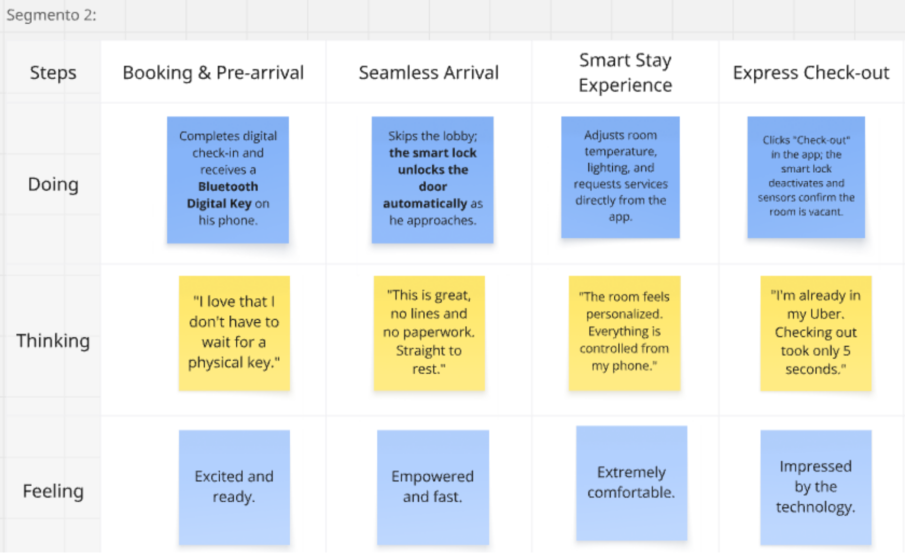
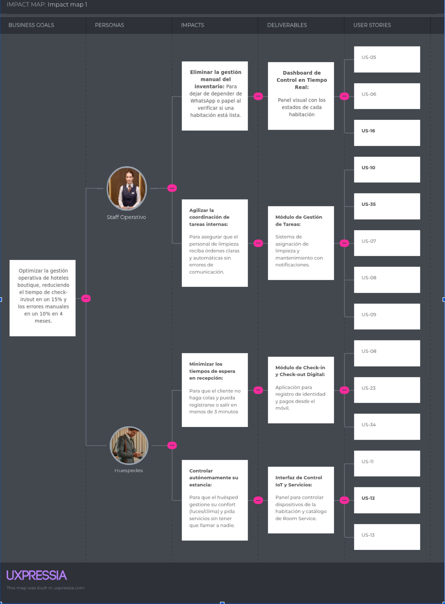

# Chapter III: Requirements Specification

## 3.1. To-Be Scenario Mapping

* **Segmento objetivo 1:** Administradores de Hoteles Boutique Pequeños

    
    
<em>Figura 3.1: Mapeo de escenario As-Is / To-Be para Administradores de Hoteles Boutique Pequeños</em>

  

  
* **Segmento objetivo 2:** Huéspedes de Hoteles

    
    
<em>Figura 3.2: Mapeo de escenario As-Is / To-Be para Huéspedes de Hoteles</em>

  

---

## 3.2. User Stories

### Resumen de Épicas (Epics)

<table border="1" cellpadding="8" cellspacing="0" style="border-collapse: collapse; width: 100%;">
  <thead>
    <tr style="background-color: #f2f2f2;">
      <th>Epic ID</th>
      <th>Título</th>
      <th>Descripción</th>
      <th>Relacionado con</th>
    </tr>
  </thead>
  <tbody>
    <tr>
      <td><strong>EP-01</strong></td>
      <td>Landing Page y Marketing Digital</td>
      <td>Épica para el sitio web estático con información por segmento, casos de éxito, simuladores y canales de contacto comercial.</td>
      <td>-</td>
    </tr>
    <tr>
      <td><strong>EP-02</strong></td>
      <td>Gestión Central del Hotel</td>
      <td>Épica que incluye la administración de reservas, gestión de habitaciones, check-in/check-out digital, gestión operativa diaria y coordinación de servicios internos.</td>
      <td>-</td>
    </tr>
    <tr>
      <td><strong>EP-03</strong></td>
      <td>Integraciones y Canales Externos</td>
      <td>Épica para las conexiones con OTAs, WhatsApp, sistemas de pago, reputación digital y webhooks de terceros.</td>
      <td>-</td>
    </tr>
    <tr>
      <td><strong>EP-04</strong></td>
      <td>Autenticación y Gestión de Usuarios</td>
      <td>Épica que agrupa las funcionalidades de registro, inicio de sesión, gestión de perfil y control de acceso por roles para todos los tipos de usuario.</td>
      <td>-</td>
    </tr>
    <tr>
      <td><strong>EP-05</strong></td>
      <td>Experiencia Digital del Huésped</td>
      <td>Épica enfocada en la experiencia del huésped: control ambiental IoT, servicios personalizados, comunicación digital y evaluación post-estancia.</td>
      <td>-</td>
    </tr>
    <tr>
      <td><strong>EP-06</strong></td>
      <td>Analítica e Informes</td>
      <td>Épica que cubre el panel de gestión, informes de ocupación, KPIs operativos, análisis de satisfacción y métricas financieras.</td>
      <td>-</td>
    </tr>
    <tr>
      <td><strong>EP-07</strong></td>
      <td>Notificaciones y Comunicación</td>
      <td>Épica para el sistema de notificaciones push, email, SMS, alertas automáticas y comunicación entre personal y huéspedes.</td>
      <td>-</td>
    </tr>
  </tbody>
</table>

---

### Detalle de Historias de Usuario

<table border="1" cellpadding="8" cellspacing="0" style="border-collapse: collapse; width: 100%;">
  <thead>
    <tr style="background-color: #f2f2f2;">
      <th>User Story ID</th>
      <th>Título</th>
      <th>Descripción (Como / Quiero / Para)</th>
      <th>Criterios de Aceptación</th>
      <th>Epic ID</th>
    </tr>
  </thead>
  <tbody>
    <tr>
      <td><strong>US-24</strong></td>
      <td>Landing page segmentada</td>
      <td><strong>Como</strong> visitante, <strong>quiero</strong> encontrar información específica según mi perfil (administrador o huésped), <strong>para</strong> entender el valor de Smart Stay.</td>
      <td>
        <ul>
          <li><strong>Escenario 1 (Admin):</strong> Ve beneficios operativos, ROI, casos de éxito y demo.</li>
          <li><strong>Escenario 2 (Huésped):</strong> Ve beneficios de experiencia, comodidad y tecnología.</li>
          <li><strong>Escenario 3 (Navegación):</strong> Identifica su perfil en menos de 3 clics.</li>
          <li><strong>Escenario 4 (CTAs):</strong> Encuentra llamadas a la acción claras.</li>
        </ul>
      </td>
      <td>EP-01</td>
    </tr>
    <tr>
      <td><strong>US-25</strong></td>
      <td>Simulador de ROI para hoteles</td>
      <td><strong>Como</strong> administrador de hotel visitante, <strong>quiero</strong> usar un simulador para estimar el retorno de inversión, <strong>para</strong> tomar decisiones informadas.</td>
      <td>
        <ul>
          <li><strong>Escenario 1:</strong> Cálculo básico de ahorro anual y recuperación.</li>
          <li><strong>Escenario 2:</strong> Ajuste por tipo de hotel (boutique, cadena, resort).</li>
          <li><strong>Escenario 3:</strong> Comparativa con situación actual.</li>
          <li><strong>Escenario 4:</strong> Exportación de resultados a PDF.</li>
        </ul>
      </td>
      <td>EP-01</td>
    </tr>
    <tr>
      <td><strong>US-27</strong></td>
      <td>Solicitud de demo y contacto comercial</td>
      <td><strong>Como</strong> visitante interesado, <strong>quiero</strong> solicitar una demostración y contactar a ventas, <strong>para</strong> explorar las soluciones de Smart Stay.</td>
      <td>
        <ul>
          <li><strong>Escenario 1:</strong> Formulario con confirmación y contacto en 24h.</li>
          <li><strong>Escenario 2:</strong> Agendamiento directo en calendario de ventas.</li>
          <li><strong>Escenario 3:</strong> Acceso rápido a teléfono, email y WhatsApp.</li>
          <li><strong>Escenario 4:</strong> Seguimiento automático si no hay respuesta.</li>
        </ul>
      </td>
      <td>EP-01</td>
    </tr>
    <tr>
      <td><strong>US-26</strong></td>
      <td>Casos de éxito y testimonios</td>
      <td><strong>Como</strong> visitante interesado, <strong>quiero</strong> ver casos de éxito reales de hoteles, <strong>para</strong> validar la efectividad de la solución.</td>
      <td>
        <ul>
          <li><strong>Escenario 1:</strong> Videos de administradores reales.</li>
          <li><strong>Escenario 2:</strong> Métricas específicas de mejora y ahorro.</li>
          <li><strong>Escenario 3:</strong> Filtros por tipo de hotel similar.</li>
          <li><strong>Escenario 4:</strong> Conexión directa con hoteles de referencia.</li>
        </ul>
      </td>
      <td>EP-01</td>
    </tr>
    <tr>
      <td><strong>US-28</strong></td>
      <td>Información corporativa y valores</td>
      <td><strong>Como</strong> visitante, <strong>quiero</strong> conocer la misión, visión y valores, <strong>para</strong> entender la filosofía de la empresa.</td>
      <td>
        <ul>
          <li><strong>Escenario 1:</strong> Sección "Sobre nosotros" completa.</li>
          <li><strong>Escenario 2:</strong> Información sobre fundadores y liderazgo.</li>
          <li><strong>Escenario 3:</strong> Compromiso con sostenibilidad y eficiencia.</li>
          <li><strong>Escenario 4:</strong> Certificaciones y reconocimientos.</li>
        </ul>
      </td>
      <td>EP-01</td>
    </tr>
    <tr>
      <td><strong>US-05</strong></td>
      <td>Panel de administrador</td>
      <td><strong>Como</strong> administrador, <strong>quiero</strong> un panel centralizado con información clave, <strong>para</strong> gestionar mi hotel de forma eficiente.</td>
      <td>
        <ul>
          <li><strong>Escenario 1:</strong> Vista general de ocupación, check-ins/outs y alertas.</li>
          <li><strong>Escenario 2:</strong> Filtros por rango de fechas.</li>
          <li><strong>Escenario 3:</strong> Acceso rápido haciendo clic en métricas.</li>
          <li><strong>Escenario 4:</strong> Actualización en tiempo real.</li>
        </ul>
      </td>
      <td>EP-02</td>
    </tr>
    <tr>
      <td><strong>US-07</strong></td>
      <td>Gestión centralizada de reservas</td>
      <td><strong>Como</strong> administrador, <strong>quiero</strong> gestionar todas las reservas en un solo lugar, <strong>para</strong> evitar el overbooking y optimizar la ocupación.</td>
      <td>
        <ul>
          <li><strong>Escenario 1:</strong> Vista de calendario organizada por fecha.</li>
          <li><strong>Escenario 2:</strong> Ingreso y validación de reservas manuales.</li>
          <li><strong>Escenario 3:</strong> Modificación con validación de disponibilidad.</li>
          <li><strong>Escenario 4:</strong> Cancelación aplicando políticas vigentes.</li>
        </ul>
      </td>
      <td>EP-02</td>
    </tr>
    <tr>
      <td><strong>US-08</strong></td>
      <td>Check-in digital automatizado</td>
      <td><strong>Como</strong> administrador y huésped, <strong>quiero</strong> realizar el check-in digital en menos de 3 minutos, <strong>para</strong> mejorar la experiencia.</td>
      <td>
        <ul>
          <li><strong>Escenario 1:</strong> Obtención de acceso digital a la habitación.</li>
          <li><strong>Escenario 2:</strong> Validación automática de documentos de identidad.</li>
          <li><strong>Escenario 3:</strong> Asistencia remota del personal en caso de dudas.</li>
          <li><strong>Escenario 4:</strong> Notificación automática a housekeeping.</li>
        </ul>
      </td>
      <td>EP-02</td>
    </tr>
    <tr>
      <td><strong>US-09</strong></td>
      <td>Check-out digital y facturación</td>
      <td><strong>Como</strong> huésped, <strong>quiero</strong> realizar el check-out digital y recibir factura, <strong>para</strong> agilizar mi salida.</td>
      <td>
        <ul>
          <li><strong>Escenario 1:</strong> Liberación de habitación y factura por email.</li>
          <li><strong>Escenario 2:</strong> Detalle y aprobación de cargos adicionales.</li>
          <li><strong>Escenario 3:</strong> Aplicación de cargos por check-out tardío.</li>
          <li><strong>Escenario 4:</strong> Envío de tarea automática a housekeeping.</li>
        </ul>
      </td>
      <td>EP-02</td>
    </tr>
    <tr>
      <td><strong>US-06</strong></td>
      <td>Gestión de habitaciones y estados</td>
      <td><strong>Como</strong> administrador, <strong>quiero</strong> gestionar los estados de las habitaciones, <strong>para</strong> optimizar operaciones diarias.</td>
      <td>
        <ul>
          <li><strong>Escenario 1:</strong> Cambio de estado (disponible, ocupada, limpieza, etc.).</li>
          <li><strong>Escenario 2:</strong> Mapa de habitaciones con códigos de color.</li>
          <li><strong>Escenario 3:</strong> Historial completo de cambios y responsables.</li>
          <li><strong>Escenario 4:</strong> Alertas automáticas por mantenimiento prolongado.</li>
        </ul>
      </td>
      <td>EP-02</td>
    </tr>
    <tr>
      <td><strong>US-10</strong></td>
      <td>Asignación y seguimiento de tareas</td>
      <td><strong>Como</strong> administrador, <strong>quiero</strong> asignar tareas al personal y seguir su progreso, <strong>para</strong> optimizar las operaciones.</td>
      <td>
        <ul>
          <li><strong>Escenario 1:</strong> Asignación de tareas de housekeeping con prioridad.</li>
          <li><strong>Escenario 2:</strong> Actualización en tiempo real del progreso.</li>
          <li><strong>Escenario 3:</strong> Validación de tareas completadas.</li>
          <li><strong>Escenario 4:</strong> Alertas automáticas por tareas vencidas.</li>
        </ul>
      </td>
      <td>EP-02</td>
    </tr>
    <tr>
      <td><strong>US-20</strong></td>
      <td>Integración con OTAs y canales</td>
      <td><strong>Como</strong> administrador, <strong>quiero</strong> integrar mi inventario con Booking, Expedia, etc., <strong>para</strong> maximizar ocupación y evitar overbooking.</td>
      <td>
        <ul>
          <li><strong>Escenario 1:</strong> Sincronización automática de disponibilidad (&lt; 5 min).</li>
          <li><strong>Escenario 2:</strong> Importación automática de reservas externas.</li>
          <li><strong>Escenario 3:</strong> Gestión centralizada de tarifas.</li>
          <li><strong>Escenario 4:</strong> Detección y notificación de conflictos.</li>
        </ul>
      </td>
      <td>EP-03</td>
    </tr>
    <tr>
      <td><strong>US-21</strong></td>
      <td>Integración con WhatsApp Business</td>
      <td><strong>Como</strong> administrador, <strong>quiero</strong> usar WhatsApp para comunicación directa, <strong>para</strong> mejorar el servicio al cliente pre/post-estancia.</td>
      <td>
        <ul>
          <li><strong>Escenario 1:</strong> Mensajes de bienvenida automáticos.</li>
          <li><strong>Escenario 2:</strong> Recepción y respuesta de consultas desde la plataforma.</li>
          <li><strong>Escenario 3:</strong> Confirmaciones automáticas de servicios solicitados.</li>
          <li><strong>Escenario 4:</strong> Mensaje de agradecimiento post-estancia.</li>
        </ul>
      </td>
      <td>EP-03</td>
    </tr>
    <tr>
      <td><strong>US-23</strong></td>
      <td>Procesamiento de pagos digitales</td>
      <td><strong>Como</strong> administrador y huésped, <strong>quiero</strong> procesar pagos seguros con múltiples métodos, <strong>para</strong> garantizar transacciones fluidas.</td>
      <td>
        <ul>
          <li><strong>Escenario 1:</strong> Pre-autorización de tarjeta en check-in digital.</li>
          <li><strong>Escenario 2:</strong> Pago inmediato de room service desde la app.</li>
          <li><strong>Escenario 3:</strong> Facturación y pago automático en check-out.</li>
          <li><strong>Escenario 4:</strong> Manejo y notificación de pagos fallidos.</li>
        </ul>
      </td>
      <td>EP-03</td>
    </tr>
    <tr>
      <td><strong>US-01</strong></td>
      <td>Registro de usuario con validación</td>
      <td><strong>Como</strong> nuevo usuario, <strong>quiero</strong> registrarme validando mi correo electrónico, <strong>para</strong> acceder al sistema según mi rol.</td>
      <td>
        <ul>
          <li><strong>Escenario 1:</strong> Creación de cuenta exitosa y correo de confirmación.</li>
          <li><strong>Escenario 2:</strong> Alerta de email ya registrado.</li>
          <li><strong>Escenario 3:</strong> Restricción por campos obligatorios vacíos.</li>
          <li><strong>Escenario 4:</strong> Validación de formato de email incorrecto.</li>
        </ul>
      </td>
      <td>EP-04</td>
    </tr>
    <tr>
      <td><strong>US-02</strong></td>
      <td>Inicio de sesión seguro</td>
      <td><strong>Como</strong> usuario registrado, <strong>quiero</strong> iniciar sesión de forma segura, <strong>para</strong> acceder a mi panel personalizado.</td>
      <td>
        <ul>
          <li><strong>Escenario 1:</strong> Acceso correcto al panel según rol.</li>
          <li><strong>Escenario 2:</strong> Mensaje de error genérico ante credenciales inválidas.</li>
          <li><strong>Escenario 3:</strong> Bloqueo temporal tras 5 intentos fallidos.</li>
          <li><strong>Escenario 4:</strong> Opción de sesión persistente ("recuérdame").</li>
        </ul>
      </td>
      <td>EP-04</td>
    </tr>
    <tr>
      <td><strong>US-11</strong></td>
      <td>Control ambiental IoT desde app</td>
      <td><strong>Como</strong> huésped, <strong>quiero</strong> controlar temperatura, luces y persianas desde el móvil, <strong>para</strong> personalizar mi experiencia.</td>
      <td>
        <ul>
          <li><strong>Escenario 1:</strong> Ajuste de clima en menos de 30 segundos.</li>
          <li><strong>Escenario 2:</strong> Control de intensidad, color y encendido de luces.</li>
          <li><strong>Escenario 3:</strong> Apertura/cierre automatizado de persianas.</li>
          <li><strong>Escenario 4:</strong> Configuración de presets personalizados.</li>
        </ul>
      </td>
      <td>EP-05</td>
    </tr>
    <tr>
      <td><strong>US-12</strong></td>
      <td>Solicitud de servicios desde la app</td>
      <td><strong>Como</strong> huésped, <strong>quiero</strong> solicitar room service y limpieza desde la app, <strong>para</strong> acceder a los servicios convenientemente.</td>
      <td>
        <ul>
          <li><strong>Escenario 1:</strong> Selección de productos y pedido de room service.</li>
          <li><strong>Escenario 2:</strong> Solicitud de limpieza extra con horario preferido.</li>
          <li><strong>Escenario 3:</strong> Seguimiento del estado del pedido en tiempo real.</li>
          <li><strong>Escenario 4:</strong> Solicitud de servicios especiales (tours, transporte).</li>
        </ul>
      </td>
      <td>EP-05</td>
    </tr>
    <tr>
      <td><strong>US-13</strong></td>
      <td>Comunicación digital huésped-personal</td>
      <td><strong>Como</strong> huésped, <strong>quiero</strong> comunicarme digitalmente con el personal, <strong>para</strong> resolver dudas y solicitudes rápidamente.</td>
      <td>
        <ul>
          <li><strong>Escenario 1:</strong> Chat en tiempo real con respuesta &lt; 5 min.</li>
          <li><strong>Escenario 2:</strong> Envío de mensajes detallados para solicitudes específicas.</li>
          <li><strong>Escenario 3:</strong> Historial completo de interacciones de la estancia.</li>
          <li><strong>Escenario 4:</strong> Escalado automático a supervisor por demoras.</li>
        </ul>
      </td>
      <td>EP-05</td>
    </tr>
    <tr>
      <td><strong>US-16</strong></td>
      <td>Panel de analítica y KPIs operativos</td>
      <td><strong>Como</strong> administrador, <strong>quiero</strong> visualizar métricas clave y KPIs, <strong>para</strong> tomar decisiones informadas.</td>
      <td>
        <ul>
          <li><strong>Escenario 1:</strong> Métricas en tiempo real (ocupación, ingresos, tareas).</li>
          <li><strong>Escenario 2:</strong> Gráficos comparativos de períodos históricos.</li>
          <li><strong>Escenario 3:</strong> Desglose detallado por filtrado de datos.</li>
          <li><strong>Escenario 4:</strong> Alertas inteligentes ante tendencias negativas.</li>
        </ul>
      </td>
      <td>EP-06</td>
    </tr>
    <tr>
      <td><strong>US-34</strong></td>
      <td>Sistema de notificaciones push</td>
      <td><strong>Como</strong> huésped, <strong>quiero</strong> recibir notificaciones push en el smartphone, <strong>para</strong> mantenerme informado de mis solicitudes.</td>
      <td>
        <ul>
          <li><strong>Escenario 1:</strong> Confirmación inmediata de reservas.</li>
          <li><strong>Escenario 2:</strong> Recordatorio 24h antes para check-in digital.</li>
          <li><strong>Escenario 3:</strong> Actualizaciones del estado de room service.</li>
          <li><strong>Escenario 4:</strong> Configuración de preferencias y horarios.</li>
        </ul>
      </td>
      <td>EP-07</td>
    </tr>
    <tr>
      <td><strong>US-35</strong></td>
      <td>Notificaciones automáticas al personal</td>
      <td><strong>Como</strong> personal del hotel, <strong>quiero</strong> recibir alertas de tareas y cambios operativos, <strong>para</strong> responder con prontitud.</td>
      <td>
        <ul>
          <li><strong>Escenario 1:</strong> Aviso de nueva tarea asignada con plazo y prioridad.</li>
          <li><strong>Escenario 2:</strong> Notificación especial por cambio a alta prioridad.</li>
          <li><strong>Escenario 3:</strong> Recordatorio 2 horas antes de vencer el plazo.</li>
          <li><strong>Escenario 4:</strong> Alerta inmediata ante emergencias operativas.</li>
        </ul>
      </td>
      <td>EP-07</td>
    </tr>
  </tbody>
</table>

---

## 3.3. Impact Mapping

  
  
<em>Figura 3.3: Diagrama de Impact Mapping para Smart Stay</em>

---

## 3.4. Product Backlog

<table border="1" cellpadding="8" cellspacing="0" style="border-collapse: collapse; width: 100%;">
  <thead>
    <tr style="background-color: #f2f2f2;">
      <th>Orden</th>
      <th>User Story Id</th>
      <th>Título</th>
      <th>Descripción</th>
      <th>Story Points</th>
    </tr>
  </thead>
  <tbody>
    <tr><td>1</td><td>US-24</td><td>Landing page segmentada</td><td>Como visitante, quiero encontrar información específica según mi perfil (administrador de hotel o huésped) para entender el valor de Smart Stay.</td><td>5</td></tr>
    <tr><td>2</td><td>US-25</td><td>Simulador de ROI para hoteles</td><td>Como administrador de hotel visitante, quiero usar un simulador para estimar el retorno de inversión que obtendría con Smart Stay para tomar decisiones informadas.</td><td>8</td></tr>
    <tr><td>3</td><td>US-27</td><td>Solicitud de demo y contacto comercial</td><td>Como visitante interesado, quiero solicitar una demostración y contactar al equipo de ventas de forma fácil y rápida para explorar las soluciones de Smart Stay.</td><td>3</td></tr>
    <tr><td>4</td><td>US-26</td><td>Casos de éxito y testimonios</td><td>Como visitante interesado, quiero ver casos de éxito reales de hoteles que usan Smart Stay para validar la efectividad de la solución.</td><td>5</td></tr>
    <tr><td>5</td><td>US-28</td><td>Información corporativa y valores</td><td>Como visitante, quiero conocer la misión, visión y valores de Smart Stay para entender la filosofía de la empresa.</td><td>2</td></tr>
    <tr><td>6</td><td>US-05</td><td>Panel de administrador</td><td>Como administrador, quiero un panel centralizado con información clave para gestionar mi hotel de forma eficiente.</td><td>8</td></tr>
    <tr><td>7</td><td>US-07</td><td>Gestión centralizada de reservas</td><td>Como administrador, quiero gestionar todas las reservas en un solo lugar para evitar el overbooking y optimizar la ocupación.</td><td>8</td></tr>
    <tr><td>8</td><td>US-08</td><td>Check-in digital automatizado</td><td>Como administrador y huésped, quiero que el check-in se realice digitalmente en menos de 3 minutos para mejorar la experiencia.</td><td>8</td></tr>
    <tr><td>9</td><td>US-09</td><td>Check-out digital y facturación</td><td>Como huésped, quiero realizar el check-out digital y recibir mi factura automáticamente para agilizar mi salida.</td><td>5</td></tr>
    <tr><td>10</td><td>US-06</td><td>Gestión de habitaciones y estados</td><td>Como administrador, quiero gestionar todos los estados de las habitaciones para optimizar las operaciones diarias.</td><td>5</td></tr>
    <tr><td>11</td><td>US-20</td><td>Integración con OTAs y canales de reserva</td><td>Como administrador, quiero integrar mi inventario con Booking.com, Expedia y otras OTAs para maximizar la ocupación y evitar el overbooking.</td><td>8</td></tr>
    <tr><td>12</td><td>US-01</td><td>Registro de usuario con validación</td><td>Como nuevo usuario, quiero registrarme en Smart Stay validando mi correo electrónico para acceder a las funcionalidades según mi rol.</td><td>3</td></tr>
    <tr><td>13</td><td>US-02</td><td>Inicio de sesión seguro</td><td>Como usuario registrado, quiero iniciar sesión de forma segura para acceder a mi panel personalizado según mi rol.</td><td>3</td></tr>
    <tr><td>14</td><td>US-11</td><td>Control ambiental IoT desde app móvil</td><td>Como huésped, quiero controlar la temperatura, iluminación y otros aspectos ambientales desde mi smartphone para personalizar mi experiencia.</td><td>8</td></tr>
    <tr><td>15</td><td>US-12</td><td>Solicitud de servicios desde la app</td><td>Como huésped, quiero solicitar room service, limpieza adicional y otros servicios desde mi smartphone para acceder a los servicios de forma conveniente.</td><td>5</td></tr>
    <tr><td>16</td><td>US-23</td><td>Procesamiento de pagos digitales</td><td>Como administrador y huésped, quiero procesar pagos de forma segura y eficiente a través de múltiples métodos de pago para garantizar transacciones fluidas.</td><td>8</td></tr>
    <tr><td>17</td><td>US-10</td><td>Asignación y seguimiento de tareas al personal</td><td>Como administrador, quiero asignar tareas al personal y hacer seguimiento de su progreso para optimizar las operaciones.</td><td>5</td></tr>
    <tr><td>18</td><td>US-16</td><td>Panel de analítica y KPIs operativos</td><td>Como administrador, quiero visualizar métricas clave y KPIs para tomar decisiones informadas sobre las operaciones del hotel.</td><td>8</td></tr>
    <tr><td>19</td><td>US-34</td><td>Sistema de notificaciones push móviles</td><td>Como huésped, quiero recibir notificaciones push en mi smartphone sobre el estado de mis solicitudes y servicios para mantenerme informado.</td><td>5</td></tr>
    <tr><td>20</td><td>US-35</td><td>Notificaciones automáticas al personal</td><td>Como personal del hotel, quiero recibir notificaciones automáticas sobre tareas asignadas y cambios operativos importantes para responder con prontitud.</td><td>3</td></tr>
    <tr><td>21</td><td>US-21</td><td>Integración con WhatsApp Business</td><td>Como administrador, quiero usar WhatsApp Business para la comunicación directa con huéspedes y la gestión de consultas pre/post-estancia para mejorar el servicio al cliente.</td><td>5</td></tr>
    <tr><td>22</td><td>US-13</td><td>Comunicación digital huésped-personal</td><td>Como huésped, quiero comunicarme con el personal del hotel de forma digital para resolver dudas y solicitudes rápidamente.</td><td>5</td></tr>
  </tbody>
</table>
