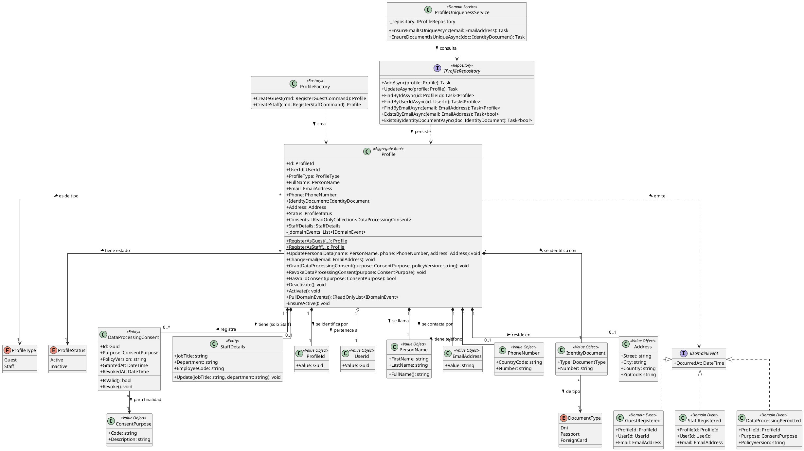
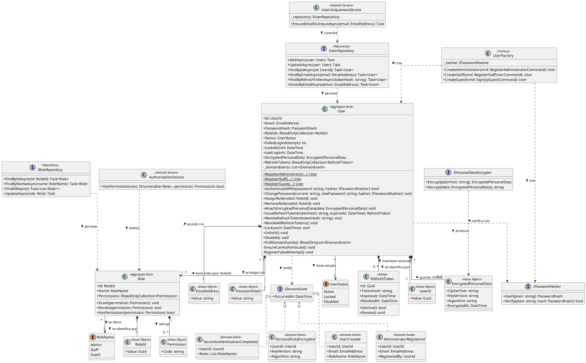
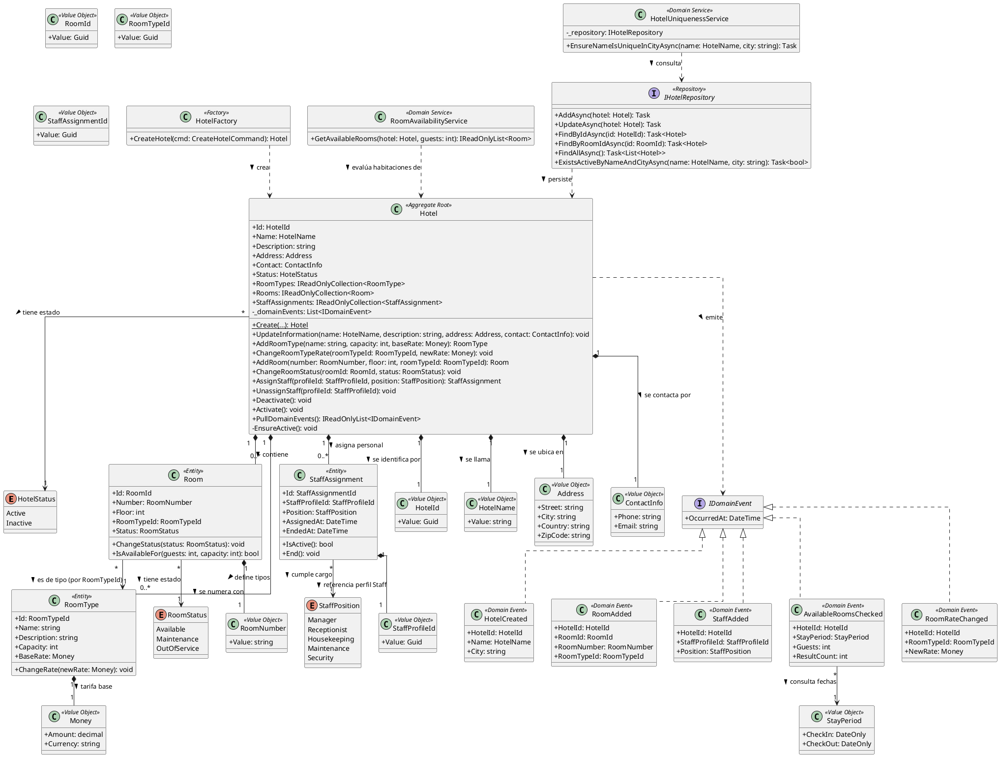

<div style="page-break-before: always;"></div>

# Capítulo V: Tactical-Level Software Design.

## 5.1. Bounded Context: Profiles

El bounded context **Profiles** administra la información detallada de los perfiles de usuario (Guest y Staff) y el procesamiento de sus datos personales. Está implementado con **C# / ASP.NET Core (.NET 8)**, **Entity Framework Core** sobre **PostgreSQL**, **MediatR** para commands, queries y eventos, y arquitectura DDD por capas.

Eventos clave: `DataProcessingPermitted`, `GuestRegistered` y `StaffRegistered`.

Relación con otros contextos: **Profiles – Bookings & Payments (Conformist)**. Profiles es *upstream* y Bookings & Payments es *downstream*, por lo que este último adopta el modelo de Profiles sin capa anticorrupción.

---

### 5.1.1. Domain Layer.

Contiene el núcleo del contexto y las reglas de negocio: quién es la persona, de qué tipo es (Guest o Staff) y si autorizó el procesamiento de sus datos.

***Aggregates y Entities***

| Clase | Categoría | Propósito |
|---|---|---|
| `Profile` | Aggregate Root | Representa el perfil de un usuario. Controla registro, actualización de datos personales, consentimiento y desactivación. Toda modificación pasa por esta clase. |
| `DataProcessingConsent` | Entity (dentro del agregado) | Registro de consentimiento para el tratamiento de datos personales: finalidad, versión de política, fecha de otorgamiento y revocación. |
| `StaffDetails` | Entity (dentro del agregado) | Datos propios del personal (cargo, área, código de empleado). Solo existe si `ProfileType = Staff`. |

**Atributos y métodos de `Profile`:**

| Miembro | Tipo | Descripción |
|---|---|---|
| `Id` | `ProfileId` | Identificador único del perfil. |
| `UserId` | `UserId` | Referencia al usuario de autenticación (IAM). |
| `ProfileType` | `ProfileType` | `Guest` o `Staff`. |
| `FullName` | `PersonName` | Nombres y apellidos. |
| `Email` | `EmailAddress` | Correo único del perfil. |
| `Phone` | `PhoneNumber?` | Teléfono de contacto. |
| `IdentityDocument` | `IdentityDocument` | Tipo y número de documento. |
| `Address` | `Address?` | Dirección (opcional). |
| `Status` | `ProfileStatus` | `Active` o `Inactive`. |
| `Consents` | `IReadOnlyCollection<DataProcessingConsent>` | Consentimientos registrados. |
| `StaffDetails` | `StaffDetails?` | Solo para Staff. |
| `RegisterAsGuest(...)` | `static Profile` | Crea un perfil Guest y emite `GuestRegistered`. |
| `RegisterAsStaff(...)` | `static Profile` | Crea un perfil Staff y emite `StaffRegistered`. |
| `UpdatePersonalData(...)` | `void` | Actualiza nombre, teléfono y dirección. |
| `ChangeEmail(EmailAddress)` | `void` | Cambia el correo (la unicidad se valida en el Domain Service). |
| `GrantDataProcessingConsent(purpose, policyVersion)` | `void` | Registra el consentimiento y emite `DataProcessingPermitted`. |
| `RevokeDataProcessingConsent(purpose)` | `void` | Revoca el consentimiento vigente de esa finalidad. |
| `HasValidConsent(purpose)` | `bool` | Indica si hay consentimiento vigente. |
| `Deactivate()` / `Activate()` | `void` | Cambia el estado del perfil. |
| `PullDomainEvents()` | `IReadOnlyList<IDomainEvent>` | Entrega y limpia los eventos pendientes. |

**Reglas de negocio principales:**

- Un perfil es Guest o Staff, nunca ambos.
- El email y el documento de identidad son únicos en el sistema.
- No se procesan datos personales para una finalidad sin consentimiento vigente.
- Un perfil `Inactive` no puede modificarse ni otorgar consentimientos.
- `StaffDetails` es obligatorio para Staff y prohibido para Guest.

***Value Objects (implementados como `record`)***

| Clase | Propósito | Atributos |
|---|---|---|
| `ProfileId` | Identidad del perfil | `Value: Guid` |
| `UserId` | Referencia al usuario IAM | `Value: Guid` |
| `PersonName` | Nombre de la persona | `FirstName`, `LastName`; `FullName()` |
| `EmailAddress` | Correo validado | `Value: string` (valida formato) |
| `PhoneNumber` | Teléfono validado | `CountryCode`, `Number` |
| `IdentityDocument` | Documento de identidad | `Type: DocumentType`, `Number` |
| `Address` | Dirección | `Street`, `City`, `Country`, `ZipCode` |
| `ConsentPurpose` | Finalidad del consentimiento | `Code`, `Description` |

***Enumeraciones***

| Enum | Valores |
|---|---|
| `ProfileType` | `Guest`, `Staff` |
| `ProfileStatus` | `Active`, `Inactive` |
| `DocumentType` | `Dni`, `Passport`, `ForeignCard` |

***Domain Events***

| Evento | Se emite cuando | Datos |
|---|---|---|
| `GuestRegistered` | Se registra un perfil Guest | `ProfileId`, `UserId`, `Email`, `OccurredAt` |
| `StaffRegistered` | Se registra un perfil Staff | `ProfileId`, `UserId`, `Email`, `OccurredAt` |
| `DataProcessingPermitted` | El usuario otorga consentimiento | `ProfileId`, `Purpose`, `PolicyVersion`, `OccurredAt` |

Todos implementan la interfaz `IDomainEvent` (marca de MediatR `INotification`).

***Factories y Domain Services***

| Clase | Tipo | Propósito |
|---|---|---|
| `ProfileFactory` | Factory | Construye `Profile` válidos desde los comandos, incluyendo `StaffDetails` según el tipo. |
| `ProfileUniquenessService` | Domain Service | Verifica unicidad de email y documento antes de registrar o cambiar datos. |

***Repositories (interfaces)***

| Interfaz | Métodos |
|---|---|
| `IProfileRepository` | `AddAsync(Profile)`, `UpdateAsync(Profile)`, `FindByIdAsync(ProfileId)`, `FindByUserIdAsync(UserId)`, `FindByEmailAsync(EmailAddress)`, `ExistsByEmailAsync(EmailAddress)`, `ExistsByIdentityDocumentAsync(IdentityDocument)` |
| `IUnitOfWork` | `CommitAsync()` |

***Relaciones entre clases***

- `Profile` **compone** 0..* `DataProcessingConsent` y 0..1 `StaffDetails`.
- `Profile` **usa** los Value Objects `PersonName`, `EmailAddress`, `PhoneNumber`, `IdentityDocument` y `Address`.
- `Profile` **emite** `GuestRegistered`, `StaffRegistered` y `DataProcessingPermitted`.
- `ProfileFactory` **crea** `Profile`; `ProfileUniquenessService` **depende** de `IProfileRepository`.

---

### 5.1.2. Interface Layer.

Expone las capacidades del contexto hacia el frontend y hacia otros bounded contexts. Los controllers solo traducen HTTP a commands/queries; no contienen reglas de negocio.

| Clase | Tipo | Propósito | Endpoints / Operaciones |
|---|---|---|---|
| `ProfilesController` | ASP.NET Core Controller (`[ApiController]`) | Registro y gestión de perfiles. | `POST /api/v1/profiles/guests`, `POST /api/v1/profiles/staff`, `GET /api/v1/profiles/{profileId}`, `PUT /api/v1/profiles/{profileId}`, `PATCH /api/v1/profiles/{profileId}/deactivation` |
| `DataConsentController` | ASP.NET Core Controller | Gestión del consentimiento de datos. | `POST /api/v1/profiles/{profileId}/consents`, `DELETE /api/v1/profiles/{profileId}/consents/{purposeCode}`, `GET /api/v1/profiles/{profileId}/consents` |
| `IProfilesContextFacade` / `ProfilesContextFacade` | Facade (API pública del contexto) | Punto de entrada para Bookings & Payments (relación Conformist). Publica el modelo de Profiles tal cual. | `FetchProfileByIdAsync(profileId)`, `FetchProfileIdByUserIdAsync(userId)`, `ExistsActiveProfileAsync(profileId)` |
| `ProfileResourceAssembler` | Assembler | Convierte entre `Profile`, commands y DTOs. | `ToResource(Profile)`, `ToCommand(Resource)` |
| `RegisterGuestResource`, `RegisterStaffResource`, `UpdateProfileResource`, `GrantConsentResource`, `ProfileResource`, `ConsentResource` | DTOs (`record`) | Contratos de entrada y salida de la API. | — |

Como Bookings & Payments es *Conformist*, consume `ProfileResource` directamente, sin capa anticorrupción.

---

### 5.1.3. Application Layer.

Orquesta los flujos del negocio mediante **MediatR**. Se separan **commands** (cambian estado) de **queries** (solo leen).

***Commands y Command Handlers (`IRequestHandler<,>`)***

| Command | Command Handler | Flujo |
|---|---|---|
| `RegisterGuestCommand` | `RegisterGuestCommandHandler` | Valida unicidad → crea Profile con `ProfileFactory` → guarda → publica `GuestRegistered`. |
| `RegisterStaffCommand` | `RegisterStaffCommandHandler` | Igual que el anterior, con `StaffDetails`; publica `StaffRegistered`. |
| `UpdateProfileCommand` | `UpdateProfileCommandHandler` | Carga el perfil → `UpdatePersonalData` → guarda. |
| `ChangeEmailCommand` | `ChangeEmailCommandHandler` | Valida unicidad → `ChangeEmail` → guarda. |
| `GrantDataProcessingConsentCommand` | `GrantDataProcessingConsentCommandHandler` | Carga el perfil → `GrantDataProcessingConsent` → guarda → publica `DataProcessingPermitted`. |
| `RevokeDataProcessingConsentCommand` | `RevokeDataProcessingConsentCommandHandler` | Carga el perfil → `RevokeDataProcessingConsent` → guarda. |
| `DeactivateProfileCommand` | `DeactivateProfileCommandHandler` | Carga el perfil → `Deactivate` → guarda. |

Cada command tiene un validador de **FluentValidation** (por ejemplo `RegisterGuestCommandValidator`) registrado como pipeline behavior de MediatR.

***Queries y Query Handlers***

| Query | Query Handler | Resultado |
|---|---|---|
| `GetProfileByIdQuery` | `GetProfileByIdQueryHandler` | `Profile` por id |
| `GetProfileByUserIdQuery` | `GetProfileByUserIdQueryHandler` | `Profile` por usuario IAM |
| `GetProfileConsentsQuery` | `GetProfileConsentsQueryHandler` | Lista de consentimientos |

***Event Handlers (`INotificationHandler<>`)***

| Handler | Evento que atiende | Acción |
|---|---|---|
| `GuestRegisteredEventHandler` | `GuestRegistered` | Envía el correo de bienvenida y solicita el consentimiento inicial. |
| `StaffRegisteredEventHandler` | `StaffRegistered` | Notifica al administrador y envía el correo de activación. |
| `DataProcessingPermittedEventHandler` | `DataProcessingPermitted` | Registra auditoría y notifica a los contextos interesados. |
| `UserCreatedEventHandler` *(opcional)* | `UserCreated` (IAM) | Crea el perfil base cuando se registra un usuario nuevo. |

***Puertos de salida (interfaces de aplicación)***

| Interfaz | Propósito |
|---|---|
| `IDomainEventPublisher` | Publica eventos de dominio al broker. |
| `IEmailService` | Envía correos al usuario. |

---

### 5.1.4. Infrastructure Layer.

Implementa el acceso a servicios externos y las interfaces definidas en el dominio y la aplicación.

| Clase | Implementa / Rol | Tecnología | Descripción |
|---|---|---|---|
| `ProfilesDbContext` | `DbContext` + `IUnitOfWork` | EF Core + Npgsql | Contexto de persistencia del bounded context. |
| `EfProfileRepository` | `IProfileRepository` | EF Core | Persiste el agregado Profile en PostgreSQL. |
| `ProfileConfiguration`, `DataProcessingConsentConfiguration`, `StaffDetailsConfiguration` | `IEntityTypeConfiguration<T>` | EF Core Fluent API | Mapeo objeto-relacional; los Value Objects se mapean con `OwnsOne`. |
| `MediatRDomainEventPublisher` | `IDomainEventPublisher` | MediatR / Message Broker | Publica los eventos del agregado tras persistir. |
| `OutboxMessage` + `OutboxProcessor` | Patrón Outbox | EF Core + `BackgroundService` | Garantiza la entrega de eventos al broker (recomendado). |
| `SmtpEmailService` | `IEmailService` | MailKit / SMTP | Envía correos de bienvenida y activación. |
| `IamUserClient` *(opcional)* | Cliente de IAM | `HttpClient` tipado | Valida que `UserId` exista en el contexto de identidad. |

---

### 5.1.5. Bounded Context Software Architecture Component Level Diagrams.

Container considerado: **Profiles API** (ASP.NET Core Web API), dentro de la plataforma.

| Componente | Responsabilidad | Tecnología |
|---|---|---|
| ProfilesController | Registro y gestión de perfiles | ASP.NET Core Controller |
| DataConsentController | Gestión del consentimiento | ASP.NET Core Controller |
| ProfilesContextFacade | API interna para Bookings & Payments | C# Service |
| Command Handlers | Casos de uso de escritura | MediatR |
| Query Handlers | Casos de uso de lectura | MediatR |
| Event Handlers | Reaccionan a eventos | MediatR `INotificationHandler` |
| Profile Domain Model | Aggregate, VOs, Domain Service, Factory | C# (clases/records) |
| EfProfileRepository | Persistencia | EF Core + Npgsql |
| Event Publisher / Outbox | Publicación de eventos | MediatR + BackgroundService |
| Email Service | Envío de correos | MailKit / SMTP |


```
workspace "Profiles Bounded Context" "C4 - Component diagram" {

  model {
    guest = person "Guest" "Huésped que gestiona su perfil y consentimientos"
    staff = person "Staff" "Personal que gestiona su perfil"

    bookings = softwareSystem "Bookings & Payments" "Downstream (Conformist): consume el modelo de Profiles" "Existing"
    mail = softwareSystem "Email Service" "Servicio de correo (SMTP)" "External"

    platform = softwareSystem "Plataforma" "Sistema principal" {
      web = container "Frontend" "Interfaz de usuario" "SPA"
      db = container "Profiles DB" "Perfiles, consentimientos y outbox" "PostgreSQL" "Database"
      broker = container "Message Broker" "Eventos de dominio" "RabbitMQ"

      api = container "Profiles API" "Bounded Context Profiles" "C#, ASP.NET Core 8" {
        profilesController = component "ProfilesController" "Registro y gestión de perfiles" "ASP.NET Core Controller"
        consentController = component "DataConsentController" "Gestión del consentimiento de datos" "ASP.NET Core Controller"
        facade = component "ProfilesContextFacade" "API pública para otros contextos" "C# Service"
        commandHandlers = component "Command Handlers" "Casos de uso de escritura" "MediatR"
        queryHandlers = component "Query Handlers" "Casos de uso de lectura" "MediatR"
        eventHandlers = component "Event Handlers" "Reaccionan a eventos de dominio" "MediatR INotificationHandler"
        domainModel = component "Profile Domain Model" "Aggregate, Value Objects, Factory, Domain Service" "C#"
        repository = component "EfProfileRepository" "Implementa IProfileRepository" "EF Core"
        publisher = component "Event Publisher / Outbox" "Publica eventos de dominio" "MediatR + BackgroundService"
        emailService = component "Email Service" "Envía correos de bienvenida y activación" "MailKit"
      }
    }

    guest -> web "Usa"
    staff -> web "Usa"
    web -> profilesController "Consume" "HTTPS/JSON"
    web -> consentController "Consume" "HTTPS/JSON"
    bookings -> facade "Consulta perfiles" "Llamada interna"

    profilesController -> commandHandlers "Envía commands"
    profilesController -> queryHandlers "Envía queries"
    consentController -> commandHandlers "Envía commands"
    consentController -> queryHandlers "Envía queries"
    facade -> queryHandlers "Consulta perfiles"

    commandHandlers -> domainModel "Aplica reglas de negocio"
    commandHandlers -> repository "Guarda agregados"
    queryHandlers -> repository "Lee agregados"
    commandHandlers -> publisher "Publica eventos"
    repository -> db "Lee/Escribe" "EF Core / Npgsql"
    publisher -> db "Guarda mensajes outbox" "EF Core / Npgsql"
    publisher -> broker "Publica eventos" "AMQP"
    publisher -> eventHandlers "Notifica eventos internos"
    eventHandlers -> emailService "Solicita envío"
    emailService -> mail "Envía correos" "SMTP"
  }

  views {
    component api "ProfilesComponents" "Component diagram del container Profiles API" {
      include *
      autolayout lr
    }

    styles {
      element "Person" {
        shape Person
        background #08427b
        color #ffffff
      }
      element "Software System" {
        background #1168bd
        color #ffffff
      }
      element "External" {
        background #999999
        color #ffffff
      }
      element "Existing" {
        background #6b8e23
        color #ffffff
      }
      element "Container" {
        background #438dd5
        color #ffffff
      }
      element "Database" {
        shape Cylinder
      }
      element "Component" {
        background #85bbf0
        color #000000
      }
    }
  }
}
```

---

### 5.1.6. Bounded Context Software Architecture Code Level Diagrams.

#### 5.1.6.1. Bounded Context Domain Layer Class Diagrams.

Diagrama UML de clases del Domain Layer. Visibilidad: `+` public, `-` private, `#` protected. Las propiedades de C# se muestran con setter privado (`+Id: ProfileId {get; private set}` se simplifica como `+Id`).




#### 5.1.6.2. Bounded Context Database Design Diagram.

Se usa un esquema relacional en **PostgreSQL** con 4 tablas, generado mediante EF Core Migrations:

- `profiles`: tabla principal del agregado. Los Value Objects (`PersonName`, `EmailAddress`, `PhoneNumber`, `IdentityDocument`, `Address`) se aplanan en columnas mediante `OwnsOne`.
- `data_processing_consents`: tabla hija con FK a `profiles` (relación 1:N).
- `staff_details`: relación 1:1 opcional con `profiles` (solo para perfiles Staff).
- `outbox_events`: garantiza la entrega de eventos de dominio al broker.


```dbml
Table profiles {
  id uuid [pk]
  user_id uuid [not null, unique, note: 'Referencia lógica al usuario IAM']
  profile_type varchar(10) [not null, note: 'GUEST | STAFF']
  first_name varchar(100) [not null]
  last_name varchar(100) [not null]
  email varchar(150) [not null, unique]
  phone_country_code varchar(5)
  phone_number varchar(20)
  document_type varchar(20) [not null, note: 'DNI | PASSPORT | FOREIGN_CARD']
  document_number varchar(30) [not null]
  address_street varchar(200)
  address_city varchar(100)
  address_country varchar(100)
  address_zip_code varchar(20)
  status varchar(10) [not null, default: 'ACTIVE']
  created_at timestamp [not null, default: `now()`]
  updated_at timestamp [not null, default: `now()`]

  indexes {
    (document_type, document_number) [unique]
  }
}

Table data_processing_consents {
  id uuid [pk]
  profile_id uuid [not null]
  purpose_code varchar(50) [not null]
  purpose_description varchar(250)
  policy_version varchar(20) [not null]
  granted_at timestamp [not null]
  revoked_at timestamp

  indexes {
    (profile_id, purpose_code, granted_at)
  }
}

Table staff_details {
  profile_id uuid [pk]
  job_title varchar(100) [not null]
  department varchar(100) [not null]
  employee_code varchar(30) [not null, unique]
}

Table outbox_events {
  id uuid [pk]
  aggregate_id uuid [not null]
  event_type varchar(100) [not null, note: 'GuestRegistered | StaffRegistered | DataProcessingPermitted']
  payload jsonb [not null]
  occurred_at timestamp [not null]
  published boolean [not null, default: false]
}

Ref: data_processing_consents.profile_id > profiles.id [delete: cascade]
Ref: staff_details.profile_id - profiles.id [delete: cascade]
Ref: outbox_events.aggregate_id > profiles.id
```

**Constraints adicionales:**

- `CHECK (profile_type IN ('GUEST','STAFF'))`
- `CHECK (status IN ('ACTIVE','INACTIVE'))`
- `CHECK (document_type IN ('DNI','PASSPORT','FOREIGN_CARD'))`
- `staff_details` solo se inserta cuando `profile_type = 'STAFF'` (regla garantizada por el dominio).
- En EF Core, los enums se guardan como texto con `HasConversion<string>()` para que coincidan con los valores de arriba.

## 5.2. Bounded Context: IAM

El bounded context **IAM (Identity & Access Management)** gestiona la seguridad, la autenticación y la autorización de todos los usuarios de la plataforma (Admin, Staff y Huésped). Está implementado con **C# / ASP.NET Core (.NET 8)**, **Entity Framework Core** sobre **PostgreSQL**, **MediatR** para commands, queries y eventos, **JWT** para los tokens de acceso y arquitectura DDD por capas.

Eventos clave: `AdministratorRegistered`, `SecureAuthenticationCompleted` y `PersonalDataEncrypted`.

Relación con otros contextos: **IAM – Profiles (Anti-Corruption Layer)**. IAM es *upstream*: provee la identidad validada y la lógica de autenticación/autorización. Profiles es *downstream*: consume esa identidad y la complementa con datos de perfil. El **ACL se ubica en Profiles** (clase `IamUserClient` con su traductor), por lo que IAM solo expone una fachada pública estable y los cambios internos de su modelo no afectan a Profiles.

---

### 5.2.1. Domain Layer.

Contiene el núcleo del contexto y las reglas de negocio de seguridad: quién es el usuario, qué rol tiene, cómo se valida su identidad y cómo se protegen sus datos sensibles.

***Aggregates y Entities***

| Clase | Categoría | Propósito |
|---|---|---|
| `User` | Aggregate Root | Representa la identidad de un usuario del sistema. Controla registro, credenciales, bloqueo por intentos fallidos, asignación de roles, sesiones (refresh tokens) y datos sensibles cifrados. |
| `RefreshToken` | Entity (dentro del agregado User) | Token de renovación de sesión. Guarda hash del token, fecha de expiración y revocación. |
| `Role` | Aggregate Root | Define un rol (Admin, Staff, Guest) y los permisos que otorga. |

**Atributos y métodos de `User`:**

| Miembro | Tipo | Descripción |
|---|---|---|
| `Id` | `UserId` | Identificador único del usuario. |
| `Email` | `EmailAddress` | Correo de acceso (único). |
| `PasswordHash` | `PasswordHash` | Hash de la contraseña (nunca se guarda en claro). |
| `RoleIds` | `IReadOnlyCollection<RoleId>` | Roles asignados. |
| `Status` | `UserStatus` | `Active`, `Locked` o `Disabled`. |
| `FailedLoginAttempts` | `int` | Contador de intentos fallidos consecutivos. |
| `LockedUntil` | `DateTime?` | Fecha hasta la cual la cuenta está bloqueada. |
| `LastLoginAt` | `DateTime?` | Último acceso exitoso. |
| `EncryptedPersonalData` | `EncryptedPersonalData?` | Datos personales sensibles cifrados. |
| `RefreshTokens` | `IReadOnlyCollection<RefreshToken>` | Sesiones activas. |
| `RegisterAdministrator(...)` | `static User` | Crea un usuario con rol Admin y emite `AdministratorRegistered`. |
| `RegisterStaff(...)` | `static User` | Crea un usuario con rol Staff y emite `UserCreated`. |
| `RegisterGuest(...)` | `static User` | Crea un usuario con rol Guest y emite `UserCreated`. |
| `AuthenticateWith(password, hasher)` | `bool` | Verifica credenciales, controla bloqueo y emite `SecureAuthenticationCompleted` si es exitosa. |
| `ChangePassword(current, new, hasher)` | `void` | Cambia la contraseña y revoca las sesiones activas. |
| `AssignRole(RoleId)` / `RemoveRole(RoleId)` | `void` | Gestiona los roles del usuario. |
| `AttachEncryptedPersonalData(data)` | `void` | Registra los datos sensibles cifrados y emite `PersonalDataEncrypted`. |
| `IssueRefreshToken(hash, expiresAt)` | `RefreshToken` | Registra una nueva sesión. |
| `RevokeRefreshToken(tokenHash)` / `RevokeAllRefreshTokens()` | `void` | Cierra una o todas las sesiones. |
| `Lock(until)` / `Unlock()` | `void` | Bloquea o desbloquea la cuenta. |
| `Disable()` | `void` | Deshabilita la cuenta definitivamente. |
| `PullDomainEvents()` | `IReadOnlyList<IDomainEvent>` | Entrega y limpia los eventos pendientes. |

**Atributos y métodos de `Role`:**

| Miembro | Tipo | Descripción |
|---|---|---|
| `Id` | `RoleId` | Identificador del rol. |
| `Name` | `RoleName` | `Admin`, `Staff` o `Guest`. |
| `Permissions` | `IReadOnlyCollection<Permission>` | Permisos otorgados. |
| `Grant(Permission)` / `Revoke(Permission)` | `void` | Gestiona permisos del rol. |
| `HasPermission(Permission)` | `bool` | Indica si el rol otorga el permiso. |

**Reglas de negocio principales:**

- El email del usuario es único en el sistema.
- La contraseña se almacena solo como hash; nunca se expone ni se registra en eventos.
- Tras 5 intentos fallidos consecutivos la cuenta se bloquea por 15 minutos.
- Un usuario `Locked` o `Disabled` no puede autenticarse.
- Solo un Admin puede registrar a otro Admin o a un Staff.
- Un usuario debe tener al menos un rol.
- Al cambiar la contraseña se revocan todas las sesiones activas.
- Los datos personales sensibles se guardan siempre cifrados.

***Value Objects (implementados como `record`)***

| Clase | Propósito | Atributos |
|---|---|---|
| `UserId` | Identidad del usuario | `Value: Guid` |
| `RoleId` | Identidad del rol | `Value: Guid` |
| `EmailAddress` | Correo validado | `Value: string` (valida formato) |
| `PasswordHash` | Hash de contraseña | `Value: string` |
| `Permission` | Permiso de acceso | `Code: string` (ej. `bookings:read`, `users:manage`) |
| `EncryptedPersonalData` | Datos sensibles cifrados | `CipherText`, `KeyVersion`, `Algorithm`, `EncryptedAt` |

***Enumeraciones***

| Enum | Valores |
|---|---|
| `RoleName` | `Admin`, `Staff`, `Guest` |
| `UserStatus` | `Active`, `Locked`, `Disabled` |

***Domain Events***

| Evento | Se emite cuando | Datos |
|---|---|---|
| `AdministratorRegistered` | Se registra un usuario Admin | `UserId`, `Email`, `RegisteredBy`, `OccurredAt` |
| `SecureAuthenticationCompleted` | Un usuario se autentica correctamente | `UserId`, `Roles`, `OccurredAt` |
| `PersonalDataEncrypted` | Se cifran y guardan datos personales sensibles | `UserId`, `KeyVersion`, `Algorithm`, `OccurredAt` |
| `UserCreated` | Se registra un usuario Guest o Staff (evento de integración que consume Profiles) | `UserId`, `Email`, `RoleName`, `OccurredAt` |

Todos implementan `IDomainEvent` (marca de MediatR `INotification`). Ningún evento contiene contraseñas ni datos cifrados.

***Factories y Domain Services***

| Clase | Tipo | Propósito |
|---|---|---|
| `UserFactory` | Factory | Construye `User` válidos con su rol inicial y la contraseña ya hasheada. |
| `UserUniquenessService` | Domain Service | Verifica que el email no esté registrado. |
| `AuthorizationService` | Domain Service | Determina si un usuario tiene un permiso a partir de sus roles. |

***Abstracciones del dominio (puertos)***

| Interfaz | Propósito |
|---|---|
| `IPasswordHasher` | `Hash(plain)` y `Verify(plain, hash)`. Implementado en Infrastructure. |
| `IPersonalDataEncryptor` | `Encrypt(plainText)` y `Decrypt(encrypted)`. Implementado en Infrastructure. |

***Repositories (interfaces)***

| Interfaz | Métodos |
|---|---|
| `IUserRepository` | `AddAsync(User)`, `UpdateAsync(User)`, `FindByIdAsync(UserId)`, `FindByEmailAsync(EmailAddress)`, `FindByRefreshTokenAsync(tokenHash)`, `ExistsByEmailAsync(EmailAddress)` |
| `IRoleRepository` | `FindByIdAsync(RoleId)`, `FindByNameAsync(RoleName)`, `FindAllAsync()`, `UpdateAsync(Role)` |
| `IUnitOfWork` | `CommitAsync()` |

***Relaciones entre clases***

- `User` **compone** 0..* `RefreshToken`.
- `User` **referencia** 1..* `Role` por `RoleId` (agregados distintos, referencia por identidad).
- `Role` **contiene** 0..* `Permission`.
- `User` **usa** los Value Objects `EmailAddress`, `PasswordHash` y `EncryptedPersonalData`.
- `User` **emite** `AdministratorRegistered`, `SecureAuthenticationCompleted`, `PersonalDataEncrypted` y `UserCreated`.
- `UserFactory` **crea** `User` apoyándose en `IPasswordHasher`; `UserUniquenessService` **depende** de `IUserRepository`.

---

### 5.2.2. Interface Layer.

Expone las capacidades del contexto hacia el frontend y hacia otros bounded contexts. Los controllers solo traducen HTTP a commands/queries; no contienen reglas de negocio.

| Clase | Tipo | Propósito | Endpoints / Operaciones |
|---|---|---|---|
| `AuthenticationController` | ASP.NET Core Controller (`[ApiController]`) | Registro de huéspedes, inicio y cierre de sesión. | `POST /api/v1/auth/sign-up`, `POST /api/v1/auth/sign-in`, `POST /api/v1/auth/refresh`, `POST /api/v1/auth/sign-out`, `PATCH /api/v1/auth/password` |
| `UsersController` | ASP.NET Core Controller | Administración de usuarios (requiere rol Admin). | `POST /api/v1/users/administrators`, `POST /api/v1/users/staff`, `GET /api/v1/users/{userId}`, `PATCH /api/v1/users/{userId}/roles`, `PATCH /api/v1/users/{userId}/lock`, `PATCH /api/v1/users/{userId}/unlock` |
| `RolesController` | ASP.NET Core Controller | Consulta de roles y permisos. | `GET /api/v1/roles`, `GET /api/v1/roles/{roleId}/permissions` |
| `JwtAuthenticationMiddleware` | Middleware | Valida el JWT de cada request y construye el `ClaimsPrincipal`. | — |
| `PermissionAuthorizationHandler` | `AuthorizationHandler<T>` | Aplica `[Authorize(Policy = "...")]` según los permisos del rol. | — |
| `IIamContextFacade` / `IamContextFacade` | Facade (API pública del contexto) | Punto de entrada estable para otros contextos. Aquí se conecta el ACL de Profiles. | `FetchUserByIdAsync(userId)`, `ExistsActiveUserAsync(userId)`, `HasPermissionAsync(userId, permission)`, `FetchRolesByUserIdAsync(userId)` |
| `IamResourceAssembler` | Assembler | Convierte entre `User`, commands y DTOs. | `ToResource(User)`, `ToCommand(Resource)` |
| `SignUpResource`, `SignInResource`, `AuthenticatedUserResource`, `RegisterAdministratorResource`, `RegisterStaffResource`, `AssignRoleResource`, `UserResource`, `RoleResource` | DTOs (`record`) | Contratos de entrada y salida de la API. | — |

**Notas:**

- Los DTOs nunca exponen `PasswordHash`, `EncryptedPersonalData` ni refresh tokens almacenados.
- Todo el tráfico va por HTTPS.
- `IamContextFacade` devuelve un `UserResource` mínimo (`Id`, `Email`, `Roles`, `Status`), de modo que Profiles lo traduce con su ACL a su propio modelo.

---

### 5.2.3. Application Layer.

Orquesta los flujos del negocio mediante **MediatR**. Se separan **commands** (cambian estado) de **queries** (solo leen).

***Commands y Command Handlers (`IRequestHandler<,>`)***

| Command | Command Handler | Flujo |
|---|---|---|
| `SignUpGuestCommand` | `SignUpGuestCommandHandler` | Valida unicidad de email → hashea contraseña → crea `User` con rol Guest → guarda → publica `UserCreated`. |
| `RegisterAdministratorCommand` | `RegisterAdministratorCommandHandler` | Verifica que quien registra sea Admin → crea `User` con rol Admin → guarda → publica `AdministratorRegistered`. |
| `RegisterStaffUserCommand` | `RegisterStaffUserCommandHandler` | Verifica que quien registra sea Admin → crea `User` con rol Staff → guarda → publica `UserCreated`. |
| `SignInCommand` | `SignInCommandHandler` | Busca usuario → `AuthenticateWith` → genera JWT y refresh token → guarda → publica `SecureAuthenticationCompleted`. |
| `RefreshTokenCommand` | `RefreshTokenCommandHandler` | Valida el refresh token → revoca el anterior → emite nuevo par de tokens. |
| `SignOutCommand` | `SignOutCommandHandler` | Revoca el refresh token de la sesión. |
| `ChangePasswordCommand` | `ChangePasswordCommandHandler` | Carga el usuario → `ChangePassword` → revoca sesiones → guarda. |
| `EncryptPersonalDataCommand` | `EncryptPersonalDataCommandHandler` | Cifra con `IPersonalDataEncryptor` → `AttachEncryptedPersonalData` → guarda → publica `PersonalDataEncrypted`. |
| `AssignRoleCommand` | `AssignRoleCommandHandler` | Carga usuario y rol → `AssignRole` → guarda. |
| `LockUserCommand` / `UnlockUserCommand` | `LockUserCommandHandler` / `UnlockUserCommandHandler` | Carga el usuario → `Lock` o `Unlock` → guarda. |

Cada command tiene un validador de **FluentValidation** (por ejemplo `SignUpGuestCommandValidator`, con reglas de complejidad de contraseña) registrado como pipeline behavior de MediatR.

***Queries y Query Handlers***

| Query | Query Handler | Resultado |
|---|---|---|
| `GetUserByIdQuery` | `GetUserByIdQueryHandler` | `User` por id |
| `GetUserByEmailQuery` | `GetUserByEmailQueryHandler` | `User` por email |
| `GetRolesQuery` | `GetRolesQueryHandler` | Lista de roles |
| `GetUserPermissionsQuery` | `GetUserPermissionsQueryHandler` | Permisos efectivos del usuario |

***Event Handlers (`INotificationHandler<>`)***

| Handler | Evento que atiende | Acción |
|---|---|---|
| `AdministratorRegisteredEventHandler` | `AdministratorRegistered` | Registra auditoría y envía correo de activación al nuevo administrador. |
| `SecureAuthenticationCompletedEventHandler` | `SecureAuthenticationCompleted` | Registra auditoría de acceso y reinicia el contador de intentos fallidos. |
| `PersonalDataEncryptedEventHandler` | `PersonalDataEncrypted` | Registra auditoría de la operación de cifrado (sin datos sensibles). |
| `UserCreatedEventHandler` | `UserCreated` | Envía correo de verificación y publica el evento de integración al broker para que Profiles cree el perfil base. |

***Puertos de salida (interfaces de aplicación)***

| Interfaz | Propósito |
|---|---|
| `ITokenService` | `GenerateAccessToken(User, roles)`, `GenerateRefreshToken()`, `ValidateToken(token)`. |
| `IDomainEventPublisher` | Publica eventos de dominio y de integración al broker. |
| `IEmailService` | Envía correos de activación y verificación. |
| `IAuditLogService` | Registra eventos de seguridad. |

---

### 5.2.4. Infrastructure Layer.

Implementa el acceso a servicios externos y las interfaces definidas en el dominio y la aplicación.

| Clase | Implementa / Rol | Tecnología | Descripción |
|---|---|---|---|
| `IamDbContext` | `DbContext` + `IUnitOfWork` | EF Core + Npgsql | Contexto de persistencia del bounded context. |
| `EfUserRepository` | `IUserRepository` | EF Core | Persiste el agregado User y sus refresh tokens en PostgreSQL. |
| `EfRoleRepository` | `IRoleRepository` | EF Core | Persiste roles y permisos. |
| `UserConfiguration`, `RefreshTokenConfiguration`, `RoleConfiguration` | `IEntityTypeConfiguration<T>` | EF Core Fluent API | Mapeo objeto-relacional; los Value Objects se mapean con `OwnsOne` y `HasConversion`. |
| `BCryptPasswordHasher` | `IPasswordHasher` | BCrypt.Net-Next | Hashea y verifica contraseñas con salt y costo configurable. |
| `AesGcmPersonalDataEncryptor` | `IPersonalDataEncryptor` | `System.Security.Cryptography.AesGcm` | Cifra y descifra datos sensibles; la clave se obtiene de un gestor de secretos (Key Vault / variables de entorno). |
| `JwtTokenService` | `ITokenService` | `Microsoft.IdentityModel.Tokens` | Genera y valida JWT firmados (HS256/RS256) y refresh tokens aleatorios. |
| `MediatRDomainEventPublisher` | `IDomainEventPublisher` | MediatR / Message Broker | Publica los eventos del agregado tras persistir. |
| `OutboxMessage` + `OutboxProcessor` | Patrón Outbox | EF Core + `BackgroundService` | Garantiza la entrega de eventos al broker (recomendado). |
| `SmtpEmailService` | `IEmailService` | MailKit / SMTP | Envía correos de activación y verificación. |
| `SecurityAuditLogService` | `IAuditLogService` | Serilog / tabla `audit_logs` | Guarda la traza de eventos de seguridad. |
| `RoleSeeder` | Inicialización | EF Core | Crea los roles Admin, Staff y Guest con sus permisos, y el primer administrador al arrancar. |

**Nota sobre el ACL:** la traducción del modelo de IAM al modelo de Profiles **no está en este contexto**. La implementa Profiles en su Infrastructure Layer con `IamUserClient` (consume `IIamContextFacade` o el evento `UserCreated`) y un traductor que convierte `UserResource` en el `UserId` y los datos mínimos que Profiles necesita.

---

### 5.2.5. Bounded Context Software Architecture Component Level Diagrams.

Container considerado: **IAM API** (ASP.NET Core Web API), dentro de la plataforma.

| Componente | Responsabilidad | Tecnología |
|---|---|---|
| AuthenticationController | Registro de huéspedes, sign-in, refresh y sign-out | ASP.NET Core Controller |
| UsersController | Administración de usuarios y roles | ASP.NET Core Controller |
| RolesController | Consulta de roles y permisos | ASP.NET Core Controller |
| JWT Auth Middleware | Valida tokens y aplica políticas de autorización | ASP.NET Core Middleware |
| IamContextFacade | API interna para otros contextos (punto de entrada del ACL de Profiles) | C# Service |
| Command Handlers | Casos de uso de escritura | MediatR |
| Query Handlers | Casos de uso de lectura | MediatR |
| Event Handlers | Reaccionan a eventos de seguridad | MediatR `INotificationHandler` |
| IAM Domain Model | Aggregates User y Role, VOs, Domain Services | C# (clases/records) |
| Security Services | Hash de contraseñas, cifrado de datos y emisión de tokens | BCrypt.Net, AesGcm, JWT |
| EfUserRepository / EfRoleRepository | Persistencia | EF Core + Npgsql |
| Event Publisher / Outbox | Publicación de eventos | MediatR + BackgroundService |
| Email Service | Envío de correos | MailKit |

Código **Structurizr DSL** (https://structurizr.com/dsl):

```
workspace "IAM Bounded Context" "C4 - Component diagram" {

  model {
    guest = person "Guest" "Huésped que se registra e inicia sesión"
    staff = person "Staff" "Personal del hotel que inicia sesión"
    admin = person "Admin" "Administrador que gestiona usuarios y roles"

    profiles = softwareSystem "Profiles" "Downstream: consume la identidad mediante un Anti-Corruption Layer" "Existing"
    mail = softwareSystem "Email Service" "Servicio de correo (SMTP)" "External"

    platform = softwareSystem "Plataforma" "Sistema principal" {
      web = container "Frontend" "Interfaz de usuario" "SPA"
      db = container "IAM DB" "Usuarios, roles, sesiones, auditoría y outbox" "PostgreSQL" "Database"
      broker = container "Message Broker" "Eventos de dominio e integración" "RabbitMQ"

      api = container "IAM API" "Bounded Context IAM" "C#, ASP.NET Core 8" {
        authController = component "AuthenticationController" "Sign-up, sign-in, refresh y sign-out" "ASP.NET Core Controller"
        usersController = component "UsersController" "Administración de usuarios y roles" "ASP.NET Core Controller"
        rolesController = component "RolesController" "Consulta de roles y permisos" "ASP.NET Core Controller"
        jwtMiddleware = component "JWT Auth Middleware" "Valida tokens y autoriza por permisos" "ASP.NET Core Middleware"
        facade = component "IamContextFacade" "API pública para otros contextos" "C# Service"
        commandHandlers = component "Command Handlers" "Casos de uso de escritura" "MediatR"
        queryHandlers = component "Query Handlers" "Casos de uso de lectura" "MediatR"
        eventHandlers = component "Event Handlers" "Reaccionan a eventos de seguridad" "MediatR INotificationHandler"
        domainModel = component "IAM Domain Model" "Aggregates User y Role, Value Objects, Domain Services" "C#"
        securityServices = component "Security Services" "Hash de contraseñas, cifrado de datos y emisión de JWT" "BCrypt.Net, AesGcm, JWT"
        repository = component "EfUserRepository / EfRoleRepository" "Implementan IUserRepository e IRoleRepository" "EF Core"
        publisher = component "Event Publisher / Outbox" "Publica eventos de dominio e integración" "MediatR + BackgroundService"
        emailService = component "Email Service" "Envía correos de activación y verificación" "MailKit"
      }
    }

    guest -> web "Usa"
    staff -> web "Usa"
    admin -> web "Usa"
    web -> authController "Consume" "HTTPS/JSON"
    web -> usersController "Consume" "HTTPS/JSON"
    web -> rolesController "Consume" "HTTPS/JSON"
    profiles -> facade "Consulta identidad (vía ACL)" "Llamada interna"
    broker -> profiles "Entrega UserCreated" "AMQP"

    jwtMiddleware -> authController "Protege endpoints"
    jwtMiddleware -> usersController "Protege endpoints"
    jwtMiddleware -> rolesController "Protege endpoints"
    authController -> commandHandlers "Envía commands"
    usersController -> commandHandlers "Envía commands"
    usersController -> queryHandlers "Envía queries"
    rolesController -> queryHandlers "Envía queries"
    facade -> queryHandlers "Consulta usuarios y permisos"

    commandHandlers -> domainModel "Aplica reglas de negocio"
    commandHandlers -> securityServices "Hashea, cifra y emite tokens"
    commandHandlers -> repository "Guarda agregados"
    queryHandlers -> repository "Lee agregados"
    commandHandlers -> publisher "Publica eventos"
    repository -> db "Lee/Escribe" "EF Core / Npgsql"
    publisher -> db "Guarda mensajes outbox" "EF Core / Npgsql"
    publisher -> broker "Publica eventos" "AMQP"
    publisher -> eventHandlers "Notifica eventos internos"
    eventHandlers -> emailService "Solicita envío"
    emailService -> mail "Envía correos" "SMTP"
  }

  views {
    component api "IamComponents" "Component diagram del container IAM API" {
      include *
      autolayout lr
    }

    styles {
      element "Person" {
        shape Person
        background #08427b
        color #ffffff
      }
      element "Software System" {
        background #1168bd
        color #ffffff
      }
      element "External" {
        background #999999
        color #ffffff
      }
      element "Existing" {
        background #6b8e23
        color #ffffff
      }
      element "Container" {
        background #438dd5
        color #ffffff
      }
      element "Database" {
        shape Cylinder
      }
      element "Component" {
        background #85bbf0
        color #000000
      }
    }
  }
}
```

---

### 5.2.6. Bounded Context Software Architecture Code Level Diagrams.

#### 5.2.6.1. Bounded Context Domain Layer Class Diagrams.

Diagrama UML de clases del Domain Layer. Visibilidad: `+` public, `-` private, `#` protected. Las propiedades de C# se muestran con setter privado (`+Id: UserId {get; private set}` se simplifica como `+Id`).

Código **PlantUML** (https://www.plantuml.com/plantuml):



#### 5.2.6.2. Bounded Context Database Design Diagram.

Se usa un esquema relacional en **PostgreSQL** con 6 tablas, generado mediante EF Core Migrations:

- `users`: tabla principal del agregado User. Los Value Objects (`EmailAddress`, `PasswordHash`, `EncryptedPersonalData`) se aplanan en columnas.
- `roles` y `role_permissions`: roles del sistema y los permisos que otorga cada uno (el Value Object `Permission` se guarda por su código).
- `user_roles`: tabla de unión N:M entre usuarios y roles.
- `refresh_tokens`: sesiones activas (relación 1:N con `users`).
- `outbox_events`: garantiza la entrega de eventos de dominio e integración al broker.
- `audit_logs`: traza de eventos de seguridad (accesos, cifrado, registro de administradores).

Código **DBML** (https://dbdiagram.io):

```dbml
Table users {
  id uuid [pk]
  email varchar(150) [not null, unique]
  password_hash varchar(200) [not null]
  status varchar(10) [not null, default: 'ACTIVE', note: 'ACTIVE | LOCKED | DISABLED']
  failed_login_attempts int [not null, default: 0]
  locked_until timestamp
  last_login_at timestamp
  encrypted_data text [note: 'Datos personales cifrados (cipher text)']
  encryption_key_version varchar(20)
  encryption_algorithm varchar(30)
  encrypted_at timestamp
  created_at timestamp [not null, default: `now()`]
  updated_at timestamp [not null, default: `now()`]
}

Table roles {
  id uuid [pk]
  name varchar(20) [not null, unique, note: 'ADMIN | STAFF | GUEST']
}

Table role_permissions {
  role_id uuid [not null]
  permission_code varchar(100) [not null]

  indexes {
    (role_id, permission_code) [pk]
  }
}

Table user_roles {
  user_id uuid [not null]
  role_id uuid [not null]

  indexes {
    (user_id, role_id) [pk]
  }
}

Table refresh_tokens {
  id uuid [pk]
  user_id uuid [not null]
  token_hash varchar(200) [not null, unique]
  expires_at timestamp [not null]
  revoked_at timestamp
  created_at timestamp [not null, default: `now()`]

  indexes {
    user_id
  }
}

Table outbox_events {
  id uuid [pk]
  aggregate_id uuid [not null]
  event_type varchar(100) [not null, note: 'AdministratorRegistered | SecureAuthenticationCompleted | PersonalDataEncrypted | UserCreated']
  payload jsonb [not null]
  occurred_at timestamp [not null]
  published boolean [not null, default: false]
}

Table audit_logs {
  id uuid [pk]
  user_id uuid
  action varchar(100) [not null]
  details jsonb
  ip_address varchar(45)
  occurred_at timestamp [not null, default: `now()`]

  indexes {
    (user_id, occurred_at)
  }
}

Ref: user_roles.user_id > users.id [delete: cascade]
Ref: user_roles.role_id > roles.id
Ref: role_permissions.role_id > roles.id [delete: cascade]
Ref: refresh_tokens.user_id > users.id [delete: cascade]
Ref: outbox_events.aggregate_id > users.id
Ref: audit_logs.user_id > users.id
```

**Constraints adicionales:**

- `CHECK (status IN ('ACTIVE','LOCKED','DISABLED'))`
- `CHECK (name IN ('ADMIN','STAFF','GUEST'))`
- `CHECK (failed_login_attempts >= 0)`
- Todo usuario debe tener al menos un registro en `user_roles` (regla garantizada por el dominio).
- Nunca se guarda la contraseña en claro: `password_hash` almacena solo el hash BCrypt.
- En EF Core, los enums se guardan como texto con `HasConversion<string>()` para que coincidan con los valores de arriba.
- `profiles.user_id` (contexto Profiles) es una **referencia lógica** a `users.id`: no hay FK entre bases de datos de contextos distintos.

## 5.3. Bounded Context: Properties Management

El bounded context **Properties Management** se encarga de la gestión de la infraestructura física: creación de hoteles, configuración de habitaciones y tipos de habitación, tarifas y asignación de personal. Está implementado con **C# / ASP.NET Core (.NET 8)**, **Entity Framework Core** sobre **PostgreSQL**, **MediatR** para commands, queries y eventos, y arquitectura DDD por capas.

Eventos clave: `HotelCreated`, `RoomAdded`, `StaffAdded` y `AvailableRoomsChecked`.

Relación con otros contextos: **Properties Management – Bookings & Payments (Customer/Supplier)**. Properties Management es *upstream* (Supplier): provee la información estructural del hotel (habitaciones, configuración base, tarifas y disponibilidad general). Bookings & Payments es *downstream* (Customer): consume esa información para asociarla a reservas y pagos. Al ser Customer/Supplier, el contrato que expone la fachada pública (`IPropertiesContextFacade`) se versiona y se acuerda con el contexto cliente, de modo que Properties no lo cambia unilateralmente.

> **Alcance de la disponibilidad:** Properties solo conoce la disponibilidad **operativa** de una habitación (disponible, en mantenimiento o fuera de servicio). La disponibilidad por fechas (cruce con reservas existentes) la resuelve Bookings & Payments, que parte de la lista que le entrega Properties.

---

### 5.3.1. Domain Layer.

Contiene el núcleo del contexto y las reglas de negocio de la infraestructura: qué hoteles existen, qué tipos de habitación y tarifas manejan, qué habitaciones tienen y qué personal está asignado a cada uno.

***Aggregates y Entities***

| Clase | Categoría | Propósito |
|---|---|---|
| `Hotel` | Aggregate Root | Representa un hotel. Controla su información, sus tipos de habitación y tarifas, sus habitaciones y su personal asignado. Toda modificación pasa por esta clase. |
| `RoomType` | Entity (dentro del agregado Hotel) | Categoría de habitación (Simple, Doble, Suite...) con capacidad, descripción y tarifa base por noche. |
| `Room` | Entity (dentro del agregado Hotel) | Habitación física del hotel, asociada a un tipo y con un estado operativo. |
| `StaffAssignment` | Entity (dentro del agregado Hotel) | Asignación de un miembro del personal (referencia al perfil Staff) a un hotel con un cargo. |

**Atributos y métodos de `Hotel`:**

| Miembro | Tipo | Descripción |
|---|---|---|
| `Id` | `HotelId` | Identificador único del hotel. |
| `Name` | `HotelName` | Nombre del hotel. |
| `Description` | `string` | Descripción general. |
| `Address` | `Address` | Dirección del hotel. |
| `Contact` | `ContactInfo` | Teléfono y correo de contacto. |
| `Status` | `HotelStatus` | `Active` o `Inactive`. |
| `RoomTypes` | `IReadOnlyCollection<RoomType>` | Tipos de habitación y sus tarifas. |
| `Rooms` | `IReadOnlyCollection<Room>` | Habitaciones del hotel. |
| `StaffAssignments` | `IReadOnlyCollection<StaffAssignment>` | Personal asignado. |
| `Create(...)` | `static Hotel` | Crea un hotel y emite `HotelCreated`. |
| `UpdateInformation(...)` | `void` | Actualiza nombre, descripción, dirección y contacto. |
| `AddRoomType(name, capacity, baseRate)` | `RoomType` | Registra un tipo de habitación con su tarifa base. |
| `ChangeRoomTypeRate(roomTypeId, newRate)` | `void` | Cambia la tarifa base y emite `RoomRateChanged`. |
| `AddRoom(number, floor, roomTypeId)` | `Room` | Agrega una habitación y emite `RoomAdded`. |
| `ChangeRoomStatus(roomId, status)` | `void` | Marca la habitación como disponible, en mantenimiento o fuera de servicio. |
| `AssignStaff(profileId, position)` | `StaffAssignment` | Asigna personal al hotel y emite `StaffAdded`. |
| `UnassignStaff(profileId)` | `void` | Finaliza la asignación del personal. |
| `Deactivate()` / `Activate()` | `void` | Cambia el estado del hotel. |
| `PullDomainEvents()` | `IReadOnlyList<IDomainEvent>` | Entrega y limpia los eventos pendientes. |

**Atributos principales de las entidades internas:**

| Entidad | Atributos |
|---|---|
| `RoomType` | `Id: RoomTypeId`, `Name: string`, `Description: string`, `Capacity: int`, `BaseRate: Money` |
| `Room` | `Id: RoomId`, `Number: RoomNumber`, `Floor: int`, `RoomTypeId: RoomTypeId`, `Status: RoomStatus`; `ChangeStatus(...)`, `IsAvailableFor(guests)` |
| `StaffAssignment` | `Id: StaffAssignmentId`, `StaffProfileId: StaffProfileId`, `Position: StaffPosition`, `AssignedAt: DateTime`, `EndedAt: DateTime?`; `IsActive()`, `End()` |

**Reglas de negocio principales:**

- El número de habitación es único dentro de un hotel.
- Una habitación debe pertenecer a un tipo de habitación existente en el mismo hotel.
- La tarifa base debe ser mayor que cero y tener moneda definida.
- Un hotel `Inactive` no puede recibir habitaciones, tarifas ni personal nuevo.
- Un mismo miembro del personal no puede tener dos asignaciones activas en el mismo hotel.
- Solo las habitaciones en estado `Available` entran en la consulta de habitaciones disponibles.
- Una habitación no puede quedar fuera de servicio si es la única de su tipo con reservas activas (validación coordinada con Bookings & Payments).
- No pueden existir dos hoteles activos con el mismo nombre en la misma ciudad.

***Value Objects (implementados como `record`)***

| Clase | Propósito | Atributos |
|---|---|---|
| `HotelId` | Identidad del hotel | `Value: Guid` |
| `RoomId` | Identidad de la habitación | `Value: Guid` |
| `RoomTypeId` | Identidad del tipo de habitación | `Value: Guid` |
| `StaffAssignmentId` | Identidad de la asignación | `Value: Guid` |
| `StaffProfileId` | Referencia al perfil Staff del contexto Profiles | `Value: Guid` |
| `HotelName` | Nombre validado del hotel | `Value: string` |
| `Address` | Dirección | `Street`, `City`, `Country`, `ZipCode` |
| `ContactInfo` | Datos de contacto | `Phone`, `Email` |
| `RoomNumber` | Número de habitación | `Value: string` |
| `Money` | Monto con moneda | `Amount: decimal`, `Currency: string` |
| `StayPeriod` | Rango de fechas de consulta | `CheckIn: DateOnly`, `CheckOut: DateOnly` |

***Enumeraciones***

| Enum | Valores |
|---|---|
| `HotelStatus` | `Active`, `Inactive` |
| `RoomStatus` | `Available`, `Maintenance`, `OutOfService` |
| `StaffPosition` | `Manager`, `Receptionist`, `Housekeeping`, `Maintenance`, `Security` |

***Domain Events***

| Evento | Se emite cuando | Datos |
|---|---|---|
| `HotelCreated` | Se crea un hotel | `HotelId`, `Name`, `City`, `OccurredAt` |
| `RoomAdded` | Se agrega una habitación | `HotelId`, `RoomId`, `RoomNumber`, `RoomTypeId`, `OccurredAt` |
| `StaffAdded` | Se asigna personal a un hotel | `HotelId`, `StaffProfileId`, `Position`, `OccurredAt` |
| `AvailableRoomsChecked` | Se consulta la disponibilidad de habitaciones (evento de aplicación informativo, publicado por el query handler) | `HotelId`, `StayPeriod`, `Guests`, `ResultCount`, `OccurredAt` |
| `RoomRateChanged` | Se cambia la tarifa de un tipo de habitación (evento de integración para Bookings & Payments) | `HotelId`, `RoomTypeId`, `NewRate`, `OccurredAt` |

Todos implementan `IDomainEvent` (marca de MediatR `INotification`).

***Factories y Domain Services***

| Clase | Tipo | Propósito |
|---|---|---|
| `HotelFactory` | Factory | Construye `Hotel` válidos desde los comandos, con sus valores iniciales. |
| `HotelUniquenessService` | Domain Service | Verifica que no exista otro hotel activo con el mismo nombre en la misma ciudad. |
| `RoomAvailabilityService` | Domain Service | Filtra las habitaciones operativamente disponibles de un hotel según capacidad y estado. |

***Repositories (interfaces)***

| Interfaz | Métodos |
|---|---|
| `IHotelRepository` | `AddAsync(Hotel)`, `UpdateAsync(Hotel)`, `FindByIdAsync(HotelId)`, `FindByRoomIdAsync(RoomId)`, `FindAllAsync()`, `ExistsActiveByNameAndCityAsync(HotelName, string city)` |
| `IUnitOfWork` | `CommitAsync()` |

***Relaciones entre clases***

- `Hotel` **compone** 0..* `RoomType`, 0..* `Room` y 0..* `StaffAssignment`.
- `Room` **referencia** 1 `RoomType` por `RoomTypeId`.
- `RoomType` **usa** el Value Object `Money` para su tarifa base.
- `StaffAssignment` **referencia** un perfil Staff del contexto Profiles por `StaffProfileId` (referencia lógica).
- `Hotel` **emite** `HotelCreated`, `RoomAdded`, `StaffAdded` y `RoomRateChanged`.
- `HotelFactory` **crea** `Hotel`; `HotelUniquenessService` **depende** de `IHotelRepository`; `RoomAvailabilityService` **evalúa** las `Room` de un `Hotel`.

---

### 5.3.2. Interface Layer.

Expone las capacidades del contexto hacia el frontend y hacia Bookings & Payments. Los controllers solo traducen HTTP a commands/queries; no contienen reglas de negocio.

| Clase | Tipo | Propósito | Endpoints / Operaciones |
|---|---|---|---|
| `HotelsController` | ASP.NET Core Controller (`[ApiController]`) | Creación y gestión de hoteles. | `POST /api/v1/hotels`, `GET /api/v1/hotels`, `GET /api/v1/hotels/{hotelId}`, `PUT /api/v1/hotels/{hotelId}`, `PATCH /api/v1/hotels/{hotelId}/deactivation` |
| `RoomTypesController` | ASP.NET Core Controller | Tipos de habitación y tarifas. | `POST /api/v1/hotels/{hotelId}/room-types`, `GET /api/v1/hotels/{hotelId}/room-types`, `PATCH /api/v1/hotels/{hotelId}/room-types/{roomTypeId}/rate` |
| `RoomsController` | ASP.NET Core Controller | Habitaciones y consulta de disponibilidad. | `POST /api/v1/hotels/{hotelId}/rooms`, `GET /api/v1/hotels/{hotelId}/rooms`, `PATCH /api/v1/hotels/{hotelId}/rooms/{roomId}/status`, `GET /api/v1/hotels/{hotelId}/rooms/available?checkIn=&checkOut=&guests=` |
| `StaffAssignmentsController` | ASP.NET Core Controller | Asignación de personal a hoteles. | `POST /api/v1/hotels/{hotelId}/staff`, `GET /api/v1/hotels/{hotelId}/staff`, `DELETE /api/v1/hotels/{hotelId}/staff/{staffProfileId}` |
| `IPropertiesContextFacade` / `PropertiesContextFacade` | Facade (API pública del contexto) | Contrato versionado para Bookings & Payments (relación Customer/Supplier). | `FetchHotelByIdAsync(hotelId)`, `FetchRoomByIdAsync(roomId)`, `FetchRoomRateAsync(roomId)`, `FetchAvailableRoomsAsync(hotelId, stayPeriod, guests)`, `ExistsActiveRoomAsync(roomId)` |
| `PropertiesResourceAssembler` | Assembler | Convierte entre agregados, commands y DTOs. | `ToResource(Hotel)`, `ToResource(Room)`, `ToCommand(Resource)` |
| `CreateHotelResource`, `UpdateHotelResource`, `AddRoomTypeResource`, `ChangeRateResource`, `AddRoomResource`, `ChangeRoomStatusResource`, `AssignStaffResource`, `HotelResource`, `RoomResource`, `RoomRateResource`, `StaffAssignmentResource` | DTOs (`record`) | Contratos de entrada y salida de la API. | — |

**Notas:**

- Las operaciones de escritura requieren rol Admin (validado con el JWT emitido por IAM); las de lectura de disponibilidad están abiertas a Staff, Guest y al contexto Bookings & Payments.
- `PropertiesContextFacade` devuelve `HotelResource`, `RoomResource` y `RoomRateResource`: son el contrato que Bookings & Payments acuerda con Properties.
- En el endpoint `rooms/available`, la respuesta lista habitaciones **operativamente** disponibles; las fechas se usan como contexto y se publican en `AvailableRoomsChecked`.

---

### 5.3.3. Application Layer.

Orquesta los flujos del negocio mediante **MediatR**. Se separan **commands** (cambian estado) de **queries** (solo leen).

***Commands y Command Handlers (`IRequestHandler<,>`)***

| Command | Command Handler | Flujo |
|---|---|---|
| `CreateHotelCommand` | `CreateHotelCommandHandler` | Valida unicidad → crea Hotel con `HotelFactory` → guarda → publica `HotelCreated`. |
| `UpdateHotelCommand` | `UpdateHotelCommandHandler` | Carga el hotel → `UpdateInformation` → guarda. |
| `DeactivateHotelCommand` | `DeactivateHotelCommandHandler` | Carga el hotel → `Deactivate` → guarda. |
| `AddRoomTypeCommand` | `AddRoomTypeCommandHandler` | Carga el hotel → `AddRoomType` → guarda. |
| `ChangeRoomTypeRateCommand` | `ChangeRoomTypeRateCommandHandler` | Carga el hotel → `ChangeRoomTypeRate` → guarda → publica `RoomRateChanged`. |
| `AddRoomCommand` | `AddRoomCommandHandler` | Carga el hotel → `AddRoom` → guarda → publica `RoomAdded`. |
| `ChangeRoomStatusCommand` | `ChangeRoomStatusCommandHandler` | Carga el hotel → `ChangeRoomStatus` → guarda. |
| `AssignStaffCommand` | `AssignStaffCommandHandler` | Verifica que el perfil Staff exista y esté activo (`IStaffProfileVerifier`) → carga el hotel → `AssignStaff` → guarda → publica `StaffAdded`. |
| `UnassignStaffCommand` | `UnassignStaffCommandHandler` | Carga el hotel → `UnassignStaff` → guarda. |

Cada command tiene un validador de **FluentValidation** (por ejemplo `AddRoomCommandValidator`) registrado como pipeline behavior de MediatR.

***Queries y Query Handlers***

| Query | Query Handler | Resultado |
|---|---|---|
| `GetHotelByIdQuery` | `GetHotelByIdQueryHandler` | `Hotel` por id |
| `GetAllHotelsQuery` | `GetAllHotelsQueryHandler` | Lista de hoteles |
| `GetRoomTypesByHotelQuery` | `GetRoomTypesByHotelQueryHandler` | Tipos de habitación y tarifas |
| `GetRoomsByHotelQuery` | `GetRoomsByHotelQueryHandler` | Habitaciones del hotel |
| `GetStaffByHotelQuery` | `GetStaffByHotelQueryHandler` | Personal asignado |
| `CheckAvailableRoomsQuery` | `CheckAvailableRoomsQueryHandler` | Habitaciones operativamente disponibles (usa `RoomAvailabilityService`) y publica `AvailableRoomsChecked`. |

***Event Handlers (`INotificationHandler<>`)***

| Handler | Evento que atiende | Acción |
|---|---|---|
| `HotelCreatedEventHandler` | `HotelCreated` | Registra auditoría y notifica al administrador la creación del hotel. |
| `RoomAddedEventHandler` | `RoomAdded` | Invalida la caché de disponibilidad del hotel y registra auditoría. |
| `StaffAddedEventHandler` | `StaffAdded` | Envía correo de notificación al miembro del personal asignado. |
| `AvailableRoomsCheckedEventHandler` | `AvailableRoomsChecked` | Registra métricas de consultas de disponibilidad. |
| `RoomRateChangedEventHandler` | `RoomRateChanged` | Publica el evento de integración al broker para que Bookings & Payments actualice las tarifas. |

***Puertos de salida (interfaces de aplicación)***

| Interfaz | Propósito |
|---|---|
| `IDomainEventPublisher` | Publica eventos de dominio y de integración al broker. |
| `IStaffProfileVerifier` | Verifica que un `StaffProfileId` exista y esté activo en el contexto Profiles. |
| `INotificationService` | Envía correos de notificación. |
| `IAvailabilityCache` | Cachea los resultados de disponibilidad por hotel. |

---

### 5.3.4. Infrastructure Layer.

Implementa el acceso a servicios externos y las interfaces definidas en el dominio y la aplicación.

| Clase | Implementa / Rol | Tecnología | Descripción |
|---|---|---|---|
| `PropertiesDbContext` | `DbContext` + `IUnitOfWork` | EF Core + Npgsql | Contexto de persistencia del bounded context. |
| `EfHotelRepository` | `IHotelRepository` | EF Core | Persiste el agregado Hotel con sus tipos de habitación, habitaciones y asignaciones. |
| `HotelConfiguration`, `RoomTypeConfiguration`, `RoomConfiguration`, `StaffAssignmentConfiguration` | `IEntityTypeConfiguration<T>` | EF Core Fluent API | Mapeo objeto-relacional; los Value Objects se mapean con `OwnsOne` y `HasConversion`. |
| `MediatRDomainEventPublisher` | `IDomainEventPublisher` | MediatR / Message Broker | Publica los eventos del agregado tras persistir. |
| `OutboxMessage` + `OutboxProcessor` | Patrón Outbox | EF Core + `BackgroundService` | Garantiza la entrega de eventos al broker (recomendado). |
| `ProfilesFacadeClient` | `IStaffProfileVerifier` | `HttpClient` tipado / llamada a `IProfilesContextFacade` | Consulta `ExistsActiveProfileAsync` del contexto Profiles para validar al personal. |
| `SmtpNotificationService` | `INotificationService` | MailKit / SMTP | Envía correos de notificación. |
| `MemoryAvailabilityCache` | `IAvailabilityCache` | `IMemoryCache` / Redis | Cachea la disponibilidad por hotel con invalidación por evento. |
| `PropertiesSeeder` | Inicialización | EF Core | Carga datos base (tipos de habitación por defecto) en entornos de desarrollo. |

---

### 5.3.5. Bounded Context Software Architecture Component Level Diagrams.

Container considerado: **Properties API** (ASP.NET Core Web API), dentro de la plataforma.

| Componente | Responsabilidad | Tecnología |
|---|---|---|
| HotelsController | Creación y gestión de hoteles | ASP.NET Core Controller |
| RoomTypesController | Tipos de habitación y tarifas | ASP.NET Core Controller |
| RoomsController | Habitaciones y consulta de disponibilidad | ASP.NET Core Controller |
| StaffAssignmentsController | Asignación de personal | ASP.NET Core Controller |
| PropertiesContextFacade | API interna versionada para Bookings & Payments (Supplier) | C# Service |
| Command Handlers | Casos de uso de escritura | MediatR |
| Query Handlers | Casos de uso de lectura | MediatR |
| Event Handlers | Reaccionan a eventos de dominio | MediatR `INotificationHandler` |
| Properties Domain Model | Aggregate Hotel, entidades, VOs, Domain Services | C# (clases/records) |
| EfHotelRepository | Persistencia | EF Core + Npgsql |
| Profiles Facade Client | Verifica perfiles Staff en Profiles | `HttpClient` tipado |
| Availability Cache | Caché de disponibilidad | IMemoryCache / Redis |
| Event Publisher / Outbox | Publicación de eventos | MediatR + BackgroundService |
| Notification Service | Envío de correos | MailKit |

Código **Structurizr DSL** (https://structurizr.com/dsl):

```
workspace "Properties Management Bounded Context" "C4 - Component diagram" {

  model {
    admin = person "Admin" "Administrador que crea hoteles, habitaciones y tarifas"
    staff = person "Staff" "Personal que consulta habitaciones y disponibilidad"

    bookings = softwareSystem "Bookings & Payments" "Downstream (Customer): consume propiedades, habitaciones y tarifas" "Existing"
    profiles = softwareSystem "Profiles" "Provee la validación de perfiles Staff" "Existing"
    mail = softwareSystem "Email Service" "Servicio de correo (SMTP)" "External"

    platform = softwareSystem "Plataforma" "Sistema principal" {
      web = container "Frontend" "Interfaz de usuario" "SPA"
      db = container "Properties DB" "Hoteles, tipos de habitación, habitaciones, personal y outbox" "PostgreSQL" "Database"
      cache = container "Availability Cache" "Caché de disponibilidad por hotel" "Redis" "Database"
      broker = container "Message Broker" "Eventos de dominio e integración" "RabbitMQ"

      api = container "Properties API" "Bounded Context Properties Management" "C#, ASP.NET Core 8" {
        hotelsController = component "HotelsController" "Creación y gestión de hoteles" "ASP.NET Core Controller"
        roomTypesController = component "RoomTypesController" "Tipos de habitación y tarifas" "ASP.NET Core Controller"
        roomsController = component "RoomsController" "Habitaciones y consulta de disponibilidad" "ASP.NET Core Controller"
        staffController = component "StaffAssignmentsController" "Asignación de personal" "ASP.NET Core Controller"
        facade = component "PropertiesContextFacade" "API pública versionada para otros contextos" "C# Service"
        commandHandlers = component "Command Handlers" "Casos de uso de escritura" "MediatR"
        queryHandlers = component "Query Handlers" "Casos de uso de lectura" "MediatR"
        eventHandlers = component "Event Handlers" "Reaccionan a eventos de dominio" "MediatR INotificationHandler"
        domainModel = component "Properties Domain Model" "Aggregate Hotel, entidades, Value Objects, Domain Services" "C#"
        repository = component "EfHotelRepository" "Implementa IHotelRepository" "EF Core"
        profilesClient = component "Profiles Facade Client" "Verifica que el personal exista y esté activo" "HttpClient tipado"
        availabilityCache = component "Availability Cache" "Cachea disponibilidad por hotel" "IMemoryCache / Redis"
        publisher = component "Event Publisher / Outbox" "Publica eventos de dominio e integración" "MediatR + BackgroundService"
        notifService = component "Notification Service" "Envía correos de notificación" "MailKit"
      }
    }

    admin -> web "Usa"
    staff -> web "Usa"
    web -> hotelsController "Consume" "HTTPS/JSON"
    web -> roomTypesController "Consume" "HTTPS/JSON"
    web -> roomsController "Consume" "HTTPS/JSON"
    web -> staffController "Consume" "HTTPS/JSON"
    bookings -> facade "Consulta hoteles, habitaciones y tarifas" "Llamada interna"
    broker -> bookings "Entrega RoomRateChanged y RoomAdded" "AMQP"

    hotelsController -> commandHandlers "Envía commands"
    hotelsController -> queryHandlers "Envía queries"
    roomTypesController -> commandHandlers "Envía commands"
    roomTypesController -> queryHandlers "Envía queries"
    roomsController -> commandHandlers "Envía commands"
    roomsController -> queryHandlers "Envía queries"
    staffController -> commandHandlers "Envía commands"
    staffController -> queryHandlers "Envía queries"
    facade -> queryHandlers "Consulta información estructural"

    commandHandlers -> domainModel "Aplica reglas de negocio"
    commandHandlers -> repository "Guarda agregados"
    commandHandlers -> profilesClient "Verifica perfil Staff"
    queryHandlers -> repository "Lee agregados"
    queryHandlers -> domainModel "Calcula disponibilidad operativa"
    queryHandlers -> availabilityCache "Lee y escribe disponibilidad"
    commandHandlers -> publisher "Publica eventos"
    repository -> db "Lee/Escribe" "EF Core / Npgsql"
    publisher -> db "Guarda mensajes outbox" "EF Core / Npgsql"
    publisher -> broker "Publica eventos" "AMQP"
    publisher -> eventHandlers "Notifica eventos internos"
    eventHandlers -> availabilityCache "Invalida caché"
    eventHandlers -> notifService "Solicita envío"
    availabilityCache -> cache "Lee/Escribe" "RESP"
    profilesClient -> profiles "Consulta ExistsActiveProfile" "HTTPS/JSON"
    notifService -> mail "Envía correos" "SMTP"
  }

  views {
    component api "PropertiesComponents" "Component diagram del container Properties API" {
      include *
      autolayout lr
    }

    styles {
      element "Person" {
        shape Person
        background #08427b
        color #ffffff
      }
      element "Software System" {
        background #1168bd
        color #ffffff
      }
      element "External" {
        background #999999
        color #ffffff
      }
      element "Existing" {
        background #6b8e23
        color #ffffff
      }
      element "Container" {
        background #438dd5
        color #ffffff
      }
      element "Database" {
        shape Cylinder
      }
      element "Component" {
        background #85bbf0
        color #000000
      }
    }
  }
}
```

---

### 5.3.6. Bounded Context Software Architecture Code Level Diagrams.

#### 5.3.6.1. Bounded Context Domain Layer Class Diagrams.

Diagrama UML de clases del Domain Layer. Visibilidad: `+` public, `-` private, `#` protected. Las propiedades de C# se muestran con setter privado (`+Id: HotelId {get; private set}` se simplifica como `+Id`).

Código **PlantUML** (https://www.plantuml.com/plantuml):



#### 5.3.6.2. Bounded Context Database Design Diagram.

Se usa un esquema relacional en **PostgreSQL** con 5 tablas, generado mediante EF Core Migrations:

- `hotels`: tabla principal del agregado Hotel. Los Value Objects (`HotelName`, `Address`, `ContactInfo`) se aplanan en columnas.
- `room_types`: tipos de habitación con su tarifa base (`Money` aplanado en monto y moneda). Relación 1:N con `hotels`.
- `rooms`: habitaciones físicas. Relación 1:N con `hotels` y N:1 con `room_types`.
- `staff_assignments`: asignaciones de personal. Relación 1:N con `hotels`; `staff_profile_id` es una referencia lógica al contexto Profiles.
- `outbox_events`: garantiza la entrega de eventos de dominio e integración al broker.

Código **DBML** (https://dbdiagram.io):

```dbml
Table hotels {
  id uuid [pk]
  name varchar(150) [not null]
  description text
  address_street varchar(200) [not null]
  address_city varchar(100) [not null]
  address_country varchar(100) [not null]
  address_zip_code varchar(20)
  contact_phone varchar(20)
  contact_email varchar(150)
  status varchar(10) [not null, default: 'ACTIVE', note: 'ACTIVE | INACTIVE']
  created_at timestamp [not null, default: `now()`]
  updated_at timestamp [not null, default: `now()`]

  indexes {
    (name, address_city) [note: 'Único entre hoteles ACTIVE (índice parcial: WHERE status = ''ACTIVE'')']
  }
}

Table room_types {
  id uuid [pk]
  hotel_id uuid [not null]
  name varchar(80) [not null]
  description varchar(250)
  capacity int [not null]
  base_rate_amount numeric(10,2) [not null]
  base_rate_currency char(3) [not null, default: 'PEN']

  indexes {
    (hotel_id, name) [unique]
  }
}

Table rooms {
  id uuid [pk]
  hotel_id uuid [not null]
  room_type_id uuid [not null]
  room_number varchar(10) [not null]
  floor int [not null]
  status varchar(15) [not null, default: 'AVAILABLE', note: 'AVAILABLE | MAINTENANCE | OUT_OF_SERVICE']

  indexes {
    (hotel_id, room_number) [unique]
    (hotel_id, status)
  }
}

Table staff_assignments {
  id uuid [pk]
  hotel_id uuid [not null]
  staff_profile_id uuid [not null, note: 'Referencia lógica al perfil Staff (contexto Profiles)']
  position varchar(20) [not null, note: 'MANAGER | RECEPTIONIST | HOUSEKEEPING | MAINTENANCE | SECURITY']
  assigned_at timestamp [not null, default: `now()`]
  ended_at timestamp

  indexes {
    (hotel_id, staff_profile_id) [note: 'Único entre asignaciones activas (índice parcial: WHERE ended_at IS NULL)']
  }
}

Table outbox_events {
  id uuid [pk]
  aggregate_id uuid [not null]
  event_type varchar(100) [not null, note: 'HotelCreated | RoomAdded | StaffAdded | RoomRateChanged']
  payload jsonb [not null]
  occurred_at timestamp [not null]
  published boolean [not null, default: false]
}

Ref: room_types.hotel_id > hotels.id [delete: cascade]
Ref: rooms.hotel_id > hotels.id [delete: cascade]
Ref: rooms.room_type_id > room_types.id
Ref: staff_assignments.hotel_id > hotels.id [delete: cascade]
Ref: outbox_events.aggregate_id > hotels.id
```

**Constraints adicionales:**

- `CHECK (status IN ('ACTIVE','INACTIVE'))` en `hotels`.
- `CHECK (status IN ('AVAILABLE','MAINTENANCE','OUT_OF_SERVICE'))` en `rooms`.
- `CHECK (position IN ('MANAGER','RECEPTIONIST','HOUSEKEEPING','MAINTENANCE','SECURITY'))` en `staff_assignments`.
- `CHECK (base_rate_amount > 0)` y `CHECK (capacity > 0)` en `room_types`.
- Índice único parcial `(name, address_city) WHERE status = 'ACTIVE'` en `hotels`.
- Índice único parcial `(hotel_id, staff_profile_id) WHERE ended_at IS NULL` en `staff_assignments`.
- `rooms.room_type_id` debe pertenecer al mismo hotel que `rooms.hotel_id` (regla garantizada por el dominio).
- `staff_assignments.staff_profile_id` es una **referencia lógica** a `profiles.id` (contexto Profiles): no hay FK entre bases de datos de contextos distintos.
- En EF Core, los enums se guardan como texto con `HasConversion<string>()` para que coincidan con los valores de arriba.

## 5.4. Bounded Context: Bookings & Payments

El bounded context **Bookings & Payments** controla el flujo comercial de SmartStay: la contratación del servicio desde la Landing Page, las reservas de habitaciones, el check-in/check-out digital, el procesamiento de pagos con pasarelas externas, el guardado seguro de tarjetas y el cálculo de ganancias y pérdidas. Está implementado con **C# / ASP.NET Core (.NET 8)**, **Entity Framework Core** sobre **PostgreSQL**, **MediatR** para commands, queries y eventos, **Polly** para resiliencia (Circuit Breaker y reintentos) y arquitectura DDD por capas.

Eventos clave: `SmartStayServiceContracted`, `PaymentCardSaved` y `ProfitsAndLossesCalculated`. Además publica eventos de integración que consumen otros contextos: `BookingConfirmed`, `DigitalCheckInCompleted` y `CheckOutCompleted`.

Relación con otros contextos (según el Context Map):

- **Profiles – Bookings & Payments (Conformist)**: Bookings & Payments es *downstream* y adopta el modelo de Profiles sin capa anticorrupción. `GuestProfileId` es directamente el `ProfileId` de Profiles.
- **Properties Management – Bookings & Payments (Customer/Supplier)**: Bookings & Payments es *downstream* (Customer). Consume `IPropertiesContextFacade` y los eventos `RoomAdded` y `RoomRateChanged`.
- **Bookings & Payments – Operational Tasks (Customer/Supplier)**: Bookings & Payments es *upstream* (Supplier). Publica `CheckOutCompleted` y `DigitalCheckInCompleted`.
- **Bookings & Payments – IoT Stay & Experience (Customer/Supplier)**: Bookings & Payments es *upstream* (Supplier). Provee el estado de la reserva y la validez de la estadía.
- **Bookings & Payments – Analytics (ACL)**: Bookings & Payments es *upstream*. El **ACL se ubica en Analytics**, por lo que este contexto solo expone eventos y una fachada estable.

> **Alcance de la disponibilidad:** Properties entrega la lista de habitaciones operativamente disponibles. Este contexto cruza esa lista con las reservas existentes para resolver la **disponibilidad por fechas**. El cruce se garantiza de forma atómica con una restricción de exclusión en PostgreSQL (ver 5.4.6.2), lo que evita el overbooking (FD-01).

---

### 5.4.1. Domain Layer.

Contiene el núcleo del contexto y las reglas del negocio comercial: quién reserva qué habitación y en qué fechas, cómo se cobra, qué tarjetas están guardadas y cuál es el resultado financiero del hotel.

***Aggregates y Entities***

| Clase | Categoría | Propósito |
|---|---|---|
| `Booking` | Aggregate Root | Representa la reserva y la estadía del huésped. Controla creación, confirmación, modificación, cancelación, check-in digital, cargos y check-out. |
| `BookingCharge` | Entity (dentro del agregado Booking) | Cargo asociado a la reserva (habitación, servicio adicional o penalidad) con su estado de pago. |
| `Payment` | Aggregate Root | Cobro procesado con la pasarela externa. Controla autorización, captura, fallo y reembolso, con idempotencia. |
| `PaymentMethod` | Aggregate Root | Tarjeta o método de pago guardado del usuario (solo token y datos enmascarados, nunca el PAN). |
| `ServiceContract` | Aggregate Root | Contratación del servicio SmartStay por parte de un hotel desde la Landing Page. |
| `ProfitLossStatement` | Aggregate Root | Estado de ganancias y pérdidas de un hotel en un período. |
| `StatementLine` | Entity (dentro del agregado ProfitLossStatement) | Línea de ingreso o gasto que compone el resultado. |

**Atributos y métodos de `Booking`:**

| Miembro | Tipo | Descripción |
|---|---|---|
| `Id` | `BookingId` | Identificador único de la reserva. |
| `GuestProfileId` | `ProfileId` | Perfil del huésped (modelo de Profiles adoptado tal cual, Conformist). |
| `HotelId` | `HotelId` | Hotel (referencia lógica a Properties). |
| `RoomId` | `RoomId` | Habitación reservada (referencia lógica a Properties). |
| `RoomTypeId` | `RoomTypeId` | Tipo de habitación (referencia lógica a Properties). |
| `StayPeriod` | `StayPeriod` | Fecha de entrada y salida. |
| `Guests` | `int` | Cantidad de huéspedes. |
| `NightlyRate` | `Money` | Tarifa por noche congelada al crear la reserva. |
| `Status` | `BookingStatus` | `Pending`, `Confirmed`, `CheckedIn`, `CheckedOut` o `Cancelled`. |
| `HoldExpiresAt` | `DateTime?` | Vencimiento de la reserva pendiente de pago. |
| `Charges` | `IReadOnlyCollection<BookingCharge>` | Cargos de la reserva. |
| `CheckedInAt` / `CheckedOutAt` | `DateTime?` | Marcas de tiempo de la estadía. |
| `Create(...)` | `static Booking` | Crea una reserva `Pending` con su cargo de habitación y emite `BookingCreated`. |
| `Confirm(PaymentId)` | `void` | Confirma la reserva tras el pago y emite `BookingConfirmed`. |
| `Modify(StayPeriod, guests)` | `void` | Cambia fechas o cantidad de huéspedes (solo `Pending` o `Confirmed`). |
| `Cancel(reason, now)` | `void` | Cancela la reserva, aplica política de penalización y emite `BookingCancelled`. |
| `VerifyGuestIdentity(IdentityDocument)` | `void` | Registra la verificación de identidad requerida para el check-in. |
| `PerformDigitalCheckIn(now)` | `void` | Realiza el check-in y emite `DigitalCheckInCompleted`. |
| `AddCharge(description, amount, type)` | `BookingCharge` | Agrega un servicio adicional o penalidad. |
| `SettleCharge(chargeId)` | `void` | Marca un cargo como pagado. |
| `PendingBalance()` | `Money` | Suma de cargos pendientes. |
| `CompleteCheckOut(now)` | `void` | Realiza el check-out y emite `CheckOutCompleted`. |
| `PullDomainEvents()` | `IReadOnlyList<IDomainEvent>` | Entrega y limpia los eventos pendientes. |

**Atributos y métodos de `Payment`, `PaymentMethod`, `ServiceContract` y `ProfitLossStatement`:**

| Clase | Atributos | Métodos |
|---|---|---|
| `Payment` | `Id: PaymentId`, `PayableRef: PayableReference`, `Amount: Money`, `Status: PaymentStatus`, `PaymentMethodId: PaymentMethodId`, `IdempotencyKey`, `ExternalTransactionId?`, `Attempts: int`, `FailureReason?`, `CreatedAt` | `static Initiate(...)`, `Authorize(externalTxnId)`, `Capture()` (emite `PaymentCaptured`), `Fail(reason)` (emite `PaymentFailed`), `Refund(amount)`, `RegisterAttempt()` |
| `PaymentMethod` | `Id: PaymentMethodId`, `OwnerProfileId: ProfileId`, `CardToken`, `Card: CardSummary`, `IsDefault: bool`, `Status: PaymentMethodStatus`, `SavedAt` | `static Save(...)` (emite `PaymentCardSaved`), `SetAsDefault()`, `Remove()`, `IsExpired(today)` |
| `ServiceContract` | `Id: ServiceContractId`, `ContractorProfileId: ProfileId`, `HotelName`, `Plan: ServicePlan`, `Status: ContractStatus`, `RequestedAt`, `ActivatedAt?` | `static Request(...)`, `Activate(PaymentId)` (emite `SmartStayServiceContracted`), `Cancel()` |
| `ProfitLossStatement` | `Id: StatementId`, `HotelId`, `Period: ReportingPeriod`, `TotalRevenue: Money`, `TotalExpenses: Money`, `NetResult: Money`, `Lines: IReadOnlyCollection<StatementLine>`, `CalculatedAt` | `static Calculate(hotelId, period, revenue, expenses)` (emite `ProfitsAndLossesCalculated`), `IsProfit()` |

**Reglas de negocio principales:**

- No se puede crear una reserva si la habitación no está disponible para las fechas pedidas (sin cruce con otra reserva activa).
- Una reserva debe tener fechas válidas: salida posterior a la entrada y entrada no anterior a hoy.
- La cantidad de huéspedes no puede superar la capacidad del tipo de habitación.
- Una reserva `Pending` vence si no se paga antes de `HoldExpiresAt`.
- Una reserva confirmada requiere un pago capturado con un método de pago válido.
- No se puede hacer check-in si la reserva no está `Confirmed` ni si el huésped no fue verificado.
- El check-out solo puede realizarse si no existen cargos pendientes.
- Una reserva cancelada puede tener penalización según la política del hotel.
- Un mismo `IdempotencyKey` no puede generar dos cobros: evita el débito duplicado ante un timeout.
- Nunca se almacena el PAN, el CVV ni datos de tarjeta en claro (PCI-DSS); solo el token de la pasarela y datos enmascarados.
- Una tarjeta vencida no puede usarse para cobrar.
- Un `ProfitLossStatement` es inmutable una vez calculado; para corregirlo se calcula uno nuevo del mismo período.

***Value Objects (implementados como `record`)***

| Clase | Propósito | Atributos |
|---|---|---|
| `BookingId`, `PaymentId`, `PaymentMethodId`, `ServiceContractId`, `StatementId`, `BookingChargeId` | Identidades de los agregados y entidades | `Value: Guid` |
| `ProfileId` | Referencia al perfil del contexto Profiles (Conformist) | `Value: Guid` |
| `HotelId`, `RoomId`, `RoomTypeId` | Referencias lógicas al contexto Properties | `Value: Guid` |
| `StayPeriod` | Rango de fechas de la estadía | `CheckIn: DateOnly`, `CheckOut: DateOnly`; `Nights()`, `Overlaps(other)` |
| `Money` | Monto con moneda | `Amount: decimal`, `Currency: string` |
| `IdentityDocument` | Documento verificado en el check-in | `Type: DocumentType`, `Number` |
| `CardToken` | Token entregado por la pasarela | `Value: string` |
| `CardSummary` | Datos enmascarados de la tarjeta | `Brand`, `Last4`, `ExpMonth`, `ExpYear`, `HolderName` |
| `IdempotencyKey` | Clave que evita cobros duplicados | `Value: string` |
| `ExternalTransactionId` | Identificador de la transacción en la pasarela | `Value: string` |
| `PayableReference` | Qué se está pagando | `Type: PayableType`, `Id: Guid` |
| `ReportingPeriod` | Período del estado financiero | `From: DateOnly`, `To: DateOnly` |

***Enumeraciones***

| Enum | Valores |
|---|---|
| `BookingStatus` | `Pending`, `Confirmed`, `CheckedIn`, `CheckedOut`, `Cancelled` |
| `ChargeType` | `Room`, `ExtraService`, `Penalty` |
| `ChargeStatus` | `Pending`, `Paid` |
| `PaymentStatus` | `Pending`, `Authorized`, `Captured`, `Failed`, `Refunded` |
| `PayableType` | `Booking`, `ServiceContract` |
| `PaymentMethodStatus` | `Active`, `Removed` |
| `ServicePlan` | `Basic`, `Standard`, `Premium` |
| `ContractStatus` | `Pending`, `Active`, `Cancelled` |
| `StatementLineType` | `Revenue`, `Expense` |
| `DocumentType` | `Dni`, `Passport`, `ForeignCard` |

***Domain Events***

| Evento | Se emite cuando | Datos | Consumidores |
|---|---|---|---|
| `SmartStayServiceContracted` | Se activa un contrato del servicio SmartStay | `ServiceContractId`, `ContractorProfileId`, `Plan`, `OccurredAt` | Analytics |
| `PaymentCardSaved` | El usuario guarda una tarjeta | `PaymentMethodId`, `OwnerProfileId`, `Brand`, `Last4`, `OccurredAt` | Auditoría |
| `ProfitsAndLossesCalculated` | Se calcula el estado de ganancias y pérdidas | `StatementId`, `HotelId`, `Period`, `NetResult`, `OccurredAt` | Analytics |
| `BookingCreated` | Se crea una reserva | `BookingId`, `GuestProfileId`, `RoomId`, `StayPeriod`, `OccurredAt` | Caché de disponibilidad |
| `BookingConfirmed` | Se confirma la reserva tras el pago | `BookingId`, `HotelId`, `RoomId`, `StayPeriod`, `OccurredAt` | Analytics, Notificaciones |
| `BookingCancelled` | Se cancela la reserva | `BookingId`, `RoomId`, `StayPeriod`, `Penalty`, `OccurredAt` | Analytics, caché |
| `PaymentCaptured` | La pasarela confirma el cobro | `PaymentId`, `PayableRef`, `Amount`, `OccurredAt` | Booking, Analytics |
| `PaymentFailed` | El cobro falla definitivamente | `PaymentId`, `PayableRef`, `Reason`, `OccurredAt` | Booking, Notificaciones |
| `DigitalCheckInCompleted` | Se completa el check-in digital | `BookingId`, `GuestProfileId`, `HotelId`, `RoomId`, `StayPeriod`, `OccurredAt` | IoT Stay & Experience, Operational Tasks |
| `CheckOutCompleted` | Se completa el check-out | `BookingId`, `GuestProfileId`, `HotelId`, `RoomId`, `OccurredAt` | IoT Stay & Experience, Operational Tasks, Analytics |

Todos implementan `IDomainEvent` (marca de MediatR `INotification`). Ningún evento contiene datos de tarjeta.

***Factories y Domain Services***

| Clase | Tipo | Propósito |
|---|---|---|
| `BookingFactory` | Factory | Construye `Booking` válidos desde el comando, congelando la tarifa y calculando el cargo de habitación. |
| `PaymentFactory` | Factory | Construye `Payment` con su `IdempotencyKey` a partir de lo que se paga y el método elegido. |
| `BookingAvailabilityService` | Domain Service | Verifica que la habitación no tenga reservas activas que se crucen con las fechas pedidas. |
| `BookingPricingService` | Domain Service | Calcula el total (noches × tarifa) y la penalidad de cancelación según la política. |
| `ProfitCalculationService` | Domain Service | Calcula ingresos, gastos y resultado neto de un hotel en un período. |

***Abstracciones del dominio (puertos)***

| Interfaz | Propósito |
|---|---|
| `ICancellationPolicy` | Define la penalidad según la anticipación de la cancelación. |

***Repositories (interfaces)***

| Interfaz | Métodos |
|---|---|
| `IBookingRepository` | `AddAsync(Booking)`, `UpdateAsync(Booking)`, `FindByIdAsync(BookingId)`, `FindByGuestAsync(ProfileId)`, `FindActiveByRoomAsync(RoomId)`, `FindByHotelAndPeriodAsync(HotelId, ReportingPeriod)`, `ExistsOverlappingAsync(RoomId, StayPeriod)`, `FindExpiredPendingAsync(DateTime now)` |
| `IPaymentRepository` | `AddAsync(Payment)`, `UpdateAsync(Payment)`, `FindByIdAsync(PaymentId)`, `FindByIdempotencyKeyAsync(IdempotencyKey)`, `FindByPayableAsync(PayableReference)` |
| `IPaymentMethodRepository` | `AddAsync(PaymentMethod)`, `UpdateAsync(PaymentMethod)`, `FindByIdAsync(PaymentMethodId)`, `FindByOwnerAsync(ProfileId)` |
| `IServiceContractRepository` | `AddAsync(ServiceContract)`, `UpdateAsync(ServiceContract)`, `FindByIdAsync(ServiceContractId)` |
| `IProfitLossRepository` | `AddAsync(ProfitLossStatement)`, `FindByIdAsync(StatementId)`, `FindByHotelAsync(HotelId)` |
| `IUnitOfWork` | `CommitAsync()` |

***Relaciones entre clases***

- `Booking` **compone** 0..* `BookingCharge` y **usa** los Value Objects `StayPeriod`, `Money` e `IdentityDocument`.
- `Booking` **referencia** al huésped por `ProfileId` (Profiles) y a la habitación por `RoomId` (Properties), siempre por identidad.
- `Payment` **referencia** a lo que paga mediante `PayableReference` (una `Booking` o un `ServiceContract`) y a `PaymentMethod` por `PaymentMethodId`.
- `ProfitLossStatement` **compone** 1..* `StatementLine`.
- `Booking` **emite** `BookingCreated`, `BookingConfirmed`, `BookingCancelled`, `DigitalCheckInCompleted` y `CheckOutCompleted`; `Payment`, `PaymentMethod`, `ServiceContract` y `ProfitLossStatement` emiten sus propios eventos.
- `BookingFactory` **crea** `Booking`; `BookingAvailabilityService` **depende** de `IBookingRepository`; `BookingPricingService` **depende** de `ICancellationPolicy`.

---

### 5.4.2. Interface Layer.

Expone las capacidades del contexto hacia el frontend (Landing Page, app móvil y web administrativa), hacia las pasarelas (webhooks) y hacia otros bounded contexts. Los controllers solo traducen HTTP a commands/queries; no contienen reglas de negocio.

| Clase | Tipo | Propósito | Endpoints / Operaciones |
|---|---|---|---|
| `BookingsController` | ASP.NET Core Controller (`[ApiController]`) | Reservas. | `POST /api/v1/bookings`, `GET /api/v1/bookings/{bookingId}`, `GET /api/v1/bookings?guestProfileId=&hotelId=`, `PUT /api/v1/bookings/{bookingId}`, `PATCH /api/v1/bookings/{bookingId}/cancellation`, `POST /api/v1/bookings/{bookingId}/charges` |
| `StaysController` | ASP.NET Core Controller | Check-in y check-out digital. | `POST /api/v1/bookings/{bookingId}/check-in`, `POST /api/v1/bookings/{bookingId}/check-out` |
| `PaymentsController` | ASP.NET Core Controller | Cobros. | `POST /api/v1/payments`, `GET /api/v1/payments/{paymentId}`, `POST /api/v1/payments/{paymentId}/refunds` |
| `PaymentWebhooksController` | ASP.NET Core Controller | Recibe las notificaciones asíncronas de la pasarela (firma verificada). | `POST /api/v1/payments/webhooks/{provider}` |
| `PaymentMethodsController` | ASP.NET Core Controller | Tarjetas guardadas. | `POST /api/v1/profiles/{profileId}/payment-methods`, `GET /api/v1/profiles/{profileId}/payment-methods`, `PATCH /api/v1/profiles/{profileId}/payment-methods/{id}/default`, `DELETE /api/v1/profiles/{profileId}/payment-methods/{id}` |
| `ServiceContractsController` | ASP.NET Core Controller | Contratación del servicio desde la Landing Page. | `POST /api/v1/service-contracts`, `GET /api/v1/service-contracts/{contractId}` |
| `FinancialStatementsController` | ASP.NET Core Controller | Ganancias y pérdidas (requiere rol Admin). | `POST /api/v1/hotels/{hotelId}/financial-statements`, `GET /api/v1/hotels/{hotelId}/financial-statements`, `GET /api/v1/hotels/{hotelId}/financial-statements/{statementId}` |
| `IBookingsContextFacade` / `BookingsContextFacade` | Facade (API pública del contexto) | Contrato versionado para Operational Tasks e IoT Stay & Experience (Customer/Supplier). | `FetchBookingByIdAsync(bookingId)`, `FetchActiveBookingByRoomAsync(roomId)`, `HasActiveStayAsync(guestProfileId, roomId)`, `FetchBookingsByPeriodAsync(hotelId, period)` |
| `BookingsResourceAssembler` | Assembler | Convierte entre agregados, commands y DTOs. | `ToResource(Booking)`, `ToResource(Payment)`, `ToCommand(Resource)` |
| `CreateBookingResource`, `ModifyBookingResource`, `CancelBookingResource`, `CheckInResource`, `ChargePaymentResource`, `SavePaymentMethodResource`, `ContractServiceResource`, `CalculateStatementResource`, `BookingResource`, `PaymentResource`, `PaymentMethodResource`, `ServiceContractResource`, `StatementResource`, `StayResource` | DTOs (`record`) | Contratos de entrada y salida de la API. | — |

**Notas:**

- Los DTOs nunca exponen el `CardToken`; solo `CardSummary` (marca y últimos 4 dígitos).
- Los datos de tarjeta nunca pasan por este backend en claro: el cliente los envía a la pasarela, que devuelve el token que se registra aquí.
- `POST /api/v1/payments` exige el header `Idempotency-Key` para evitar cobros duplicados.
- Los endpoints validan el JWT emitido por IAM; las operaciones financieras requieren rol Admin.
- `BookingsContextFacade` devuelve `BookingResource` y `StayResource`: es el contrato versionado que Operational Tasks e IoT Stay & Experience acuerdan con este contexto.

---

### 5.4.3. Application Layer.

Orquesta los flujos del negocio mediante **MediatR**. Se separan **commands** (cambian estado) de **queries** (solo leen).

***Commands y Command Handlers (`IRequestHandler<,>`)***

| Command | Command Handler | Flujo |
|---|---|---|
| `CreateBookingCommand` | `CreateBookingCommandHandler` | Verifica perfil activo (`IProfilesGateway`) → consulta habitación y tarifa (`IPropertiesGateway`) → valida cruce de fechas con `BookingAvailabilityService` → crea Booking con `BookingFactory` → guarda → publica `BookingCreated`. |
| `ModifyBookingCommand` | `ModifyBookingCommandHandler` | Carga la reserva → valida nueva disponibilidad → `Modify` → guarda. |
| `CancelBookingCommand` | `CancelBookingCommandHandler` | Carga la reserva → `Cancel` con `BookingPricingService` → guarda → publica `BookingCancelled` → reembolsa si corresponde. |
| `ChargePaymentCommand` | `ChargePaymentCommandHandler` | Busca por `IdempotencyKey` (si existe, devuelve el resultado previo) → crea Payment con `PaymentFactory` → cobra con `IPaymentGateway` (Circuit Breaker + timeout) → `Authorize`/`Capture` o `Fail` → guarda → publica evento. |
| `ConfirmBookingCommand` | `ConfirmBookingCommandHandler` | Se dispara al recibir `PaymentCaptured` de una reserva → `Confirm` → guarda → publica `BookingConfirmed`. |
| `ExpirePendingBookingsCommand` | `ExpirePendingBookingsCommandHandler` | Tarea programada: cancela las reservas `Pending` vencidas y libera la caché. |
| `SavePaymentMethodCommand` | `SavePaymentMethodCommandHandler` | Valida el token con la pasarela → crea PaymentMethod con datos enmascarados → guarda → publica `PaymentCardSaved`. |
| `RemovePaymentMethodCommand` | `RemovePaymentMethodCommandHandler` | Carga la tarjeta → `Remove` → guarda. |
| `PerformDigitalCheckInCommand` | `PerformDigitalCheckInCommandHandler` | Carga la reserva → valida identidad y pago → `VerifyGuestIdentity` + `PerformDigitalCheckIn` → guarda → publica `DigitalCheckInCompleted`. |
| `CompleteCheckOutCommand` | `CompleteCheckOutCommandHandler` | Carga la reserva → verifica saldo pendiente → `CompleteCheckOut` → guarda → publica `CheckOutCompleted`. |
| `AddBookingChargeCommand` | `AddBookingChargeCommandHandler` | Carga la reserva → `AddCharge` → guarda. |
| `ContractServiceCommand` | `ContractServiceCommandHandler` | Crea ServiceContract `Pending` → inicia el cobro del plan. |
| `ActivateServiceContractCommand` | `ActivateServiceContractCommandHandler` | Al capturarse el pago del contrato → `Activate` → guarda → publica `SmartStayServiceContracted`. |
| `CalculateProfitLossCommand` | `CalculateProfitLossCommandHandler` | Obtiene pagos capturados del período → `ProfitCalculationService` → crea ProfitLossStatement → guarda → publica `ProfitsAndLossesCalculated`. |
| `RefundPaymentCommand` | `RefundPaymentCommandHandler` | Carga el pago → solicita el reembolso a la pasarela → `Refund` → guarda. |

Cada command tiene un validador de **FluentValidation** (por ejemplo `CreateBookingCommandValidator`) registrado como pipeline behavior de MediatR.

***Queries y Query Handlers***

| Query | Query Handler | Resultado |
|---|---|---|
| `GetBookingByIdQuery` | `GetBookingByIdQueryHandler` | `Booking` por id |
| `GetBookingsByGuestQuery` | `GetBookingsByGuestQueryHandler` | Reservas del huésped |
| `GetBookingsByHotelQuery` | `GetBookingsByHotelQueryHandler` | Reservas del hotel por estado y fechas |
| `GetPaymentByIdQuery` | `GetPaymentByIdQueryHandler` | `Payment` por id |
| `GetPaymentMethodsByOwnerQuery` | `GetPaymentMethodsByOwnerQueryHandler` | Tarjetas guardadas (enmascaradas) |
| `GetServiceContractByIdQuery` | `GetServiceContractByIdQueryHandler` | Contrato del servicio |
| `GetProfitLossStatementsQuery` | `GetProfitLossStatementsQueryHandler` | Estados financieros por hotel |
| `GetActiveBookingByRoomQuery` | `GetActiveBookingByRoomQueryHandler` | Estadía activa de una habitación (usada por la fachada) |

***Event Handlers (`INotificationHandler<>`)***

| Handler | Evento que atiende | Acción |
|---|---|---|
| `BookingCreatedEventHandler` | `BookingCreated` | Invalida la caché de disponibilidad de la habitación. |
| `BookingConfirmedEventHandler` | `BookingConfirmed` | Envía la confirmación al huésped e invalida la caché. |
| `BookingCancelledEventHandler` | `BookingCancelled` | Notifica al huésped, invalida la caché y sincroniza el cupo con las OTA. |
| `PaymentCapturedEventHandler` | `PaymentCaptured` | Confirma la reserva o activa el contrato según `PayableType`. |
| `PaymentFailedEventHandler` | `PaymentFailed` | Notifica al usuario y deja la reserva `Pending` hasta su vencimiento. |
| `DigitalCheckInCompletedEventHandler` | `DigitalCheckInCompleted` | Envía confirmación al huésped (los demás contextos reaccionan por el broker). |
| `CheckOutCompletedEventHandler` | `CheckOutCompleted` | Envía el resumen de estadía y solicita la reseña del servicio. |
| `RoomRateChangedEventHandler` *(integración de Properties)* | `RoomRateChanged` | Invalida la tarifa cacheada de ese tipo de habitación. |
| `RoomAddedEventHandler` *(integración de Properties)* | `RoomAdded` | Invalida la caché de disponibilidad del hotel. |

***Puertos de salida (interfaces de aplicación)***

| Interfaz | Propósito |
|---|---|
| `IPaymentGateway` | `Authorize`, `Capture`, `Refund`, `TokenizeCard` y `Verify` contra la pasarela externa. |
| `IOtaChannelManager` | Sincroniza reservas y cupos con las plataformas OTA. |
| `IPropertiesGateway` | Consulta hoteles, habitaciones, tarifas y habitaciones operativamente disponibles (Customer de Properties). |
| `IProfilesGateway` | Consulta que el perfil exista y esté activo (Conformist con Profiles). |
| `IAvailabilityCache` | Cachea la disponibilidad y tarifas por hotel. |
| `INotificationService` | Envía correos, SMS y notificaciones push. |
| `IDomainEventPublisher` | Publica eventos de dominio y de integración al broker. |

---

### 5.4.4. Infrastructure Layer.

Implementa el acceso a servicios externos y las interfaces definidas en el dominio y la aplicación.

| Clase | Implementa / Rol | Tecnología | Descripción |
|---|---|---|---|
| `BookingsDbContext` | `DbContext` + `IUnitOfWork` | EF Core + Npgsql | Contexto de persistencia del bounded context. |
| `EfBookingRepository`, `EfPaymentRepository`, `EfPaymentMethodRepository`, `EfServiceContractRepository`, `EfProfitLossRepository` | `IBookingRepository`, `IPaymentRepository`, `IPaymentMethodRepository`, `IServiceContractRepository`, `IProfitLossRepository` | EF Core | Persisten los agregados en PostgreSQL. |
| `BookingConfiguration`, `BookingChargeConfiguration`, `PaymentConfiguration`, `PaymentMethodConfiguration`, `ServiceContractConfiguration`, `ProfitLossStatementConfiguration`, `StatementLineConfiguration` | `IEntityTypeConfiguration<T>` | EF Core Fluent API | Mapeo objeto-relacional; los Value Objects se mapean con `OwnsOne` y `HasConversion`. |
| `ExternalPaymentGatewayAdapter` | `IPaymentGateway` | `HttpClient` tipado + Polly | Integra la pasarela externa por HTTPS/REST con timeout, Circuit Breaker y reintentos con backoff; envía el `IdempotencyKey`. |
| `FailedPaymentRetryQueue` | Cola de reintento | RabbitMQ (DLQ) | Reintenta los cobros con timeout y deriva a Dead Letter Queue tras agotar los reintentos. |
| `OtaChannelAdapter` | `IOtaChannelManager` | `HttpClient` tipado + Polly | Sincroniza reservas y cupos con las OTA (API/JSON). |
| `PropertiesFacadeClient` | `IPropertiesGateway` | `HttpClient` tipado / llamada a `IPropertiesContextFacade` | Consume el contrato versionado de Properties. |
| `ProfilesFacadeClient` | `IProfilesGateway` | `HttpClient` tipado / llamada a `IProfilesContextFacade` | Consume `ProfileResource` directamente, sin traductor (Conformist). |
| `RedisAvailabilityCache` | `IAvailabilityCache` | StackExchange.Redis | Cachea disponibilidad con invalidación por evento. |
| `MediatRDomainEventPublisher` | `IDomainEventPublisher` | MediatR / Message Broker | Publica los eventos del agregado tras persistir. |
| `OutboxMessage` + `OutboxProcessor` | Patrón Outbox | EF Core + `BackgroundService` | Garantiza la entrega de eventos al broker. |
| `InboxMessage` + `IntegrationEventConsumer` | Patrón Inbox | RabbitMQ + `BackgroundService` | Consume `RoomRateChanged` y `RoomAdded` con idempotencia. |
| `BookingExpirationJob` | Tarea programada | `BackgroundService` | Ejecuta `ExpirePendingBookingsCommand` periódicamente. |
| `NotificationServiceClient` | `INotificationService` | `HttpClient` / MailKit / push | Envía confirmaciones y alertas. |

---

### 5.4.5. Bounded Context Software Architecture Component Level Diagrams.

Container considerado: **Bookings & Payments API** (ASP.NET Core Web API), dentro de la plataforma.

| Componente | Responsabilidad | Tecnología |
|---|---|---|
| BookingsController / StaysController | Reservas y check-in/check-out | ASP.NET Core Controller |
| PaymentsController / PaymentWebhooksController | Cobros y webhooks de la pasarela | ASP.NET Core Controller |
| PaymentMethodsController | Tarjetas guardadas | ASP.NET Core Controller |
| ServiceContractsController | Contratación del servicio | ASP.NET Core Controller |
| FinancialStatementsController | Ganancias y pérdidas | ASP.NET Core Controller |
| BookingsContextFacade | API interna versionada (Supplier) | C# Service |
| Command Handlers | Casos de uso de escritura | MediatR |
| Query Handlers | Casos de uso de lectura | MediatR |
| Event Handlers | Reaccionan a eventos | MediatR `INotificationHandler` |
| Bookings Domain Model | Aggregates, VOs, Domain Services, Factories | C# (clases/records) |
| Repositories | Persistencia | EF Core + Npgsql |
| Payment Gateway Adapter | Cobros con Circuit Breaker e idempotencia | `HttpClient` + Polly |
| OTA Channel Adapter | Sincronización con OTA | `HttpClient` + Polly |
| Properties / Profiles Clients | Consumo de los contextos upstream | `HttpClient` tipado |
| Availability Cache | Caché de disponibilidad | Redis |
| Event Publisher / Outbox / Inbox | Publicación y consumo de eventos | MediatR + BackgroundService |
| Notification Client | Envío de notificaciones | MailKit / push |

Código **Structurizr DSL** (https://structurizr.com/dsl):

```
workspace "Bookings & Payments Bounded Context" "C4 - Component diagram" {

  model {
    guest = person "Guest" "Huésped que reserva, hace check-in y paga"
    admin = person "Admin" "Administrador que contrata el servicio y revisa finanzas"
    staff = person "Staff" "Personal que registra check-in manual"

    profiles = softwareSystem "Profiles" "Upstream (Conformist): provee el modelo de perfiles" "Existing"
    properties = softwareSystem "Properties Management" "Upstream (Supplier): hoteles, habitaciones y tarifas" "Existing"
    opTasks = softwareSystem "Operational Tasks" "Downstream: reacciona a check-in y check-out" "Existing"
    iot = softwareSystem "IoT Stay & Experience" "Downstream: activa y revoca la llave digital" "Existing"
    analytics = softwareSystem "Analytics" "Downstream: consume vía su propio ACL" "Existing"
    gateway = softwareSystem "Payment Gateway" "Pasarela de pagos externa (HTTPS/REST)" "External"
    ota = softwareSystem "OTA Platforms" "Booking, Expedia, etc." "External"
    notif = softwareSystem "Notification Service" "Push, SMS y correo" "External"

    platform = softwareSystem "Plataforma" "Sistema principal" {
      web = container "Frontend" "Landing Page, web admin y app móvil" "SPA / Flutter"
      db = container "Bookings DB" "Reservas, pagos, tarjetas, contratos, finanzas, outbox e inbox" "PostgreSQL" "Database"
      cache = container "Availability Cache" "Disponibilidad y tarifas" "Redis" "Database"
      broker = container "Message Broker" "Eventos de dominio e integración" "RabbitMQ"

      api = container "Bookings & Payments API" "Bounded Context Bookings & Payments" "C#, ASP.NET Core 8" {
        bookingsController = component "BookingsController / StaysController" "Reservas y check-in/check-out" "ASP.NET Core Controller"
        paymentsController = component "PaymentsController / Webhooks" "Cobros y notificaciones de la pasarela" "ASP.NET Core Controller"
        methodsController = component "PaymentMethodsController" "Tarjetas guardadas" "ASP.NET Core Controller"
        contractsController = component "ServiceContractsController" "Contratación del servicio" "ASP.NET Core Controller"
        financeController = component "FinancialStatementsController" "Ganancias y pérdidas" "ASP.NET Core Controller"
        facade = component "BookingsContextFacade" "API pública versionada para otros contextos" "C# Service"
        commandHandlers = component "Command Handlers" "Casos de uso de escritura" "MediatR"
        queryHandlers = component "Query Handlers" "Casos de uso de lectura" "MediatR"
        eventHandlers = component "Event Handlers" "Reaccionan a eventos" "MediatR INotificationHandler"
        domainModel = component "Bookings Domain Model" "Aggregates, Value Objects, Factories, Domain Services" "C#"
        repositories = component "Repositories" "Implementan los repositorios del dominio" "EF Core"
        paymentAdapter = component "Payment Gateway Adapter" "Cobro con Circuit Breaker, timeout e idempotencia" "HttpClient + Polly"
        otaAdapter = component "OTA Channel Adapter" "Sincroniza cupos y reservas" "HttpClient + Polly"
        upstreamClients = component "Properties / Profiles Clients" "Consumen los contextos upstream" "HttpClient tipado"
        availabilityCache = component "Availability Cache Client" "Lee y escribe disponibilidad" "StackExchange.Redis"
        publisher = component "Event Publisher / Outbox / Inbox" "Publica y consume eventos" "MediatR + BackgroundService"
        notifClient = component "Notification Client" "Envía confirmaciones y alertas" "MailKit / push"
      }
    }

    guest -> web "Usa"
    admin -> web "Usa"
    staff -> web "Usa"
    web -> bookingsController "Consume" "HTTPS/JSON"
    web -> paymentsController "Consume" "HTTPS/JSON"
    web -> methodsController "Consume" "HTTPS/JSON"
    web -> contractsController "Consume" "HTTPS/JSON"
    web -> financeController "Consume" "HTTPS/JSON"
    opTasks -> facade "Consulta reservas" "Llamada interna"
    iot -> facade "Valida estadía activa" "Llamada interna"
    gateway -> paymentsController "Notifica el resultado del cobro" "HTTPS (webhook)"
    broker -> opTasks "Entrega CheckOutCompleted y DigitalCheckInCompleted" "AMQP"
    broker -> iot "Entrega DigitalCheckInCompleted y CheckOutCompleted" "AMQP"
    broker -> analytics "Entrega eventos de reservas y pagos" "AMQP"

    bookingsController -> commandHandlers "Envía commands"
    bookingsController -> queryHandlers "Envía queries"
    paymentsController -> commandHandlers "Envía commands"
    paymentsController -> queryHandlers "Envía queries"
    methodsController -> commandHandlers "Envía commands"
    methodsController -> queryHandlers "Envía queries"
    contractsController -> commandHandlers "Envía commands"
    financeController -> commandHandlers "Envía commands"
    financeController -> queryHandlers "Envía queries"
    facade -> queryHandlers "Consulta reservas"

    commandHandlers -> domainModel "Aplica reglas de negocio"
    commandHandlers -> repositories "Guarda agregados"
    commandHandlers -> paymentAdapter "Cobra y reembolsa"
    commandHandlers -> upstreamClients "Verifica perfil, habitación y tarifa"
    commandHandlers -> publisher "Publica eventos"
    queryHandlers -> repositories "Lee agregados"
    queryHandlers -> availabilityCache "Lee y escribe disponibilidad"
    repositories -> db "Lee/Escribe" "EF Core / Npgsql"
    publisher -> db "Guarda outbox e inbox" "EF Core / Npgsql"
    publisher -> broker "Publica y consume eventos" "AMQP"
    publisher -> eventHandlers "Notifica eventos internos"
    eventHandlers -> availabilityCache "Invalida caché"
    eventHandlers -> otaAdapter "Sincroniza cupos"
    eventHandlers -> notifClient "Solicita envío"
    availabilityCache -> cache "Lee/Escribe" "RESP"
    paymentAdapter -> gateway "Cobra y tokeniza" "HTTPS/REST"
    otaAdapter -> ota "Sincroniza reservas y cupos" "HTTPS/JSON"
    upstreamClients -> properties "Consulta habitaciones y tarifas" "HTTPS/JSON"
    upstreamClients -> profiles "Consulta perfiles" "HTTPS/JSON"
    notifClient -> notif "Envía notificaciones" "HTTPS"
  }

  views {
    component api "BookingsComponents" "Component diagram del container Bookings & Payments API" {
      include *
      autolayout lr
    }

    styles {
      element "Person" {
        shape Person
        background #08427b
        color #ffffff
      }
      element "Software System" {
        background #1168bd
        color #ffffff
      }
      element "External" {
        background #999999
        color #ffffff
      }
      element "Existing" {
        background #6b8e23
        color #ffffff
      }
      element "Container" {
        background #438dd5
        color #ffffff
      }
      element "Database" {
        shape Cylinder
      }
      element "Component" {
        background #85bbf0
        color #000000
      }
    }
  }
}
```

---

### 5.4.6. Bounded Context Software Architecture Code Level Diagrams.

#### 5.4.6.1. Bounded Context Domain Layer Class Diagrams.

Diagrama UML de clases del Domain Layer. Visibilidad: `+` public, `-` private, `#` protected. Las propiedades de C# se muestran con setter privado (`+Id: BookingId {get; private set}` se simplifica como `+Id`).

Código **PlantUML** (https://www.plantuml.com/plantuml):



```plantuml
@startuml
skinparam classAttributeIconSize 0
skinparam linetype ortho

enum BookingStatus {
  Pending
  Confirmed
  CheckedIn
  CheckedOut
  Cancelled
}
enum ChargeType {
  Room
  ExtraService
  Penalty
}
enum ChargeStatus {
  Pending
  Paid
}
enum PaymentStatus {
  Pending
  Authorized
  Captured
  Failed
  Refunded
}
enum PayableType {
  Booking
  ServiceContract
}
enum ServicePlan {
  Basic
  Standard
  Premium
}
enum ContractStatus {
  Pending
  Active
  Cancelled
}
enum StatementLineType {
  Revenue
  Expense
}

class Booking <<Aggregate Root>> {
  +Id: BookingId
  +GuestProfileId: ProfileId
  +HotelId: HotelId
  +RoomId: RoomId
  +RoomTypeId: RoomTypeId
  +StayPeriod: StayPeriod
  +Guests: int
  +NightlyRate: Money
  +Status: BookingStatus
  +HoldExpiresAt: DateTime
  +Charges: IReadOnlyCollection<BookingCharge>
  +CheckedInAt: DateTime
  +CheckedOutAt: DateTime
  -_domainEvents: List<IDomainEvent>
  +{static} Create(...): Booking
  +Confirm(paymentId: PaymentId): void
  +Modify(period: StayPeriod, guests: int): void
  +Cancel(reason: string, now: DateTime): void
  +VerifyGuestIdentity(doc: IdentityDocument): void
  +PerformDigitalCheckIn(now: DateTime): void
  +AddCharge(description: string, amount: Money, type: ChargeType): BookingCharge
  +SettleCharge(chargeId: BookingChargeId): void
  +PendingBalance(): Money
  +CompleteCheckOut(now: DateTime): void
  +PullDomainEvents(): IReadOnlyList<IDomainEvent>
  -EnsureStatus(expected: BookingStatus): void
}

class BookingCharge <<Entity>> {
  +Id: BookingChargeId
  +Description: string
  +Amount: Money
  +Type: ChargeType
  +Status: ChargeStatus
  +Settle(): void
}

class Payment <<Aggregate Root>> {
  +Id: PaymentId
  +PayableRef: PayableReference
  +Amount: Money
  +Status: PaymentStatus
  +PaymentMethodId: PaymentMethodId
  +IdempotencyKey: IdempotencyKey
  +ExternalTransactionId: ExternalTransactionId
  +Attempts: int
  +FailureReason: string
  +CreatedAt: DateTime
  +{static} Initiate(...): Payment
  +Authorize(txnId: ExternalTransactionId): void
  +Capture(): void
  +Fail(reason: string): void
  +Refund(amount: Money): void
  +RegisterAttempt(): void
}

class PaymentMethod <<Aggregate Root>> {
  +Id: PaymentMethodId
  +OwnerProfileId: ProfileId
  +CardToken: CardToken
  +Card: CardSummary
  +IsDefault: bool
  +SavedAt: DateTime
  +{static} Save(...): PaymentMethod
  +SetAsDefault(): void
  +Remove(): void
  +IsExpired(today: DateOnly): bool
}

class ServiceContract <<Aggregate Root>> {
  +Id: ServiceContractId
  +ContractorProfileId: ProfileId
  +HotelName: string
  +Plan: ServicePlan
  +Status: ContractStatus
  +RequestedAt: DateTime
  +ActivatedAt: DateTime
  +{static} Request(...): ServiceContract
  +Activate(paymentId: PaymentId): void
  +Cancel(): void
}

class ProfitLossStatement <<Aggregate Root>> {
  +Id: StatementId
  +HotelId: HotelId
  +Period: ReportingPeriod
  +TotalRevenue: Money
  +TotalExpenses: Money
  +NetResult: Money
  +Lines: IReadOnlyCollection<StatementLine>
  +CalculatedAt: DateTime
  +{static} Calculate(hotelId: HotelId, period: ReportingPeriod, revenue: Money, expenses: List<StatementLine>): ProfitLossStatement
  +IsProfit(): bool
}

class StatementLine <<Entity>> {
  +Type: StatementLineType
  +Concept: string
  +Amount: Money
}

class BookingId <<Value Object>> {
  +Value: Guid
}
class PaymentId <<Value Object>> {
  +Value: Guid
}
class PaymentMethodId <<Value Object>> {
  +Value: Guid
}
class ProfileId <<Value Object>> {
  +Value: Guid
}
class HotelId <<Value Object>> {
  +Value: Guid
}
class RoomId <<Value Object>> {
  +Value: Guid
}
class StayPeriod <<Value Object>> {
  +CheckIn: DateOnly
  +CheckOut: DateOnly
  +Nights(): int
  +Overlaps(other: StayPeriod): bool
}
class Money <<Value Object>> {
  +Amount: decimal
  +Currency: string
}
class IdentityDocument <<Value Object>> {
  +Type: DocumentType
  +Number: string
}
class CardToken <<Value Object>> {
  +Value: string
}
class CardSummary <<Value Object>> {
  +Brand: string
  +Last4: string
  +ExpMonth: int
  +ExpYear: int
  +HolderName: string
}
class IdempotencyKey <<Value Object>> {
  +Value: string
}
class PayableReference <<Value Object>> {
  +Type: PayableType
  +Id: Guid
}
class ReportingPeriod <<Value Object>> {
  +From: DateOnly
  +To: DateOnly
}

interface IDomainEvent {
  +OccurredAt: DateTime
}
class SmartStayServiceContracted <<Domain Event>> {
  +ServiceContractId: Guid
  +ContractorProfileId: ProfileId
  +Plan: ServicePlan
}
class PaymentCardSaved <<Domain Event>> {
  +PaymentMethodId: PaymentMethodId
  +OwnerProfileId: ProfileId
  +Brand: string
  +Last4: string
}
class ProfitsAndLossesCalculated <<Domain Event>> {
  +StatementId: Guid
  +HotelId: HotelId
  +Period: ReportingPeriod
  +NetResult: Money
}
class BookingConfirmed <<Domain Event>> {
  +BookingId: BookingId
  +HotelId: HotelId
  +RoomId: RoomId
  +StayPeriod: StayPeriod
}
class DigitalCheckInCompleted <<Domain Event>> {
  +BookingId: BookingId
  +GuestProfileId: ProfileId
  +RoomId: RoomId
  +StayPeriod: StayPeriod
}
class CheckOutCompleted <<Domain Event>> {
  +BookingId: BookingId
  +GuestProfileId: ProfileId
  +RoomId: RoomId
}
class PaymentCaptured <<Domain Event>> {
  +PaymentId: PaymentId
  +PayableRef: PayableReference
  +Amount: Money
}

class BookingFactory <<Factory>> {
  +CreateBooking(cmd: CreateBookingCommand, rate: Money): Booking
}
class PaymentFactory <<Factory>> {
  +CreatePayment(cmd: ChargePaymentCommand): Payment
}
class BookingAvailabilityService <<Domain Service>> {
  -_repository: IBookingRepository
  +EnsureRoomIsFreeAsync(roomId: RoomId, period: StayPeriod): Task
}
class BookingPricingService <<Domain Service>> {
  -_policy: ICancellationPolicy
  +CalculateTotal(rate: Money, period: StayPeriod): Money
  +CalculatePenalty(booking: Booking, now: DateTime): Money
}
class ProfitCalculationService <<Domain Service>> {
  +Calculate(revenue: Money, expenses: List<StatementLine>): Money
}
interface ICancellationPolicy {
  +PenaltyFor(booking: Booking, now: DateTime): Money
}
interface IBookingRepository <<Repository>> {
  +AddAsync(booking: Booking): Task
  +UpdateAsync(booking: Booking): Task
  +FindByIdAsync(id: BookingId): Task<Booking>
  +FindActiveByRoomAsync(id: RoomId): Task<Booking>
  +ExistsOverlappingAsync(id: RoomId, period: StayPeriod): Task<bool>
  +FindExpiredPendingAsync(now: DateTime): Task<List<Booking>>
}
interface IPaymentRepository <<Repository>> {
  +AddAsync(payment: Payment): Task
  +UpdateAsync(payment: Payment): Task
  +FindByIdempotencyKeyAsync(key: IdempotencyKey): Task<Payment>
}

Booking "1" *-- "0..*" BookingCharge : registra cargos >
Booking "*" --> "1" BookingStatus : tiene estado >
Booking "1" *-- "1" BookingId : se identifica por >
Booking "1" *-- "1" StayPeriod : ocupa >
Booking "1" *-- "1" Money : tarifa por noche >
Booking "1" o-- "1" ProfileId : reserva el huésped >
Booking "1" o-- "1" HotelId : en el hotel >
Booking "1" o-- "1" RoomId : habitación >
Booking "1" o-- "0..1" IdentityDocument : verificado con >
BookingCharge "*" --> "1" ChargeType : de tipo >
BookingCharge "*" --> "1" ChargeStatus : tiene estado >
Payment "*" --> "1" PaymentStatus : tiene estado >
Payment "1" *-- "1" PayableReference : paga >
Payment "1" *-- "1" IdempotencyKey : evita duplicados >
Payment "1" *-- "1" Money : por monto >
Payment "*" --> "1" PaymentMethodId : con método >
PayableReference "*" --> "1" PayableType : de tipo >
PaymentMethod "1" *-- "1" CardToken : token de pasarela >
PaymentMethod "1" *-- "1" CardSummary : datos enmascarados >
PaymentMethod "1" o-- "1" ProfileId : pertenece a >
ServiceContract "*" --> "1" ServicePlan : plan >
ServiceContract "*" --> "1" ContractStatus : tiene estado >
ProfitLossStatement "1" *-- "1..*" StatementLine : se compone de >
ProfitLossStatement "1" *-- "1" ReportingPeriod : cubre >
StatementLine "*" --> "1" StatementLineType : de tipo >
Booking ..> IDomainEvent : emite >
Payment ..> IDomainEvent : emite >
PaymentMethod ..> IDomainEvent : emite >
ServiceContract ..> IDomainEvent : emite >
ProfitLossStatement ..> IDomainEvent : emite >
IDomainEvent <|.. SmartStayServiceContracted
IDomainEvent <|.. PaymentCardSaved
IDomainEvent <|.. ProfitsAndLossesCalculated
IDomainEvent <|.. BookingConfirmed
IDomainEvent <|.. DigitalCheckInCompleted
IDomainEvent <|.. CheckOutCompleted
IDomainEvent <|.. PaymentCaptured
BookingFactory ..> Booking : crea >
PaymentFactory ..> Payment : crea >
BookingAvailabilityService ..> IBookingRepository : consulta >
BookingPricingService ..> ICancellationPolicy : usa >
ProfitCalculationService ..> ProfitLossStatement : calcula >
IBookingRepository ..> Booking : persiste >
IPaymentRepository ..> Payment : persiste >
@enduml
```

#### 5.4.6.2. Bounded Context Database Design Diagram.

Se usa un esquema relacional en **PostgreSQL** con 9 tablas, generado mediante EF Core Migrations:

- `bookings`: tabla principal del agregado Booking. Los Value Objects (`StayPeriod`, `Money`, `IdentityDocument`) se aplanan en columnas.
- `booking_charges`: cargos de la reserva (relación 1:N con `bookings`).
- `payments`: cobros con su `idempotency_key` único y la referencia genérica a lo pagado (`payable_type` + `payable_id`).
- `payment_methods`: tarjetas guardadas. Solo se almacena el token de la pasarela y los datos enmascarados (PCI-DSS).
- `service_contracts`: contratos del servicio SmartStay.
- `profit_loss_statements` y `statement_lines`: estados de ganancias y pérdidas y sus líneas (1:N).
- `outbox_events`: garantiza la entrega de eventos al broker.
- `inbox_messages`: registra los eventos de integración ya procesados para consumirlos con idempotencia.

Código **DBML** (https://dbdiagram.io):

```dbml
Table bookings {
  id uuid [pk]
  guest_profile_id uuid [not null, note: 'Referencia lógica a profiles.id (Conformist)']
  hotel_id uuid [not null, note: 'Referencia lógica a hotels.id (Properties)']
  room_id uuid [not null, note: 'Referencia lógica a rooms.id (Properties)']
  room_type_id uuid [not null, note: 'Referencia lógica a room_types.id (Properties)']
  check_in date [not null]
  check_out date [not null]
  guests int [not null]
  nightly_rate_amount numeric(10,2) [not null]
  nightly_rate_currency char(3) [not null, default: 'PEN']
  status varchar(15) [not null, default: 'PENDING', note: 'PENDING | CONFIRMED | CHECKED_IN | CHECKED_OUT | CANCELLED']
  hold_expires_at timestamp
  identity_document_type varchar(20)
  identity_document_number varchar(30)
  checked_in_at timestamp
  checked_out_at timestamp
  cancellation_reason varchar(250)
  created_at timestamp [not null, default: `now()`]
  updated_at timestamp [not null, default: `now()`]

  indexes {
    (room_id, check_in, check_out)
    (guest_profile_id, status)
    (hotel_id, status)
  }
}

Table booking_charges {
  id uuid [pk]
  booking_id uuid [not null]
  description varchar(200) [not null]
  amount numeric(10,2) [not null]
  currency char(3) [not null, default: 'PEN']
  charge_type varchar(15) [not null, note: 'ROOM | EXTRA_SERVICE | PENALTY']
  status varchar(10) [not null, default: 'PENDING', note: 'PENDING | PAID']
  created_at timestamp [not null, default: `now()`]
}

Table payments {
  id uuid [pk]
  payable_type varchar(20) [not null, note: 'BOOKING | SERVICE_CONTRACT']
  payable_id uuid [not null]
  payment_method_id uuid
  amount numeric(10,2) [not null]
  currency char(3) [not null, default: 'PEN']
  status varchar(15) [not null, default: 'PENDING', note: 'PENDING | AUTHORIZED | CAPTURED | FAILED | REFUNDED']
  idempotency_key varchar(100) [not null, unique]
  external_transaction_id varchar(100)
  attempts int [not null, default: 0]
  failure_reason varchar(250)
  created_at timestamp [not null, default: `now()`]
  updated_at timestamp [not null, default: `now()`]

  indexes {
    (payable_type, payable_id)
    external_transaction_id
  }
}

Table payment_methods {
  id uuid [pk]
  owner_profile_id uuid [not null, note: 'Referencia lógica a profiles.id']
  card_token varchar(200) [not null, note: 'Token de la pasarela. Nunca el PAN ni el CVV']
  card_brand varchar(20) [not null]
  card_last4 char(4) [not null]
  card_exp_month int [not null]
  card_exp_year int [not null]
  holder_name varchar(100)
  is_default boolean [not null, default: false]
  status varchar(10) [not null, default: 'ACTIVE', note: 'ACTIVE | REMOVED']
  saved_at timestamp [not null, default: `now()`]

  indexes {
    (owner_profile_id, status)
  }
}

Table service_contracts {
  id uuid [pk]
  contractor_profile_id uuid [not null, note: 'Referencia lógica a profiles.id']
  hotel_name varchar(150) [not null]
  plan varchar(10) [not null, note: 'BASIC | STANDARD | PREMIUM']
  status varchar(10) [not null, default: 'PENDING', note: 'PENDING | ACTIVE | CANCELLED']
  requested_at timestamp [not null, default: `now()`]
  activated_at timestamp
}

Table profit_loss_statements {
  id uuid [pk]
  hotel_id uuid [not null, note: 'Referencia lógica a hotels.id']
  period_from date [not null]
  period_to date [not null]
  total_revenue numeric(12,2) [not null]
  total_expenses numeric(12,2) [not null]
  net_result numeric(12,2) [not null]
  currency char(3) [not null, default: 'PEN']
  calculated_at timestamp [not null, default: `now()`]

  indexes {
    (hotel_id, period_from, period_to)
  }
}

Table statement_lines {
  id uuid [pk]
  statement_id uuid [not null]
  line_type varchar(10) [not null, note: 'REVENUE | EXPENSE']
  concept varchar(150) [not null]
  amount numeric(12,2) [not null]
}

Table outbox_events {
  id uuid [pk]
  aggregate_id uuid [not null]
  event_type varchar(100) [not null, note: 'SmartStayServiceContracted | PaymentCardSaved | ProfitsAndLossesCalculated | BookingConfirmed | BookingCancelled | PaymentCaptured | DigitalCheckInCompleted | CheckOutCompleted']
  payload jsonb [not null]
  occurred_at timestamp [not null]
  published boolean [not null, default: false]
}

Table inbox_messages {
  message_id uuid [pk]
  event_type varchar(100) [not null, note: 'RoomRateChanged | RoomAdded']
  received_at timestamp [not null, default: `now()`]
}

Ref: booking_charges.booking_id > bookings.id [delete: cascade]
Ref: statement_lines.statement_id > profit_loss_statements.id [delete: cascade]
Ref: payments.payment_method_id > payment_methods.id
```

**Constraints adicionales:**

- `CHECK (status IN ('PENDING','CONFIRMED','CHECKED_IN','CHECKED_OUT','CANCELLED'))` en `bookings`.
- `CHECK (check_out > check_in)` y `CHECK (guests > 0)` en `bookings`.
- **Restricción de exclusión anti-overbooking** (requiere la extensión `btree_gist`): `EXCLUDE USING gist (room_id WITH =, daterange(check_in, check_out) WITH &&) WHERE (status IN ('PENDING','CONFIRMED','CHECKED_IN'))`. Garantiza de forma atómica que dos reservas activas no se crucen en la misma habitación.
- `CHECK (status IN ('PENDING','AUTHORIZED','CAPTURED','FAILED','REFUNDED'))` y `CHECK (amount > 0)` en `payments`.
- `UNIQUE (idempotency_key)` en `payments`: un mismo intento de cobro no puede registrarse dos veces.
- `CHECK (payable_type IN ('BOOKING','SERVICE_CONTRACT'))` en `payments`.
- `CHECK (plan IN ('BASIC','STANDARD','PREMIUM'))` en `service_contracts`.
- `CHECK (charge_type IN ('ROOM','EXTRA_SERVICE','PENALTY'))` en `booking_charges`.
- `CHECK (line_type IN ('REVENUE','EXPENSE'))` en `statement_lines`.
- Un único método por defecto activo por perfil: índice único parcial `(owner_profile_id) WHERE is_default = true AND status = 'ACTIVE'` en `payment_methods`.
- El check-out solo se registra sin cargos pendientes y el check-in solo con reserva `CONFIRMED` (reglas garantizadas por el dominio).
- `payments.payable_id` apunta a `bookings.id` o `service_contracts.id` según `payable_type`: es una **referencia polimórfica**, por eso no tiene FK.
- `bookings.guest_profile_id`, `hotel_id`, `room_id`, `room_type_id` y `service_contracts.contractor_profile_id` son **referencias lógicas** a los contextos Profiles y Properties: no hay FK entre bases de datos de contextos distintos.
- En EF Core, los enums se guardan como texto con `HasConversion<string>()` para que coincidan con los valores de arriba.


---

## 5.5. Bounded Context: Operational Tasks

El bounded context **Operational Tasks** gestiona las actividades diarias del personal del hotel: tareas de limpieza y atención, reporte y seguimiento de incidencias técnicas, estado de preparación de las habitaciones y registro de turnos del staff. Está implementado con **C# / ASP.NET Core (.NET 8)**, **Entity Framework Core** sobre **PostgreSQL**, **MediatR** para commands, queries y eventos, y arquitectura DDD por capas.

Eventos clave: `AssignedTasksViewed`, `TaskMarkedAsCompleted` e `IncidentReported`. Además publica `RoomMarkedAsReady` y `RoomMarkedForMaintenance` para que otros contextos reaccionen sin acoplarse.

Relación con otros contextos (según el Context Map):

- **Properties Management – Operational Tasks (Customer/Supplier)**: Operational Tasks es *downstream* (Customer). Consume `IPropertiesContextFacade` (estructura de hoteles, habitaciones y personal) y los eventos `RoomAdded` y `StaffAdded`.
- **Bookings & Payments – Operational Tasks (Customer/Supplier)**: Operational Tasks es *downstream* (Customer). Consume `CheckOutCompleted` y `DigitalCheckInCompleted` para activar las tareas internas del hotel.
- **Integración por eventos con IoT Stay & Experience**: consume `DeviceFaultDetected` (falla de actuador, batería baja de cerradura) como evento publicado, sin acceder al modelo de IoT. Esta relación no figura aún en el Context Map y se recomienda agregarla como Customer/Supplier.

> **Alcance del estado de habitación:** Properties conoce solo el estado **operativo** de la habitación (`Available`, `Maintenance`, `OutOfService`). Este contexto es dueño del estado **de limpieza y preparación** (`Dirty`, `Cleaning`, `CleanedAndInspected`, `UnderMaintenance`) y lo sincroniza con Properties cuando una falla bloquea la habitación.

---

### 5.5.1. Domain Layer.

Contiene el núcleo del contexto y las reglas de la operación diaria: qué tareas existen, quién las atiende, qué incidencias hay abiertas, si una habitación está lista para recibir a un huésped y qué personal está en turno.

***Aggregates y Entities***

| Clase | Categoría | Propósito |
|---|---|---|
| `StaffTask` | Aggregate Root | Tarea asignable al personal (limpieza, mantenimiento, atención al huésped, inspección). Controla asignación, avance y cierre. |
| `TaskChecklistItem` | Entity (dentro del agregado StaffTask) | Paso verificable de una tarea (por ejemplo, "cambiar sábanas"). |
| `Incident` | Aggregate Root | Incidencia técnica reportada en una habitación o área común. Controla severidad, atención y resolución. |
| `IncidentAttachment` | Entity (dentro del agregado Incident) | Evidencia adjunta (foto o documento). |
| `WorkOrder` | Entity (dentro del agregado Incident) | Orden de trabajo asignada a un técnico, con repuestos utilizados. |
| `RoomCondition` | Aggregate Root | Estado de limpieza y preparación de una habitación. |
| `StaffShift` | Aggregate Root | Turno de un miembro del staff: registro de hora de entrada y salida. |

**Atributos y métodos de `StaffTask`:**

| Miembro | Tipo | Descripción |
|---|---|---|
| `Id` | `TaskId` | Identificador único de la tarea. |
| `HotelId` | `HotelId` | Hotel (referencia lógica a Properties). |
| `RoomId` | `RoomId?` | Habitación asociada (opcional). |
| `Type` | `TaskType` | `Housekeeping`, `Maintenance`, `GuestService` o `Inspection`. |
| `Title` / `Description` | `string` | Descripción de la tarea. |
| `Priority` | `TaskPriority` | `Low`, `Normal`, `High` o `Urgent`. |
| `Status` | `TaskStatus` | `Pending`, `Assigned`, `InProgress`, `Completed` o `Cancelled`. |
| `AssignedTo` | `StaffProfileId?` | Miembro del staff asignado (referencia lógica a Profiles). |
| `Origin` | `TaskOrigin` | Qué la originó (reserva, incidencia, solicitud manual). |
| `DueAt` / `CompletedAt` | `DateTime?` | Plazo y cierre. |
| `Checklist` | `IReadOnlyCollection<TaskChecklistItem>` | Pasos de la tarea. |
| `Create(...)` | `static StaffTask` | Crea la tarea `Pending` y emite `TaskCreated`. |
| `Assign(StaffProfileId)` | `void` | Asigna la tarea y emite `TaskAssigned`. |
| `Reassign(StaffProfileId)` | `void` | Cambia de responsable. |
| `Start(StaffProfileId)` | `void` | La tarea pasa a `InProgress`. |
| `CompleteChecklistItem(itemId)` | `void` | Marca un paso como realizado. |
| `Complete(StaffProfileId, now)` | `void` | Cierra la tarea y emite `TaskMarkedAsCompleted`. |
| `ChangePriority(TaskPriority)` | `void` | Cambia la prioridad. |
| `Cancel(reason)` | `void` | Cancela la tarea. |
| `PullDomainEvents()` | `IReadOnlyList<IDomainEvent>` | Entrega y limpia los eventos pendientes. |

**Atributos y métodos de los demás agregados:**

| Clase | Atributos | Métodos |
|---|---|---|
| `Incident` | `Id: IncidentId`, `HotelId`, `RoomId?`, `AreaName?`, `ReportedBy: StaffProfileId`, `Category: IncidentCategory`, `Severity: IncidentSeverity`, `Description`, `Status: IncidentStatus`, `ReportedAt`, `ResolvedAt?`, `Attachments`, `WorkOrder?` | `static Report(...)` (emite `IncidentReported`), `Acknowledge()`, `IssueWorkOrder(technician)`, `AttachEvidence(...)`, `RecordPartUsed(...)`, `Resolve(now)` (emite `IncidentResolved`), `Close()`, `RequiresRoomBlock()` |
| `RoomCondition` | `Id: RoomConditionId`, `RoomId`, `HotelId`, `State: RoomCleaningState`, `UpdatedAt` | `static Initialize(...)`, `MarkDirty()`, `StartCleaning()`, `MarkCleanedAndInspected()` (emite `RoomMarkedAsReady`), `MarkUnderMaintenance()` (emite `RoomMarkedForMaintenance`), `MarkRepaired()`, `IsReadyForGuest()` |
| `StaffShift` | `Id: StaffShiftId`, `StaffProfileId`, `HotelId`, `StartedAt`, `EndedAt?` | `static Start(...)` (emite `StaffShiftStarted`), `End(now)` (emite `StaffShiftEnded`), `WorkedDuration()`, `IsActive()` |

**Reglas de negocio principales:**

- Una tarea solo puede iniciarla y cerrarla el miembro del staff al que está asignada.
- Una tarea de limpieza solo puede completarse si todos los pasos del checklist están realizados.
- Solo puede asignarse una tarea a personal con turno activo en ese hotel.
- Las tareas de limpieza se crean y asignan automáticamente tras cada check-out.
- Una habitación solo se marca `CleanedAndInspected` si no tiene tareas de limpieza abiertas.
- Una habitación reparada debe pasar por higienización antes de volver a estar lista para un huésped.
- Una incidencia de severidad `High` o `Critical` bloquea de inmediato la disponibilidad de la habitación.
- Toda avería eléctrica debe notificarse a la administración en menos de 10 minutos.
- El cierre de una incidencia exige adjuntar evidencia y el reporte de repuestos utilizados.
- Un miembro del staff no puede tener dos turnos activos a la vez.
- Una tarea cancelada o completada no puede modificarse.

***Value Objects (implementados como `record`)***

| Clase | Propósito | Atributos |
|---|---|---|
| `TaskId`, `IncidentId`, `RoomConditionId`, `StaffShiftId`, `ChecklistItemId`, `AttachmentId`, `WorkOrderId` | Identidades de agregados y entidades | `Value: Guid` |
| `HotelId`, `RoomId` | Referencias lógicas al contexto Properties | `Value: Guid` |
| `StaffProfileId` | Referencia al perfil Staff del contexto Profiles | `Value: Guid` |
| `BookingRef` | Referencia a la reserva que originó una tarea | `Value: Guid` |
| `TaskOrigin` | Qué originó la tarea | `Kind: OriginKind`, `ReferenceId: Guid?` |
| `PartUsed` | Repuesto usado en una reparación | `Name`, `Quantity`, `Cost: decimal` |
| `EvidenceUrl` | Ubicación de la evidencia | `Value: string` |

***Enumeraciones***

| Enum | Valores |
|---|---|
| `TaskType` | `Housekeeping`, `Maintenance`, `GuestService`, `Inspection` |
| `TaskPriority` | `Low`, `Normal`, `High`, `Urgent` |
| `TaskStatus` | `Pending`, `Assigned`, `InProgress`, `Completed`, `Cancelled` |
| `OriginKind` | `CheckOut`, `CheckInAlert`, `Incident`, `GuestRequest`, `Manual` |
| `IncidentCategory` | `Electrical`, `Plumbing`, `Furniture`, `Device`, `Cleaning`, `Other` |
| `IncidentSeverity` | `Low`, `Medium`, `High`, `Critical` |
| `IncidentStatus` | `Reported`, `Acknowledged`, `InRepair`, `Resolved`, `Closed` |
| `RoomCleaningState` | `Dirty`, `Cleaning`, `CleanedAndInspected`, `UnderMaintenance` |

***Domain Events***

| Evento | Se emite cuando | Datos | Consumidores |
|---|---|---|---|
| `TaskMarkedAsCompleted` | El staff cierra una tarea | `TaskId`, `HotelId`, `RoomId`, `Type`, `CompletedBy`, `OccurredAt` | Analytics, Notificaciones |
| `IncidentReported` | Se reporta una incidencia | `IncidentId`, `HotelId`, `RoomId`, `Category`, `Severity`, `OccurredAt` | Analytics, Notificaciones |
| `AssignedTasksViewed` | El staff consulta sus tareas asignadas (evento de aplicación informativo, publicado por el query handler) | `StaffProfileId`, `HotelId`, `ResultCount`, `OccurredAt` | Métricas de uso |
| `TaskCreated` | Se crea una tarea | `TaskId`, `Type`, `Priority`, `RoomId`, `OccurredAt` | Asignación automática |
| `TaskAssigned` | Se asigna una tarea | `TaskId`, `StaffProfileId`, `OccurredAt` | Notificaciones push |
| `IncidentResolved` | Se resuelve una incidencia | `IncidentId`, `RoomId`, `OccurredAt` | Analytics |
| `RoomMarkedAsReady` | La habitación queda limpia e inspeccionada | `RoomId`, `HotelId`, `OccurredAt` | Bookings & Payments |
| `RoomMarkedForMaintenance` | La habitación queda bloqueada por mantenimiento | `RoomId`, `HotelId`, `IncidentId`, `OccurredAt` | Properties (vía su API), Bookings & Payments |
| `StaffShiftStarted` / `StaffShiftEnded` | El staff registra su entrada o salida | `StaffShiftId`, `StaffProfileId`, `HotelId`, `OccurredAt` | Analytics |

Todos implementan `IDomainEvent` (marca de MediatR `INotification`).

***Factories y Domain Services***

| Clase | Tipo | Propósito |
|---|---|---|
| `StaffTaskFactory` | Factory | Construye tareas válidas a partir de un comando o de un evento externo, incluyendo el checklist estándar según el tipo. |
| `TaskAssignmentService` | Domain Service | Elige al miembro del staff con turno activo, cargo adecuado y menor carga de tareas abiertas. |
| `RoomReadinessPolicy` | Domain Service | Determina si una habitación puede declararse lista (sin tareas abiertas ni incidencias bloqueantes). |
| `IncidentEscalationPolicy` | Domain Service | Define severidad, bloqueo de habitación y plazo de notificación a la administración. |

***Repositories (interfaces)***

| Interfaz | Métodos |
|---|---|
| `IStaffTaskRepository` | `AddAsync(StaffTask)`, `UpdateAsync(StaffTask)`, `FindByIdAsync(TaskId)`, `FindAssignedToAsync(StaffProfileId, TaskStatus[])`, `FindOpenByRoomAsync(RoomId)`, `CountOpenByStaffAsync(StaffProfileId)` |
| `IIncidentRepository` | `AddAsync(Incident)`, `UpdateAsync(Incident)`, `FindByIdAsync(IncidentId)`, `FindOpenByHotelAsync(HotelId)`, `FindBlockingByRoomAsync(RoomId)` |
| `IRoomConditionRepository` | `AddAsync(RoomCondition)`, `UpdateAsync(RoomCondition)`, `FindByRoomIdAsync(RoomId)`, `FindByHotelAsync(HotelId)` |
| `IStaffShiftRepository` | `AddAsync(StaffShift)`, `UpdateAsync(StaffShift)`, `FindActiveByStaffAsync(StaffProfileId)`, `FindActiveByHotelAsync(HotelId)` |
| `IUnitOfWork` | `CommitAsync()` |

***Relaciones entre clases***

- `StaffTask` **compone** 0..* `TaskChecklistItem`.
- `Incident` **compone** 0..* `IncidentAttachment` y 0..1 `WorkOrder`.
- `StaffTask`, `Incident`, `RoomCondition` y `StaffShift` **referencian** habitaciones, hoteles y personal por identidad (`RoomId`, `HotelId`, `StaffProfileId`).
- `StaffTask` **emite** `TaskCreated`, `TaskAssigned` y `TaskMarkedAsCompleted`; `Incident` emite `IncidentReported` e `IncidentResolved`; `RoomCondition` emite `RoomMarkedAsReady` y `RoomMarkedForMaintenance`.
- `StaffTaskFactory` **crea** `StaffTask`; `TaskAssignmentService` **depende** de `IStaffShiftRepository` e `IStaffTaskRepository`; `RoomReadinessPolicy` **depende** de `IStaffTaskRepository` e `IIncidentRepository`.

---

### 5.5.2. Interface Layer.

Expone las capacidades del contexto hacia la app móvil del staff, la web administrativa y otros bounded contexts. Los controllers solo traducen HTTP a commands/queries; no contienen reglas de negocio.

| Clase | Tipo | Propósito | Endpoints / Operaciones |
|---|---|---|---|
| `TasksController` | ASP.NET Core Controller (`[ApiController]`) | Gestión y seguimiento de tareas. | `POST /api/v1/tasks`, `GET /api/v1/tasks/mine`, `GET /api/v1/hotels/{hotelId}/tasks?status=&type=`, `PATCH /api/v1/tasks/{taskId}/assignment`, `PATCH /api/v1/tasks/{taskId}/start`, `PATCH /api/v1/tasks/{taskId}/checklist/{itemId}`, `PATCH /api/v1/tasks/{taskId}/completion`, `PATCH /api/v1/tasks/{taskId}/cancellation` |
| `IncidentsController` | ASP.NET Core Controller | Reporte y atención de incidencias. | `POST /api/v1/incidents`, `GET /api/v1/hotels/{hotelId}/incidents`, `GET /api/v1/incidents/{incidentId}`, `POST /api/v1/incidents/{incidentId}/attachments`, `POST /api/v1/incidents/{incidentId}/work-order`, `PATCH /api/v1/incidents/{incidentId}/resolution` |
| `RoomConditionsController` | ASP.NET Core Controller | Estado de limpieza y preparación. | `GET /api/v1/hotels/{hotelId}/room-conditions`, `GET /api/v1/rooms/{roomId}/condition`, `PATCH /api/v1/rooms/{roomId}/condition` |
| `StaffShiftsController` | ASP.NET Core Controller | Registro de entrada y salida del staff. | `POST /api/v1/shifts/check-in`, `POST /api/v1/shifts/check-out`, `GET /api/v1/hotels/{hotelId}/shifts/active` |
| `IOperationsContextFacade` / `OperationsContextFacade` | Facade (API pública del contexto) | Lectura del estado operativo para dashboards y Analytics. | `FetchRoomConditionAsync(roomId)`, `IsRoomReadyAsync(roomId)`, `FetchOpenIncidentsAsync(hotelId)` |
| `OperationsResourceAssembler` | Assembler | Convierte entre agregados, commands y DTOs. | `ToResource(StaffTask)`, `ToResource(Incident)`, `ToCommand(Resource)` |
| `CreateTaskResource`, `AssignTaskResource`, `CompleteTaskResource`, `ReportIncidentResource`, `IssueWorkOrderResource`, `ResolveIncidentResource`, `ChangeRoomConditionResource`, `TaskResource`, `IncidentResource`, `RoomConditionResource`, `StaffShiftResource` | DTOs (`record`) | Contratos de entrada y salida de la API. | — |

**Notas:**

- `GET /api/v1/tasks/mine` toma el `StaffProfileId` del JWT de IAM; el staff solo ve sus propias tareas.
- La asignación manual y la consulta por hotel requieren rol Admin; el reporte de incidencias y el cierre de tareas, rol Staff.
- Los DTOs de incidencia exponen solo URLs de evidencia, nunca el contenido binario.
- Este contexto no es upstream de ningún Customer/Supplier del Context Map; la fachada es de solo lectura y sirve a dashboards y a Analytics. Bookings & Payments se entera de que una habitación está lista por el evento `RoomMarkedAsReady`, sin dependencia directa.

---

### 5.5.3. Application Layer.

Orquesta los flujos del negocio mediante **MediatR**. Se separan **commands** (cambian estado) de **queries** (solo leen).

***Commands y Command Handlers (`IRequestHandler<,>`)***

| Command | Command Handler | Flujo |
|---|---|---|
| `CreateTaskCommand` | `CreateTaskCommandHandler` | Valida hotel/habitación (`IPropertiesGateway`) → crea con `StaffTaskFactory` → guarda → publica `TaskCreated`. |
| `AutoAssignTaskCommand` | `AutoAssignTaskCommandHandler` | Elige responsable con `TaskAssignmentService` → `Assign` → guarda → publica `TaskAssigned`. |
| `AssignTaskCommand` | `AssignTaskCommandHandler` | Verifica turno activo del staff → `Assign`/`Reassign` → guarda → publica `TaskAssigned`. |
| `StartTaskCommand` | `StartTaskCommandHandler` | Carga la tarea → `Start` → guarda. |
| `CompleteChecklistItemCommand` | `CompleteChecklistItemCommandHandler` | Carga la tarea → `CompleteChecklistItem` → guarda. |
| `CompleteTaskCommand` | `CompleteTaskCommandHandler` | Carga la tarea → `Complete` → si es de limpieza, evalúa `RoomReadinessPolicy` y marca la habitación → guarda → publica `TaskMarkedAsCompleted` y, si corresponde, `RoomMarkedAsReady`. |
| `CancelTaskCommand` | `CancelTaskCommandHandler` | Carga la tarea → `Cancel` → guarda. |
| `ReportIncidentCommand` | `ReportIncidentCommandHandler` | Crea el Incident → `IncidentEscalationPolicy` → si bloquea, `MarkUnderMaintenance` y `IRoomStatusUpdater` → guarda → publica `IncidentReported`. |
| `AttachIncidentEvidenceCommand` | `AttachIncidentEvidenceCommandHandler` | Sube a `IEvidenceStorage` → `AttachEvidence` → guarda. |
| `IssueWorkOrderCommand` | `IssueWorkOrderCommandHandler` | Carga la incidencia → `IssueWorkOrder` → guarda → crea tarea de mantenimiento. |
| `ResolveIncidentCommand` | `ResolveIncidentCommandHandler` | Verifica evidencia y repuestos → `Resolve` → `MarkRepaired` en la habitación (pasa a `Dirty`) → crea tarea de limpieza → guarda → publica `IncidentResolved`. |
| `ChangeRoomConditionCommand` | `ChangeRoomConditionCommandHandler` | Carga la condición → `StartCleaning`/`MarkCleanedAndInspected` → guarda → publica evento. |
| `InitializeRoomConditionCommand` | `InitializeRoomConditionCommandHandler` | Al conocerse una habitación nueva (`RoomAdded`) crea su `RoomCondition` en `CleanedAndInspected`. |
| `StartShiftCommand` | `StartShiftCommandHandler` | Verifica que no haya turno activo → `StaffShift.Start` → guarda → publica `StaffShiftStarted`. |
| `EndShiftCommand` | `EndShiftCommandHandler` | Carga el turno activo → `End` → guarda → publica `StaffShiftEnded`. |

Cada command tiene un validador de **FluentValidation** (por ejemplo `ReportIncidentCommandValidator`) registrado como pipeline behavior de MediatR.

***Queries y Query Handlers***

| Query | Query Handler | Resultado |
|---|---|---|
| `GetAssignedTasksQuery` | `GetAssignedTasksQueryHandler` | Tareas asignadas al staff; publica `AssignedTasksViewed`. |
| `GetTasksByHotelQuery` | `GetTasksByHotelQueryHandler` | Tareas del hotel por estado y tipo |
| `GetTaskByIdQuery` | `GetTaskByIdQueryHandler` | `StaffTask` por id |
| `GetIncidentsByHotelQuery` | `GetIncidentsByHotelQueryHandler` | Incidencias del hotel |
| `GetIncidentByIdQuery` | `GetIncidentByIdQueryHandler` | `Incident` por id |
| `GetRoomConditionsByHotelQuery` | `GetRoomConditionsByHotelQueryHandler` | Estado de limpieza de las habitaciones |
| `GetActiveShiftsByHotelQuery` | `GetActiveShiftsByHotelQueryHandler` | Personal con turno activo |

***Event Handlers (`INotificationHandler<>`)***

Reaccionan a eventos de otros contextos (consumidos del broker con idempotencia) y a eventos propios.

| Handler | Evento que atiende | Acción |
|---|---|---|
| `CheckOutCompletedEventHandler` *(Bookings & Payments)* | `CheckOutCompleted` | Política: *Whenever CheckOutCompleted Then CreateHousekeepingTask*. Marca la habitación `Dirty` y crea y asigna la tarea de limpieza al personal de turno. |
| `DigitalCheckInCompletedEventHandler` *(Bookings & Payments)* | `DigitalCheckInCompleted` | Verifica que la habitación esté `CleanedAndInspected`; si no, crea una tarea `Urgent` de preparación y alerta a la administración. |
| `DeviceFaultDetectedEventHandler` *(IoT)* | `DeviceFaultDetected` | Reporta una incidencia automática de categoría `Device`. |
| `RoomAddedEventHandler` *(Properties)* | `RoomAdded` | Inicializa el `RoomCondition` de la nueva habitación. |
| `StaffAddedEventHandler` *(Properties)* | `StaffAdded` | Registra al miembro del staff como asignable a ese hotel. |
| `TaskCreatedEventHandler` | `TaskCreated` | Dispara la asignación automática si la tarea no fue asignada manualmente. |
| `TaskAssignedEventHandler` | `TaskAssigned` | Envía una notificación push al staff asignado. |
| `IncidentReportedEventHandler` | `IncidentReported` | Notifica a la administración (en menos de 10 minutos si es eléctrica o crítica). |
| `RoomMarkedForMaintenanceEventHandler` | `RoomMarkedForMaintenance` | Actualiza el estado operativo en Properties mediante `IRoomStatusUpdater`. |
| `TaskMarkedAsCompletedEventHandler` | `TaskMarkedAsCompleted` | Registra métricas de desempeño y notifica a la administración. |

***Puertos de salida (interfaces de aplicación)***

| Interfaz | Propósito |
|---|---|
| `IPropertiesGateway` | Consulta hoteles, habitaciones y personal (Customer de Properties). |
| `IRoomStatusUpdater` | Cambia el estado operativo de una habitación en Properties (`Maintenance`/`Available`). |
| `IPushNotificationService` | Envía notificaciones push al staff y a la administración. |
| `IEvidenceStorage` | Almacena y entrega las evidencias adjuntas. |
| `IDomainEventPublisher` | Publica eventos de dominio y de integración al broker. |

---

### 5.5.4. Infrastructure Layer.

Implementa el acceso a servicios externos y las interfaces definidas en el dominio y la aplicación.

| Clase | Implementa / Rol | Tecnología | Descripción |
|---|---|---|---|
| `OperationsDbContext` | `DbContext` + `IUnitOfWork` | EF Core + Npgsql | Contexto de persistencia del bounded context. |
| `EfStaffTaskRepository`, `EfIncidentRepository`, `EfRoomConditionRepository`, `EfStaffShiftRepository` | `IStaffTaskRepository`, `IIncidentRepository`, `IRoomConditionRepository`, `IStaffShiftRepository` | EF Core | Persisten los agregados en PostgreSQL. |
| `StaffTaskConfiguration`, `TaskChecklistItemConfiguration`, `IncidentConfiguration`, `IncidentAttachmentConfiguration`, `WorkOrderConfiguration`, `RoomConditionConfiguration`, `StaffShiftConfiguration` | `IEntityTypeConfiguration<T>` | EF Core Fluent API | Mapeo objeto-relacional; los Value Objects se mapean con `OwnsOne` y `HasConversion`. |
| `PropertiesFacadeClient` | `IPropertiesGateway`, `IRoomStatusUpdater` | `HttpClient` tipado / llamada a `IPropertiesContextFacade` | Consume el contrato versionado de Properties y cambia el estado de una habitación con credenciales de servicio. |
| `IntegrationEventConsumer` | Consumidor del broker | RabbitMQ + `BackgroundService` | Recibe `CheckOutCompleted`, `DigitalCheckInCompleted`, `DeviceFaultDetected`, `RoomAdded` y `StaffAdded`. |
| `InboxMessage` | Patrón Inbox | EF Core | Evita procesar dos veces un mismo evento de integración. |
| `MediatRDomainEventPublisher` | `IDomainEventPublisher` | MediatR / Message Broker | Publica los eventos del agregado tras persistir. |
| `OutboxMessage` + `OutboxProcessor` | Patrón Outbox | EF Core + `BackgroundService` | Garantiza la entrega de eventos al broker. |
| `FcmPushNotificationService` | `IPushNotificationService` | Firebase Cloud Messaging | Envía push a la app móvil del staff y de la administración. |
| `BlobEvidenceStorage` | `IEvidenceStorage` | Almacenamiento de objetos compatible con S3 | Guarda las fotos y documentos de las incidencias. |
| `OverdueTaskMonitor` | Tarea programada | `BackgroundService` | Eleva la prioridad de las tareas vencidas y alerta a la administración. |

---

### 5.5.5. Bounded Context Software Architecture Component Level Diagrams.

Container considerado: **Operational Tasks API** (ASP.NET Core Web API), dentro de la plataforma.

| Componente | Responsabilidad | Tecnología |
|---|---|---|
| TasksController | Gestión y seguimiento de tareas | ASP.NET Core Controller |
| IncidentsController | Reporte y atención de incidencias | ASP.NET Core Controller |
| RoomConditionsController | Estado de limpieza de habitaciones | ASP.NET Core Controller |
| StaffShiftsController | Turnos del staff | ASP.NET Core Controller |
| OperationsContextFacade | API interna de solo lectura | C# Service |
| Command Handlers | Casos de uso de escritura | MediatR |
| Query Handlers | Casos de uso de lectura | MediatR |
| Event Handlers | Reaccionan a eventos propios y externos | MediatR `INotificationHandler` |
| Operations Domain Model | Aggregates, VOs, Factory, Domain Services | C# (clases/records) |
| Repositories | Persistencia | EF Core + Npgsql |
| Properties Facade Client | Consume y actualiza Properties | `HttpClient` tipado |
| Integration Event Consumer | Recibe eventos de otros contextos | RabbitMQ + BackgroundService |
| Event Publisher / Outbox | Publicación de eventos | MediatR + BackgroundService |
| Push Notification Service | Notificaciones al staff | Firebase Cloud Messaging |
| Evidence Storage | Evidencias de incidencias | Almacenamiento de objetos |

Código **Structurizr DSL** (https://structurizr.com/dsl):

```
workspace "Operational Tasks Bounded Context" "C4 - Component diagram" {

  model {
    staff = person "Staff" "Personal que atiende tareas e incidencias"
    admin = person "Admin" "Administrador que supervisa la operación"

    properties = softwareSystem "Properties Management" "Upstream (Supplier): estructura del hotel" "Existing"
    bookings = softwareSystem "Bookings & Payments" "Upstream (Supplier): check-in y check-out" "Existing"
    iot = softwareSystem "IoT Stay & Experience" "Publica fallas de dispositivos" "Existing"
    analytics = softwareSystem "Analytics" "Consume eventos operativos" "Existing"
    fcm = softwareSystem "Push Notification Service" "Notificaciones push" "External"
    storage = softwareSystem "Object Storage" "Evidencias de incidencias" "External"

    platform = softwareSystem "Plataforma" "Sistema principal" {
      web = container "Frontend" "Web admin y app móvil del staff" "SPA / Flutter"
      db = container "Operations DB" "Tareas, incidencias, estado de habitaciones, turnos, outbox e inbox" "PostgreSQL" "Database"
      broker = container "Message Broker" "Eventos de dominio e integración" "RabbitMQ"

      api = container "Operational Tasks API" "Bounded Context Operational Tasks" "C#, ASP.NET Core 8" {
        tasksController = component "TasksController" "Gestión y seguimiento de tareas" "ASP.NET Core Controller"
        incidentsController = component "IncidentsController" "Reporte y atención de incidencias" "ASP.NET Core Controller"
        conditionsController = component "RoomConditionsController" "Estado de limpieza de habitaciones" "ASP.NET Core Controller"
        shiftsController = component "StaffShiftsController" "Turnos del staff" "ASP.NET Core Controller"
        facade = component "OperationsContextFacade" "API de solo lectura" "C# Service"
        commandHandlers = component "Command Handlers" "Casos de uso de escritura" "MediatR"
        queryHandlers = component "Query Handlers" "Casos de uso de lectura" "MediatR"
        eventHandlers = component "Event Handlers" "Reaccionan a eventos propios y externos" "MediatR INotificationHandler"
        domainModel = component "Operations Domain Model" "Aggregates, Value Objects, Factory, Domain Services" "C#"
        repositories = component "Repositories" "Implementan los repositorios del dominio" "EF Core"
        propertiesClient = component "Properties Facade Client" "Consume y actualiza Properties" "HttpClient tipado"
        consumer = component "Integration Event Consumer" "Recibe eventos de otros contextos con idempotencia" "RabbitMQ + BackgroundService"
        publisher = component "Event Publisher / Outbox" "Publica eventos de dominio e integración" "MediatR + BackgroundService"
        pushService = component "Push Notification Service" "Notifica al staff y la administración" "Firebase Cloud Messaging"
        evidenceStorage = component "Evidence Storage" "Guarda evidencias" "S3-compatible"
      }
    }

    staff -> web "Usa"
    admin -> web "Usa"
    web -> tasksController "Consume" "HTTPS/JSON"
    web -> incidentsController "Consume" "HTTPS/JSON"
    web -> conditionsController "Consume" "HTTPS/JSON"
    web -> shiftsController "Consume" "HTTPS/JSON"
    analytics -> facade "Consulta estado operativo" "Llamada interna"
    broker -> consumer "Entrega CheckOutCompleted, DigitalCheckInCompleted, DeviceFaultDetected, RoomAdded y StaffAdded" "AMQP"
    broker -> bookings "Entrega RoomMarkedAsReady" "AMQP"
    broker -> analytics "Entrega eventos operativos" "AMQP"

    tasksController -> commandHandlers "Envía commands"
    tasksController -> queryHandlers "Envía queries"
    incidentsController -> commandHandlers "Envía commands"
    incidentsController -> queryHandlers "Envía queries"
    conditionsController -> commandHandlers "Envía commands"
    conditionsController -> queryHandlers "Envía queries"
    shiftsController -> commandHandlers "Envía commands"
    shiftsController -> queryHandlers "Envía queries"
    facade -> queryHandlers "Consulta estado operativo"

    consumer -> eventHandlers "Entrega eventos externos"
    commandHandlers -> domainModel "Aplica reglas de negocio"
    commandHandlers -> repositories "Guarda agregados"
    commandHandlers -> propertiesClient "Valida habitaciones y bloquea estado"
    commandHandlers -> evidenceStorage "Guarda evidencias"
    commandHandlers -> publisher "Publica eventos"
    queryHandlers -> repositories "Lee agregados"
    repositories -> db "Lee/Escribe" "EF Core / Npgsql"
    consumer -> db "Registra inbox" "EF Core / Npgsql"
    publisher -> db "Guarda mensajes outbox" "EF Core / Npgsql"
    publisher -> broker "Publica eventos" "AMQP"
    publisher -> eventHandlers "Notifica eventos internos"
    eventHandlers -> commandHandlers "Dispara commands (asignación, tareas)"
    eventHandlers -> pushService "Solicita notificación"
    propertiesClient -> properties "Consulta y actualiza estado de habitaciones" "HTTPS/JSON"
    pushService -> fcm "Envía push" "HTTPS"
    evidenceStorage -> storage "Guarda y lee objetos" "HTTPS"
  }

  views {
    component api "OperationsComponents" "Component diagram del container Operational Tasks API" {
      include *
      autolayout lr
    }

    styles {
      element "Person" {
        shape Person
        background #08427b
        color #ffffff
      }
      element "Software System" {
        background #1168bd
        color #ffffff
      }
      element "External" {
        background #999999
        color #ffffff
      }
      element "Existing" {
        background #6b8e23
        color #ffffff
      }
      element "Container" {
        background #438dd5
        color #ffffff
      }
      element "Database" {
        shape Cylinder
      }
      element "Component" {
        background #85bbf0
        color #000000
      }
    }
  }
}
```

---

### 5.5.6. Bounded Context Software Architecture Code Level Diagrams.

#### 5.5.6.1. Bounded Context Domain Layer Class Diagrams.

Diagrama UML de clases del Domain Layer. Visibilidad: `+` public, `-` private, `#` protected. Las propiedades de C# se muestran con setter privado (`+Id: TaskId {get; private set}` se simplifica como `+Id`).

Código **PlantUML** (https://www.plantuml.com/plantuml):



```plantuml
@startuml
skinparam classAttributeIconSize 0
skinparam linetype ortho

enum TaskType {
  Housekeeping
  Maintenance
  GuestService
  Inspection
}
enum TaskPriority {
  Low
  Normal
  High
  Urgent
}
enum TaskStatus {
  Pending
  Assigned
  InProgress
  Completed
  Cancelled
}
enum IncidentCategory {
  Electrical
  Plumbing
  Furniture
  Device
  Cleaning
  Other
}
enum IncidentSeverity {
  Low
  Medium
  High
  Critical
}
enum IncidentStatus {
  Reported
  Acknowledged
  InRepair
  Resolved
  Closed
}
enum RoomCleaningState {
  Dirty
  Cleaning
  CleanedAndInspected
  UnderMaintenance
}

class StaffTask <<Aggregate Root>> {
  +Id: TaskId
  +HotelId: HotelId
  +RoomId: RoomId
  +Type: TaskType
  +Title: string
  +Description: string
  +Priority: TaskPriority
  +Status: TaskStatus
  +AssignedTo: StaffProfileId
  +Origin: TaskOrigin
  +DueAt: DateTime
  +CompletedAt: DateTime
  +Checklist: IReadOnlyCollection<TaskChecklistItem>
  -_domainEvents: List<IDomainEvent>
  +{static} Create(...): StaffTask
  +Assign(staff: StaffProfileId): void
  +Reassign(staff: StaffProfileId): void
  +Start(staff: StaffProfileId): void
  +CompleteChecklistItem(itemId: ChecklistItemId): void
  +Complete(staff: StaffProfileId, now: DateTime): void
  +ChangePriority(priority: TaskPriority): void
  +Cancel(reason: string): void
  +PullDomainEvents(): IReadOnlyList<IDomainEvent>
  -EnsureAssignedTo(staff: StaffProfileId): void
}

class TaskChecklistItem <<Entity>> {
  +Id: ChecklistItemId
  +Description: string
  +IsDone: bool
  +MarkDone(): void
}

class Incident <<Aggregate Root>> {
  +Id: IncidentId
  +HotelId: HotelId
  +RoomId: RoomId
  +AreaName: string
  +ReportedBy: StaffProfileId
  +Category: IncidentCategory
  +Severity: IncidentSeverity
  +Description: string
  +Status: IncidentStatus
  +ReportedAt: DateTime
  +ResolvedAt: DateTime
  +Attachments: IReadOnlyCollection<IncidentAttachment>
  +WorkOrder: WorkOrder
  +{static} Report(...): Incident
  +Acknowledge(): void
  +IssueWorkOrder(technician: StaffProfileId): WorkOrder
  +AttachEvidence(url: EvidenceUrl): void
  +RecordPartUsed(part: PartUsed): void
  +Resolve(now: DateTime): void
  +Close(): void
  +RequiresRoomBlock(): bool
}

class IncidentAttachment <<Entity>> {
  +Id: AttachmentId
  +Url: EvidenceUrl
  +AttachedAt: DateTime
}

class WorkOrder <<Entity>> {
  +Id: WorkOrderId
  +Technician: StaffProfileId
  +IssuedAt: DateTime
  +PartsUsed: IReadOnlyCollection<PartUsed>
  +RecordPart(part: PartUsed): void
}

class RoomCondition <<Aggregate Root>> {
  +Id: RoomConditionId
  +RoomId: RoomId
  +HotelId: HotelId
  +State: RoomCleaningState
  +UpdatedAt: DateTime
  +{static} Initialize(...): RoomCondition
  +MarkDirty(): void
  +StartCleaning(): void
  +MarkCleanedAndInspected(): void
  +MarkUnderMaintenance(): void
  +MarkRepaired(): void
  +IsReadyForGuest(): bool
}

class StaffShift <<Aggregate Root>> {
  +Id: StaffShiftId
  +StaffProfileId: StaffProfileId
  +HotelId: HotelId
  +StartedAt: DateTime
  +EndedAt: DateTime
  +{static} Start(...): StaffShift
  +End(now: DateTime): void
  +WorkedDuration(): TimeSpan
  +IsActive(): bool
}

class TaskId <<Value Object>> {
  +Value: Guid
}
class IncidentId <<Value Object>> {
  +Value: Guid
}
class HotelId <<Value Object>> {
  +Value: Guid
}
class RoomId <<Value Object>> {
  +Value: Guid
}
class StaffProfileId <<Value Object>> {
  +Value: Guid
}
class TaskOrigin <<Value Object>> {
  +Kind: OriginKind
  +ReferenceId: Guid
}
class PartUsed <<Value Object>> {
  +Name: string
  +Quantity: int
  +Cost: decimal
}
class EvidenceUrl <<Value Object>> {
  +Value: string
}

interface IDomainEvent {
  +OccurredAt: DateTime
}
class TaskMarkedAsCompleted <<Domain Event>> {
  +TaskId: TaskId
  +HotelId: HotelId
  +RoomId: RoomId
  +Type: TaskType
  +CompletedBy: StaffProfileId
}
class IncidentReported <<Domain Event>> {
  +IncidentId: IncidentId
  +HotelId: HotelId
  +RoomId: RoomId
  +Category: IncidentCategory
  +Severity: IncidentSeverity
}
class AssignedTasksViewed <<Domain Event>> {
  +StaffProfileId: StaffProfileId
  +HotelId: HotelId
  +ResultCount: int
}
class TaskAssigned <<Domain Event>> {
  +TaskId: TaskId
  +StaffProfileId: StaffProfileId
}
class RoomMarkedAsReady <<Domain Event>> {
  +RoomId: RoomId
  +HotelId: HotelId
}
class RoomMarkedForMaintenance <<Domain Event>> {
  +RoomId: RoomId
  +HotelId: HotelId
  +IncidentId: IncidentId
}

class StaffTaskFactory <<Factory>> {
  +CreateTask(cmd: CreateTaskCommand): StaffTask
  +CreateHousekeepingTask(roomId: RoomId, hotelId: HotelId, origin: TaskOrigin): StaffTask
}
class TaskAssignmentService <<Domain Service>> {
  -_shifts: IStaffShiftRepository
  -_tasks: IStaffTaskRepository
  +ChooseAssigneeAsync(task: StaffTask): Task<StaffProfileId>
}
class RoomReadinessPolicy <<Domain Service>> {
  -_tasks: IStaffTaskRepository
  -_incidents: IIncidentRepository
  +CanBeMarkedReadyAsync(roomId: RoomId): Task<bool>
}
class IncidentEscalationPolicy <<Domain Service>> {
  +ShouldBlockRoom(incident: Incident): bool
  +NotificationDeadline(incident: Incident): TimeSpan
}
interface IStaffTaskRepository <<Repository>> {
  +AddAsync(task: StaffTask): Task
  +UpdateAsync(task: StaffTask): Task
  +FindByIdAsync(id: TaskId): Task<StaffTask>
  +FindAssignedToAsync(id: StaffProfileId, statuses: TaskStatus[]): Task<List<StaffTask>>
  +FindOpenByRoomAsync(id: RoomId): Task<List<StaffTask>>
  +CountOpenByStaffAsync(id: StaffProfileId): Task<int>
}
interface IIncidentRepository <<Repository>> {
  +AddAsync(incident: Incident): Task
  +UpdateAsync(incident: Incident): Task
  +FindByIdAsync(id: IncidentId): Task<Incident>
  +FindBlockingByRoomAsync(id: RoomId): Task<List<Incident>>
}
interface IRoomConditionRepository <<Repository>> {
  +AddAsync(condition: RoomCondition): Task
  +UpdateAsync(condition: RoomCondition): Task
  +FindByRoomIdAsync(id: RoomId): Task<RoomCondition>
}
interface IStaffShiftRepository <<Repository>> {
  +AddAsync(shift: StaffShift): Task
  +UpdateAsync(shift: StaffShift): Task
  +FindActiveByStaffAsync(id: StaffProfileId): Task<StaffShift>
  +FindActiveByHotelAsync(id: HotelId): Task<List<StaffShift>>
}

StaffTask "1" *-- "0..*" TaskChecklistItem : se compone de >
StaffTask "*" --> "1" TaskType : de tipo >
StaffTask "*" --> "1" TaskPriority : prioridad >
StaffTask "*" --> "1" TaskStatus : tiene estado >
StaffTask "1" *-- "1" TaskId : se identifica por >
StaffTask "1" *-- "1" TaskOrigin : originada por >
StaffTask "1" o-- "0..1" StaffProfileId : asignada a >
StaffTask "1" o-- "0..1" RoomId : en la habitación >
Incident "1" *-- "0..*" IncidentAttachment : adjunta evidencia >
Incident "1" *-- "0..1" WorkOrder : genera >
Incident "*" --> "1" IncidentCategory : categoría >
Incident "*" --> "1" IncidentSeverity : severidad >
Incident "*" --> "1" IncidentStatus : tiene estado >
Incident "1" *-- "1" IncidentId : se identifica por >
Incident "1" o-- "1" StaffProfileId : reportada por >
IncidentAttachment "1" *-- "1" EvidenceUrl : ubicada en >
WorkOrder "1" *-- "0..*" PartUsed : registra repuestos >
RoomCondition "*" --> "1" RoomCleaningState : tiene estado >
RoomCondition "1" o-- "1" RoomId : de la habitación >
StaffShift "1" o-- "1" StaffProfileId : turno de >
StaffShift "1" o-- "1" HotelId : en el hotel >
StaffTask ..> IDomainEvent : emite >
Incident ..> IDomainEvent : emite >
RoomCondition ..> IDomainEvent : emite >
IDomainEvent <|.. TaskMarkedAsCompleted
IDomainEvent <|.. IncidentReported
IDomainEvent <|.. AssignedTasksViewed
IDomainEvent <|.. TaskAssigned
IDomainEvent <|.. RoomMarkedAsReady
IDomainEvent <|.. RoomMarkedForMaintenance
StaffTaskFactory ..> StaffTask : crea >
TaskAssignmentService ..> IStaffShiftRepository : consulta >
TaskAssignmentService ..> IStaffTaskRepository : consulta >
RoomReadinessPolicy ..> IStaffTaskRepository : consulta >
RoomReadinessPolicy ..> IIncidentRepository : consulta >
IncidentEscalationPolicy ..> Incident : evalúa >
IStaffTaskRepository ..> StaffTask : persiste >
IIncidentRepository ..> Incident : persiste >
IRoomConditionRepository ..> RoomCondition : persiste >
IStaffShiftRepository ..> StaffShift : persiste >
@enduml
```

#### 5.5.6.2. Bounded Context Database Design Diagram.

Se usa un esquema relacional en **PostgreSQL** con 10 tablas, generado mediante EF Core Migrations:

- `staff_tasks`: tabla principal del agregado StaffTask. El Value Object `TaskOrigin` se aplana en columnas.
- `task_checklist_items`: pasos de cada tarea (relación 1:N con `staff_tasks`).
- `incidents`: tabla principal del agregado Incident.
- `incident_attachments`: evidencias de cada incidencia (relación 1:N).
- `work_orders` y `work_order_parts`: orden de trabajo (relación 1:1 opcional con `incidents`) y repuestos usados (relación 1:N).
- `room_conditions`: estado de limpieza y preparación de cada habitación (una fila por habitación).
- `staff_shifts`: turnos del staff.
- `outbox_events`: garantiza la entrega de eventos al broker.
- `inbox_messages`: registra los eventos de integración ya procesados.

Código **DBML** (https://dbdiagram.io):

```dbml
Table staff_tasks {
  id uuid [pk]
  hotel_id uuid [not null, note: 'Referencia lógica a hotels.id (Properties)']
  room_id uuid [note: 'Referencia lógica a rooms.id (Properties)']
  task_type varchar(15) [not null, note: 'HOUSEKEEPING | MAINTENANCE | GUEST_SERVICE | INSPECTION']
  title varchar(150) [not null]
  description varchar(500)
  priority varchar(10) [not null, default: 'NORMAL', note: 'LOW | NORMAL | HIGH | URGENT']
  status varchar(12) [not null, default: 'PENDING', note: 'PENDING | ASSIGNED | IN_PROGRESS | COMPLETED | CANCELLED']
  assigned_to uuid [note: 'Referencia lógica a profiles.id (Staff)']
  origin_kind varchar(15) [not null, note: 'CHECK_OUT | CHECK_IN_ALERT | INCIDENT | GUEST_REQUEST | MANUAL']
  origin_reference_id uuid
  due_at timestamp
  completed_at timestamp
  created_at timestamp [not null, default: `now()`]
  updated_at timestamp [not null, default: `now()`]

  indexes {
    (assigned_to, status)
    (hotel_id, status)
    (room_id, status)
  }
}

Table task_checklist_items {
  id uuid [pk]
  task_id uuid [not null]
  description varchar(200) [not null]
  is_done boolean [not null, default: false]
  position int [not null]
}

Table incidents {
  id uuid [pk]
  hotel_id uuid [not null, note: 'Referencia lógica a hotels.id (Properties)']
  room_id uuid [note: 'Referencia lógica a rooms.id (Properties)']
  area_name varchar(100)
  reported_by uuid [not null, note: 'Referencia lógica a profiles.id (Staff)']
  category varchar(15) [not null, note: 'ELECTRICAL | PLUMBING | FURNITURE | DEVICE | CLEANING | OTHER']
  severity varchar(10) [not null, note: 'LOW | MEDIUM | HIGH | CRITICAL']
  description varchar(1000) [not null]
  status varchar(15) [not null, default: 'REPORTED', note: 'REPORTED | ACKNOWLEDGED | IN_REPAIR | RESOLVED | CLOSED']
  reported_at timestamp [not null, default: `now()`]
  resolved_at timestamp

  indexes {
    (hotel_id, status)
    (room_id, status)
  }
}

Table incident_attachments {
  id uuid [pk]
  incident_id uuid [not null]
  url varchar(500) [not null]
  attached_at timestamp [not null, default: `now()`]
}

Table work_orders {
  id uuid [pk]
  incident_id uuid [not null, unique]
  technician uuid [not null, note: 'Referencia lógica a profiles.id (Staff)']
  issued_at timestamp [not null, default: `now()`]
}

Table work_order_parts {
  id uuid [pk]
  work_order_id uuid [not null]
  name varchar(100) [not null]
  quantity int [not null]
  cost numeric(10,2) [not null]
}

Table room_conditions {
  id uuid [pk]
  room_id uuid [not null, unique, note: 'Referencia lógica a rooms.id (Properties)']
  hotel_id uuid [not null]
  state varchar(25) [not null, default: 'CLEANED_AND_INSPECTED', note: 'DIRTY | CLEANING | CLEANED_AND_INSPECTED | UNDER_MAINTENANCE']
  updated_at timestamp [not null, default: `now()`]

  indexes {
    (hotel_id, state)
  }
}

Table staff_shifts {
  id uuid [pk]
  staff_profile_id uuid [not null, note: 'Referencia lógica a profiles.id (Staff)']
  hotel_id uuid [not null]
  started_at timestamp [not null]
  ended_at timestamp

  indexes {
    (staff_profile_id, started_at)
    (hotel_id, ended_at) [note: 'Turnos activos: ended_at IS NULL']
  }
}

Table outbox_events {
  id uuid [pk]
  aggregate_id uuid [not null]
  event_type varchar(100) [not null, note: 'TaskMarkedAsCompleted | IncidentReported | IncidentResolved | RoomMarkedAsReady | RoomMarkedForMaintenance | StaffShiftStarted | StaffShiftEnded']
  payload jsonb [not null]
  occurred_at timestamp [not null]
  published boolean [not null, default: false]
}

Table inbox_messages {
  message_id uuid [pk]
  event_type varchar(100) [not null, note: 'CheckOutCompleted | DigitalCheckInCompleted | DeviceFaultDetected | RoomAdded | StaffAdded']
  received_at timestamp [not null, default: `now()`]
}

Ref: task_checklist_items.task_id > staff_tasks.id [delete: cascade]
Ref: incident_attachments.incident_id > incidents.id [delete: cascade]
Ref: work_orders.incident_id - incidents.id [delete: cascade]
Ref: work_order_parts.work_order_id > work_orders.id [delete: cascade]
```

**Constraints adicionales:**

- `CHECK (task_type IN ('HOUSEKEEPING','MAINTENANCE','GUEST_SERVICE','INSPECTION'))` en `staff_tasks`.
- `CHECK (priority IN ('LOW','NORMAL','HIGH','URGENT'))` y `CHECK (status IN ('PENDING','ASSIGNED','IN_PROGRESS','COMPLETED','CANCELLED'))` en `staff_tasks`.
- `CHECK (category IN ('ELECTRICAL','PLUMBING','FURNITURE','DEVICE','CLEANING','OTHER'))` y `CHECK (severity IN ('LOW','MEDIUM','HIGH','CRITICAL'))` en `incidents`.
- `CHECK (status IN ('REPORTED','ACKNOWLEDGED','IN_REPAIR','RESOLVED','CLOSED'))` en `incidents`.
- `CHECK (state IN ('DIRTY','CLEANING','CLEANED_AND_INSPECTED','UNDER_MAINTENANCE'))` en `room_conditions`.
- `CHECK (quantity > 0)` y `CHECK (cost >= 0)` en `work_order_parts`.
- Índice único parcial `(staff_profile_id) WHERE ended_at IS NULL` en `staff_shifts`: un solo turno activo por miembro del staff.
- Índice único parcial `(room_id, task_type) WHERE task_type = 'HOUSEKEEPING' AND status IN ('PENDING','ASSIGNED','IN_PROGRESS')` en `staff_tasks`: no se duplican las tareas de limpieza abiertas de una habitación.
- Una tarea de limpieza solo se completa con todo su checklist hecho, y una incidencia solo se resuelve con evidencia y repuestos reportados (reglas garantizadas por el dominio).
- `hotel_id`, `room_id`, `assigned_to`, `reported_by`, `technician` y `staff_profile_id` son **referencias lógicas** a los contextos Properties y Profiles: no hay FK entre bases de datos de contextos distintos.
- En EF Core, los enums se guardan como texto con `HasConversion<string>()` para que coincidan con los valores de arriba.


---

## 5.6. Bounded Context: IoT Stay & Experience

El bounded context **IoT Stay & Experience** es el núcleo de la solución. Gestiona la interacción digital del huésped con la habitación a través de IoT: la estadía activa, la llave digital, el control de clima e iluminación, la ingesta de telemetría de sensores y la reseña del servicio. Está implementado con **C# / ASP.NET Core (.NET 8)**, **Entity Framework Core** sobre **PostgreSQL**, **MediatR** para commands, queries y eventos, **MQTT** (MQTTnet) hacia el broker de dispositivos y arquitectura DDD por capas con **puertos y adaptadores** para el hardware.

Eventos clave: `DigitalCheckInCompleted`, `HotelDigitalKeyActivated` y `ServiceReviewSubmitted`. Además publica `DigitalKeyRevoked`, `EnvironmentCommandIssued` y `DeviceFaultDetected`.

> **Sobre `DigitalCheckInCompleted`:** el estado de la estadía pertenece a Bookings & Payments, que valida la reserva y la identidad y emite `DigitalCheckInCompleted`. Este contexto **consume** ese evento y lo registra localmente como el inicio de una `RoomStay`, que es lo que habilita la llave digital y el control de la habitación.

Relación con otros contextos (según el Context Map):

- **Bookings & Payments – IoT Stay & Experience (Customer/Supplier)**: IoT es *downstream* (Customer). Consume `DigitalCheckInCompleted` y `CheckOutCompleted`, y valida con `IBookingsContextFacade` que exista una reserva activa antes de habilitar funciones digitales.
- **Integración por eventos con Operational Tasks**: publica `DeviceFaultDetected`, que Operational Tasks convierte en una incidencia (relación a agregar en el Context Map como Customer/Supplier).

> **Evolución del hardware:** cada fabricante se integra mediante un adaptador que implementa el puerto `IDeviceAdapter`. Agregar una nueva marca de cerraduras no modifica el dominio ni los contextos de reservas (QA05, TS-05).

---

### 5.6.1. Domain Layer.

Contiene el núcleo del contexto y las reglas de la experiencia del huésped: quién tiene derecho a estar en una habitación, con qué llave, qué dispositivos la controlan y qué opinó del servicio.

***Aggregates y Entities***

| Clase | Categoría | Propósito |
|---|---|---|
| `RoomStay` | Aggregate Root | Estadía activa de un huésped en una habitación. Es la base de todos los permisos IoT. |
| `DigitalKey` | Aggregate Root | Llave digital que abre la cerradura de la habitación durante la estadía. |
| `SmartRoom` | Aggregate Root | Habitación inteligente: sus dispositivos y su estado ambiental. |
| `IoTDevice` | Entity (dentro del agregado SmartRoom) | Cerradura, termostato, luz o sensor instalado en la habitación. |
| `ServiceReview` | Aggregate Root | Reseña del servicio enviada por el huésped al terminar su estadía. |

**Atributos y métodos de `RoomStay` y `DigitalKey`:**

| Clase | Atributos | Métodos |
|---|---|---|
| `RoomStay` | `Id: RoomStayId`, `BookingId`, `GuestProfileId`, `HotelId`, `RoomId`, `ValidFrom: DateTime`, `ValidUntil: DateTime`, `Status: RoomStayStatus` | `static Start(...)` (emite `RoomStayStarted`), `End(now)` (emite `RoomStayEnded`), `Allows(guestProfileId, now): bool` |
| `DigitalKey` | `Id: DigitalKeyId`, `RoomStayId`, `RoomId`, `GuestProfileId`, `LockDeviceId`, `Credential: KeyCredential`, `Status: DigitalKeyStatus`, `IssuedAt`, `ActivatedAt?`, `RevokedAt?` | `static Issue(...)`, `Activate()` (emite `HotelDigitalKeyActivated`), `Revoke(reason)` (emite `DigitalKeyRevoked`), `Expire(now)`, `Validate(presentedToken, now): bool` |

**Atributos y métodos de `SmartRoom`:**

| Miembro | Tipo | Descripción |
|---|---|---|
| `Id` | `SmartRoomId` | Identificador único. |
| `RoomId` | `RoomId` | Habitación (referencia lógica a Properties). |
| `HotelId` | `HotelId` | Hotel (referencia lógica a Properties). |
| `Devices` | `IReadOnlyCollection<IoTDevice>` | Dispositivos instalados. |
| `Environment` | `EnvironmentState` | Temperatura y luz objetivo y última lectura. |
| `RegisterDevice(type, vendor, protocol)` | `IoTDevice` | Registra un dispositivo en la habitación. |
| `SetTargetTemperature(Temperature)` | `DeviceCommand` | Genera la orden hacia el termostato y emite `EnvironmentCommandIssued`. |
| `SetLighting(LightLevel, on)` | `DeviceCommand` | Genera la orden hacia la iluminación y emite `EnvironmentCommandIssued`. |
| `ApplyReading(TelemetryReading)` | `void` | Actualiza el estado ambiental con la última lectura del sensor. |
| `RegisterHeartbeat(deviceId, now)` | `void` | Actualiza `LastSeenAt` y estado en línea del dispositivo. |
| `MarkDeviceFaulty(deviceId, reason)` | `void` | Marca el dispositivo con falla y emite `DeviceFaultDetected`. |
| `RecordLowBattery(deviceId, level)` | `void` | Registra batería baja de una cerradura y emite `DeviceFaultDetected` si es crítica. |
| `LockDevice()` | `IoTDevice` | Devuelve la cerradura de la habitación. |
| `PullDomainEvents()` | `IReadOnlyList<IDomainEvent>` | Entrega y limpia los eventos pendientes. |

**Atributos de `IoTDevice` y `ServiceReview`:**

| Clase | Atributos | Métodos |
|---|---|---|
| `IoTDevice` | `Id: DeviceId`, `Type: DeviceType`, `Vendor: string`, `Protocol: DeviceProtocol`, `Status: DeviceStatus`, `LastSeenAt?`, `BatteryLevel?: int` | `GoOnline(now)`, `GoOffline()`, `MarkFaulty()`, `UpdateBattery(level)` |
| `ServiceReview` | `Id: ReviewId`, `RoomStayId`, `BookingId`, `GuestProfileId`, `HotelId`, `Rating: Rating`, `Comment?`, `SubmittedAt` | `static Submit(...)` (emite `ServiceReviewSubmitted`) |

**Reglas de negocio principales:**

- Una `RoomStay` solo se inicia a partir de un `DigitalCheckInCompleted` válido de Bookings & Payments.
- Solo el huésped titular de una `RoomStay` activa puede controlar la habitación o abrir la cerradura.
- Cada `RoomStay` tiene a lo sumo una `DigitalKey` activa.
- Al terminar la estadía (`CheckOutCompleted`) la llave digital se revoca de inmediato.
- Una llave solo es válida dentro de la ventana de la estadía; el token se guarda como hash.
- La temperatura objetivo debe estar entre 16 °C y 30 °C; la iluminación entre 0 % y 100 %.
- No se envían órdenes a dispositivos `Offline` o `Faulty`; la orden se rechaza con un error claro.
- Una cerradura con batería crítica (menos del 15 %) se reporta como falla.
- Solo se puede enviar una reseña cuando la estadía terminó, y una sola por estadía.
- La calificación es un entero entre 1 y 5.
- Las órdenes a dispositivos deben publicarse al broker en menos de 5 segundos tras validar la sesión del huésped.

***Value Objects (implementados como `record`)***

| Clase | Propósito | Atributos |
|---|---|---|
| `RoomStayId`, `DigitalKeyId`, `SmartRoomId`, `DeviceId`, `ReviewId` | Identidades de agregados y entidades | `Value: Guid` |
| `BookingId` | Referencia a la reserva de Bookings & Payments | `Value: Guid` |
| `ProfileId` | Referencia al perfil del huésped (Profiles) | `Value: Guid` |
| `HotelId`, `RoomId` | Referencias lógicas al contexto Properties | `Value: Guid` |
| `KeyCredential` | Credencial de la llave digital | `TokenHash: string`, `ExpiresAt: DateTime` |
| `Temperature` | Temperatura objetivo validada | `Celsius: decimal` (16 a 30) |
| `LightLevel` | Nivel de iluminación validado | `Percent: int` (0 a 100) |
| `EnvironmentState` | Estado ambiental de la habitación | `TargetTemperature`, `CurrentTemperature?`, `LightLevel`, `LightOn`, `UpdatedAt` |
| `TelemetryReading` | Lectura de un sensor | `DeviceId`, `Metric`, `Value: decimal`, `Unit`, `ReadAt` |
| `DeviceCommand` | Orden hacia un dispositivo | `CommandId: Guid`, `DeviceId`, `Action`, `Payload`, `IssuedAt` |
| `Rating` | Calificación del servicio | `Value: int` (1 a 5) |

***Enumeraciones***

| Enum | Valores |
|---|---|
| `RoomStayStatus` | `Active`, `Ended` |
| `DigitalKeyStatus` | `Issued`, `Active`, `Revoked`, `Expired` |
| `DeviceType` | `Lock`, `Thermostat`, `Light`, `Sensor` |
| `DeviceProtocol` | `Mqtt`, `Rest`, `Emulated` |
| `DeviceStatus` | `Online`, `Offline`, `Faulty` |
| `CommandStatus` | `Sent`, `Acknowledged`, `Failed` |

***Domain Events***

| Evento | Se emite cuando | Datos | Consumidores |
|---|---|---|---|
| `DigitalCheckInCompleted` | **Consumido** de Bookings & Payments; aquí inicia la estadía (`RoomStayStarted`) | `BookingId`, `GuestProfileId`, `RoomId`, `StayPeriod`, `OccurredAt` | Este contexto |
| `HotelDigitalKeyActivated` | Se activa la llave digital del huésped | `DigitalKeyId`, `RoomStayId`, `RoomId`, `GuestProfileId`, `OccurredAt` | Notificaciones, Analytics |
| `ServiceReviewSubmitted` | El huésped envía su reseña | `ReviewId`, `HotelId`, `BookingId`, `Rating`, `OccurredAt` | Analytics |
| `RoomStayStarted` / `RoomStayEnded` | Inicia o termina la estadía | `RoomStayId`, `BookingId`, `RoomId`, `OccurredAt` | Analytics |
| `DigitalKeyRevoked` | Se revoca la llave | `DigitalKeyId`, `RoomId`, `Reason`, `OccurredAt` | Analytics, Auditoría |
| `EnvironmentCommandIssued` | Se envía una orden de clima o luz | `SmartRoomId`, `DeviceId`, `Action`, `OccurredAt` | Auditoría |
| `DeviceFaultDetected` | Un dispositivo falla o tiene batería crítica | `HotelId`, `RoomId`, `DeviceId`, `DeviceType`, `Reason`, `OccurredAt` | Operational Tasks, Analytics |

Todos implementan `IDomainEvent` (marca de MediatR `INotification`). Ningún evento contiene tokens ni credenciales de la llave.

***Factories y Domain Services***

| Clase | Tipo | Propósito |
|---|---|---|
| `DigitalKeyFactory` | Factory | Construye la `DigitalKey` con su credencial hasheada y su ventana de validez. |
| `SmartRoomFactory` | Factory | Construye `SmartRoom` con su dispositivo cerradura y los sensores base. |
| `KeyAccessPolicy` | Domain Service | Decide si un huésped puede obtener o usar la llave (estadía activa, llave vigente). |
| `EnvironmentCommandPolicy` | Domain Service | Valida que la estadía esté activa, el dispositivo esté disponible y los valores estén en rango. |
| `DeviceHealthEvaluator` | Domain Service | Determina si un dispositivo está degradado (sin heartbeat, batería baja). |

***Abstracciones del dominio (puertos)***

| Interfaz | Propósito |
|---|---|
| `IKeyCredentialGenerator` | `Generate(): (token, KeyCredential)`. Genera el token y su hash. Implementado en Infrastructure. |

***Repositories (interfaces)***

| Interfaz | Métodos |
|---|---|
| `IRoomStayRepository` | `AddAsync(RoomStay)`, `UpdateAsync(RoomStay)`, `FindByBookingIdAsync(BookingId)`, `FindActiveByRoomAsync(RoomId)`, `FindActiveByGuestAsync(ProfileId)` |
| `IDigitalKeyRepository` | `AddAsync(DigitalKey)`, `UpdateAsync(DigitalKey)`, `FindByIdAsync(DigitalKeyId)`, `FindActiveByStayAsync(RoomStayId)`, `FindExpiredAsync(DateTime now)` |
| `ISmartRoomRepository` | `AddAsync(SmartRoom)`, `UpdateAsync(SmartRoom)`, `FindByRoomIdAsync(RoomId)`, `FindByDeviceIdAsync(DeviceId)`, `FindByHotelAsync(HotelId)` |
| `IServiceReviewRepository` | `AddAsync(ServiceReview)`, `ExistsByStayAsync(RoomStayId)`, `FindByHotelAsync(HotelId)` |
| `IUnitOfWork` | `CommitAsync()` |

***Relaciones entre clases***

- `SmartRoom` **compone** 1..* `IoTDevice` y **usa** los Value Objects `EnvironmentState`, `Temperature`, `LightLevel` y `TelemetryReading`.
- `DigitalKey` **referencia** a `RoomStay` por `RoomStayId` y **usa** `KeyCredential`.
- `ServiceReview` **referencia** a `RoomStay` y a la reserva por identidad.
- `RoomStay` **referencia** la reserva (`BookingId`), el huésped (`ProfileId`) y la habitación (`RoomId`) de otros contextos.
- `RoomStay` **emite** `RoomStayStarted` y `RoomStayEnded`; `DigitalKey` emite `HotelDigitalKeyActivated` y `DigitalKeyRevoked`; `SmartRoom` emite `EnvironmentCommandIssued` y `DeviceFaultDetected`; `ServiceReview` emite `ServiceReviewSubmitted`.
- `DigitalKeyFactory` **crea** `DigitalKey` apoyándose en `IKeyCredentialGenerator`; `KeyAccessPolicy` y `EnvironmentCommandPolicy` **evalúan** `RoomStay` y `SmartRoom`.

---

### 5.6.2. Interface Layer.

Expone las capacidades del contexto hacia la app móvil del huésped, la web administrativa y el hardware. Los controllers y listeners solo traducen su protocolo a commands/queries; no contienen reglas de negocio.

| Clase | Tipo | Propósito | Endpoints / Operaciones |
|---|---|---|---|
| `DigitalKeysController` | ASP.NET Core Controller (`[ApiController]`) | Llave digital del huésped. | `GET /api/v1/stays/{bookingId}/digital-key`, `POST /api/v1/stays/{bookingId}/digital-key/activation`, `POST /api/v1/rooms/{roomId}/door/unlock` |
| `RoomControlController` | ASP.NET Core Controller | Control ambiental de la habitación. | `GET /api/v1/smart-rooms/{roomId}/state`, `PUT /api/v1/smart-rooms/{roomId}/climate`, `PUT /api/v1/smart-rooms/{roomId}/lighting` |
| `SmartRoomsController` | ASP.NET Core Controller | Administración de habitaciones inteligentes y dispositivos (requiere rol Admin). | `POST /api/v1/smart-rooms`, `POST /api/v1/smart-rooms/{roomId}/devices`, `GET /api/v1/hotels/{hotelId}/smart-rooms`, `GET /api/v1/smart-rooms/{roomId}/devices`, `GET /api/v1/smart-rooms/{roomId}/telemetry?metric=&from=&to=` |
| `ServiceReviewsController` | ASP.NET Core Controller | Reseñas del servicio. | `POST /api/v1/stays/{bookingId}/review`, `GET /api/v1/hotels/{hotelId}/reviews` |
| `MqttTelemetryListener` | Inbound adapter (`BackgroundService`) | Recibe telemetría, heartbeats y confirmaciones de órdenes publicados por los dispositivos. | Topics `smartstay/{hotelId}/{roomId}/telemetry`, `.../heartbeat`, `.../ack` |
| `IIotContextFacade` / `IotContextFacade` | Facade (API pública del contexto) | Lectura del estado IoT para otros contextos. | `FetchRoomEnvironmentAsync(roomId)`, `FetchDeviceStatusAsync(roomId)`, `HasActiveDigitalKeyAsync(bookingId)` |
| `IotResourceAssembler` | Assembler | Convierte entre agregados, commands y DTOs. | `ToResource(SmartRoom)`, `ToResource(DigitalKey)`, `ToCommand(Resource)` |
| `SetClimateResource`, `SetLightingResource`, `UnlockDoorResource`, `RegisterDeviceResource`, `SubmitReviewResource`, `DigitalKeyResource`, `RoomEnvironmentResource`, `DeviceResource`, `TelemetryResource`, `ServiceReviewResource` | DTOs (`record`) | Contratos de entrada y salida de la API. | — |

**Notas:**

- El `GuestProfileId` se toma del JWT emitido por IAM; el huésped solo puede operar la habitación de su estadía activa.
- `DigitalKeyResource` entrega el token **una sola vez** al activar la llave; después solo se expone su estado.
- Las órdenes de clima e iluminación responden `202 Accepted` apenas se publican al broker; el resultado llega por la confirmación (`ack`) del dispositivo.
- Los endpoints de telemetría y administración requieren rol Admin; el acceso a actuadores se audita.
- `IotContextFacade` solo expone lectura. Todo el tráfico HTTP va por HTTPS y el MQTT por TLS.

---

### 5.6.3. Application Layer.

Orquesta los flujos del negocio mediante **MediatR**. Se separan **commands** (cambian estado) de **queries** (solo leen).

***Commands y Command Handlers (`IRequestHandler<,>`)***

| Command | Command Handler | Flujo |
|---|---|---|
| `StartRoomStayCommand` | `StartRoomStayCommandHandler` | Se dispara con `DigitalCheckInCompleted` → `RoomStay.Start` → guarda → emite `RoomStayStarted` → emite `IssueDigitalKeyCommand`. |
| `EndRoomStayCommand` | `EndRoomStayCommandHandler` | Se dispara con `CheckOutCompleted` → `RoomStay.End` → guarda → ejecuta `RevokeDigitalKeyCommand`. |
| `IssueDigitalKeyCommand` | `IssueDigitalKeyCommandHandler` | Crea la `DigitalKey` con `DigitalKeyFactory` e `IKeyCredentialGenerator` → guarda. |
| `ActivateDigitalKeyCommand` | `ActivateDigitalKeyCommandHandler` | Valida con `KeyAccessPolicy` → `Activate` → programa la llave en la cerradura por `IDeviceGateway` → guarda → publica `HotelDigitalKeyActivated`. |
| `RevokeDigitalKeyCommand` | `RevokeDigitalKeyCommandHandler` | `Revoke` → ordena a la cerradura eliminar la credencial (`RevokeDigitalKey`) → guarda → publica `DigitalKeyRevoked`. |
| `UnlockDoorCommand` | `UnlockDoorCommandHandler` | Valida el token con `DigitalKey.Validate` → envía la orden de apertura por `IDeviceGateway` → registra la orden. |
| `SetRoomTemperatureCommand` | `SetRoomTemperatureCommandHandler` | Valida la estadía activa con `EnvironmentCommandPolicy` → `SmartRoom.SetTargetTemperature` → publica la orden en el broker/gateway (`IDeviceGateway`) en menos de 5 s → guarda → publica `EnvironmentCommandIssued`. |
| `SetRoomLightingCommand` | `SetRoomLightingCommandHandler` | Igual que el anterior, con `SetLighting`. |
| `RegisterSmartRoomCommand` | `RegisterSmartRoomCommandHandler` | Crea el `SmartRoom` con `SmartRoomFactory` → guarda. |
| `RegisterDeviceCommand` | `RegisterDeviceCommandHandler` | Carga el `SmartRoom` → `RegisterDevice` → guarda. |
| `ProcessTelemetryCommand` | `ProcessTelemetryCommandHandler` | Lo invoca el listener MQTT → `ApplyReading` → guarda la lectura en `ITelemetryStore` → actualiza la caché de estado. |
| `ProcessDeviceHeartbeatCommand` | `ProcessDeviceHeartbeatCommandHandler` | `RegisterHeartbeat` → evalúa con `DeviceHealthEvaluator`. |
| `ConfirmDeviceCommandCommand` | `ConfirmDeviceCommandCommandHandler` | Registra el `ack` del dispositivo o el fallo de la orden. |
| `ReportDeviceFaultCommand` | `ReportDeviceFaultCommandHandler` | `MarkDeviceFaulty` / `RecordLowBattery` → guarda → publica `DeviceFaultDetected`. |
| `ExpireDigitalKeysCommand` | `ExpireDigitalKeysCommandHandler` | Tarea programada: expira y revoca en la cerradura las llaves vencidas. |
| `SubmitServiceReviewCommand` | `SubmitServiceReviewCommandHandler` | Verifica estadía terminada y que no exista reseña previa → `ServiceReview.Submit` → guarda → publica `ServiceReviewSubmitted`. |

Cada command tiene un validador de **FluentValidation** (por ejemplo `SetRoomTemperatureCommandValidator`, con el rango de temperatura) registrado como pipeline behavior de MediatR.

***Queries y Query Handlers***

| Query | Query Handler | Resultado |
|---|---|---|
| `GetRoomEnvironmentStateQuery` | `GetRoomEnvironmentStateQueryHandler` | Estado ambiental de la habitación (desde caché) |
| `GetDigitalKeyByStayQuery` | `GetDigitalKeyByStayQueryHandler` | Estado de la llave digital de la estadía |
| `GetDevicesByRoomQuery` | `GetDevicesByRoomQueryHandler` | Dispositivos y su estado |
| `GetSmartRoomsByHotelQuery` | `GetSmartRoomsByHotelQueryHandler` | Habitaciones inteligentes del hotel |
| `GetTelemetryHistoryQuery` | `GetTelemetryHistoryQueryHandler` | Historial de lecturas por métrica y rango |
| `GetReviewsByHotelQuery` | `GetReviewsByHotelQueryHandler` | Reseñas del hotel |

***Event Handlers (`INotificationHandler<>`)***

| Handler | Evento que atiende | Acción |
|---|---|---|
| `DigitalCheckInCompletedEventHandler` *(Bookings & Payments)* | `DigitalCheckInCompleted` | Despacha `StartRoomStayCommand`. |
| `CheckOutCompletedEventHandler` *(Bookings & Payments)* | `CheckOutCompleted` | Despacha `EndRoomStayCommand` (revoca la llave de inmediato). |
| `HotelDigitalKeyActivatedEventHandler` | `HotelDigitalKeyActivated` | Notifica al huésped que su llave está lista y registra auditoría. |
| `DigitalKeyRevokedEventHandler` | `DigitalKeyRevoked` | Registra auditoría de seguridad. |
| `EnvironmentCommandIssuedEventHandler` | `EnvironmentCommandIssued` | Registra auditoría de acceso a actuadores. |
| `DeviceFaultDetectedEventHandler` | `DeviceFaultDetected` | Publica el evento de integración al broker para Operational Tasks. |
| `ServiceReviewSubmittedEventHandler` | `ServiceReviewSubmitted` | Publica el evento de integración y agradece al huésped. |

***Puertos de salida (interfaces de aplicación)***

| Interfaz | Propósito |
|---|---|
| `IDeviceGateway` | Publica órdenes y recibe confirmaciones de los dispositivos; delega en el `IDeviceAdapter` del fabricante. |
| `IDeviceAdapter` | Puerto del hardware por fabricante/protocolo: `Send(DeviceCommand)`, `ProgramKey(...)`, `RevokeKey(...)`. |
| `ITelemetryStore` | Guarda y consulta lecturas de sensores. |
| `IRoomStateCache` | Cachea el estado ambiental de cada habitación. |
| `IBookingReader` | Verifica una reserva activa en Bookings & Payments (Customer). |
| `IPushNotificationService` | Envía notificaciones push al huésped. |
| `IDomainEventPublisher` | Publica eventos de dominio y de integración al broker. |

---

### 5.6.4. Infrastructure Layer.

Implementa el acceso a servicios externos, hardware y las interfaces definidas en el dominio y la aplicación.

| Clase | Implementa / Rol | Tecnología | Descripción |
|---|---|---|---|
| `IotDbContext` | `DbContext` + `IUnitOfWork` | EF Core + Npgsql | Contexto de persistencia del bounded context. |
| `EfRoomStayRepository`, `EfDigitalKeyRepository`, `EfSmartRoomRepository`, `EfServiceReviewRepository` | `IRoomStayRepository`, `IDigitalKeyRepository`, `ISmartRoomRepository`, `IServiceReviewRepository` | EF Core | Persisten los agregados en PostgreSQL. |
| `RoomStayConfiguration`, `DigitalKeyConfiguration`, `SmartRoomConfiguration`, `IoTDeviceConfiguration`, `ServiceReviewConfiguration` | `IEntityTypeConfiguration<T>` | EF Core Fluent API | Mapeo objeto-relacional; los Value Objects se mapean con `OwnsOne` y `HasConversion`. |
| `MqttDeviceGateway` | `IDeviceGateway` | MQTTnet sobre TLS | Publica las órdenes en los topics MQTT del hotel con QoS 1 y correlaciona los `ack`. |
| `MqttDeviceAdapter` | `IDeviceAdapter` | MQTTnet | Adaptador estándar para microcontroladores que hablan MQTT. |
| `VendorLockRestAdapter` | `IDeviceAdapter` | `HttpClient` tipado + Polly | Adaptador de ejemplo para un fabricante de cerraduras con API REST. Agregar otro fabricante es agregar otro adaptador. |
| `EmulatedDeviceAdapter` | `IDeviceAdapter` | In-memory | Emulador de hardware para desarrollo y pruebas (TS-05). |
| `TelemetryIngestionService` | Ingesta de alto volumen | `System.Threading.Channels` + `BackgroundService` | Recibe ráfagas de lecturas, las agrupa por lotes y las persiste sin bloquear el hilo principal. |
| `PostgresTelemetryStore` | `ITelemetryStore` | Npgsql (tabla particionada por mes) | Almacena las lecturas con retención configurable. |
| `RedisRoomStateCache` | `IRoomStateCache` | StackExchange.Redis | Mantiene el último estado de cada habitación. |
| `HmacKeyCredentialGenerator` | `IKeyCredentialGenerator` | `System.Security.Cryptography` | Genera el token aleatorio y su hash; la clave de firma viene de un gestor de secretos. |
| `BookingsFacadeClient` | `IBookingReader` | `HttpClient` tipado / llamada a `IBookingsContextFacade` | Consume el contrato versionado de Bookings & Payments. |
| `IntegrationEventConsumer` | Consumidor del broker | RabbitMQ + `BackgroundService` | Recibe `DigitalCheckInCompleted` y `CheckOutCompleted` con idempotencia (tabla `inbox_messages`). |
| `MediatRDomainEventPublisher` | `IDomainEventPublisher` | MediatR / Message Broker | Publica los eventos del agregado tras persistir. |
| `OutboxMessage` + `OutboxProcessor` | Patrón Outbox | EF Core + `BackgroundService` | Garantiza la entrega de eventos al broker. |
| `FcmPushNotificationService` | `IPushNotificationService` | Firebase Cloud Messaging | Envía push al huésped. |
| `DeviceHealthMonitor` | Tarea programada | `BackgroundService` | Detecta dispositivos sin heartbeat y dispara `ReportDeviceFaultCommand`. |
| `DigitalKeyExpirationJob` | Tarea programada | `BackgroundService` | Ejecuta `ExpireDigitalKeysCommand` periódicamente. |

---

### 5.6.5. Bounded Context Software Architecture Component Level Diagrams.

Container considerado: **IoT Stay & Experience API** (ASP.NET Core Web API), dentro de la plataforma.

| Componente | Responsabilidad | Tecnología |
|---|---|---|
| DigitalKeysController | Llave digital y apertura de puerta | ASP.NET Core Controller |
| RoomControlController | Clima e iluminación | ASP.NET Core Controller |
| SmartRoomsController | Habitaciones inteligentes y dispositivos | ASP.NET Core Controller |
| ServiceReviewsController | Reseñas del servicio | ASP.NET Core Controller |
| MQTT Telemetry Listener | Recibe telemetría, heartbeats y ack | MQTTnet + BackgroundService |
| IotContextFacade | API interna de solo lectura | C# Service |
| Command Handlers | Casos de uso de escritura | MediatR |
| Query Handlers | Casos de uso de lectura | MediatR |
| Event Handlers | Reaccionan a eventos | MediatR `INotificationHandler` |
| IoT Domain Model | Aggregates, VOs, Factories, Domain Services | C# (clases/records) |
| Repositories | Persistencia | EF Core + Npgsql |
| Device Gateway + Adapters | Órdenes al hardware por fabricante | MQTTnet / HttpClient |
| Telemetry Ingestion | Ingesta y almacenamiento por lotes | Channels + Npgsql |
| Room State Cache | Estado ambiental por habitación | Redis |
| Bookings Facade Client | Valida la reserva activa | `HttpClient` tipado |
| Integration Event Consumer | Recibe eventos de Bookings | RabbitMQ + BackgroundService |
| Event Publisher / Outbox | Publicación de eventos | MediatR + BackgroundService |
| Push Notification Service | Notificaciones al huésped | Firebase Cloud Messaging |

Código **Structurizr DSL** (https://structurizr.com/dsl):

```
workspace "IoT Stay & Experience Bounded Context" "C4 - Component diagram" {

  model {
    guest = person "Guest" "Huésped que abre su puerta y controla su habitación"
    admin = person "Admin" "Administrador que registra dispositivos y revisa reseñas"

    bookings = softwareSystem "Bookings & Payments" "Upstream (Supplier): estadía y check-in/check-out" "Existing"
    opTasks = softwareSystem "Operational Tasks" "Recibe DeviceFaultDetected" "Existing"
    analytics = softwareSystem "Analytics" "Consume eventos de IoT" "Existing"
    devices = softwareSystem "IoT Devices" "Cerraduras, termostatos, luces y sensores" "External"
    fcm = softwareSystem "Push Notification Service" "Notificaciones push" "External"

    platform = softwareSystem "Plataforma" "Sistema principal" {
      web = container "Frontend" "Web admin y app móvil del huésped" "SPA / Flutter"
      db = container "IoT DB" "Estadías, llaves, habitaciones inteligentes, telemetría, reseñas, outbox e inbox" "PostgreSQL" "Database"
      cache = container "Room State Cache" "Estado ambiental por habitación" "Redis" "Database"
      broker = container "Message Broker" "Eventos de dominio e integración" "RabbitMQ"
      mqtt = container "MQTT Broker" "Órdenes y telemetría de dispositivos" "MQTT"

      api = container "IoT Stay & Experience API" "Bounded Context IoT Stay & Experience" "C#, ASP.NET Core 8" {
        keysController = component "DigitalKeysController" "Llave digital y apertura de puerta" "ASP.NET Core Controller"
        controlController = component "RoomControlController" "Clima e iluminación" "ASP.NET Core Controller"
        roomsController = component "SmartRoomsController" "Habitaciones inteligentes y dispositivos" "ASP.NET Core Controller"
        reviewsController = component "ServiceReviewsController" "Reseñas del servicio" "ASP.NET Core Controller"
        telemetryListener = component "MQTT Telemetry Listener" "Recibe telemetría, heartbeats y ack" "MQTTnet + BackgroundService"
        facade = component "IotContextFacade" "API de solo lectura" "C# Service"
        commandHandlers = component "Command Handlers" "Casos de uso de escritura" "MediatR"
        queryHandlers = component "Query Handlers" "Casos de uso de lectura" "MediatR"
        eventHandlers = component "Event Handlers" "Reaccionan a eventos" "MediatR INotificationHandler"
        domainModel = component "IoT Domain Model" "Aggregates, Value Objects, Factories, Domain Services" "C#"
        repositories = component "Repositories" "Implementan los repositorios del dominio" "EF Core"
        deviceGateway = component "Device Gateway + Adapters" "Órdenes al hardware por fabricante (puertos y adaptadores)" "MQTTnet / HttpClient"
        telemetryIngestion = component "Telemetry Ingestion" "Ingesta por lotes sin bloquear el hilo principal" "Channels + Npgsql"
        stateCache = component "Room State Cache" "Último estado de cada habitación" "StackExchange.Redis"
        bookingsClient = component "Bookings Facade Client" "Valida la reserva activa" "HttpClient tipado"
        consumer = component "Integration Event Consumer" "Recibe eventos de Bookings con idempotencia" "RabbitMQ + BackgroundService"
        publisher = component "Event Publisher / Outbox" "Publica eventos de dominio e integración" "MediatR + BackgroundService"
        pushService = component "Push Notification Service" "Notifica al huésped" "Firebase Cloud Messaging"
      }
    }

    guest -> web "Usa"
    admin -> web "Usa"
    web -> keysController "Consume" "HTTPS/JSON"
    web -> controlController "Consume" "HTTPS/JSON"
    web -> roomsController "Consume" "HTTPS/JSON"
    web -> reviewsController "Consume" "HTTPS/JSON"
    broker -> consumer "Entrega DigitalCheckInCompleted y CheckOutCompleted" "AMQP"
    broker -> opTasks "Entrega DeviceFaultDetected" "AMQP"
    broker -> analytics "Entrega eventos de IoT" "AMQP"

    keysController -> commandHandlers "Envía commands"
    keysController -> queryHandlers "Envía queries"
    controlController -> commandHandlers "Envía commands"
    controlController -> queryHandlers "Envía queries"
    roomsController -> commandHandlers "Envía commands"
    roomsController -> queryHandlers "Envía queries"
    reviewsController -> commandHandlers "Envía commands"
    reviewsController -> queryHandlers "Envía queries"
    facade -> queryHandlers "Consulta estado IoT"
    telemetryListener -> telemetryIngestion "Entrega lecturas"
    telemetryListener -> commandHandlers "Envía heartbeats y ack"

    consumer -> eventHandlers "Entrega eventos externos"
    commandHandlers -> domainModel "Aplica reglas de negocio"
    commandHandlers -> repositories "Guarda agregados"
    commandHandlers -> deviceGateway "Envía órdenes"
    commandHandlers -> bookingsClient "Valida reserva activa"
    commandHandlers -> publisher "Publica eventos"
    queryHandlers -> repositories "Lee agregados"
    queryHandlers -> stateCache "Lee estado ambiental"
    telemetryIngestion -> stateCache "Actualiza estado"
    repositories -> db "Lee/Escribe" "EF Core / Npgsql"
    telemetryIngestion -> db "Guarda lecturas por lotes" "Npgsql"
    consumer -> db "Registra inbox" "EF Core / Npgsql"
    publisher -> db "Guarda mensajes outbox" "EF Core / Npgsql"
    publisher -> broker "Publica eventos" "AMQP"
    publisher -> eventHandlers "Notifica eventos internos"
    eventHandlers -> commandHandlers "Dispara commands (estadía, llave)"
    eventHandlers -> pushService "Solicita notificación"
    stateCache -> cache "Lee/Escribe" "RESP"
    deviceGateway -> mqtt "Publica órdenes" "MQTT/TLS"
    mqtt -> telemetryListener "Entrega telemetría" "MQTT/TLS"
    mqtt -> devices "Entrega órdenes" "MQTT/TLS"
    devices -> mqtt "Publica telemetría y ack" "MQTT/TLS"
    bookingsClient -> bookings "Consulta reserva activa" "HTTPS/JSON"
    pushService -> fcm "Envía push" "HTTPS"
  }

  views {
    component api "IotComponents" "Component diagram del container IoT Stay & Experience API" {
      include *
      autolayout lr
    }

    styles {
      element "Person" {
        shape Person
        background #08427b
        color #ffffff
      }
      element "Software System" {
        background #1168bd
        color #ffffff
      }
      element "External" {
        background #999999
        color #ffffff
      }
      element "Existing" {
        background #6b8e23
        color #ffffff
      }
      element "Container" {
        background #438dd5
        color #ffffff
      }
      element "Database" {
        shape Cylinder
      }
      element "Component" {
        background #85bbf0
        color #000000
      }
    }
  }
}
```

---

### 5.6.6. Bounded Context Software Architecture Code Level Diagrams.

#### 5.6.6.1. Bounded Context Domain Layer Class Diagrams.

Diagrama UML de clases del Domain Layer. Visibilidad: `+` public, `-` private, `#` protected. Las propiedades de C# se muestran con setter privado (`+Id: SmartRoomId {get; private set}` se simplifica como `+Id`).

Código **PlantUML** (https://www.plantuml.com/plantuml):



```plantuml
@startuml
skinparam classAttributeIconSize 0
skinparam linetype ortho

enum RoomStayStatus {
  Active
  Ended
}
enum DigitalKeyStatus {
  Issued
  Active
  Revoked
  Expired
}
enum DeviceType {
  Lock
  Thermostat
  Light
  Sensor
}
enum DeviceProtocol {
  Mqtt
  Rest
  Emulated
}
enum DeviceStatus {
  Online
  Offline
  Faulty
}

class RoomStay <<Aggregate Root>> {
  +Id: RoomStayId
  +BookingId: BookingId
  +GuestProfileId: ProfileId
  +HotelId: HotelId
  +RoomId: RoomId
  +ValidFrom: DateTime
  +ValidUntil: DateTime
  +Status: RoomStayStatus
  -_domainEvents: List<IDomainEvent>
  +{static} Start(...): RoomStay
  +End(now: DateTime): void
  +Allows(guest: ProfileId, now: DateTime): bool
  +PullDomainEvents(): IReadOnlyList<IDomainEvent>
}

class DigitalKey <<Aggregate Root>> {
  +Id: DigitalKeyId
  +RoomStayId: RoomStayId
  +RoomId: RoomId
  +GuestProfileId: ProfileId
  +LockDeviceId: DeviceId
  +Credential: KeyCredential
  +Status: DigitalKeyStatus
  +IssuedAt: DateTime
  +ActivatedAt: DateTime
  +RevokedAt: DateTime
  +{static} Issue(...): DigitalKey
  +Activate(): void
  +Revoke(reason: string): void
  +Expire(now: DateTime): void
  +Validate(presentedToken: string, now: DateTime): bool
}

class SmartRoom <<Aggregate Root>> {
  +Id: SmartRoomId
  +RoomId: RoomId
  +HotelId: HotelId
  +Devices: IReadOnlyCollection<IoTDevice>
  +Environment: EnvironmentState
  -_domainEvents: List<IDomainEvent>
  +{static} Create(...): SmartRoom
  +RegisterDevice(type: DeviceType, vendor: string, protocol: DeviceProtocol): IoTDevice
  +SetTargetTemperature(t: Temperature): DeviceCommand
  +SetLighting(level: LightLevel, on: bool): DeviceCommand
  +ApplyReading(reading: TelemetryReading): void
  +RegisterHeartbeat(id: DeviceId, now: DateTime): void
  +MarkDeviceFaulty(id: DeviceId, reason: string): void
  +RecordLowBattery(id: DeviceId, level: int): void
  +LockDevice(): IoTDevice
  +PullDomainEvents(): IReadOnlyList<IDomainEvent>
}

class IoTDevice <<Entity>> {
  +Id: DeviceId
  +Type: DeviceType
  +Vendor: string
  +Protocol: DeviceProtocol
  +Status: DeviceStatus
  +LastSeenAt: DateTime
  +BatteryLevel: int
  +GoOnline(now: DateTime): void
  +GoOffline(): void
  +MarkFaulty(): void
  +UpdateBattery(level: int): void
}

class ServiceReview <<Aggregate Root>> {
  +Id: ReviewId
  +RoomStayId: RoomStayId
  +BookingId: BookingId
  +GuestProfileId: ProfileId
  +HotelId: HotelId
  +Rating: Rating
  +Comment: string
  +SubmittedAt: DateTime
  +{static} Submit(...): ServiceReview
}

class RoomStayId <<Value Object>> {
  +Value: Guid
}
class DigitalKeyId <<Value Object>> {
  +Value: Guid
}
class DeviceId <<Value Object>> {
  +Value: Guid
}
class BookingId <<Value Object>> {
  +Value: Guid
}
class ProfileId <<Value Object>> {
  +Value: Guid
}
class HotelId <<Value Object>> {
  +Value: Guid
}
class RoomId <<Value Object>> {
  +Value: Guid
}
class KeyCredential <<Value Object>> {
  +TokenHash: string
  +ExpiresAt: DateTime
}
class Temperature <<Value Object>> {
  +Celsius: decimal
}
class LightLevel <<Value Object>> {
  +Percent: int
}
class EnvironmentState <<Value Object>> {
  +TargetTemperature: Temperature
  +CurrentTemperature: decimal
  +LightLevel: LightLevel
  +LightOn: bool
  +UpdatedAt: DateTime
}
class TelemetryReading <<Value Object>> {
  +DeviceId: DeviceId
  +Metric: string
  +Value: decimal
  +Unit: string
  +ReadAt: DateTime
}
class DeviceCommand <<Value Object>> {
  +CommandId: Guid
  +DeviceId: DeviceId
  +Action: string
  +Payload: string
  +IssuedAt: DateTime
}
class Rating <<Value Object>> {
  +Value: int
}

interface IDomainEvent {
  +OccurredAt: DateTime
}
class RoomStayStarted <<Domain Event>> {
  +RoomStayId: RoomStayId
  +BookingId: BookingId
  +RoomId: RoomId
}
class RoomStayEnded <<Domain Event>> {
  +RoomStayId: RoomStayId
  +BookingId: BookingId
  +RoomId: RoomId
}
class HotelDigitalKeyActivated <<Domain Event>> {
  +DigitalKeyId: DigitalKeyId
  +RoomStayId: RoomStayId
  +RoomId: RoomId
  +GuestProfileId: ProfileId
}
class DigitalKeyRevoked <<Domain Event>> {
  +DigitalKeyId: DigitalKeyId
  +RoomId: RoomId
  +Reason: string
}
class EnvironmentCommandIssued <<Domain Event>> {
  +SmartRoomId: SmartRoomId
  +DeviceId: DeviceId
  +Action: string
}
class DeviceFaultDetected <<Domain Event>> {
  +HotelId: HotelId
  +RoomId: RoomId
  +DeviceId: DeviceId
  +DeviceType: DeviceType
  +Reason: string
}
class ServiceReviewSubmitted <<Domain Event>> {
  +ReviewId: ReviewId
  +HotelId: HotelId
  +BookingId: BookingId
  +Rating: Rating
}

class DigitalKeyFactory <<Factory>> {
  -_generator: IKeyCredentialGenerator
  +CreateKey(stay: RoomStay, lockId: DeviceId): (DigitalKey, string)
}
class SmartRoomFactory <<Factory>> {
  +CreateSmartRoom(cmd: RegisterSmartRoomCommand): SmartRoom
}
class KeyAccessPolicy <<Domain Service>> {
  +CanUseKey(stay: RoomStay, key: DigitalKey, guest: ProfileId, now: DateTime): bool
}
class EnvironmentCommandPolicy <<Domain Service>> {
  +EnsureCanControl(stay: RoomStay, room: SmartRoom, guest: ProfileId, now: DateTime): void
}
class DeviceHealthEvaluator <<Domain Service>> {
  +IsDegraded(device: IoTDevice, now: DateTime): bool
}
interface IKeyCredentialGenerator {
  +Generate(): (string, KeyCredential)
}
interface IRoomStayRepository <<Repository>> {
  +AddAsync(stay: RoomStay): Task
  +UpdateAsync(stay: RoomStay): Task
  +FindByBookingIdAsync(id: BookingId): Task<RoomStay>
  +FindActiveByRoomAsync(id: RoomId): Task<RoomStay>
}
interface IDigitalKeyRepository <<Repository>> {
  +AddAsync(key: DigitalKey): Task
  +UpdateAsync(key: DigitalKey): Task
  +FindActiveByStayAsync(id: RoomStayId): Task<DigitalKey>
  +FindExpiredAsync(now: DateTime): Task<List<DigitalKey>>
}
interface ISmartRoomRepository <<Repository>> {
  +AddAsync(room: SmartRoom): Task
  +UpdateAsync(room: SmartRoom): Task
  +FindByRoomIdAsync(id: RoomId): Task<SmartRoom>
  +FindByDeviceIdAsync(id: DeviceId): Task<SmartRoom>
}
interface IServiceReviewRepository <<Repository>> {
  +AddAsync(review: ServiceReview): Task
  +ExistsByStayAsync(id: RoomStayId): Task<bool>
}

SmartRoom "1" *-- "1..*" IoTDevice : instala >
SmartRoom "1" *-- "1" EnvironmentState : estado ambiental >
SmartRoom "1" o-- "1" RoomId : de la habitación >
IoTDevice "*" --> "1" DeviceType : de tipo >
IoTDevice "*" --> "1" DeviceProtocol : habla >
IoTDevice "*" --> "1" DeviceStatus : tiene estado >
EnvironmentState "1" *-- "1" Temperature : objetivo >
EnvironmentState "1" *-- "1" LightLevel : iluminación >
SmartRoom ..> TelemetryReading : aplica >
SmartRoom ..> DeviceCommand : genera >
RoomStay "*" --> "1" RoomStayStatus : tiene estado >
RoomStay "1" *-- "1" RoomStayId : se identifica por >
RoomStay "1" o-- "1" BookingId : de la reserva >
RoomStay "1" o-- "1" ProfileId : del huésped >
RoomStay "1" o-- "1" RoomId : en la habitación >
DigitalKey "*" --> "1" DigitalKeyStatus : tiene estado >
DigitalKey "1" *-- "1" KeyCredential : protegida con >
DigitalKey "*" --> "1" RoomStay : habilitada por (RoomStayId) >
ServiceReview "1" *-- "1" Rating : califica con >
ServiceReview "*" --> "1" RoomStay : de la estadía (RoomStayId) >
RoomStay ..> IDomainEvent : emite >
DigitalKey ..> IDomainEvent : emite >
SmartRoom ..> IDomainEvent : emite >
ServiceReview ..> IDomainEvent : emite >
IDomainEvent <|.. RoomStayStarted
IDomainEvent <|.. RoomStayEnded
IDomainEvent <|.. HotelDigitalKeyActivated
IDomainEvent <|.. DigitalKeyRevoked
IDomainEvent <|.. EnvironmentCommandIssued
IDomainEvent <|.. DeviceFaultDetected
IDomainEvent <|.. ServiceReviewSubmitted
DigitalKeyFactory ..> DigitalKey : crea >
DigitalKeyFactory ..> IKeyCredentialGenerator : usa >
SmartRoomFactory ..> SmartRoom : crea >
KeyAccessPolicy ..> DigitalKey : evalúa >
KeyAccessPolicy ..> RoomStay : evalúa >
EnvironmentCommandPolicy ..> SmartRoom : evalúa >
EnvironmentCommandPolicy ..> RoomStay : evalúa >
DeviceHealthEvaluator ..> IoTDevice : evalúa >
IRoomStayRepository ..> RoomStay : persiste >
IDigitalKeyRepository ..> DigitalKey : persiste >
ISmartRoomRepository ..> SmartRoom : persiste >
IServiceReviewRepository ..> ServiceReview : persiste >
@enduml
```

#### 5.6.6.2. Bounded Context Database Design Diagram.

Se usa un esquema relacional en **PostgreSQL** con 9 tablas, generado mediante EF Core Migrations:

- `room_stays`: estadías activas e históricas (una por reserva con check-in digital).
- `digital_keys`: llaves digitales; el token nunca se guarda, solo su hash. Los Value Objects (`KeyCredential`) se aplanan en columnas.
- `smart_rooms`: habitaciones inteligentes. `EnvironmentState` se aplana en columnas.
- `iot_devices`: dispositivos de cada habitación (relación 1:N con `smart_rooms`).
- `device_commands`: bitácora de órdenes enviadas a los dispositivos, con su confirmación (auditoría de acceso a actuadores).
- `telemetry_readings`: lecturas de sensores, particionada por mes por su alto volumen.
- `service_reviews`: reseñas del servicio (una por estadía).
- `outbox_events`: garantiza la entrega de eventos al broker.
- `inbox_messages`: registra los eventos de integración ya procesados.

Código **DBML** (https://dbdiagram.io):

```dbml
Table room_stays {
  id uuid [pk]
  booking_id uuid [not null, unique, note: 'Referencia lógica a bookings.id (Bookings & Payments)']
  guest_profile_id uuid [not null, note: 'Referencia lógica a profiles.id']
  hotel_id uuid [not null]
  room_id uuid [not null, note: 'Referencia lógica a rooms.id (Properties)']
  valid_from timestamp [not null]
  valid_until timestamp [not null]
  status varchar(10) [not null, default: 'ACTIVE', note: 'ACTIVE | ENDED']
  created_at timestamp [not null, default: `now()`]
  ended_at timestamp

  indexes {
    (room_id, status)
    (guest_profile_id, status)
  }
}

Table digital_keys {
  id uuid [pk]
  room_stay_id uuid [not null]
  room_id uuid [not null]
  guest_profile_id uuid [not null]
  lock_device_id uuid [not null]
  token_hash varchar(200) [not null, note: 'Hash del token. Nunca se guarda el token']
  expires_at timestamp [not null]
  status varchar(10) [not null, default: 'ISSUED', note: 'ISSUED | ACTIVE | REVOKED | EXPIRED']
  issued_at timestamp [not null, default: `now()`]
  activated_at timestamp
  revoked_at timestamp
  revoke_reason varchar(100)

  indexes {
    (room_stay_id, status)
    (status, expires_at)
  }
}

Table smart_rooms {
  id uuid [pk]
  room_id uuid [not null, unique, note: 'Referencia lógica a rooms.id (Properties)']
  hotel_id uuid [not null]
  target_temperature numeric(4,1) [not null, default: 22.0]
  current_temperature numeric(4,1)
  light_level int [not null, default: 0]
  light_on boolean [not null, default: false]
  environment_updated_at timestamp
  created_at timestamp [not null, default: `now()`]

  indexes {
    hotel_id
  }
}

Table iot_devices {
  id uuid [pk]
  smart_room_id uuid [not null]
  device_type varchar(12) [not null, note: 'LOCK | THERMOSTAT | LIGHT | SENSOR']
  vendor varchar(80) [not null]
  protocol varchar(10) [not null, note: 'MQTT | REST | EMULATED']
  status varchar(10) [not null, default: 'OFFLINE', note: 'ONLINE | OFFLINE | FAULTY']
  battery_level int
  last_seen_at timestamp

  indexes {
    (smart_room_id, device_type)
    (status, last_seen_at)
  }
}

Table device_commands {
  id uuid [pk]
  device_id uuid [not null]
  issued_by_profile_id uuid [note: 'Referencia lógica a profiles.id. Nulo si lo emitió el sistema']
  action varchar(40) [not null]
  payload jsonb
  status varchar(12) [not null, default: 'SENT', note: 'SENT | ACKNOWLEDGED | FAILED']
  issued_at timestamp [not null, default: `now()`]
  acknowledged_at timestamp

  indexes {
    (device_id, issued_at)
  }
}

Table telemetry_readings {
  id bigserial [pk]
  device_id uuid [not null]
  metric varchar(30) [not null, note: 'temperature | humidity | light | battery | door_state | energy']
  value numeric(10,2) [not null]
  unit varchar(10) [not null]
  read_at timestamp [not null]

  indexes {
    (device_id, metric, read_at)
  }
}

Table service_reviews {
  id uuid [pk]
  room_stay_id uuid [not null, unique]
  booking_id uuid [not null]
  guest_profile_id uuid [not null]
  hotel_id uuid [not null]
  rating int [not null]
  comment varchar(1000)
  submitted_at timestamp [not null, default: `now()`]

  indexes {
    (hotel_id, submitted_at)
  }
}

Table outbox_events {
  id uuid [pk]
  aggregate_id uuid [not null]
  event_type varchar(100) [not null, note: 'HotelDigitalKeyActivated | DigitalKeyRevoked | DeviceFaultDetected | ServiceReviewSubmitted | RoomStayStarted | RoomStayEnded']
  payload jsonb [not null]
  occurred_at timestamp [not null]
  published boolean [not null, default: false]
}

Table inbox_messages {
  message_id uuid [pk]
  event_type varchar(100) [not null, note: 'DigitalCheckInCompleted | CheckOutCompleted']
  received_at timestamp [not null, default: `now()`]
}

Ref: digital_keys.room_stay_id > room_stays.id
Ref: iot_devices.smart_room_id > smart_rooms.id [delete: cascade]
Ref: device_commands.device_id > iot_devices.id
Ref: telemetry_readings.device_id > iot_devices.id
Ref: service_reviews.room_stay_id - room_stays.id
```

**Constraints adicionales:**

- `CHECK (status IN ('ACTIVE','ENDED'))` en `room_stays` y `CHECK (valid_until > valid_from)`.
- `UNIQUE (booking_id)` en `room_stays`: una sola estadía por reserva.
- `CHECK (status IN ('ISSUED','ACTIVE','REVOKED','EXPIRED'))` en `digital_keys`.
- Índice único parcial `(room_stay_id) WHERE status IN ('ISSUED','ACTIVE')` en `digital_keys`: una sola llave vigente por estadía.
- `CHECK (target_temperature BETWEEN 16 AND 30)` y `CHECK (light_level BETWEEN 0 AND 100)` en `smart_rooms`.
- `CHECK (device_type IN ('LOCK','THERMOSTAT','LIGHT','SENSOR'))`, `CHECK (protocol IN ('MQTT','REST','EMULATED'))` y `CHECK (status IN ('ONLINE','OFFLINE','FAULTY'))` en `iot_devices`.
- `CHECK (battery_level BETWEEN 0 AND 100)` en `iot_devices`.
- `CHECK (status IN ('SENT','ACKNOWLEDGED','FAILED'))` en `device_commands`.
- `CHECK (rating BETWEEN 1 AND 5)` en `service_reviews` y `UNIQUE (room_stay_id)`: una reseña por estadía.
- `telemetry_readings` se crea con **particionamiento por rango** de `read_at` (mensual) y una política de retención configurable.
- La reseña solo se acepta con la estadía terminada y la orden a un dispositivo solo con el dispositivo `ONLINE` (reglas garantizadas por el dominio).
- `booking_id`, `guest_profile_id`, `hotel_id` y `room_id` son **referencias lógicas** a los contextos Bookings & Payments, Profiles y Properties: no hay FK entre bases de datos de contextos distintos.
- En EF Core, los enums se guardan como texto con `HasConversion<string>()` para que coincidan con los valores de arriba.


---

## 5.7. Bounded Context: Analytics

El bounded context **Analytics** recopila datos de uso y desempeño de la plataforma para generar reportes estratégicos y tableros de indicadores (KPI) para el administrador. Es un contexto de **solo consumo**: no modifica el estado de ningún otro contexto. Está implementado con **C# / ASP.NET Core (.NET 8)**, **Entity Framework Core** sobre **PostgreSQL**, **MediatR** para commands, queries y eventos, y arquitectura DDD por capas, con un modelo propio de reporting separado del modelo transaccional.

Eventos clave: `ReportsReviewed` y `HotelEventsViewed`. Además publica `ReportRequested`, `ReportGenerated` y `DailyKpiSnapshotComputed` (eventos internos).

Relación con otros contextos (según el Context Map):

- **Bookings & Payments – Analytics (Anti-Corruption Layer)**: Analytics es *downstream*. Consume los eventos de reservas, pagos e ingresos. El **ACL se ubica en Analytics** (traductores de eventos y `BookingsFacadeClient`), de modo que el modelo analítico (`BookingFact`, `PaymentFact`) nunca depende de la estructura interna del modelo transaccional.
- **Integración por eventos con Operational Tasks e IoT Stay & Experience**: consume `TaskMarkedAsCompleted`, `IncidentReported`, `IncidentResolved`, `StaffShiftStarted/Ended`, `DeviceFaultDetected` y `ServiceReviewSubmitted`. Se aplica el mismo patrón ACL (un traductor por contexto de origen). Estas relaciones no figuran aún en el Context Map y se recomienda agregarlas como ACL.

> **Principio de diseño:** Analytics es *terminal*. Ningún contexto depende de su modelo, por lo que no expone una fachada para otros contextos. Su única salida es la API de reportes para el administrador.

---

### 5.7.1. Domain Layer.

Contiene el núcleo del contexto y las reglas de reporting: qué reportes existen, cómo se calculan los indicadores, qué hechos analíticos se almacenan y qué se considera un reporte revisado.

***Aggregates y Entities***

| Clase | Categoría | Propósito |
|---|---|---|
| `Report` | Aggregate Root | Reporte estratégico solicitado por el administrador. Controla su generación, sus métricas y su revisión. |
| `ReportMetric` | Entity (dentro del agregado Report) | Valor calculado del reporte (por ejemplo, tasa de ocupación o ingresos). |
| `DailyKpiSnapshot` | Aggregate Root | Instantánea diaria de los indicadores de un hotel; evita recalcular el historial en cada consulta. |
| `HotelEventEntry` | Aggregate Root | Registro inmutable de un evento relevante del hotel (reserva, check-in, incidencia, reseña, etc.), usado en la línea de tiempo. |
| `BookingFact`, `PaymentFact`, `TaskFact`, `IncidentFact`, `ReviewFact` | Entities (hechos analíticos) | Modelo propio de Analytics, ya traducido por el ACL. Son de solo anexar y se identifican por el id del origen para ser idempotentes. |

**Atributos y métodos de `Report`:**

| Miembro | Tipo | Descripción |
|---|---|---|
| `Id` | `ReportId` | Identificador único del reporte. |
| `HotelId` | `HotelId` | Hotel analizado (referencia lógica a Properties). |
| `Type` | `ReportType` | `Occupancy`, `Revenue`, `ProfitLoss`, `TaskPerformance`, `IncidentSummary` o `GuestSatisfaction`. |
| `Period` | `ReportingPeriod` | Rango de fechas analizado. |
| `RequestedBy` | `UserId` | Administrador que lo solicitó (IAM). |
| `Status` | `ReportStatus` | `Generating`, `Ready`, `Failed` o `Reviewed`. |
| `Metrics` | `IReadOnlyCollection<ReportMetric>` | Métricas calculadas. |
| `RequestedAt` / `GeneratedAt` / `ReviewedAt` | `DateTime?` | Marcas de tiempo. |
| `Request(...)` | `static Report` | Crea el reporte en `Generating` y emite `ReportRequested`. |
| `Complete(metrics)` | `void` | Registra las métricas, pasa a `Ready` y emite `ReportGenerated`. |
| `Fail(reason)` | `void` | Marca el reporte como `Failed`. |
| `MarkReviewed(UserId, now)` | `void` | Registra la revisión por el administrador y emite `ReportsReviewed`. |
| `PullDomainEvents()` | `IReadOnlyList<IDomainEvent>` | Entrega y limpia los eventos pendientes. |

**Atributos y métodos de los demás agregados y hechos:**

| Clase | Atributos | Métodos |
|---|---|---|
| `DailyKpiSnapshot` | `Id: SnapshotId`, `HotelId`, `Date: DateOnly`, `OccupiedRooms`, `TotalRooms`, `OccupancyRate`, `Revenue: Money`, `Adr: Money`, `RevPar: Money`, `CheckIns`, `CheckOuts`, `OpenIncidents`, `AvgTaskMinutes`, `AvgRating?` | `static Compute(...)` (emite `DailyKpiSnapshotComputed`), `Recompute(...)` |
| `HotelEventEntry` | `Id: Guid`, `HotelId`, `EventType: HotelEventType`, `SourceContext: string`, `Summary`, `OccurredAt`, `Payload` | `static Record(...)` |
| `BookingFact` | `BookingId`, `HotelId`, `RoomTypeId`, `Nights`, `RoomRevenue: Money`, `Status`, `CheckIn`, `CheckOut`, `Channel` | `UpdateStatus(...)` |
| `PaymentFact` | `PaymentId`, `HotelId`, `Amount: Money`, `PayableType`, `Status`, `CapturedAt` | — |
| `TaskFact` | `TaskId`, `HotelId`, `Type`, `CreatedAt`, `CompletedAt?`, `DurationMinutes?` | `Complete(...)` |
| `IncidentFact` | `IncidentId`, `HotelId`, `Category`, `Severity`, `ReportedAt`, `ResolvedAt?` | `Resolve(...)` |
| `ReviewFact` | `ReviewId`, `HotelId`, `Rating`, `SubmittedAt` | — |

**Reglas de negocio principales:**

- Solo un Admin puede solicitar y revisar reportes.
- Un reporte solo puede revisarse cuando está en estado `Ready`; revisarlo dos veces no lo cambia.
- El período de un reporte debe ser válido: `From` no posterior a `To` y no futuro.
- Los hechos analíticos son de solo anexar y se actualizan por su id de origen, por lo que reprocesar un mismo evento no duplica datos (idempotencia).
- Una `DailyKpiSnapshot` es única por hotel y fecha; recalcularla reemplaza la anterior.
- Los indicadores se calculan siempre con las mismas fórmulas (ver `KpiCalculationService`).
- Analytics nunca modifica ni devuelve datos personales: los hechos guardan identificadores, no nombres ni documentos.
- Una reseña o calificación solo cuenta en el promedio una vez por estadía.

***Value Objects (implementados como `record`)***

| Clase | Propósito | Atributos |
|---|---|---|
| `ReportId`, `SnapshotId` | Identidades de los agregados | `Value: Guid` |
| `HotelId`, `RoomTypeId` | Referencias lógicas al contexto Properties | `Value: Guid` |
| `UserId` | Administrador (IAM) | `Value: Guid` |
| `ReportingPeriod` | Período analizado | `From: DateOnly`, `To: DateOnly`; `Days()` |
| `Money` | Monto con moneda | `Amount: decimal`, `Currency: string` |
| `MetricValue` | Valor de una métrica | `Code: string`, `Value: decimal`, `Unit: string` |
| `Percentage` | Porcentaje validado | `Value: decimal` (0 a 100) |

***Enumeraciones***

| Enum | Valores |
|---|---|
| `ReportType` | `Occupancy`, `Revenue`, `ProfitLoss`, `TaskPerformance`, `IncidentSummary`, `GuestSatisfaction` |
| `ReportStatus` | `Generating`, `Ready`, `Failed`, `Reviewed` |
| `HotelEventType` | `BookingConfirmed`, `BookingCancelled`, `CheckIn`, `CheckOut`, `PaymentCaptured`, `TaskCompleted`, `IncidentReported`, `IncidentResolved`, `DeviceFault`, `ReviewSubmitted`, `StaffShift` |
| `ExportFormat` | `Pdf`, `Csv` |

***Domain Events***

| Evento | Se emite cuando | Datos | Consumidores |
|---|---|---|---|
| `ReportsReviewed` | El administrador revisa un reporte | `ReportId`, `ReviewedBy`, `HotelId`, `OccurredAt` | Auditoría |
| `HotelEventsViewed` | El administrador consulta la línea de tiempo de eventos del hotel (evento de aplicación informativo, publicado por el query handler) | `HotelId`, `Period`, `ResultCount`, `ViewedBy`, `OccurredAt` | Métricas de uso |
| `ReportRequested` | Se solicita un reporte | `ReportId`, `Type`, `Period`, `OccurredAt` | Generador de reportes |
| `ReportGenerated` | El reporte queda listo | `ReportId`, `HotelId`, `OccurredAt` | Notificaciones |
| `DailyKpiSnapshotComputed` | Se calcula la instantánea diaria | `SnapshotId`, `HotelId`, `Date`, `OccurredAt` | Caché de KPI |

Todos implementan `IDomainEvent` (marca de MediatR `INotification`).

***Factories y Domain Services***

| Clase | Tipo | Propósito |
|---|---|---|
| `ReportFactory` | Factory | Construye `Report` válidos desde el comando, validando período y tipo. |
| `KpiCalculationService` | Domain Service | Calcula ocupación, ADR (tarifa media diaria), RevPAR, ingresos, tiempo medio de tareas y calificación media. |
| `ReportMetricsBuilder` | Domain Service | Arma la lista de métricas de cada `ReportType` a partir de los hechos del período. |

***Repositories (interfaces)***

| Interfaz | Métodos |
|---|---|
| `IReportRepository` | `AddAsync(Report)`, `UpdateAsync(Report)`, `FindByIdAsync(ReportId)`, `FindByHotelAsync(HotelId)`, `FindPendingAsync()` |
| `IKpiSnapshotRepository` | `UpsertAsync(DailyKpiSnapshot)`, `FindByHotelAndRangeAsync(HotelId, ReportingPeriod)`, `FindByHotelAndDateAsync(HotelId, DateOnly)` |
| `IHotelEventRepository` | `AddAsync(HotelEventEntry)`, `FindByHotelAndPeriodAsync(HotelId, ReportingPeriod, HotelEventType[])` |
| `IAnalyticsFactRepository` | `UpsertBookingFactAsync`, `UpsertPaymentFactAsync`, `UpsertTaskFactAsync`, `UpsertIncidentFactAsync`, `UpsertReviewFactAsync`, y consultas por hotel y período para cada hecho. |
| `IUnitOfWork` | `CommitAsync()` |

***Relaciones entre clases***

- `Report` **compone** 0..* `ReportMetric` y **usa** el Value Object `ReportingPeriod`.
- `Report` **referencia** al administrador por `UserId` (IAM) y al hotel por `HotelId` (Properties).
- `KpiCalculationService` y `ReportMetricsBuilder` **leen** los hechos (`BookingFact`, `PaymentFact`, `TaskFact`, `IncidentFact`, `ReviewFact`) a través de `IAnalyticsFactRepository`.
- `Report` **emite** `ReportRequested`, `ReportGenerated` y `ReportsReviewed`; `DailyKpiSnapshot` emite `DailyKpiSnapshotComputed`.
- `ReportFactory` **crea** `Report`.

---

### 5.7.2. Interface Layer.

Expone las capacidades del contexto hacia la web administrativa. Los controllers solo traducen HTTP a commands/queries; no contienen reglas de negocio. Todos los endpoints requieren rol Admin.

| Clase | Tipo | Propósito | Endpoints / Operaciones |
|---|---|---|---|
| `ReportsController` | ASP.NET Core Controller (`[ApiController]`) | Solicitud, consulta, revisión y exportación de reportes. | `POST /api/v1/analytics/reports`, `GET /api/v1/analytics/reports?hotelId=&type=`, `GET /api/v1/analytics/reports/{reportId}`, `PATCH /api/v1/analytics/reports/{reportId}/review`, `GET /api/v1/analytics/reports/{reportId}/export?format=pdf\|csv` |
| `DashboardController` | ASP.NET Core Controller | Tablero de KPI. | `GET /api/v1/analytics/hotels/{hotelId}/dashboard?from=&to=`, `GET /api/v1/analytics/hotels/{hotelId}/kpis/{kpiCode}/trend?from=&to=` |
| `HotelEventsController` | ASP.NET Core Controller | Línea de tiempo de eventos del hotel. | `GET /api/v1/analytics/hotels/{hotelId}/events?from=&to=&type=` |
| `AnalyticsResourceAssembler` | Assembler | Convierte entre agregados, commands y DTOs. | `ToResource(Report)`, `ToResource(DailyKpiSnapshot)`, `ToCommand(Resource)` |
| `RequestReportResource`, `ReportResource`, `ReportMetricResource`, `DashboardResource`, `KpiTrendResource`, `HotelEventResource` | DTOs (`record`) | Contratos de entrada y salida de la API. | — |

**Notas:**

- Los DTOs no exponen datos personales de huéspedes ni de staff.
- Las consultas de rangos largos se resuelven desde `daily_kpi_snapshots` y no desde las tablas de hechos, para mantener el tiempo de respuesta por debajo de 1,5 s.
- Analytics **no** publica una fachada para otros contextos (es terminal en el Context Map).

---

### 5.7.3. Application Layer.

Orquesta los flujos del negocio mediante **MediatR**. Se separan **commands** (cambian estado) de **queries** (solo leen).

***Commands y Command Handlers (`IRequestHandler<,>`)***

| Command | Command Handler | Flujo |
|---|---|---|
| `RequestReportCommand` | `RequestReportCommandHandler` | Valida período y rol → crea Report con `ReportFactory` → guarda → publica `ReportRequested`. |
| `GenerateReportCommand` | `GenerateReportCommandHandler` | Lo ejecuta el generador en segundo plano → `ReportMetricsBuilder` con los hechos del período → `Complete` (o `Fail`) → guarda → publica `ReportGenerated`. |
| `MarkReportReviewedCommand` | `MarkReportReviewedCommandHandler` | Carga el reporte → `MarkReviewed` → guarda → publica `ReportsReviewed`. |
| `IngestBookingFactCommand` | `IngestBookingFactCommandHandler` | Recibe el hecho ya traducido por el ACL → `UpsertBookingFactAsync` → registra `HotelEventEntry`. |
| `IngestPaymentFactCommand` | `IngestPaymentFactCommandHandler` | Igual, con `PaymentFact`. |
| `IngestTaskFactCommand` | `IngestTaskFactCommandHandler` | Igual, con `TaskFact`. |
| `IngestIncidentFactCommand` | `IngestIncidentFactCommandHandler` | Igual, con `IncidentFact`. |
| `IngestReviewFactCommand` | `IngestReviewFactCommandHandler` | Igual, con `ReviewFact`. |
| `RecordHotelEventCommand` | `RecordHotelEventCommandHandler` | Registra un `HotelEventEntry` para eventos sin hecho asociado (turnos, fallas de dispositivo). |
| `ComputeDailyKpiSnapshotCommand` | `ComputeDailyKpiSnapshotCommandHandler` | Tarea programada diaria → `KpiCalculationService` → `UpsertAsync` → publica `DailyKpiSnapshotComputed`. |

Cada command tiene un validador de **FluentValidation** (por ejemplo `RequestReportCommandValidator`) registrado como pipeline behavior de MediatR.

***Queries y Query Handlers***

| Query | Query Handler | Resultado |
|---|---|---|
| `GetReportByIdQuery` | `GetReportByIdQueryHandler` | `Report` por id con sus métricas |
| `GetReportsByHotelQuery` | `GetReportsByHotelQueryHandler` | Reportes del hotel por tipo y estado |
| `GetDashboardKpisQuery` | `GetDashboardKpisQueryHandler` | KPI del período (desde `daily_kpi_snapshots` y la caché) |
| `GetKpiTrendQuery` | `GetKpiTrendQueryHandler` | Serie diaria de un KPI |
| `GetHotelEventsQuery` | `GetHotelEventsQueryHandler` | Línea de tiempo de eventos; publica `HotelEventsViewed`. |
| `ExportReportQuery` | `ExportReportQueryHandler` | Archivo PDF o CSV del reporte (usa `IReportExporter`) |

***Event Handlers (`INotificationHandler<>`)***

| Handler | Evento que atiende | Acción |
|---|---|---|
| `ReportRequestedEventHandler` | `ReportRequested` | Despacha `GenerateReportCommand` en segundo plano. |
| `ReportGeneratedEventHandler` | `ReportGenerated` | Notifica al administrador que su reporte está listo. |
| `ReportsReviewedEventHandler` | `ReportsReviewed` | Registra auditoría de la revisión. |
| `HotelEventsViewedEventHandler` | `HotelEventsViewed` | Registra métricas de uso del tablero. |
| `DailyKpiSnapshotComputedEventHandler` | `DailyKpiSnapshotComputed` | Invalida la caché de KPI del hotel. |

***Puertos de salida (interfaces de aplicación)***

| Interfaz | Propósito |
|---|---|
| `IReportExporter` | `ExportAsync(Report, ExportFormat)`: genera el archivo del reporte. |
| `IKpiCache` | Cachea los KPI calculados por hotel y período. |
| `INotificationService` | Notifica al administrador. |
| `IDomainEventPublisher` | Publica eventos de dominio al broker. |

---

### 5.7.4. Infrastructure Layer.

Implementa el acceso a servicios externos, el **Anti-Corruption Layer** y las interfaces definidas en el dominio y la aplicación.

| Clase | Implementa / Rol | Tecnología | Descripción |
|---|---|---|---|
| `AnalyticsDbContext` | `DbContext` + `IUnitOfWork` | EF Core + Npgsql | Contexto de persistencia del bounded context. |
| `EfReportRepository`, `EfKpiSnapshotRepository`, `EfHotelEventRepository`, `EfAnalyticsFactRepository` | `IReportRepository`, `IKpiSnapshotRepository`, `IHotelEventRepository`, `IAnalyticsFactRepository` | EF Core | Persisten los agregados y hechos en PostgreSQL. |
| `ReportConfiguration`, `ReportMetricConfiguration`, `DailyKpiSnapshotConfiguration`, `HotelEventEntryConfiguration`, `BookingFactConfiguration`, `PaymentFactConfiguration`, `TaskFactConfiguration`, `IncidentFactConfiguration`, `ReviewFactConfiguration` | `IEntityTypeConfiguration<T>` | EF Core Fluent API | Mapeo objeto-relacional; los Value Objects se mapean con `OwnsOne` y `HasConversion`. |
| `BookingsAclTranslator` | **ACL** (Bookings & Payments → Analytics) | C# | Traduce `BookingConfirmed`, `BookingCancelled`, `CheckOutCompleted` y `PaymentCaptured` a `BookingFact` y `PaymentFact` del modelo de Analytics. |
| `OperationsAclTranslator` | ACL (Operational Tasks → Analytics) | C# | Traduce `TaskMarkedAsCompleted`, `IncidentReported`, `IncidentResolved` y `StaffShift*` a `TaskFact`, `IncidentFact` y `HotelEventEntry`. |
| `IotAclTranslator` | ACL (IoT Stay & Experience → Analytics) | C# | Traduce `ServiceReviewSubmitted`, `HotelDigitalKeyActivated` y `DeviceFaultDetected` a `ReviewFact` y `HotelEventEntry`. |
| `BookingsFacadeClient` | Cliente de reprocesamiento | `HttpClient` tipado / llamada a `IBookingsContextFacade` | Reconstruye el histórico de reservas con `FetchBookingsByPeriodAsync` y lo pasa por el mismo traductor. |
| `AnalyticsEventConsumer` | Consumidor del broker | RabbitMQ + `BackgroundService` | Recibe los eventos de los contextos upstream y los entrega al traductor correspondiente. |
| `InboxMessage` | Patrón Inbox | EF Core | Evita procesar dos veces un mismo evento (idempotencia del ACL). |
| `ReportGenerationWorker` | Procesador en segundo plano | `BackgroundService` | Toma los reportes en `Generating` y ejecuta `GenerateReportCommand`. |
| `DailyKpiJob` | Tarea programada | `BackgroundService` (cron) | Ejecuta `ComputeDailyKpiSnapshotCommand` cada madrugada. |
| `PdfReportExporter` | `IReportExporter` | QuestPDF | Genera el reporte en PDF. |
| `CsvReportExporter` | `IReportExporter` | CsvHelper | Genera el reporte en CSV. |
| `RedisKpiCache` | `IKpiCache` | StackExchange.Redis | Cachea los KPI con invalidación por evento. |
| `SmtpNotificationService` | `INotificationService` | MailKit / push | Avisa al administrador. |
| `MediatRDomainEventPublisher` | `IDomainEventPublisher` | MediatR / Message Broker | Publica los eventos del agregado tras persistir. |
| `OutboxMessage` + `OutboxProcessor` | Patrón Outbox | EF Core + `BackgroundService` | Garantiza la entrega de eventos al broker. |

---

### 5.7.5. Bounded Context Software Architecture Component Level Diagrams.

Container considerado: **Analytics API** (ASP.NET Core Web API), dentro de la plataforma.

| Componente | Responsabilidad | Tecnología |
|---|---|---|
| ReportsController | Solicitud, revisión y exportación de reportes | ASP.NET Core Controller |
| DashboardController | Tablero de KPI | ASP.NET Core Controller |
| HotelEventsController | Línea de tiempo de eventos | ASP.NET Core Controller |
| Command Handlers | Casos de uso de escritura e ingesta | MediatR |
| Query Handlers | Casos de uso de lectura | MediatR |
| Event Handlers | Reaccionan a eventos | MediatR `INotificationHandler` |
| Analytics Domain Model | Aggregates, hechos, VOs, Domain Services | C# (clases/records) |
| Repositories | Persistencia | EF Core + Npgsql |
| ACL Translators | Traducen eventos externos al modelo de Analytics | C# |
| Analytics Event Consumer | Recibe eventos de otros contextos con idempotencia | RabbitMQ + BackgroundService |
| Bookings Facade Client | Reprocesa el histórico de reservas | `HttpClient` tipado |
| Report Generation Worker / Daily KPI Job | Generación en segundo plano y KPI diarios | BackgroundService |
| Report Exporter | Exporta a PDF y CSV | QuestPDF / CsvHelper |
| KPI Cache | Caché de indicadores | Redis |
| Event Publisher / Outbox | Publicación de eventos | MediatR + BackgroundService |
| Notification Service | Avisos al administrador | MailKit |

Código **Structurizr DSL** (https://structurizr.com/dsl):

```
workspace "Analytics Bounded Context" "C4 - Component diagram" {

  model {
    admin = person "Admin" "Administrador que revisa reportes e indicadores estratégicos"

    bookings = softwareSystem "Bookings & Payments" "Upstream: reservas, pagos e ingresos" "Existing"
    opTasks = softwareSystem "Operational Tasks" "Upstream: tareas, incidencias y turnos" "Existing"
    iot = softwareSystem "IoT Stay & Experience" "Upstream: reseñas y fallas de dispositivos" "Existing"
    mail = softwareSystem "Email Service" "Servicio de correo (SMTP)" "External"

    platform = softwareSystem "Plataforma" "Sistema principal" {
      web = container "Frontend" "Web administrativa" "SPA"
      db = container "Analytics DB" "Hechos, KPI, reportes, eventos, outbox e inbox" "PostgreSQL" "Database"
      cache = container "KPI Cache" "Indicadores por hotel y período" "Redis" "Database"
      broker = container "Message Broker" "Eventos de dominio e integración" "RabbitMQ"

      api = container "Analytics API" "Bounded Context Analytics" "C#, ASP.NET Core 8" {
        reportsController = component "ReportsController" "Solicitud, revisión y exportación de reportes" "ASP.NET Core Controller"
        dashboardController = component "DashboardController" "Tablero de KPI" "ASP.NET Core Controller"
        eventsController = component "HotelEventsController" "Línea de tiempo de eventos" "ASP.NET Core Controller"
        commandHandlers = component "Command Handlers" "Casos de uso de escritura e ingesta" "MediatR"
        queryHandlers = component "Query Handlers" "Casos de uso de lectura" "MediatR"
        eventHandlers = component "Event Handlers" "Reaccionan a eventos" "MediatR INotificationHandler"
        domainModel = component "Analytics Domain Model" "Aggregates, hechos, Value Objects, Domain Services" "C#"
        repositories = component "Repositories" "Implementan los repositorios del dominio" "EF Core"
        acl = component "ACL Translators" "Traducen eventos externos al modelo de Analytics" "C#"
        consumer = component "Analytics Event Consumer" "Recibe eventos con idempotencia" "RabbitMQ + BackgroundService"
        bookingsClient = component "Bookings Facade Client" "Reprocesa el histórico de reservas" "HttpClient tipado"
        workers = component "Report Worker / Daily KPI Job" "Generación en segundo plano y KPI diarios" "BackgroundService"
        exporter = component "Report Exporter" "Exporta a PDF y CSV" "QuestPDF / CsvHelper"
        kpiCache = component "KPI Cache Client" "Cachea indicadores" "StackExchange.Redis"
        publisher = component "Event Publisher / Outbox" "Publica eventos de dominio" "MediatR + BackgroundService"
        notifService = component "Notification Service" "Avisa al administrador" "MailKit"
      }
    }

    admin -> web "Usa"
    web -> reportsController "Consume" "HTTPS/JSON"
    web -> dashboardController "Consume" "HTTPS/JSON"
    web -> eventsController "Consume" "HTTPS/JSON"
    broker -> consumer "Entrega eventos de reservas, pagos, tareas, incidencias, turnos, reseñas y fallas" "AMQP"

    reportsController -> commandHandlers "Envía commands"
    reportsController -> queryHandlers "Envía queries"
    dashboardController -> queryHandlers "Envía queries"
    eventsController -> queryHandlers "Envía queries"

    consumer -> acl "Entrega eventos externos"
    acl -> commandHandlers "Envía hechos ya traducidos"
    bookingsClient -> acl "Entrega histórico de reservas"
    commandHandlers -> domainModel "Aplica reglas de negocio"
    commandHandlers -> repositories "Guarda agregados y hechos"
    commandHandlers -> publisher "Publica eventos"
    queryHandlers -> repositories "Lee agregados y hechos"
    queryHandlers -> kpiCache "Lee y escribe KPI"
    queryHandlers -> exporter "Exporta reportes"
    workers -> commandHandlers "Genera reportes y calcula KPI diarios"
    repositories -> db "Lee/Escribe" "EF Core / Npgsql"
    consumer -> db "Registra inbox" "EF Core / Npgsql"
    publisher -> db "Guarda mensajes outbox" "EF Core / Npgsql"
    publisher -> broker "Publica eventos" "AMQP"
    publisher -> eventHandlers "Notifica eventos internos"
    eventHandlers -> commandHandlers "Dispara la generación del reporte"
    eventHandlers -> kpiCache "Invalida caché"
    eventHandlers -> notifService "Solicita envío"
    kpiCache -> cache "Lee/Escribe" "RESP"
    bookingsClient -> bookings "Consulta histórico de reservas" "HTTPS/JSON"
    notifService -> mail "Envía correos" "SMTP"
    opTasks -> broker "Publica eventos operativos" "AMQP"
    iot -> broker "Publica eventos de IoT" "AMQP"
  }

  views {
    component api "AnalyticsComponents" "Component diagram del container Analytics API" {
      include *
      autolayout lr
    }

    styles {
      element "Person" {
        shape Person
        background #08427b
        color #ffffff
      }
      element "Software System" {
        background #1168bd
        color #ffffff
      }
      element "External" {
        background #999999
        color #ffffff
      }
      element "Existing" {
        background #6b8e23
        color #ffffff
      }
      element "Container" {
        background #438dd5
        color #ffffff
      }
      element "Database" {
        shape Cylinder
      }
      element "Component" {
        background #85bbf0
        color #000000
      }
    }
  }
}
```

---

### 5.7.6. Bounded Context Software Architecture Code Level Diagrams.

#### 5.7.6.1. Bounded Context Domain Layer Class Diagrams.

Diagrama UML de clases del Domain Layer. Visibilidad: `+` public, `-` private, `#` protected. Las propiedades de C# se muestran con setter privado (`+Id: ReportId {get; private set}` se simplifica como `+Id`).

Código **PlantUML** (https://www.plantuml.com/plantuml):



```plantuml
@startuml
skinparam classAttributeIconSize 0
skinparam linetype ortho

enum ReportType {
  Occupancy
  Revenue
  ProfitLoss
  TaskPerformance
  IncidentSummary
  GuestSatisfaction
}
enum ReportStatus {
  Generating
  Ready
  Failed
  Reviewed
}
enum HotelEventType {
  BookingConfirmed
  BookingCancelled
  CheckIn
  CheckOut
  PaymentCaptured
  TaskCompleted
  IncidentReported
  IncidentResolved
  DeviceFault
  ReviewSubmitted
  StaffShift
}

class Report <<Aggregate Root>> {
  +Id: ReportId
  +HotelId: HotelId
  +Type: ReportType
  +Period: ReportingPeriod
  +RequestedBy: UserId
  +Status: ReportStatus
  +Metrics: IReadOnlyCollection<ReportMetric>
  +RequestedAt: DateTime
  +GeneratedAt: DateTime
  +ReviewedAt: DateTime
  -_domainEvents: List<IDomainEvent>
  +{static} Request(...): Report
  +Complete(metrics: List<MetricValue>): void
  +Fail(reason: string): void
  +MarkReviewed(by: UserId, now: DateTime): void
  +PullDomainEvents(): IReadOnlyList<IDomainEvent>
  -EnsureStatus(expected: ReportStatus): void
}

class ReportMetric <<Entity>> {
  +Code: string
  +Value: decimal
  +Unit: string
}

class DailyKpiSnapshot <<Aggregate Root>> {
  +Id: SnapshotId
  +HotelId: HotelId
  +Date: DateOnly
  +OccupiedRooms: int
  +TotalRooms: int
  +OccupancyRate: Percentage
  +Revenue: Money
  +Adr: Money
  +RevPar: Money
  +CheckIns: int
  +CheckOuts: int
  +OpenIncidents: int
  +AvgTaskMinutes: decimal
  +AvgRating: decimal
  +{static} Compute(...): DailyKpiSnapshot
  +Recompute(...): void
}

class HotelEventEntry <<Aggregate Root>> {
  +Id: Guid
  +HotelId: HotelId
  +EventType: HotelEventType
  +SourceContext: string
  +Summary: string
  +OccurredAt: DateTime
  +{static} Record(...): HotelEventEntry
}

class BookingFact <<Entity>> {
  +BookingId: Guid
  +HotelId: HotelId
  +RoomTypeId: RoomTypeId
  +Nights: int
  +RoomRevenue: Money
  +Status: string
  +CheckIn: DateOnly
  +CheckOut: DateOnly
  +Channel: string
  +UpdateStatus(status: string): void
}
class PaymentFact <<Entity>> {
  +PaymentId: Guid
  +HotelId: HotelId
  +Amount: Money
  +PayableType: string
  +Status: string
  +CapturedAt: DateTime
}
class TaskFact <<Entity>> {
  +TaskId: Guid
  +HotelId: HotelId
  +Type: string
  +CreatedAt: DateTime
  +CompletedAt: DateTime
  +DurationMinutes: decimal
  +Complete(at: DateTime): void
}
class IncidentFact <<Entity>> {
  +IncidentId: Guid
  +HotelId: HotelId
  +Category: string
  +Severity: string
  +ReportedAt: DateTime
  +ResolvedAt: DateTime
  +Resolve(at: DateTime): void
}
class ReviewFact <<Entity>> {
  +ReviewId: Guid
  +HotelId: HotelId
  +Rating: int
  +SubmittedAt: DateTime
}

class ReportId <<Value Object>> {
  +Value: Guid
}
class SnapshotId <<Value Object>> {
  +Value: Guid
}
class HotelId <<Value Object>> {
  +Value: Guid
}
class RoomTypeId <<Value Object>> {
  +Value: Guid
}
class UserId <<Value Object>> {
  +Value: Guid
}
class ReportingPeriod <<Value Object>> {
  +From: DateOnly
  +To: DateOnly
  +Days(): int
}
class Money <<Value Object>> {
  +Amount: decimal
  +Currency: string
}
class MetricValue <<Value Object>> {
  +Code: string
  +Value: decimal
  +Unit: string
}
class Percentage <<Value Object>> {
  +Value: decimal
}

interface IDomainEvent {
  +OccurredAt: DateTime
}
class ReportsReviewed <<Domain Event>> {
  +ReportId: ReportId
  +ReviewedBy: UserId
  +HotelId: HotelId
}
class HotelEventsViewed <<Domain Event>> {
  +HotelId: HotelId
  +Period: ReportingPeriod
  +ResultCount: int
  +ViewedBy: UserId
}
class ReportRequested <<Domain Event>> {
  +ReportId: ReportId
  +Type: ReportType
  +Period: ReportingPeriod
}
class ReportGenerated <<Domain Event>> {
  +ReportId: ReportId
  +HotelId: HotelId
}
class DailyKpiSnapshotComputed <<Domain Event>> {
  +SnapshotId: SnapshotId
  +HotelId: HotelId
  +Date: DateOnly
}

class ReportFactory <<Factory>> {
  +CreateReport(cmd: RequestReportCommand): Report
}
class KpiCalculationService <<Domain Service>> {
  -_facts: IAnalyticsFactRepository
  +ComputeDailyAsync(hotelId: HotelId, date: DateOnly): Task<DailyKpiSnapshot>
  +Occupancy(occupied: int, total: int): Percentage
  +Adr(roomRevenue: Money, soldRooms: int): Money
  +RevPar(roomRevenue: Money, availableRooms: int): Money
}
class ReportMetricsBuilder <<Domain Service>> {
  -_facts: IAnalyticsFactRepository
  +BuildAsync(type: ReportType, hotelId: HotelId, period: ReportingPeriod): Task<List<MetricValue>>
}
interface IReportRepository <<Repository>> {
  +AddAsync(report: Report): Task
  +UpdateAsync(report: Report): Task
  +FindByIdAsync(id: ReportId): Task<Report>
  +FindByHotelAsync(id: HotelId): Task<List<Report>>
  +FindPendingAsync(): Task<List<Report>>
}
interface IKpiSnapshotRepository <<Repository>> {
  +UpsertAsync(snapshot: DailyKpiSnapshot): Task
  +FindByHotelAndRangeAsync(id: HotelId, period: ReportingPeriod): Task<List<DailyKpiSnapshot>>
}
interface IHotelEventRepository <<Repository>> {
  +AddAsync(entry: HotelEventEntry): Task
  +FindByHotelAndPeriodAsync(id: HotelId, period: ReportingPeriod): Task<List<HotelEventEntry>>
}
interface IAnalyticsFactRepository <<Repository>> {
  +UpsertBookingFactAsync(fact: BookingFact): Task
  +UpsertPaymentFactAsync(fact: PaymentFact): Task
  +UpsertTaskFactAsync(fact: TaskFact): Task
  +UpsertIncidentFactAsync(fact: IncidentFact): Task
  +UpsertReviewFactAsync(fact: ReviewFact): Task
}

Report "1" *-- "0..*" ReportMetric : se compone de >
Report "*" --> "1" ReportType : de tipo >
Report "*" --> "1" ReportStatus : tiene estado >
Report "1" *-- "1" ReportId : se identifica por >
Report "1" *-- "1" ReportingPeriod : cubre >
Report "1" o-- "1" HotelId : analiza el hotel >
Report "1" o-- "1" UserId : solicitado por >
Report ..> MetricValue : recibe >
DailyKpiSnapshot "1" *-- "1" Percentage : ocupación >
DailyKpiSnapshot "1" *-- "3" Money : ingresos, ADR y RevPAR >
DailyKpiSnapshot "1" o-- "1" HotelId : del hotel >
HotelEventEntry "*" --> "1" HotelEventType : de tipo >
HotelEventEntry "1" o-- "1" HotelId : del hotel >
BookingFact "1" *-- "1" Money : ingreso por habitación >
PaymentFact "1" *-- "1" Money : monto >
Report ..> IDomainEvent : emite >
DailyKpiSnapshot ..> IDomainEvent : emite >
IDomainEvent <|.. ReportsReviewed
IDomainEvent <|.. HotelEventsViewed
IDomainEvent <|.. ReportRequested
IDomainEvent <|.. ReportGenerated
IDomainEvent <|.. DailyKpiSnapshotComputed
ReportFactory ..> Report : crea >
KpiCalculationService ..> IAnalyticsFactRepository : lee hechos de >
KpiCalculationService ..> DailyKpiSnapshot : calcula >
ReportMetricsBuilder ..> IAnalyticsFactRepository : lee hechos de >
IReportRepository ..> Report : persiste >
IKpiSnapshotRepository ..> DailyKpiSnapshot : persiste >
IHotelEventRepository ..> HotelEventEntry : persiste >
IAnalyticsFactRepository ..> BookingFact : persiste >
IAnalyticsFactRepository ..> PaymentFact : persiste >
IAnalyticsFactRepository ..> TaskFact : persiste >
IAnalyticsFactRepository ..> IncidentFact : persiste >
IAnalyticsFactRepository ..> ReviewFact : persiste >
@enduml
```

#### 5.7.6.2. Bounded Context Database Design Diagram.

Se usa un esquema relacional en **PostgreSQL** con 11 tablas, generado mediante EF Core Migrations:

- `reports` y `report_metrics`: reportes solicitados y sus métricas (relación 1:N).
- `daily_kpi_snapshots`: una fila por hotel y fecha con todos los indicadores precalculados.
- `hotel_event_entries`: línea de tiempo de eventos del hotel, solo de anexar.
- `booking_facts`, `payment_facts`, `task_facts`, `incident_facts` y `review_facts`: hechos analíticos traducidos por el ACL. Su clave primaria es el id del origen, lo que hace el ingreso idempotente.
- `outbox_events`: garantiza la entrega de eventos al broker.
- `inbox_messages`: registra los eventos de integración ya procesados.

Código **DBML** (https://dbdiagram.io):

```dbml
Table reports {
  id uuid [pk]
  hotel_id uuid [not null, note: 'Referencia lógica a hotels.id (Properties)']
  report_type varchar(20) [not null, note: 'OCCUPANCY | REVENUE | PROFIT_LOSS | TASK_PERFORMANCE | INCIDENT_SUMMARY | GUEST_SATISFACTION']
  period_from date [not null]
  period_to date [not null]
  requested_by uuid [not null, note: 'Referencia lógica a users.id (IAM)']
  status varchar(12) [not null, default: 'GENERATING', note: 'GENERATING | READY | FAILED | REVIEWED']
  failure_reason varchar(250)
  requested_at timestamp [not null, default: `now()`]
  generated_at timestamp
  reviewed_at timestamp
  reviewed_by uuid [note: 'Referencia lógica a users.id (IAM)']

  indexes {
    (hotel_id, report_type, status)
    (status, requested_at)
  }
}

Table report_metrics {
  id uuid [pk]
  report_id uuid [not null]
  code varchar(50) [not null]
  value numeric(14,4) [not null]
  unit varchar(15) [not null]

  indexes {
    (report_id, code) [unique]
  }
}

Table daily_kpi_snapshots {
  id uuid [pk]
  hotel_id uuid [not null]
  snapshot_date date [not null]
  occupied_rooms int [not null]
  total_rooms int [not null]
  occupancy_rate numeric(5,2) [not null]
  revenue numeric(12,2) [not null]
  adr numeric(10,2) [not null]
  rev_par numeric(10,2) [not null]
  currency char(3) [not null, default: 'PEN']
  check_ins int [not null, default: 0]
  check_outs int [not null, default: 0]
  open_incidents int [not null, default: 0]
  avg_task_minutes numeric(8,2)
  avg_rating numeric(3,2)
  computed_at timestamp [not null, default: `now()`]

  indexes {
    (hotel_id, snapshot_date) [unique]
  }
}

Table hotel_event_entries {
  id uuid [pk]
  hotel_id uuid [not null]
  event_type varchar(25) [not null]
  source_context varchar(30) [not null, note: 'BOOKINGS | OPERATIONS | IOT']
  summary varchar(250) [not null]
  payload jsonb
  occurred_at timestamp [not null]

  indexes {
    (hotel_id, occurred_at)
    (hotel_id, event_type, occurred_at)
  }
}

Table booking_facts {
  booking_id uuid [pk, note: 'Id de origen en Bookings & Payments (idempotencia)']
  hotel_id uuid [not null]
  room_type_id uuid
  nights int [not null]
  room_revenue numeric(12,2) [not null]
  currency char(3) [not null, default: 'PEN']
  status varchar(15) [not null]
  check_in date [not null]
  check_out date [not null]
  channel varchar(20) [not null, default: 'DIRECT', note: 'DIRECT | OTA']
  updated_at timestamp [not null, default: `now()`]

  indexes {
    (hotel_id, check_in)
    (hotel_id, status)
  }
}

Table payment_facts {
  payment_id uuid [pk, note: 'Id de origen en Bookings & Payments (idempotencia)']
  hotel_id uuid
  amount numeric(12,2) [not null]
  currency char(3) [not null, default: 'PEN']
  payable_type varchar(20) [not null]
  status varchar(15) [not null]
  captured_at timestamp [not null]

  indexes {
    (hotel_id, captured_at)
  }
}

Table task_facts {
  task_id uuid [pk, note: 'Id de origen en Operational Tasks (idempotencia)']
  hotel_id uuid [not null]
  task_type varchar(15) [not null]
  created_at timestamp [not null]
  completed_at timestamp
  duration_minutes numeric(8,2)

  indexes {
    (hotel_id, task_type, completed_at)
  }
}

Table incident_facts {
  incident_id uuid [pk, note: 'Id de origen en Operational Tasks (idempotencia)']
  hotel_id uuid [not null]
  category varchar(15) [not null]
  severity varchar(10) [not null]
  reported_at timestamp [not null]
  resolved_at timestamp

  indexes {
    (hotel_id, reported_at)
  }
}

Table review_facts {
  review_id uuid [pk, note: 'Id de origen en IoT Stay & Experience (idempotencia)']
  hotel_id uuid [not null]
  rating int [not null]
  submitted_at timestamp [not null]

  indexes {
    (hotel_id, submitted_at)
  }
}

Table outbox_events {
  id uuid [pk]
  aggregate_id uuid [not null]
  event_type varchar(100) [not null, note: 'ReportsReviewed | ReportGenerated | DailyKpiSnapshotComputed']
  payload jsonb [not null]
  occurred_at timestamp [not null]
  published boolean [not null, default: false]
}

Table inbox_messages {
  message_id uuid [pk]
  event_type varchar(100) [not null]
  source_context varchar(30) [not null, note: 'BOOKINGS | OPERATIONS | IOT']
  received_at timestamp [not null, default: `now()`]
}

Ref: report_metrics.report_id > reports.id [delete: cascade]
Ref: outbox_events.aggregate_id > reports.id
```

**Constraints adicionales:**

- `CHECK (report_type IN ('OCCUPANCY','REVENUE','PROFIT_LOSS','TASK_PERFORMANCE','INCIDENT_SUMMARY','GUEST_SATISFACTION'))` en `reports`.
- `CHECK (status IN ('GENERATING','READY','FAILED','REVIEWED'))` y `CHECK (period_to >= period_from)` en `reports`.
- `UNIQUE (hotel_id, snapshot_date)` en `daily_kpi_snapshots`: una instantánea por hotel y día; el recálculo hace *upsert*.
- `CHECK (occupancy_rate BETWEEN 0 AND 100)` y `CHECK (occupied_rooms <= total_rooms)` en `daily_kpi_snapshots`.
- `CHECK (source_context IN ('BOOKINGS','OPERATIONS','IOT'))` en `hotel_event_entries` e `inbox_messages`.
- `CHECK (rating BETWEEN 1 AND 5)` en `review_facts`.
- `hotel_event_entries` es de solo anexar: no se permiten `UPDATE` ni `DELETE` desde la aplicación.
- Las tablas de hechos usan el **id del origen como clave primaria**, de modo que reprocesar el mismo evento hace *upsert* y no duplica datos.
- Los hechos solo guardan identificadores y valores numéricos: no hay nombres, documentos ni datos de tarjeta.
- `hotel_event_entries` y `daily_kpi_snapshots` pueden particionarse por fecha cuando el volumen lo requiera.
- Un reporte solo se revisa en estado `READY` (regla garantizada por el dominio).
- Todos los `*_id` de otros contextos (`hotel_id`, `requested_by`, `booking_id`, `payment_id`, `task_id`, `incident_id`, `review_id`) son **referencias lógicas**: no hay FK entre bases de datos de contextos distintos.
- En EF Core, los enums se guardan como texto con `HasConversion<string>()` para que coincidan con los valores de arriba.


