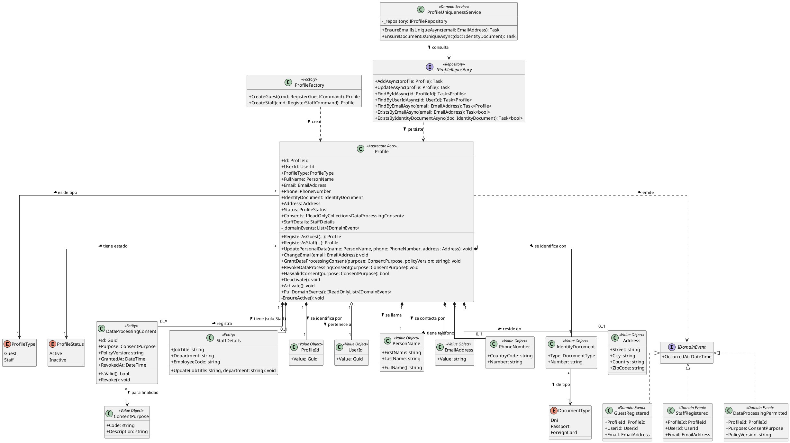

<div style="page-break-before: always;"></div>

# Capítulo V: Tactical-Level Software Design.

## 5.1. Bounded Context: Profiles

El bounded context **Profiles** administra la información detallada de los perfiles de usuario (Guest y Staff) y el procesamiento de sus datos personales. Está implementado con **C# / ASP.NET Core (.NET 8)**, **Entity Framework Core** sobre **PostgreSQL**, **MediatR** para commands, queries y eventos, y arquitectura DDD por capas.

Eventos clave: `DataProcessingPermitted`, `GuestRegistered` y `StaffRegistered`.

Relación con otros contextos: **Profiles – Bookings & Payments (Conformist)**. Profiles es *upstream* y Bookings & Payments es *downstream*, por lo que este último adopta el modelo de Profiles sin capa anticorrupción.

---

### 5.1.1. Domain Layer.

Contiene el núcleo del contexto y las reglas de negocio: quién es la persona, de qué tipo es (Guest o Staff) y si autorizó el procesamiento de sus datos.

#### Aggregates y Entities

| Clase | Categoría | Propósito |
|---|---|---|
| `Profile` | Aggregate Root | Representa el perfil de un usuario. Controla registro, actualización de datos personales, consentimiento y desactivación. Toda modificación pasa por esta clase. |
| `DataProcessingConsent` | Entity (dentro del agregado) | Registro de consentimiento para el tratamiento de datos personales: finalidad, versión de política, fecha de otorgamiento y revocación. |
| `StaffDetails` | Entity (dentro del agregado) | Datos propios del personal (cargo, área, código de empleado). Solo existe si `ProfileType = Staff`. |

**Atributos y métodos de `Profile`:**

| Miembro | Tipo | Descripción |
|---|---|---|
| `Id` | `ProfileId` | Identificador único del perfil. |
| `UserId` | `UserId` | Referencia al usuario de autenticación (IAM). |
| `ProfileType` | `ProfileType` | `Guest` o `Staff`. |
| `FullName` | `PersonName` | Nombres y apellidos. |
| `Email` | `EmailAddress` | Correo único del perfil. |
| `Phone` | `PhoneNumber?` | Teléfono de contacto. |
| `IdentityDocument` | `IdentityDocument` | Tipo y número de documento. |
| `Address` | `Address?` | Dirección (opcional). |
| `Status` | `ProfileStatus` | `Active` o `Inactive`. |
| `Consents` | `IReadOnlyCollection<DataProcessingConsent>` | Consentimientos registrados. |
| `StaffDetails` | `StaffDetails?` | Solo para Staff. |
| `RegisterAsGuest(...)` | `static Profile` | Crea un perfil Guest y emite `GuestRegistered`. |
| `RegisterAsStaff(...)` | `static Profile` | Crea un perfil Staff y emite `StaffRegistered`. |
| `UpdatePersonalData(...)` | `void` | Actualiza nombre, teléfono y dirección. |
| `ChangeEmail(EmailAddress)` | `void` | Cambia el correo (la unicidad se valida en el Domain Service). |
| `GrantDataProcessingConsent(purpose, policyVersion)` | `void` | Registra el consentimiento y emite `DataProcessingPermitted`. |
| `RevokeDataProcessingConsent(purpose)` | `void` | Revoca el consentimiento vigente de esa finalidad. |
| `HasValidConsent(purpose)` | `bool` | Indica si hay consentimiento vigente. |
| `Deactivate()` / `Activate()` | `void` | Cambia el estado del perfil. |
| `PullDomainEvents()` | `IReadOnlyList<IDomainEvent>` | Entrega y limpia los eventos pendientes. |

**Reglas de negocio principales:**

- Un perfil es Guest o Staff, nunca ambos.
- El email y el documento de identidad son únicos en el sistema.
- No se procesan datos personales para una finalidad sin consentimiento vigente.
- Un perfil `Inactive` no puede modificarse ni otorgar consentimientos.
- `StaffDetails` es obligatorio para Staff y prohibido para Guest.

#### Value Objects (implementados como `record`)

| Clase | Propósito | Atributos |
|---|---|---|
| `ProfileId` | Identidad del perfil | `Value: Guid` |
| `UserId` | Referencia al usuario IAM | `Value: Guid` |
| `PersonName` | Nombre de la persona | `FirstName`, `LastName`; `FullName()` |
| `EmailAddress` | Correo validado | `Value: string` (valida formato) |
| `PhoneNumber` | Teléfono validado | `CountryCode`, `Number` |
| `IdentityDocument` | Documento de identidad | `Type: DocumentType`, `Number` |
| `Address` | Dirección | `Street`, `City`, `Country`, `ZipCode` |
| `ConsentPurpose` | Finalidad del consentimiento | `Code`, `Description` |

#### Enumeraciones

| Enum | Valores |
|---|---|
| `ProfileType` | `Guest`, `Staff` |
| `ProfileStatus` | `Active`, `Inactive` |
| `DocumentType` | `Dni`, `Passport`, `ForeignCard` |

#### Domain Events

| Evento | Se emite cuando | Datos |
|---|---|---|
| `GuestRegistered` | Se registra un perfil Guest | `ProfileId`, `UserId`, `Email`, `OccurredAt` |
| `StaffRegistered` | Se registra un perfil Staff | `ProfileId`, `UserId`, `Email`, `OccurredAt` |
| `DataProcessingPermitted` | El usuario otorga consentimiento | `ProfileId`, `Purpose`, `PolicyVersion`, `OccurredAt` |

Todos implementan la interfaz `IDomainEvent` (marca de MediatR `INotification`).

#### Factories y Domain Services

| Clase | Tipo | Propósito |
|---|---|---|
| `ProfileFactory` | Factory | Construye `Profile` válidos desde los comandos, incluyendo `StaffDetails` según el tipo. |
| `ProfileUniquenessService` | Domain Service | Verifica unicidad de email y documento antes de registrar o cambiar datos. |

#### Repositories (interfaces)

| Interfaz | Métodos |
|---|---|
| `IProfileRepository` | `AddAsync(Profile)`, `UpdateAsync(Profile)`, `FindByIdAsync(ProfileId)`, `FindByUserIdAsync(UserId)`, `FindByEmailAsync(EmailAddress)`, `ExistsByEmailAsync(EmailAddress)`, `ExistsByIdentityDocumentAsync(IdentityDocument)` |
| `IUnitOfWork` | `CommitAsync()` |

#### Relaciones entre clases

- `Profile` **compone** 0..* `DataProcessingConsent` y 0..1 `StaffDetails`.
- `Profile` **usa** los Value Objects `PersonName`, `EmailAddress`, `PhoneNumber`, `IdentityDocument` y `Address`.
- `Profile` **emite** `GuestRegistered`, `StaffRegistered` y `DataProcessingPermitted`.
- `ProfileFactory` **crea** `Profile`; `ProfileUniquenessService` **depende** de `IProfileRepository`.

---

### 5.1.2. Interface Layer.

Expone las capacidades del contexto hacia el frontend y hacia otros bounded contexts. Los controllers solo traducen HTTP a commands/queries; no contienen reglas de negocio.

| Clase | Tipo | Propósito | Endpoints / Operaciones |
|---|---|---|---|
| `ProfilesController` | ASP.NET Core Controller (`[ApiController]`) | Registro y gestión de perfiles. | `POST /api/v1/profiles/guests`, `POST /api/v1/profiles/staff`, `GET /api/v1/profiles/{profileId}`, `PUT /api/v1/profiles/{profileId}`, `PATCH /api/v1/profiles/{profileId}/deactivation` |
| `DataConsentController` | ASP.NET Core Controller | Gestión del consentimiento de datos. | `POST /api/v1/profiles/{profileId}/consents`, `DELETE /api/v1/profiles/{profileId}/consents/{purposeCode}`, `GET /api/v1/profiles/{profileId}/consents` |
| `IProfilesContextFacade` / `ProfilesContextFacade` | Facade (API pública del contexto) | Punto de entrada para Bookings & Payments (relación Conformist). Publica el modelo de Profiles tal cual. | `FetchProfileByIdAsync(profileId)`, `FetchProfileIdByUserIdAsync(userId)`, `ExistsActiveProfileAsync(profileId)` |
| `ProfileResourceAssembler` | Assembler | Convierte entre `Profile`, commands y DTOs. | `ToResource(Profile)`, `ToCommand(Resource)` |
| `RegisterGuestResource`, `RegisterStaffResource`, `UpdateProfileResource`, `GrantConsentResource`, `ProfileResource`, `ConsentResource` | DTOs (`record`) | Contratos de entrada y salida de la API. | — |

Como Bookings & Payments es *Conformist*, consume `ProfileResource` directamente, sin capa anticorrupción.

---

### 5.1.3. Application Layer.

Orquesta los flujos del negocio mediante **MediatR**. Se separan **commands** (cambian estado) de **queries** (solo leen).

#### Commands y Command Handlers (`IRequestHandler<,>`)

| Command | Command Handler | Flujo |
|---|---|---|
| `RegisterGuestCommand` | `RegisterGuestCommandHandler` | Valida unicidad → crea Profile con `ProfileFactory` → guarda → publica `GuestRegistered`. |
| `RegisterStaffCommand` | `RegisterStaffCommandHandler` | Igual que el anterior, con `StaffDetails`; publica `StaffRegistered`. |
| `UpdateProfileCommand` | `UpdateProfileCommandHandler` | Carga el perfil → `UpdatePersonalData` → guarda. |
| `ChangeEmailCommand` | `ChangeEmailCommandHandler` | Valida unicidad → `ChangeEmail` → guarda. |
| `GrantDataProcessingConsentCommand` | `GrantDataProcessingConsentCommandHandler` | Carga el perfil → `GrantDataProcessingConsent` → guarda → publica `DataProcessingPermitted`. |
| `RevokeDataProcessingConsentCommand` | `RevokeDataProcessingConsentCommandHandler` | Carga el perfil → `RevokeDataProcessingConsent` → guarda. |
| `DeactivateProfileCommand` | `DeactivateProfileCommandHandler` | Carga el perfil → `Deactivate` → guarda. |

Cada command tiene un validador de **FluentValidation** (por ejemplo `RegisterGuestCommandValidator`) registrado como pipeline behavior de MediatR.

#### Queries y Query Handlers

| Query | Query Handler | Resultado |
|---|---|---|
| `GetProfileByIdQuery` | `GetProfileByIdQueryHandler` | `Profile` por id |
| `GetProfileByUserIdQuery` | `GetProfileByUserIdQueryHandler` | `Profile` por usuario IAM |
| `GetProfileConsentsQuery` | `GetProfileConsentsQueryHandler` | Lista de consentimientos |

#### Event Handlers (`INotificationHandler<>`)

| Handler | Evento que atiende | Acción |
|---|---|---|
| `GuestRegisteredEventHandler` | `GuestRegistered` | Envía el correo de bienvenida y solicita el consentimiento inicial. |
| `StaffRegisteredEventHandler` | `StaffRegistered` | Notifica al administrador y envía el correo de activación. |
| `DataProcessingPermittedEventHandler` | `DataProcessingPermitted` | Registra auditoría y notifica a los contextos interesados. |
| `UserCreatedEventHandler` *(opcional)* | `UserCreated` (IAM) | Crea el perfil base cuando se registra un usuario nuevo. |

#### Puertos de salida (interfaces de aplicación)

| Interfaz | Propósito |
|---|---|
| `IDomainEventPublisher` | Publica eventos de dominio al broker. |
| `IEmailService` | Envía correos al usuario. |

---

### 5.1.4. Infrastructure Layer.

Implementa el acceso a servicios externos y las interfaces definidas en el dominio y la aplicación.

| Clase | Implementa / Rol | Tecnología | Descripción |
|---|---|---|---|
| `ProfilesDbContext` | `DbContext` + `IUnitOfWork` | EF Core + Npgsql | Contexto de persistencia del bounded context. |
| `EfProfileRepository` | `IProfileRepository` | EF Core | Persiste el agregado Profile en PostgreSQL. |
| `ProfileConfiguration`, `DataProcessingConsentConfiguration`, `StaffDetailsConfiguration` | `IEntityTypeConfiguration<T>` | EF Core Fluent API | Mapeo objeto-relacional; los Value Objects se mapean con `OwnsOne`. |
| `MediatRDomainEventPublisher` | `IDomainEventPublisher` | MediatR / Message Broker | Publica los eventos del agregado tras persistir. |
| `OutboxMessage` + `OutboxProcessor` | Patrón Outbox | EF Core + `BackgroundService` | Garantiza la entrega de eventos al broker (recomendado). |
| `SmtpEmailService` | `IEmailService` | MailKit / SMTP | Envía correos de bienvenida y activación. |
| `IamUserClient` *(opcional)* | Cliente de IAM | `HttpClient` tipado | Valida que `UserId` exista en el contexto de identidad. |

---

### 5.1.5. Bounded Context Software Architecture Component Level Diagrams.

Container considerado: **Profiles API** (ASP.NET Core Web API), dentro de la plataforma.

| Componente | Responsabilidad | Tecnología |
|---|---|---|
| ProfilesController | Registro y gestión de perfiles | ASP.NET Core Controller |
| DataConsentController | Gestión del consentimiento | ASP.NET Core Controller |
| ProfilesContextFacade | API interna para Bookings & Payments | C# Service |
| Command Handlers | Casos de uso de escritura | MediatR |
| Query Handlers | Casos de uso de lectura | MediatR |
| Event Handlers | Reaccionan a eventos | MediatR `INotificationHandler` |
| Profile Domain Model | Aggregate, VOs, Domain Service, Factory | C# (clases/records) |
| EfProfileRepository | Persistencia | EF Core + Npgsql |
| Event Publisher / Outbox | Publicación de eventos | MediatR + BackgroundService |
| Email Service | Envío de correos | MailKit / SMTP |


```
workspace "Profiles Bounded Context" "C4 - Component diagram" {

  model {
    guest = person "Guest" "Huésped que gestiona su perfil y consentimientos"
    staff = person "Staff" "Personal que gestiona su perfil"

    bookings = softwareSystem "Bookings & Payments" "Downstream (Conformist): consume el modelo de Profiles" "Existing"
    mail = softwareSystem "Email Service" "Servicio de correo (SMTP)" "External"

    platform = softwareSystem "Plataforma" "Sistema principal" {
      web = container "Frontend" "Interfaz de usuario" "SPA"
      db = container "Profiles DB" "Perfiles, consentimientos y outbox" "PostgreSQL" "Database"
      broker = container "Message Broker" "Eventos de dominio" "RabbitMQ"

      api = container "Profiles API" "Bounded Context Profiles" "C#, ASP.NET Core 8" {
        profilesController = component "ProfilesController" "Registro y gestión de perfiles" "ASP.NET Core Controller"
        consentController = component "DataConsentController" "Gestión del consentimiento de datos" "ASP.NET Core Controller"
        facade = component "ProfilesContextFacade" "API pública para otros contextos" "C# Service"
        commandHandlers = component "Command Handlers" "Casos de uso de escritura" "MediatR"
        queryHandlers = component "Query Handlers" "Casos de uso de lectura" "MediatR"
        eventHandlers = component "Event Handlers" "Reaccionan a eventos de dominio" "MediatR INotificationHandler"
        domainModel = component "Profile Domain Model" "Aggregate, Value Objects, Factory, Domain Service" "C#"
        repository = component "EfProfileRepository" "Implementa IProfileRepository" "EF Core"
        publisher = component "Event Publisher / Outbox" "Publica eventos de dominio" "MediatR + BackgroundService"
        emailService = component "Email Service" "Envía correos de bienvenida y activación" "MailKit"
      }
    }

    guest -> web "Usa"
    staff -> web "Usa"
    web -> profilesController "Consume" "HTTPS/JSON"
    web -> consentController "Consume" "HTTPS/JSON"
    bookings -> facade "Consulta perfiles" "Llamada interna"

    profilesController -> commandHandlers "Envía commands"
    profilesController -> queryHandlers "Envía queries"
    consentController -> commandHandlers "Envía commands"
    consentController -> queryHandlers "Envía queries"
    facade -> queryHandlers "Consulta perfiles"

    commandHandlers -> domainModel "Aplica reglas de negocio"
    commandHandlers -> repository "Guarda agregados"
    queryHandlers -> repository "Lee agregados"
    commandHandlers -> publisher "Publica eventos"
    repository -> db "Lee/Escribe" "EF Core / Npgsql"
    publisher -> db "Guarda mensajes outbox" "EF Core / Npgsql"
    publisher -> broker "Publica eventos" "AMQP"
    publisher -> eventHandlers "Notifica eventos internos"
    eventHandlers -> emailService "Solicita envío"
    emailService -> mail "Envía correos" "SMTP"
  }

  views {
    component api "ProfilesComponents" "Component diagram del container Profiles API" {
      include *
      autolayout lr
    }

    styles {
      element "Person" {
        shape Person
        background #08427b
        color #ffffff
      }
      element "Software System" {
        background #1168bd
        color #ffffff
      }
      element "External" {
        background #999999
        color #ffffff
      }
      element "Existing" {
        background #6b8e23
        color #ffffff
      }
      element "Container" {
        background #438dd5
        color #ffffff
      }
      element "Database" {
        shape Cylinder
      }
      element "Component" {
        background #85bbf0
        color #000000
      }
    }
  }
}
```

---

### 5.1.6. Bounded Context Software Architecture Code Level Diagrams.

#### 5.1.6.1. Bounded Context Domain Layer Class Diagrams.

Diagrama UML de clases del Domain Layer. Visibilidad: `+` public, `-` private, `#` protected. Las propiedades de C# se muestran con setter privado (`+Id: ProfileId {get; private set}` se simplifica como `+Id`).




#### 5.1.6.2. Bounded Context Database Design Diagram.

Se usa un esquema relacional en **PostgreSQL** con 4 tablas, generado mediante EF Core Migrations:

- `profiles`: tabla principal del agregado. Los Value Objects (`PersonName`, `EmailAddress`, `PhoneNumber`, `IdentityDocument`, `Address`) se aplanan en columnas mediante `OwnsOne`.
- `data_processing_consents`: tabla hija con FK a `profiles` (relación 1:N).
- `staff_details`: relación 1:1 opcional con `profiles` (solo para perfiles Staff).
- `outbox_events`: garantiza la entrega de eventos de dominio al broker.


```dbml
Table profiles {
  id uuid [pk]
  user_id uuid [not null, unique, note: 'Referencia lógica al usuario IAM']
  profile_type varchar(10) [not null, note: 'GUEST | STAFF']
  first_name varchar(100) [not null]
  last_name varchar(100) [not null]
  email varchar(150) [not null, unique]
  phone_country_code varchar(5)
  phone_number varchar(20)
  document_type varchar(20) [not null, note: 'DNI | PASSPORT | FOREIGN_CARD']
  document_number varchar(30) [not null]
  address_street varchar(200)
  address_city varchar(100)
  address_country varchar(100)
  address_zip_code varchar(20)
  status varchar(10) [not null, default: 'ACTIVE']
  created_at timestamp [not null, default: `now()`]
  updated_at timestamp [not null, default: `now()`]

  indexes {
    (document_type, document_number) [unique]
  }
}

Table data_processing_consents {
  id uuid [pk]
  profile_id uuid [not null]
  purpose_code varchar(50) [not null]
  purpose_description varchar(250)
  policy_version varchar(20) [not null]
  granted_at timestamp [not null]
  revoked_at timestamp

  indexes {
    (profile_id, purpose_code, granted_at)
  }
}

Table staff_details {
  profile_id uuid [pk]
  job_title varchar(100) [not null]
  department varchar(100) [not null]
  employee_code varchar(30) [not null, unique]
}

Table outbox_events {
  id uuid [pk]
  aggregate_id uuid [not null]
  event_type varchar(100) [not null, note: 'GuestRegistered | StaffRegistered | DataProcessingPermitted']
  payload jsonb [not null]
  occurred_at timestamp [not null]
  published boolean [not null, default: false]
}

Ref: data_processing_consents.profile_id > profiles.id [delete: cascade]
Ref: staff_details.profile_id - profiles.id [delete: cascade]
Ref: outbox_events.aggregate_id > profiles.id
```

**Constraints adicionales:**

- `CHECK (profile_type IN ('GUEST','STAFF'))`
- `CHECK (status IN ('ACTIVE','INACTIVE'))`
- `CHECK (document_type IN ('DNI','PASSPORT','FOREIGN_CARD'))`
- `staff_details` solo se inserta cuando `profile_type = 'STAFF'` (regla garantizada por el dominio).
- En EF Core, los enums se guardan como texto con `HasConversion<string>()` para que coincidan con los valores de arriba.

## 5.X. Bounded Context: <Bounded Context Name>

### 5.X.1. Domain Layer.

### 5.X.2. Interface Layer.

### 5.X.2. Application Layer.

### 5.X.4. Infrastructure Layer.

### 5.X.5. Bounded Context Software Architecture Component Level Diagrams.

### 5.X.6. Bounded Context Software Architecture Code Level Diagrams.

#### 5.X.6.1. Bounded Context Domain Layer Class Diagrams.

#### 5.X.6.2. Bounded Context Database Design Diagram.


