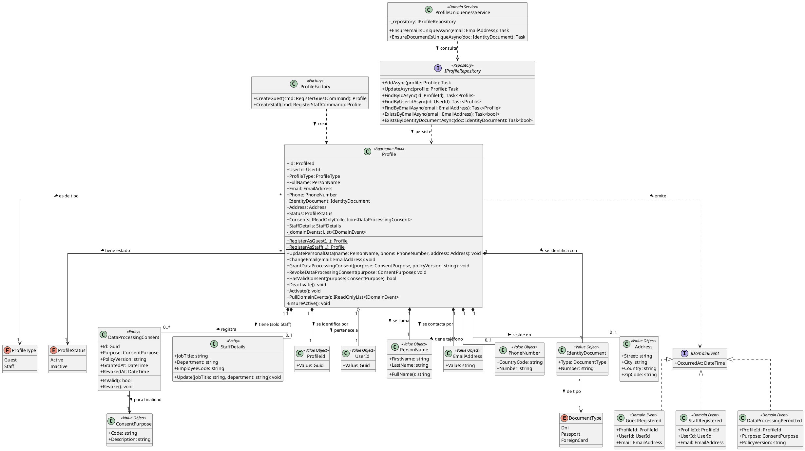
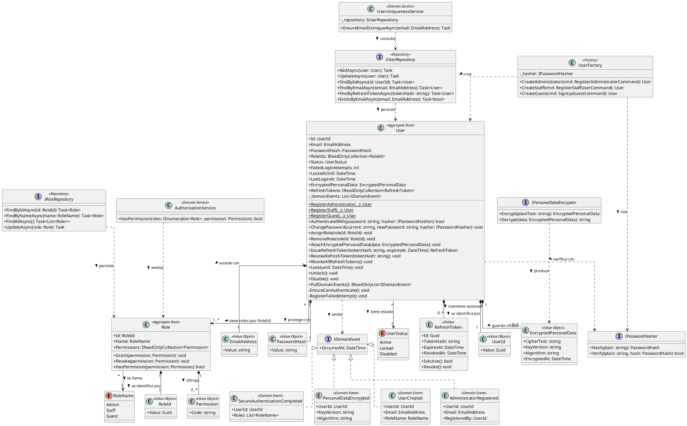
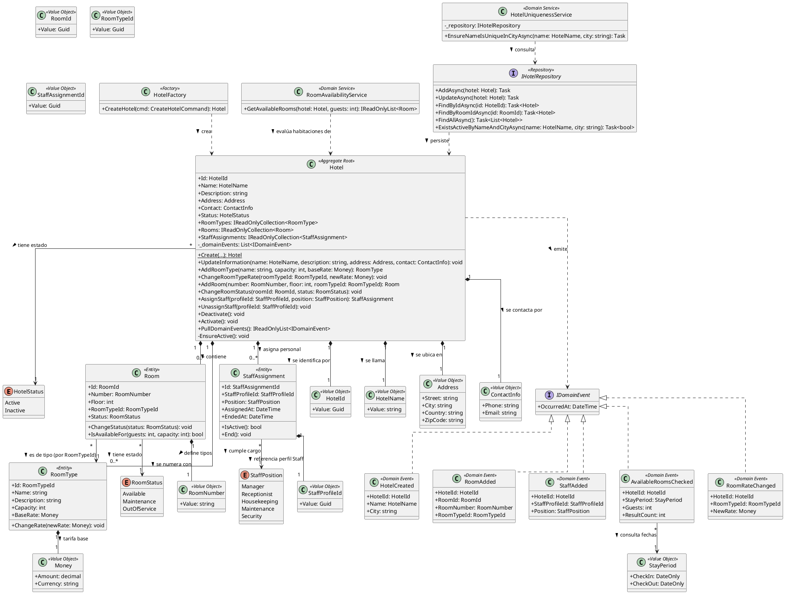

<div style="page-break-before: always;"></div>

# Capítulo V: Tactical-Level Software Design.

## 5.1. Bounded Context: Profiles

El bounded context **Profiles** administra la información detallada de los perfiles de usuario (Guest y Staff) y el procesamiento de sus datos personales. Está implementado con **C# / ASP.NET Core (.NET 8)**, **Entity Framework Core** sobre **PostgreSQL**, **MediatR** para commands, queries y eventos, y arquitectura DDD por capas.

Eventos clave: `DataProcessingPermitted`, `GuestRegistered` y `StaffRegistered`.

Relación con otros contextos: **Profiles – Bookings & Payments (Conformist)**. Profiles es *upstream* y Bookings & Payments es *downstream*, por lo que este último adopta el modelo de Profiles sin capa anticorrupción.

---

### 5.1.1. Domain Layer.

Contiene el núcleo del contexto y las reglas de negocio: quién es la persona, de qué tipo es (Guest o Staff) y si autorizó el procesamiento de sus datos.

***Aggregates y Entities***

| Clase | Categoría | Propósito |
|---|---|---|
| `Profile` | Aggregate Root | Representa el perfil de un usuario. Controla registro, actualización de datos personales, consentimiento y desactivación. Toda modificación pasa por esta clase. |
| `DataProcessingConsent` | Entity (dentro del agregado) | Registro de consentimiento para el tratamiento de datos personales: finalidad, versión de política, fecha de otorgamiento y revocación. |
| `StaffDetails` | Entity (dentro del agregado) | Datos propios del personal (cargo, área, código de empleado). Solo existe si `ProfileType = Staff`. |

**Atributos y métodos de `Profile`:**

| Miembro | Tipo | Descripción |
|---|---|---|
| `Id` | `ProfileId` | Identificador único del perfil. |
| `UserId` | `UserId` | Referencia al usuario de autenticación (IAM). |
| `ProfileType` | `ProfileType` | `Guest` o `Staff`. |
| `FullName` | `PersonName` | Nombres y apellidos. |
| `Email` | `EmailAddress` | Correo único del perfil. |
| `Phone` | `PhoneNumber?` | Teléfono de contacto. |
| `IdentityDocument` | `IdentityDocument` | Tipo y número de documento. |
| `Address` | `Address?` | Dirección (opcional). |
| `Status` | `ProfileStatus` | `Active` o `Inactive`. |
| `Consents` | `IReadOnlyCollection<DataProcessingConsent>` | Consentimientos registrados. |
| `StaffDetails` | `StaffDetails?` | Solo para Staff. |
| `RegisterAsGuest(...)` | `static Profile` | Crea un perfil Guest y emite `GuestRegistered`. |
| `RegisterAsStaff(...)` | `static Profile` | Crea un perfil Staff y emite `StaffRegistered`. |
| `UpdatePersonalData(...)` | `void` | Actualiza nombre, teléfono y dirección. |
| `ChangeEmail(EmailAddress)` | `void` | Cambia el correo (la unicidad se valida en el Domain Service). |
| `GrantDataProcessingConsent(purpose, policyVersion)` | `void` | Registra el consentimiento y emite `DataProcessingPermitted`. |
| `RevokeDataProcessingConsent(purpose)` | `void` | Revoca el consentimiento vigente de esa finalidad. |
| `HasValidConsent(purpose)` | `bool` | Indica si hay consentimiento vigente. |
| `Deactivate()` / `Activate()` | `void` | Cambia el estado del perfil. |
| `PullDomainEvents()` | `IReadOnlyList<IDomainEvent>` | Entrega y limpia los eventos pendientes. |

**Reglas de negocio principales:**

- Un perfil es Guest o Staff, nunca ambos.
- El email y el documento de identidad son únicos en el sistema.
- No se procesan datos personales para una finalidad sin consentimiento vigente.
- Un perfil `Inactive` no puede modificarse ni otorgar consentimientos.
- `StaffDetails` es obligatorio para Staff y prohibido para Guest.

***Value Objects (implementados como `record`)***

| Clase | Propósito | Atributos |
|---|---|---|
| `ProfileId` | Identidad del perfil | `Value: Guid` |
| `UserId` | Referencia al usuario IAM | `Value: Guid` |
| `PersonName` | Nombre de la persona | `FirstName`, `LastName`; `FullName()` |
| `EmailAddress` | Correo validado | `Value: string` (valida formato) |
| `PhoneNumber` | Teléfono validado | `CountryCode`, `Number` |
| `IdentityDocument` | Documento de identidad | `Type: DocumentType`, `Number` |
| `Address` | Dirección | `Street`, `City`, `Country`, `ZipCode` |
| `ConsentPurpose` | Finalidad del consentimiento | `Code`, `Description` |

***Enumeraciones***

| Enum | Valores |
|---|---|
| `ProfileType` | `Guest`, `Staff` |
| `ProfileStatus` | `Active`, `Inactive` |
| `DocumentType` | `Dni`, `Passport`, `ForeignCard` |

***Domain Events***

| Evento | Se emite cuando | Datos |
|---|---|---|
| `GuestRegistered` | Se registra un perfil Guest | `ProfileId`, `UserId`, `Email`, `OccurredAt` |
| `StaffRegistered` | Se registra un perfil Staff | `ProfileId`, `UserId`, `Email`, `OccurredAt` |
| `DataProcessingPermitted` | El usuario otorga consentimiento | `ProfileId`, `Purpose`, `PolicyVersion`, `OccurredAt` |

Todos implementan la interfaz `IDomainEvent` (marca de MediatR `INotification`).

***Factories y Domain Services***

| Clase | Tipo | Propósito |
|---|---|---|
| `ProfileFactory` | Factory | Construye `Profile` válidos desde los comandos, incluyendo `StaffDetails` según el tipo. |
| `ProfileUniquenessService` | Domain Service | Verifica unicidad de email y documento antes de registrar o cambiar datos. |

***Repositories (interfaces)***

| Interfaz | Métodos |
|---|---|
| `IProfileRepository` | `AddAsync(Profile)`, `UpdateAsync(Profile)`, `FindByIdAsync(ProfileId)`, `FindByUserIdAsync(UserId)`, `FindByEmailAsync(EmailAddress)`, `ExistsByEmailAsync(EmailAddress)`, `ExistsByIdentityDocumentAsync(IdentityDocument)` |
| `IUnitOfWork` | `CommitAsync()` |

***Relaciones entre clases***

- `Profile` **compone** 0..* `DataProcessingConsent` y 0..1 `StaffDetails`.
- `Profile` **usa** los Value Objects `PersonName`, `EmailAddress`, `PhoneNumber`, `IdentityDocument` y `Address`.
- `Profile` **emite** `GuestRegistered`, `StaffRegistered` y `DataProcessingPermitted`.
- `ProfileFactory` **crea** `Profile`; `ProfileUniquenessService` **depende** de `IProfileRepository`.

---

### 5.1.2. Interface Layer.

Expone las capacidades del contexto hacia el frontend y hacia otros bounded contexts. Los controllers solo traducen HTTP a commands/queries; no contienen reglas de negocio.

| Clase | Tipo | Propósito | Endpoints / Operaciones |
|---|---|---|---|
| `ProfilesController` | ASP.NET Core Controller (`[ApiController]`) | Registro y gestión de perfiles. | `POST /api/v1/profiles/guests`, `POST /api/v1/profiles/staff`, `GET /api/v1/profiles/{profileId}`, `PUT /api/v1/profiles/{profileId}`, `PATCH /api/v1/profiles/{profileId}/deactivation` |
| `DataConsentController` | ASP.NET Core Controller | Gestión del consentimiento de datos. | `POST /api/v1/profiles/{profileId}/consents`, `DELETE /api/v1/profiles/{profileId}/consents/{purposeCode}`, `GET /api/v1/profiles/{profileId}/consents` |
| `IProfilesContextFacade` / `ProfilesContextFacade` | Facade (API pública del contexto) | Punto de entrada para Bookings & Payments (relación Conformist). Publica el modelo de Profiles tal cual. | `FetchProfileByIdAsync(profileId)`, `FetchProfileIdByUserIdAsync(userId)`, `ExistsActiveProfileAsync(profileId)` |
| `ProfileResourceAssembler` | Assembler | Convierte entre `Profile`, commands y DTOs. | `ToResource(Profile)`, `ToCommand(Resource)` |
| `RegisterGuestResource`, `RegisterStaffResource`, `UpdateProfileResource`, `GrantConsentResource`, `ProfileResource`, `ConsentResource` | DTOs (`record`) | Contratos de entrada y salida de la API. | — |

Como Bookings & Payments es *Conformist*, consume `ProfileResource` directamente, sin capa anticorrupción.

---

### 5.1.3. Application Layer.

Orquesta los flujos del negocio mediante **MediatR**. Se separan **commands** (cambian estado) de **queries** (solo leen).

***Commands y Command Handlers (`IRequestHandler<,>`)***

| Command | Command Handler | Flujo |
|---|---|---|
| `RegisterGuestCommand` | `RegisterGuestCommandHandler` | Valida unicidad → crea Profile con `ProfileFactory` → guarda → publica `GuestRegistered`. |
| `RegisterStaffCommand` | `RegisterStaffCommandHandler` | Igual que el anterior, con `StaffDetails`; publica `StaffRegistered`. |
| `UpdateProfileCommand` | `UpdateProfileCommandHandler` | Carga el perfil → `UpdatePersonalData` → guarda. |
| `ChangeEmailCommand` | `ChangeEmailCommandHandler` | Valida unicidad → `ChangeEmail` → guarda. |
| `GrantDataProcessingConsentCommand` | `GrantDataProcessingConsentCommandHandler` | Carga el perfil → `GrantDataProcessingConsent` → guarda → publica `DataProcessingPermitted`. |
| `RevokeDataProcessingConsentCommand` | `RevokeDataProcessingConsentCommandHandler` | Carga el perfil → `RevokeDataProcessingConsent` → guarda. |
| `DeactivateProfileCommand` | `DeactivateProfileCommandHandler` | Carga el perfil → `Deactivate` → guarda. |

Cada command tiene un validador de **FluentValidation** (por ejemplo `RegisterGuestCommandValidator`) registrado como pipeline behavior de MediatR.

***Queries y Query Handlers***

| Query | Query Handler | Resultado |
|---|---|---|
| `GetProfileByIdQuery` | `GetProfileByIdQueryHandler` | `Profile` por id |
| `GetProfileByUserIdQuery` | `GetProfileByUserIdQueryHandler` | `Profile` por usuario IAM |
| `GetProfileConsentsQuery` | `GetProfileConsentsQueryHandler` | Lista de consentimientos |

***Event Handlers (`INotificationHandler<>`)***

| Handler | Evento que atiende | Acción |
|---|---|---|
| `GuestRegisteredEventHandler` | `GuestRegistered` | Envía el correo de bienvenida y solicita el consentimiento inicial. |
| `StaffRegisteredEventHandler` | `StaffRegistered` | Notifica al administrador y envía el correo de activación. |
| `DataProcessingPermittedEventHandler` | `DataProcessingPermitted` | Registra auditoría y notifica a los contextos interesados. |
| `UserCreatedEventHandler` *(opcional)* | `UserCreated` (IAM) | Crea el perfil base cuando se registra un usuario nuevo. |

***Puertos de salida (interfaces de aplicación)***

| Interfaz | Propósito |
|---|---|
| `IDomainEventPublisher` | Publica eventos de dominio al broker. |
| `IEmailService` | Envía correos al usuario. |

---

### 5.1.4. Infrastructure Layer.

Implementa el acceso a servicios externos y las interfaces definidas en el dominio y la aplicación.

| Clase | Implementa / Rol | Tecnología | Descripción |
|---|---|---|---|
| `ProfilesDbContext` | `DbContext` + `IUnitOfWork` | EF Core + Npgsql | Contexto de persistencia del bounded context. |
| `EfProfileRepository` | `IProfileRepository` | EF Core | Persiste el agregado Profile en PostgreSQL. |
| `ProfileConfiguration`, `DataProcessingConsentConfiguration`, `StaffDetailsConfiguration` | `IEntityTypeConfiguration<T>` | EF Core Fluent API | Mapeo objeto-relacional; los Value Objects se mapean con `OwnsOne`. |
| `MediatRDomainEventPublisher` | `IDomainEventPublisher` | MediatR / Message Broker | Publica los eventos del agregado tras persistir. |
| `OutboxMessage` + `OutboxProcessor` | Patrón Outbox | EF Core + `BackgroundService` | Garantiza la entrega de eventos al broker (recomendado). |
| `SmtpEmailService` | `IEmailService` | MailKit / SMTP | Envía correos de bienvenida y activación. |
| `IamUserClient` *(opcional)* | Cliente de IAM | `HttpClient` tipado | Valida que `UserId` exista en el contexto de identidad. |

---

### 5.1.5. Bounded Context Software Architecture Component Level Diagrams.

Container considerado: **Profiles API** (ASP.NET Core Web API), dentro de la plataforma.

| Componente | Responsabilidad | Tecnología |
|---|---|---|
| ProfilesController | Registro y gestión de perfiles | ASP.NET Core Controller |
| DataConsentController | Gestión del consentimiento | ASP.NET Core Controller |
| ProfilesContextFacade | API interna para Bookings & Payments | C# Service |
| Command Handlers | Casos de uso de escritura | MediatR |
| Query Handlers | Casos de uso de lectura | MediatR |
| Event Handlers | Reaccionan a eventos | MediatR `INotificationHandler` |
| Profile Domain Model | Aggregate, VOs, Domain Service, Factory | C# (clases/records) |
| EfProfileRepository | Persistencia | EF Core + Npgsql |
| Event Publisher / Outbox | Publicación de eventos | MediatR + BackgroundService |
| Email Service | Envío de correos | MailKit / SMTP |


```
workspace "Profiles Bounded Context" "C4 - Component diagram" {

  model {
    guest = person "Guest" "Huésped que gestiona su perfil y consentimientos"
    staff = person "Staff" "Personal que gestiona su perfil"

    bookings = softwareSystem "Bookings & Payments" "Downstream (Conformist): consume el modelo de Profiles" "Existing"
    mail = softwareSystem "Email Service" "Servicio de correo (SMTP)" "External"

    platform = softwareSystem "Plataforma" "Sistema principal" {
      web = container "Frontend" "Interfaz de usuario" "SPA"
      db = container "Profiles DB" "Perfiles, consentimientos y outbox" "PostgreSQL" "Database"
      broker = container "Message Broker" "Eventos de dominio" "RabbitMQ"

      api = container "Profiles API" "Bounded Context Profiles" "C#, ASP.NET Core 8" {
        profilesController = component "ProfilesController" "Registro y gestión de perfiles" "ASP.NET Core Controller"
        consentController = component "DataConsentController" "Gestión del consentimiento de datos" "ASP.NET Core Controller"
        facade = component "ProfilesContextFacade" "API pública para otros contextos" "C# Service"
        commandHandlers = component "Command Handlers" "Casos de uso de escritura" "MediatR"
        queryHandlers = component "Query Handlers" "Casos de uso de lectura" "MediatR"
        eventHandlers = component "Event Handlers" "Reaccionan a eventos de dominio" "MediatR INotificationHandler"
        domainModel = component "Profile Domain Model" "Aggregate, Value Objects, Factory, Domain Service" "C#"
        repository = component "EfProfileRepository" "Implementa IProfileRepository" "EF Core"
        publisher = component "Event Publisher / Outbox" "Publica eventos de dominio" "MediatR + BackgroundService"
        emailService = component "Email Service" "Envía correos de bienvenida y activación" "MailKit"
      }
    }

    guest -> web "Usa"
    staff -> web "Usa"
    web -> profilesController "Consume" "HTTPS/JSON"
    web -> consentController "Consume" "HTTPS/JSON"
    bookings -> facade "Consulta perfiles" "Llamada interna"

    profilesController -> commandHandlers "Envía commands"
    profilesController -> queryHandlers "Envía queries"
    consentController -> commandHandlers "Envía commands"
    consentController -> queryHandlers "Envía queries"
    facade -> queryHandlers "Consulta perfiles"

    commandHandlers -> domainModel "Aplica reglas de negocio"
    commandHandlers -> repository "Guarda agregados"
    queryHandlers -> repository "Lee agregados"
    commandHandlers -> publisher "Publica eventos"
    repository -> db "Lee/Escribe" "EF Core / Npgsql"
    publisher -> db "Guarda mensajes outbox" "EF Core / Npgsql"
    publisher -> broker "Publica eventos" "AMQP"
    publisher -> eventHandlers "Notifica eventos internos"
    eventHandlers -> emailService "Solicita envío"
    emailService -> mail "Envía correos" "SMTP"
  }

  views {
    component api "ProfilesComponents" "Component diagram del container Profiles API" {
      include *
      autolayout lr
    }

    styles {
      element "Person" {
        shape Person
        background #08427b
        color #ffffff
      }
      element "Software System" {
        background #1168bd
        color #ffffff
      }
      element "External" {
        background #999999
        color #ffffff
      }
      element "Existing" {
        background #6b8e23
        color #ffffff
      }
      element "Container" {
        background #438dd5
        color #ffffff
      }
      element "Database" {
        shape Cylinder
      }
      element "Component" {
        background #85bbf0
        color #000000
      }
    }
  }
}
```

---

### 5.1.6. Bounded Context Software Architecture Code Level Diagrams.

#### 5.1.6.1. Bounded Context Domain Layer Class Diagrams.

Diagrama UML de clases del Domain Layer. Visibilidad: `+` public, `-` private, `#` protected. Las propiedades de C# se muestran con setter privado (`+Id: ProfileId {get; private set}` se simplifica como `+Id`).




#### 5.1.6.2. Bounded Context Database Design Diagram.

Se usa un esquema relacional en **PostgreSQL** con 4 tablas, generado mediante EF Core Migrations:

- `profiles`: tabla principal del agregado. Los Value Objects (`PersonName`, `EmailAddress`, `PhoneNumber`, `IdentityDocument`, `Address`) se aplanan en columnas mediante `OwnsOne`.
- `data_processing_consents`: tabla hija con FK a `profiles` (relación 1:N).
- `staff_details`: relación 1:1 opcional con `profiles` (solo para perfiles Staff).
- `outbox_events`: garantiza la entrega de eventos de dominio al broker.


```dbml
Table profiles {
  id uuid [pk]
  user_id uuid [not null, unique, note: 'Referencia lógica al usuario IAM']
  profile_type varchar(10) [not null, note: 'GUEST | STAFF']
  first_name varchar(100) [not null]
  last_name varchar(100) [not null]
  email varchar(150) [not null, unique]
  phone_country_code varchar(5)
  phone_number varchar(20)
  document_type varchar(20) [not null, note: 'DNI | PASSPORT | FOREIGN_CARD']
  document_number varchar(30) [not null]
  address_street varchar(200)
  address_city varchar(100)
  address_country varchar(100)
  address_zip_code varchar(20)
  status varchar(10) [not null, default: 'ACTIVE']
  created_at timestamp [not null, default: `now()`]
  updated_at timestamp [not null, default: `now()`]

  indexes {
    (document_type, document_number) [unique]
  }
}

Table data_processing_consents {
  id uuid [pk]
  profile_id uuid [not null]
  purpose_code varchar(50) [not null]
  purpose_description varchar(250)
  policy_version varchar(20) [not null]
  granted_at timestamp [not null]
  revoked_at timestamp

  indexes {
    (profile_id, purpose_code, granted_at)
  }
}

Table staff_details {
  profile_id uuid [pk]
  job_title varchar(100) [not null]
  department varchar(100) [not null]
  employee_code varchar(30) [not null, unique]
}

Table outbox_events {
  id uuid [pk]
  aggregate_id uuid [not null]
  event_type varchar(100) [not null, note: 'GuestRegistered | StaffRegistered | DataProcessingPermitted']
  payload jsonb [not null]
  occurred_at timestamp [not null]
  published boolean [not null, default: false]
}

Ref: data_processing_consents.profile_id > profiles.id [delete: cascade]
Ref: staff_details.profile_id - profiles.id [delete: cascade]
Ref: outbox_events.aggregate_id > profiles.id
```

**Constraints adicionales:**

- `CHECK (profile_type IN ('GUEST','STAFF'))`
- `CHECK (status IN ('ACTIVE','INACTIVE'))`
- `CHECK (document_type IN ('DNI','PASSPORT','FOREIGN_CARD'))`
- `staff_details` solo se inserta cuando `profile_type = 'STAFF'` (regla garantizada por el dominio).
- En EF Core, los enums se guardan como texto con `HasConversion<string>()` para que coincidan con los valores de arriba.

## 5.2. Bounded Context: IAM

El bounded context **IAM (Identity & Access Management)** gestiona la seguridad, la autenticación y la autorización de todos los usuarios de la plataforma (Admin, Staff y Huésped). Está implementado con **C# / ASP.NET Core (.NET 8)**, **Entity Framework Core** sobre **PostgreSQL**, **MediatR** para commands, queries y eventos, **JWT** para los tokens de acceso y arquitectura DDD por capas.

Eventos clave: `AdministratorRegistered`, `SecureAuthenticationCompleted` y `PersonalDataEncrypted`.

Relación con otros contextos: **IAM – Profiles (Anti-Corruption Layer)**. IAM es *upstream*: provee la identidad validada y la lógica de autenticación/autorización. Profiles es *downstream*: consume esa identidad y la complementa con datos de perfil. El **ACL se ubica en Profiles** (clase `IamUserClient` con su traductor), por lo que IAM solo expone una fachada pública estable y los cambios internos de su modelo no afectan a Profiles.

---

### 5.2.1. Domain Layer.

Contiene el núcleo del contexto y las reglas de negocio de seguridad: quién es el usuario, qué rol tiene, cómo se valida su identidad y cómo se protegen sus datos sensibles.

***Aggregates y Entities***

| Clase | Categoría | Propósito |
|---|---|---|
| `User` | Aggregate Root | Representa la identidad de un usuario del sistema. Controla registro, credenciales, bloqueo por intentos fallidos, asignación de roles, sesiones (refresh tokens) y datos sensibles cifrados. |
| `RefreshToken` | Entity (dentro del agregado User) | Token de renovación de sesión. Guarda hash del token, fecha de expiración y revocación. |
| `Role` | Aggregate Root | Define un rol (Admin, Staff, Guest) y los permisos que otorga. |

**Atributos y métodos de `User`:**

| Miembro | Tipo | Descripción |
|---|---|---|
| `Id` | `UserId` | Identificador único del usuario. |
| `Email` | `EmailAddress` | Correo de acceso (único). |
| `PasswordHash` | `PasswordHash` | Hash de la contraseña (nunca se guarda en claro). |
| `RoleIds` | `IReadOnlyCollection<RoleId>` | Roles asignados. |
| `Status` | `UserStatus` | `Active`, `Locked` o `Disabled`. |
| `FailedLoginAttempts` | `int` | Contador de intentos fallidos consecutivos. |
| `LockedUntil` | `DateTime?` | Fecha hasta la cual la cuenta está bloqueada. |
| `LastLoginAt` | `DateTime?` | Último acceso exitoso. |
| `EncryptedPersonalData` | `EncryptedPersonalData?` | Datos personales sensibles cifrados. |
| `RefreshTokens` | `IReadOnlyCollection<RefreshToken>` | Sesiones activas. |
| `RegisterAdministrator(...)` | `static User` | Crea un usuario con rol Admin y emite `AdministratorRegistered`. |
| `RegisterStaff(...)` | `static User` | Crea un usuario con rol Staff y emite `UserCreated`. |
| `RegisterGuest(...)` | `static User` | Crea un usuario con rol Guest y emite `UserCreated`. |
| `AuthenticateWith(password, hasher)` | `bool` | Verifica credenciales, controla bloqueo y emite `SecureAuthenticationCompleted` si es exitosa. |
| `ChangePassword(current, new, hasher)` | `void` | Cambia la contraseña y revoca las sesiones activas. |
| `AssignRole(RoleId)` / `RemoveRole(RoleId)` | `void` | Gestiona los roles del usuario. |
| `AttachEncryptedPersonalData(data)` | `void` | Registra los datos sensibles cifrados y emite `PersonalDataEncrypted`. |
| `IssueRefreshToken(hash, expiresAt)` | `RefreshToken` | Registra una nueva sesión. |
| `RevokeRefreshToken(tokenHash)` / `RevokeAllRefreshTokens()` | `void` | Cierra una o todas las sesiones. |
| `Lock(until)` / `Unlock()` | `void` | Bloquea o desbloquea la cuenta. |
| `Disable()` | `void` | Deshabilita la cuenta definitivamente. |
| `PullDomainEvents()` | `IReadOnlyList<IDomainEvent>` | Entrega y limpia los eventos pendientes. |

**Atributos y métodos de `Role`:**

| Miembro | Tipo | Descripción |
|---|---|---|
| `Id` | `RoleId` | Identificador del rol. |
| `Name` | `RoleName` | `Admin`, `Staff` o `Guest`. |
| `Permissions` | `IReadOnlyCollection<Permission>` | Permisos otorgados. |
| `Grant(Permission)` / `Revoke(Permission)` | `void` | Gestiona permisos del rol. |
| `HasPermission(Permission)` | `bool` | Indica si el rol otorga el permiso. |

**Reglas de negocio principales:**

- El email del usuario es único en el sistema.
- La contraseña se almacena solo como hash; nunca se expone ni se registra en eventos.
- Tras 5 intentos fallidos consecutivos la cuenta se bloquea por 15 minutos.
- Un usuario `Locked` o `Disabled` no puede autenticarse.
- Solo un Admin puede registrar a otro Admin o a un Staff.
- Un usuario debe tener al menos un rol.
- Al cambiar la contraseña se revocan todas las sesiones activas.
- Los datos personales sensibles se guardan siempre cifrados.

***Value Objects (implementados como `record`)***

| Clase | Propósito | Atributos |
|---|---|---|
| `UserId` | Identidad del usuario | `Value: Guid` |
| `RoleId` | Identidad del rol | `Value: Guid` |
| `EmailAddress` | Correo validado | `Value: string` (valida formato) |
| `PasswordHash` | Hash de contraseña | `Value: string` |
| `Permission` | Permiso de acceso | `Code: string` (ej. `bookings:read`, `users:manage`) |
| `EncryptedPersonalData` | Datos sensibles cifrados | `CipherText`, `KeyVersion`, `Algorithm`, `EncryptedAt` |

***Enumeraciones***

| Enum | Valores |
|---|---|
| `RoleName` | `Admin`, `Staff`, `Guest` |
| `UserStatus` | `Active`, `Locked`, `Disabled` |

***Domain Events***

| Evento | Se emite cuando | Datos |
|---|---|---|
| `AdministratorRegistered` | Se registra un usuario Admin | `UserId`, `Email`, `RegisteredBy`, `OccurredAt` |
| `SecureAuthenticationCompleted` | Un usuario se autentica correctamente | `UserId`, `Roles`, `OccurredAt` |
| `PersonalDataEncrypted` | Se cifran y guardan datos personales sensibles | `UserId`, `KeyVersion`, `Algorithm`, `OccurredAt` |
| `UserCreated` | Se registra un usuario Guest o Staff (evento de integración que consume Profiles) | `UserId`, `Email`, `RoleName`, `OccurredAt` |

Todos implementan `IDomainEvent` (marca de MediatR `INotification`). Ningún evento contiene contraseñas ni datos cifrados.

***Factories y Domain Services***

| Clase | Tipo | Propósito |
|---|---|---|
| `UserFactory` | Factory | Construye `User` válidos con su rol inicial y la contraseña ya hasheada. |
| `UserUniquenessService` | Domain Service | Verifica que el email no esté registrado. |
| `AuthorizationService` | Domain Service | Determina si un usuario tiene un permiso a partir de sus roles. |

***Abstracciones del dominio (puertos)***

| Interfaz | Propósito |
|---|---|
| `IPasswordHasher` | `Hash(plain)` y `Verify(plain, hash)`. Implementado en Infrastructure. |
| `IPersonalDataEncryptor` | `Encrypt(plainText)` y `Decrypt(encrypted)`. Implementado en Infrastructure. |

***Repositories (interfaces)***

| Interfaz | Métodos |
|---|---|
| `IUserRepository` | `AddAsync(User)`, `UpdateAsync(User)`, `FindByIdAsync(UserId)`, `FindByEmailAsync(EmailAddress)`, `FindByRefreshTokenAsync(tokenHash)`, `ExistsByEmailAsync(EmailAddress)` |
| `IRoleRepository` | `FindByIdAsync(RoleId)`, `FindByNameAsync(RoleName)`, `FindAllAsync()`, `UpdateAsync(Role)` |
| `IUnitOfWork` | `CommitAsync()` |

***Relaciones entre clases***

- `User` **compone** 0..* `RefreshToken`.
- `User` **referencia** 1..* `Role` por `RoleId` (agregados distintos, referencia por identidad).
- `Role` **contiene** 0..* `Permission`.
- `User` **usa** los Value Objects `EmailAddress`, `PasswordHash` y `EncryptedPersonalData`.
- `User` **emite** `AdministratorRegistered`, `SecureAuthenticationCompleted`, `PersonalDataEncrypted` y `UserCreated`.
- `UserFactory` **crea** `User` apoyándose en `IPasswordHasher`; `UserUniquenessService` **depende** de `IUserRepository`.

---

### 5.2.2. Interface Layer.

Expone las capacidades del contexto hacia el frontend y hacia otros bounded contexts. Los controllers solo traducen HTTP a commands/queries; no contienen reglas de negocio.

| Clase | Tipo | Propósito | Endpoints / Operaciones |
|---|---|---|---|
| `AuthenticationController` | ASP.NET Core Controller (`[ApiController]`) | Registro de huéspedes, inicio y cierre de sesión. | `POST /api/v1/auth/sign-up`, `POST /api/v1/auth/sign-in`, `POST /api/v1/auth/refresh`, `POST /api/v1/auth/sign-out`, `PATCH /api/v1/auth/password` |
| `UsersController` | ASP.NET Core Controller | Administración de usuarios (requiere rol Admin). | `POST /api/v1/users/administrators`, `POST /api/v1/users/staff`, `GET /api/v1/users/{userId}`, `PATCH /api/v1/users/{userId}/roles`, `PATCH /api/v1/users/{userId}/lock`, `PATCH /api/v1/users/{userId}/unlock` |
| `RolesController` | ASP.NET Core Controller | Consulta de roles y permisos. | `GET /api/v1/roles`, `GET /api/v1/roles/{roleId}/permissions` |
| `JwtAuthenticationMiddleware` | Middleware | Valida el JWT de cada request y construye el `ClaimsPrincipal`. | — |
| `PermissionAuthorizationHandler` | `AuthorizationHandler<T>` | Aplica `[Authorize(Policy = "...")]` según los permisos del rol. | — |
| `IIamContextFacade` / `IamContextFacade` | Facade (API pública del contexto) | Punto de entrada estable para otros contextos. Aquí se conecta el ACL de Profiles. | `FetchUserByIdAsync(userId)`, `ExistsActiveUserAsync(userId)`, `HasPermissionAsync(userId, permission)`, `FetchRolesByUserIdAsync(userId)` |
| `IamResourceAssembler` | Assembler | Convierte entre `User`, commands y DTOs. | `ToResource(User)`, `ToCommand(Resource)` |
| `SignUpResource`, `SignInResource`, `AuthenticatedUserResource`, `RegisterAdministratorResource`, `RegisterStaffResource`, `AssignRoleResource`, `UserResource`, `RoleResource` | DTOs (`record`) | Contratos de entrada y salida de la API. | — |

**Notas:**

- Los DTOs nunca exponen `PasswordHash`, `EncryptedPersonalData` ni refresh tokens almacenados.
- Todo el tráfico va por HTTPS.
- `IamContextFacade` devuelve un `UserResource` mínimo (`Id`, `Email`, `Roles`, `Status`), de modo que Profiles lo traduce con su ACL a su propio modelo.

---

### 5.2.3. Application Layer.

Orquesta los flujos del negocio mediante **MediatR**. Se separan **commands** (cambian estado) de **queries** (solo leen).

***Commands y Command Handlers (`IRequestHandler<,>`)***

| Command | Command Handler | Flujo |
|---|---|---|
| `SignUpGuestCommand` | `SignUpGuestCommandHandler` | Valida unicidad de email → hashea contraseña → crea `User` con rol Guest → guarda → publica `UserCreated`. |
| `RegisterAdministratorCommand` | `RegisterAdministratorCommandHandler` | Verifica que quien registra sea Admin → crea `User` con rol Admin → guarda → publica `AdministratorRegistered`. |
| `RegisterStaffUserCommand` | `RegisterStaffUserCommandHandler` | Verifica que quien registra sea Admin → crea `User` con rol Staff → guarda → publica `UserCreated`. |
| `SignInCommand` | `SignInCommandHandler` | Busca usuario → `AuthenticateWith` → genera JWT y refresh token → guarda → publica `SecureAuthenticationCompleted`. |
| `RefreshTokenCommand` | `RefreshTokenCommandHandler` | Valida el refresh token → revoca el anterior → emite nuevo par de tokens. |
| `SignOutCommand` | `SignOutCommandHandler` | Revoca el refresh token de la sesión. |
| `ChangePasswordCommand` | `ChangePasswordCommandHandler` | Carga el usuario → `ChangePassword` → revoca sesiones → guarda. |
| `EncryptPersonalDataCommand` | `EncryptPersonalDataCommandHandler` | Cifra con `IPersonalDataEncryptor` → `AttachEncryptedPersonalData` → guarda → publica `PersonalDataEncrypted`. |
| `AssignRoleCommand` | `AssignRoleCommandHandler` | Carga usuario y rol → `AssignRole` → guarda. |
| `LockUserCommand` / `UnlockUserCommand` | `LockUserCommandHandler` / `UnlockUserCommandHandler` | Carga el usuario → `Lock` o `Unlock` → guarda. |

Cada command tiene un validador de **FluentValidation** (por ejemplo `SignUpGuestCommandValidator`, con reglas de complejidad de contraseña) registrado como pipeline behavior de MediatR.

***Queries y Query Handlers***

| Query | Query Handler | Resultado |
|---|---|---|
| `GetUserByIdQuery` | `GetUserByIdQueryHandler` | `User` por id |
| `GetUserByEmailQuery` | `GetUserByEmailQueryHandler` | `User` por email |
| `GetRolesQuery` | `GetRolesQueryHandler` | Lista de roles |
| `GetUserPermissionsQuery` | `GetUserPermissionsQueryHandler` | Permisos efectivos del usuario |

***Event Handlers (`INotificationHandler<>`)***

| Handler | Evento que atiende | Acción |
|---|---|---|
| `AdministratorRegisteredEventHandler` | `AdministratorRegistered` | Registra auditoría y envía correo de activación al nuevo administrador. |
| `SecureAuthenticationCompletedEventHandler` | `SecureAuthenticationCompleted` | Registra auditoría de acceso y reinicia el contador de intentos fallidos. |
| `PersonalDataEncryptedEventHandler` | `PersonalDataEncrypted` | Registra auditoría de la operación de cifrado (sin datos sensibles). |
| `UserCreatedEventHandler` | `UserCreated` | Envía correo de verificación y publica el evento de integración al broker para que Profiles cree el perfil base. |

***Puertos de salida (interfaces de aplicación)***

| Interfaz | Propósito |
|---|---|
| `ITokenService` | `GenerateAccessToken(User, roles)`, `GenerateRefreshToken()`, `ValidateToken(token)`. |
| `IDomainEventPublisher` | Publica eventos de dominio y de integración al broker. |
| `IEmailService` | Envía correos de activación y verificación. |
| `IAuditLogService` | Registra eventos de seguridad. |

---

### 5.2.4. Infrastructure Layer.

Implementa el acceso a servicios externos y las interfaces definidas en el dominio y la aplicación.

| Clase | Implementa / Rol | Tecnología | Descripción |
|---|---|---|---|
| `IamDbContext` | `DbContext` + `IUnitOfWork` | EF Core + Npgsql | Contexto de persistencia del bounded context. |
| `EfUserRepository` | `IUserRepository` | EF Core | Persiste el agregado User y sus refresh tokens en PostgreSQL. |
| `EfRoleRepository` | `IRoleRepository` | EF Core | Persiste roles y permisos. |
| `UserConfiguration`, `RefreshTokenConfiguration`, `RoleConfiguration` | `IEntityTypeConfiguration<T>` | EF Core Fluent API | Mapeo objeto-relacional; los Value Objects se mapean con `OwnsOne` y `HasConversion`. |
| `BCryptPasswordHasher` | `IPasswordHasher` | BCrypt.Net-Next | Hashea y verifica contraseñas con salt y costo configurable. |
| `AesGcmPersonalDataEncryptor` | `IPersonalDataEncryptor` | `System.Security.Cryptography.AesGcm` | Cifra y descifra datos sensibles; la clave se obtiene de un gestor de secretos (Key Vault / variables de entorno). |
| `JwtTokenService` | `ITokenService` | `Microsoft.IdentityModel.Tokens` | Genera y valida JWT firmados (HS256/RS256) y refresh tokens aleatorios. |
| `MediatRDomainEventPublisher` | `IDomainEventPublisher` | MediatR / Message Broker | Publica los eventos del agregado tras persistir. |
| `OutboxMessage` + `OutboxProcessor` | Patrón Outbox | EF Core + `BackgroundService` | Garantiza la entrega de eventos al broker (recomendado). |
| `SmtpEmailService` | `IEmailService` | MailKit / SMTP | Envía correos de activación y verificación. |
| `SecurityAuditLogService` | `IAuditLogService` | Serilog / tabla `audit_logs` | Guarda la traza de eventos de seguridad. |
| `RoleSeeder` | Inicialización | EF Core | Crea los roles Admin, Staff y Guest con sus permisos, y el primer administrador al arrancar. |

**Nota sobre el ACL:** la traducción del modelo de IAM al modelo de Profiles **no está en este contexto**. La implementa Profiles en su Infrastructure Layer con `IamUserClient` (consume `IIamContextFacade` o el evento `UserCreated`) y un traductor que convierte `UserResource` en el `UserId` y los datos mínimos que Profiles necesita.

---

### 5.2.5. Bounded Context Software Architecture Component Level Diagrams.

Container considerado: **IAM API** (ASP.NET Core Web API), dentro de la plataforma.

| Componente | Responsabilidad | Tecnología |
|---|---|---|
| AuthenticationController | Registro de huéspedes, sign-in, refresh y sign-out | ASP.NET Core Controller |
| UsersController | Administración de usuarios y roles | ASP.NET Core Controller |
| RolesController | Consulta de roles y permisos | ASP.NET Core Controller |
| JWT Auth Middleware | Valida tokens y aplica políticas de autorización | ASP.NET Core Middleware |
| IamContextFacade | API interna para otros contextos (punto de entrada del ACL de Profiles) | C# Service |
| Command Handlers | Casos de uso de escritura | MediatR |
| Query Handlers | Casos de uso de lectura | MediatR |
| Event Handlers | Reaccionan a eventos de seguridad | MediatR `INotificationHandler` |
| IAM Domain Model | Aggregates User y Role, VOs, Domain Services | C# (clases/records) |
| Security Services | Hash de contraseñas, cifrado de datos y emisión de tokens | BCrypt.Net, AesGcm, JWT |
| EfUserRepository / EfRoleRepository | Persistencia | EF Core + Npgsql |
| Event Publisher / Outbox | Publicación de eventos | MediatR + BackgroundService |
| Email Service | Envío de correos | MailKit |

Código **Structurizr DSL** (https://structurizr.com/dsl):

```
workspace "IAM Bounded Context" "C4 - Component diagram" {

  model {
    guest = person "Guest" "Huésped que se registra e inicia sesión"
    staff = person "Staff" "Personal del hotel que inicia sesión"
    admin = person "Admin" "Administrador que gestiona usuarios y roles"

    profiles = softwareSystem "Profiles" "Downstream: consume la identidad mediante un Anti-Corruption Layer" "Existing"
    mail = softwareSystem "Email Service" "Servicio de correo (SMTP)" "External"

    platform = softwareSystem "Plataforma" "Sistema principal" {
      web = container "Frontend" "Interfaz de usuario" "SPA"
      db = container "IAM DB" "Usuarios, roles, sesiones, auditoría y outbox" "PostgreSQL" "Database"
      broker = container "Message Broker" "Eventos de dominio e integración" "RabbitMQ"

      api = container "IAM API" "Bounded Context IAM" "C#, ASP.NET Core 8" {
        authController = component "AuthenticationController" "Sign-up, sign-in, refresh y sign-out" "ASP.NET Core Controller"
        usersController = component "UsersController" "Administración de usuarios y roles" "ASP.NET Core Controller"
        rolesController = component "RolesController" "Consulta de roles y permisos" "ASP.NET Core Controller"
        jwtMiddleware = component "JWT Auth Middleware" "Valida tokens y autoriza por permisos" "ASP.NET Core Middleware"
        facade = component "IamContextFacade" "API pública para otros contextos" "C# Service"
        commandHandlers = component "Command Handlers" "Casos de uso de escritura" "MediatR"
        queryHandlers = component "Query Handlers" "Casos de uso de lectura" "MediatR"
        eventHandlers = component "Event Handlers" "Reaccionan a eventos de seguridad" "MediatR INotificationHandler"
        domainModel = component "IAM Domain Model" "Aggregates User y Role, Value Objects, Domain Services" "C#"
        securityServices = component "Security Services" "Hash de contraseñas, cifrado de datos y emisión de JWT" "BCrypt.Net, AesGcm, JWT"
        repository = component "EfUserRepository / EfRoleRepository" "Implementan IUserRepository e IRoleRepository" "EF Core"
        publisher = component "Event Publisher / Outbox" "Publica eventos de dominio e integración" "MediatR + BackgroundService"
        emailService = component "Email Service" "Envía correos de activación y verificación" "MailKit"
      }
    }

    guest -> web "Usa"
    staff -> web "Usa"
    admin -> web "Usa"
    web -> authController "Consume" "HTTPS/JSON"
    web -> usersController "Consume" "HTTPS/JSON"
    web -> rolesController "Consume" "HTTPS/JSON"
    profiles -> facade "Consulta identidad (vía ACL)" "Llamada interna"
    broker -> profiles "Entrega UserCreated" "AMQP"

    jwtMiddleware -> authController "Protege endpoints"
    jwtMiddleware -> usersController "Protege endpoints"
    jwtMiddleware -> rolesController "Protege endpoints"
    authController -> commandHandlers "Envía commands"
    usersController -> commandHandlers "Envía commands"
    usersController -> queryHandlers "Envía queries"
    rolesController -> queryHandlers "Envía queries"
    facade -> queryHandlers "Consulta usuarios y permisos"

    commandHandlers -> domainModel "Aplica reglas de negocio"
    commandHandlers -> securityServices "Hashea, cifra y emite tokens"
    commandHandlers -> repository "Guarda agregados"
    queryHandlers -> repository "Lee agregados"
    commandHandlers -> publisher "Publica eventos"
    repository -> db "Lee/Escribe" "EF Core / Npgsql"
    publisher -> db "Guarda mensajes outbox" "EF Core / Npgsql"
    publisher -> broker "Publica eventos" "AMQP"
    publisher -> eventHandlers "Notifica eventos internos"
    eventHandlers -> emailService "Solicita envío"
    emailService -> mail "Envía correos" "SMTP"
  }

  views {
    component api "IamComponents" "Component diagram del container IAM API" {
      include *
      autolayout lr
    }

    styles {
      element "Person" {
        shape Person
        background #08427b
        color #ffffff
      }
      element "Software System" {
        background #1168bd
        color #ffffff
      }
      element "External" {
        background #999999
        color #ffffff
      }
      element "Existing" {
        background #6b8e23
        color #ffffff
      }
      element "Container" {
        background #438dd5
        color #ffffff
      }
      element "Database" {
        shape Cylinder
      }
      element "Component" {
        background #85bbf0
        color #000000
      }
    }
  }
}
```

---

### 5.2.6. Bounded Context Software Architecture Code Level Diagrams.

#### 5.2.6.1. Bounded Context Domain Layer Class Diagrams.

Diagrama UML de clases del Domain Layer. Visibilidad: `+` public, `-` private, `#` protected. Las propiedades de C# se muestran con setter privado (`+Id: UserId {get; private set}` se simplifica como `+Id`).

Código **PlantUML** (https://www.plantuml.com/plantuml):



#### 5.2.6.2. Bounded Context Database Design Diagram.

Se usa un esquema relacional en **PostgreSQL** con 6 tablas, generado mediante EF Core Migrations:

- `users`: tabla principal del agregado User. Los Value Objects (`EmailAddress`, `PasswordHash`, `EncryptedPersonalData`) se aplanan en columnas.
- `roles` y `role_permissions`: roles del sistema y los permisos que otorga cada uno (el Value Object `Permission` se guarda por su código).
- `user_roles`: tabla de unión N:M entre usuarios y roles.
- `refresh_tokens`: sesiones activas (relación 1:N con `users`).
- `outbox_events`: garantiza la entrega de eventos de dominio e integración al broker.
- `audit_logs`: traza de eventos de seguridad (accesos, cifrado, registro de administradores).

Código **DBML** (https://dbdiagram.io):

```dbml
Table users {
  id uuid [pk]
  email varchar(150) [not null, unique]
  password_hash varchar(200) [not null]
  status varchar(10) [not null, default: 'ACTIVE', note: 'ACTIVE | LOCKED | DISABLED']
  failed_login_attempts int [not null, default: 0]
  locked_until timestamp
  last_login_at timestamp
  encrypted_data text [note: 'Datos personales cifrados (cipher text)']
  encryption_key_version varchar(20)
  encryption_algorithm varchar(30)
  encrypted_at timestamp
  created_at timestamp [not null, default: `now()`]
  updated_at timestamp [not null, default: `now()`]
}

Table roles {
  id uuid [pk]
  name varchar(20) [not null, unique, note: 'ADMIN | STAFF | GUEST']
}

Table role_permissions {
  role_id uuid [not null]
  permission_code varchar(100) [not null]

  indexes {
    (role_id, permission_code) [pk]
  }
}

Table user_roles {
  user_id uuid [not null]
  role_id uuid [not null]

  indexes {
    (user_id, role_id) [pk]
  }
}

Table refresh_tokens {
  id uuid [pk]
  user_id uuid [not null]
  token_hash varchar(200) [not null, unique]
  expires_at timestamp [not null]
  revoked_at timestamp
  created_at timestamp [not null, default: `now()`]

  indexes {
    user_id
  }
}

Table outbox_events {
  id uuid [pk]
  aggregate_id uuid [not null]
  event_type varchar(100) [not null, note: 'AdministratorRegistered | SecureAuthenticationCompleted | PersonalDataEncrypted | UserCreated']
  payload jsonb [not null]
  occurred_at timestamp [not null]
  published boolean [not null, default: false]
}

Table audit_logs {
  id uuid [pk]
  user_id uuid
  action varchar(100) [not null]
  details jsonb
  ip_address varchar(45)
  occurred_at timestamp [not null, default: `now()`]

  indexes {
    (user_id, occurred_at)
  }
}

Ref: user_roles.user_id > users.id [delete: cascade]
Ref: user_roles.role_id > roles.id
Ref: role_permissions.role_id > roles.id [delete: cascade]
Ref: refresh_tokens.user_id > users.id [delete: cascade]
Ref: outbox_events.aggregate_id > users.id
Ref: audit_logs.user_id > users.id
```

**Constraints adicionales:**

- `CHECK (status IN ('ACTIVE','LOCKED','DISABLED'))`
- `CHECK (name IN ('ADMIN','STAFF','GUEST'))`
- `CHECK (failed_login_attempts >= 0)`
- Todo usuario debe tener al menos un registro en `user_roles` (regla garantizada por el dominio).
- Nunca se guarda la contraseña en claro: `password_hash` almacena solo el hash BCrypt.
- En EF Core, los enums se guardan como texto con `HasConversion<string>()` para que coincidan con los valores de arriba.
- `profiles.user_id` (contexto Profiles) es una **referencia lógica** a `users.id`: no hay FK entre bases de datos de contextos distintos.

## 5.3. Bounded Context: Properties Management

El bounded context **Properties Management** se encarga de la gestión de la infraestructura física: creación de hoteles, configuración de habitaciones y tipos de habitación, tarifas y asignación de personal. Está implementado con **C# / ASP.NET Core (.NET 8)**, **Entity Framework Core** sobre **PostgreSQL**, **MediatR** para commands, queries y eventos, y arquitectura DDD por capas.

Eventos clave: `HotelCreated`, `RoomAdded`, `StaffAdded` y `AvailableRoomsChecked`.

Relación con otros contextos: **Properties Management – Bookings & Payments (Customer/Supplier)**. Properties Management es *upstream* (Supplier): provee la información estructural del hotel (habitaciones, configuración base, tarifas y disponibilidad general). Bookings & Payments es *downstream* (Customer): consume esa información para asociarla a reservas y pagos. Al ser Customer/Supplier, el contrato que expone la fachada pública (`IPropertiesContextFacade`) se versiona y se acuerda con el contexto cliente, de modo que Properties no lo cambia unilateralmente.

> **Alcance de la disponibilidad:** Properties solo conoce la disponibilidad **operativa** de una habitación (disponible, en mantenimiento o fuera de servicio). La disponibilidad por fechas (cruce con reservas existentes) la resuelve Bookings & Payments, que parte de la lista que le entrega Properties.

---

### 5.3.1. Domain Layer.

Contiene el núcleo del contexto y las reglas de negocio de la infraestructura: qué hoteles existen, qué tipos de habitación y tarifas manejan, qué habitaciones tienen y qué personal está asignado a cada uno.

***Aggregates y Entities***

| Clase | Categoría | Propósito |
|---|---|---|
| `Hotel` | Aggregate Root | Representa un hotel. Controla su información, sus tipos de habitación y tarifas, sus habitaciones y su personal asignado. Toda modificación pasa por esta clase. |
| `RoomType` | Entity (dentro del agregado Hotel) | Categoría de habitación (Simple, Doble, Suite...) con capacidad, descripción y tarifa base por noche. |
| `Room` | Entity (dentro del agregado Hotel) | Habitación física del hotel, asociada a un tipo y con un estado operativo. |
| `StaffAssignment` | Entity (dentro del agregado Hotel) | Asignación de un miembro del personal (referencia al perfil Staff) a un hotel con un cargo. |

**Atributos y métodos de `Hotel`:**

| Miembro | Tipo | Descripción |
|---|---|---|
| `Id` | `HotelId` | Identificador único del hotel. |
| `Name` | `HotelName` | Nombre del hotel. |
| `Description` | `string` | Descripción general. |
| `Address` | `Address` | Dirección del hotel. |
| `Contact` | `ContactInfo` | Teléfono y correo de contacto. |
| `Status` | `HotelStatus` | `Active` o `Inactive`. |
| `RoomTypes` | `IReadOnlyCollection<RoomType>` | Tipos de habitación y sus tarifas. |
| `Rooms` | `IReadOnlyCollection<Room>` | Habitaciones del hotel. |
| `StaffAssignments` | `IReadOnlyCollection<StaffAssignment>` | Personal asignado. |
| `Create(...)` | `static Hotel` | Crea un hotel y emite `HotelCreated`. |
| `UpdateInformation(...)` | `void` | Actualiza nombre, descripción, dirección y contacto. |
| `AddRoomType(name, capacity, baseRate)` | `RoomType` | Registra un tipo de habitación con su tarifa base. |
| `ChangeRoomTypeRate(roomTypeId, newRate)` | `void` | Cambia la tarifa base y emite `RoomRateChanged`. |
| `AddRoom(number, floor, roomTypeId)` | `Room` | Agrega una habitación y emite `RoomAdded`. |
| `ChangeRoomStatus(roomId, status)` | `void` | Marca la habitación como disponible, en mantenimiento o fuera de servicio. |
| `AssignStaff(profileId, position)` | `StaffAssignment` | Asigna personal al hotel y emite `StaffAdded`. |
| `UnassignStaff(profileId)` | `void` | Finaliza la asignación del personal. |
| `Deactivate()` / `Activate()` | `void` | Cambia el estado del hotel. |
| `PullDomainEvents()` | `IReadOnlyList<IDomainEvent>` | Entrega y limpia los eventos pendientes. |

**Atributos principales de las entidades internas:**

| Entidad | Atributos |
|---|---|
| `RoomType` | `Id: RoomTypeId`, `Name: string`, `Description: string`, `Capacity: int`, `BaseRate: Money` |
| `Room` | `Id: RoomId`, `Number: RoomNumber`, `Floor: int`, `RoomTypeId: RoomTypeId`, `Status: RoomStatus`; `ChangeStatus(...)`, `IsAvailableFor(guests)` |
| `StaffAssignment` | `Id: StaffAssignmentId`, `StaffProfileId: StaffProfileId`, `Position: StaffPosition`, `AssignedAt: DateTime`, `EndedAt: DateTime?`; `IsActive()`, `End()` |

**Reglas de negocio principales:**

- El número de habitación es único dentro de un hotel.
- Una habitación debe pertenecer a un tipo de habitación existente en el mismo hotel.
- La tarifa base debe ser mayor que cero y tener moneda definida.
- Un hotel `Inactive` no puede recibir habitaciones, tarifas ni personal nuevo.
- Un mismo miembro del personal no puede tener dos asignaciones activas en el mismo hotel.
- Solo las habitaciones en estado `Available` entran en la consulta de habitaciones disponibles.
- Una habitación no puede quedar fuera de servicio si es la única de su tipo con reservas activas (validación coordinada con Bookings & Payments).
- No pueden existir dos hoteles activos con el mismo nombre en la misma ciudad.

***Value Objects (implementados como `record`)***

| Clase | Propósito | Atributos |
|---|---|---|
| `HotelId` | Identidad del hotel | `Value: Guid` |
| `RoomId` | Identidad de la habitación | `Value: Guid` |
| `RoomTypeId` | Identidad del tipo de habitación | `Value: Guid` |
| `StaffAssignmentId` | Identidad de la asignación | `Value: Guid` |
| `StaffProfileId` | Referencia al perfil Staff del contexto Profiles | `Value: Guid` |
| `HotelName` | Nombre validado del hotel | `Value: string` |
| `Address` | Dirección | `Street`, `City`, `Country`, `ZipCode` |
| `ContactInfo` | Datos de contacto | `Phone`, `Email` |
| `RoomNumber` | Número de habitación | `Value: string` |
| `Money` | Monto con moneda | `Amount: decimal`, `Currency: string` |
| `StayPeriod` | Rango de fechas de consulta | `CheckIn: DateOnly`, `CheckOut: DateOnly` |

***Enumeraciones***

| Enum | Valores |
|---|---|
| `HotelStatus` | `Active`, `Inactive` |
| `RoomStatus` | `Available`, `Maintenance`, `OutOfService` |
| `StaffPosition` | `Manager`, `Receptionist`, `Housekeeping`, `Maintenance`, `Security` |

***Domain Events***

| Evento | Se emite cuando | Datos |
|---|---|---|
| `HotelCreated` | Se crea un hotel | `HotelId`, `Name`, `City`, `OccurredAt` |
| `RoomAdded` | Se agrega una habitación | `HotelId`, `RoomId`, `RoomNumber`, `RoomTypeId`, `OccurredAt` |
| `StaffAdded` | Se asigna personal a un hotel | `HotelId`, `StaffProfileId`, `Position`, `OccurredAt` |
| `AvailableRoomsChecked` | Se consulta la disponibilidad de habitaciones (evento de aplicación informativo, publicado por el query handler) | `HotelId`, `StayPeriod`, `Guests`, `ResultCount`, `OccurredAt` |
| `RoomRateChanged` | Se cambia la tarifa de un tipo de habitación (evento de integración para Bookings & Payments) | `HotelId`, `RoomTypeId`, `NewRate`, `OccurredAt` |

Todos implementan `IDomainEvent` (marca de MediatR `INotification`).

***Factories y Domain Services***

| Clase | Tipo | Propósito |
|---|---|---|
| `HotelFactory` | Factory | Construye `Hotel` válidos desde los comandos, con sus valores iniciales. |
| `HotelUniquenessService` | Domain Service | Verifica que no exista otro hotel activo con el mismo nombre en la misma ciudad. |
| `RoomAvailabilityService` | Domain Service | Filtra las habitaciones operativamente disponibles de un hotel según capacidad y estado. |

***Repositories (interfaces)***

| Interfaz | Métodos |
|---|---|
| `IHotelRepository` | `AddAsync(Hotel)`, `UpdateAsync(Hotel)`, `FindByIdAsync(HotelId)`, `FindByRoomIdAsync(RoomId)`, `FindAllAsync()`, `ExistsActiveByNameAndCityAsync(HotelName, string city)` |
| `IUnitOfWork` | `CommitAsync()` |

***Relaciones entre clases***

- `Hotel` **compone** 0..* `RoomType`, 0..* `Room` y 0..* `StaffAssignment`.
- `Room` **referencia** 1 `RoomType` por `RoomTypeId`.
- `RoomType` **usa** el Value Object `Money` para su tarifa base.
- `StaffAssignment` **referencia** un perfil Staff del contexto Profiles por `StaffProfileId` (referencia lógica).
- `Hotel` **emite** `HotelCreated`, `RoomAdded`, `StaffAdded` y `RoomRateChanged`.
- `HotelFactory` **crea** `Hotel`; `HotelUniquenessService` **depende** de `IHotelRepository`; `RoomAvailabilityService` **evalúa** las `Room` de un `Hotel`.

---

### 5.3.2. Interface Layer.

Expone las capacidades del contexto hacia el frontend y hacia Bookings & Payments. Los controllers solo traducen HTTP a commands/queries; no contienen reglas de negocio.

| Clase | Tipo | Propósito | Endpoints / Operaciones |
|---|---|---|---|
| `HotelsController` | ASP.NET Core Controller (`[ApiController]`) | Creación y gestión de hoteles. | `POST /api/v1/hotels`, `GET /api/v1/hotels`, `GET /api/v1/hotels/{hotelId}`, `PUT /api/v1/hotels/{hotelId}`, `PATCH /api/v1/hotels/{hotelId}/deactivation` |
| `RoomTypesController` | ASP.NET Core Controller | Tipos de habitación y tarifas. | `POST /api/v1/hotels/{hotelId}/room-types`, `GET /api/v1/hotels/{hotelId}/room-types`, `PATCH /api/v1/hotels/{hotelId}/room-types/{roomTypeId}/rate` |
| `RoomsController` | ASP.NET Core Controller | Habitaciones y consulta de disponibilidad. | `POST /api/v1/hotels/{hotelId}/rooms`, `GET /api/v1/hotels/{hotelId}/rooms`, `PATCH /api/v1/hotels/{hotelId}/rooms/{roomId}/status`, `GET /api/v1/hotels/{hotelId}/rooms/available?checkIn=&checkOut=&guests=` |
| `StaffAssignmentsController` | ASP.NET Core Controller | Asignación de personal a hoteles. | `POST /api/v1/hotels/{hotelId}/staff`, `GET /api/v1/hotels/{hotelId}/staff`, `DELETE /api/v1/hotels/{hotelId}/staff/{staffProfileId}` |
| `IPropertiesContextFacade` / `PropertiesContextFacade` | Facade (API pública del contexto) | Contrato versionado para Bookings & Payments (relación Customer/Supplier). | `FetchHotelByIdAsync(hotelId)`, `FetchRoomByIdAsync(roomId)`, `FetchRoomRateAsync(roomId)`, `FetchAvailableRoomsAsync(hotelId, stayPeriod, guests)`, `ExistsActiveRoomAsync(roomId)` |
| `PropertiesResourceAssembler` | Assembler | Convierte entre agregados, commands y DTOs. | `ToResource(Hotel)`, `ToResource(Room)`, `ToCommand(Resource)` |
| `CreateHotelResource`, `UpdateHotelResource`, `AddRoomTypeResource`, `ChangeRateResource`, `AddRoomResource`, `ChangeRoomStatusResource`, `AssignStaffResource`, `HotelResource`, `RoomResource`, `RoomRateResource`, `StaffAssignmentResource` | DTOs (`record`) | Contratos de entrada y salida de la API. | — |

**Notas:**

- Las operaciones de escritura requieren rol Admin (validado con el JWT emitido por IAM); las de lectura de disponibilidad están abiertas a Staff, Guest y al contexto Bookings & Payments.
- `PropertiesContextFacade` devuelve `HotelResource`, `RoomResource` y `RoomRateResource`: son el contrato que Bookings & Payments acuerda con Properties.
- En el endpoint `rooms/available`, la respuesta lista habitaciones **operativamente** disponibles; las fechas se usan como contexto y se publican en `AvailableRoomsChecked`.

---

### 5.3.3. Application Layer.

Orquesta los flujos del negocio mediante **MediatR**. Se separan **commands** (cambian estado) de **queries** (solo leen).

***Commands y Command Handlers (`IRequestHandler<,>`)***

| Command | Command Handler | Flujo |
|---|---|---|
| `CreateHotelCommand` | `CreateHotelCommandHandler` | Valida unicidad → crea Hotel con `HotelFactory` → guarda → publica `HotelCreated`. |
| `UpdateHotelCommand` | `UpdateHotelCommandHandler` | Carga el hotel → `UpdateInformation` → guarda. |
| `DeactivateHotelCommand` | `DeactivateHotelCommandHandler` | Carga el hotel → `Deactivate` → guarda. |
| `AddRoomTypeCommand` | `AddRoomTypeCommandHandler` | Carga el hotel → `AddRoomType` → guarda. |
| `ChangeRoomTypeRateCommand` | `ChangeRoomTypeRateCommandHandler` | Carga el hotel → `ChangeRoomTypeRate` → guarda → publica `RoomRateChanged`. |
| `AddRoomCommand` | `AddRoomCommandHandler` | Carga el hotel → `AddRoom` → guarda → publica `RoomAdded`. |
| `ChangeRoomStatusCommand` | `ChangeRoomStatusCommandHandler` | Carga el hotel → `ChangeRoomStatus` → guarda. |
| `AssignStaffCommand` | `AssignStaffCommandHandler` | Verifica que el perfil Staff exista y esté activo (`IStaffProfileVerifier`) → carga el hotel → `AssignStaff` → guarda → publica `StaffAdded`. |
| `UnassignStaffCommand` | `UnassignStaffCommandHandler` | Carga el hotel → `UnassignStaff` → guarda. |

Cada command tiene un validador de **FluentValidation** (por ejemplo `AddRoomCommandValidator`) registrado como pipeline behavior de MediatR.

***Queries y Query Handlers***

| Query | Query Handler | Resultado |
|---|---|---|
| `GetHotelByIdQuery` | `GetHotelByIdQueryHandler` | `Hotel` por id |
| `GetAllHotelsQuery` | `GetAllHotelsQueryHandler` | Lista de hoteles |
| `GetRoomTypesByHotelQuery` | `GetRoomTypesByHotelQueryHandler` | Tipos de habitación y tarifas |
| `GetRoomsByHotelQuery` | `GetRoomsByHotelQueryHandler` | Habitaciones del hotel |
| `GetStaffByHotelQuery` | `GetStaffByHotelQueryHandler` | Personal asignado |
| `CheckAvailableRoomsQuery` | `CheckAvailableRoomsQueryHandler` | Habitaciones operativamente disponibles (usa `RoomAvailabilityService`) y publica `AvailableRoomsChecked`. |

***Event Handlers (`INotificationHandler<>`)***

| Handler | Evento que atiende | Acción |
|---|---|---|
| `HotelCreatedEventHandler` | `HotelCreated` | Registra auditoría y notifica al administrador la creación del hotel. |
| `RoomAddedEventHandler` | `RoomAdded` | Invalida la caché de disponibilidad del hotel y registra auditoría. |
| `StaffAddedEventHandler` | `StaffAdded` | Envía correo de notificación al miembro del personal asignado. |
| `AvailableRoomsCheckedEventHandler` | `AvailableRoomsChecked` | Registra métricas de consultas de disponibilidad. |
| `RoomRateChangedEventHandler` | `RoomRateChanged` | Publica el evento de integración al broker para que Bookings & Payments actualice las tarifas. |

***Puertos de salida (interfaces de aplicación)***

| Interfaz | Propósito |
|---|---|
| `IDomainEventPublisher` | Publica eventos de dominio y de integración al broker. |
| `IStaffProfileVerifier` | Verifica que un `StaffProfileId` exista y esté activo en el contexto Profiles. |
| `INotificationService` | Envía correos de notificación. |
| `IAvailabilityCache` | Cachea los resultados de disponibilidad por hotel. |

---

### 5.3.4. Infrastructure Layer.

Implementa el acceso a servicios externos y las interfaces definidas en el dominio y la aplicación.

| Clase | Implementa / Rol | Tecnología | Descripción |
|---|---|---|---|
| `PropertiesDbContext` | `DbContext` + `IUnitOfWork` | EF Core + Npgsql | Contexto de persistencia del bounded context. |
| `EfHotelRepository` | `IHotelRepository` | EF Core | Persiste el agregado Hotel con sus tipos de habitación, habitaciones y asignaciones. |
| `HotelConfiguration`, `RoomTypeConfiguration`, `RoomConfiguration`, `StaffAssignmentConfiguration` | `IEntityTypeConfiguration<T>` | EF Core Fluent API | Mapeo objeto-relacional; los Value Objects se mapean con `OwnsOne` y `HasConversion`. |
| `MediatRDomainEventPublisher` | `IDomainEventPublisher` | MediatR / Message Broker | Publica los eventos del agregado tras persistir. |
| `OutboxMessage` + `OutboxProcessor` | Patrón Outbox | EF Core + `BackgroundService` | Garantiza la entrega de eventos al broker (recomendado). |
| `ProfilesFacadeClient` | `IStaffProfileVerifier` | `HttpClient` tipado / llamada a `IProfilesContextFacade` | Consulta `ExistsActiveProfileAsync` del contexto Profiles para validar al personal. |
| `SmtpNotificationService` | `INotificationService` | MailKit / SMTP | Envía correos de notificación. |
| `MemoryAvailabilityCache` | `IAvailabilityCache` | `IMemoryCache` / Redis | Cachea la disponibilidad por hotel con invalidación por evento. |
| `PropertiesSeeder` | Inicialización | EF Core | Carga datos base (tipos de habitación por defecto) en entornos de desarrollo. |

---

### 5.3.5. Bounded Context Software Architecture Component Level Diagrams.

Container considerado: **Properties API** (ASP.NET Core Web API), dentro de la plataforma.

| Componente | Responsabilidad | Tecnología |
|---|---|---|
| HotelsController | Creación y gestión de hoteles | ASP.NET Core Controller |
| RoomTypesController | Tipos de habitación y tarifas | ASP.NET Core Controller |
| RoomsController | Habitaciones y consulta de disponibilidad | ASP.NET Core Controller |
| StaffAssignmentsController | Asignación de personal | ASP.NET Core Controller |
| PropertiesContextFacade | API interna versionada para Bookings & Payments (Supplier) | C# Service |
| Command Handlers | Casos de uso de escritura | MediatR |
| Query Handlers | Casos de uso de lectura | MediatR |
| Event Handlers | Reaccionan a eventos de dominio | MediatR `INotificationHandler` |
| Properties Domain Model | Aggregate Hotel, entidades, VOs, Domain Services | C# (clases/records) |
| EfHotelRepository | Persistencia | EF Core + Npgsql |
| Profiles Facade Client | Verifica perfiles Staff en Profiles | `HttpClient` tipado |
| Availability Cache | Caché de disponibilidad | IMemoryCache / Redis |
| Event Publisher / Outbox | Publicación de eventos | MediatR + BackgroundService |
| Notification Service | Envío de correos | MailKit |

Código **Structurizr DSL** (https://structurizr.com/dsl):

```
workspace "Properties Management Bounded Context" "C4 - Component diagram" {

  model {
    admin = person "Admin" "Administrador que crea hoteles, habitaciones y tarifas"
    staff = person "Staff" "Personal que consulta habitaciones y disponibilidad"

    bookings = softwareSystem "Bookings & Payments" "Downstream (Customer): consume propiedades, habitaciones y tarifas" "Existing"
    profiles = softwareSystem "Profiles" "Provee la validación de perfiles Staff" "Existing"
    mail = softwareSystem "Email Service" "Servicio de correo (SMTP)" "External"

    platform = softwareSystem "Plataforma" "Sistema principal" {
      web = container "Frontend" "Interfaz de usuario" "SPA"
      db = container "Properties DB" "Hoteles, tipos de habitación, habitaciones, personal y outbox" "PostgreSQL" "Database"
      cache = container "Availability Cache" "Caché de disponibilidad por hotel" "Redis" "Database"
      broker = container "Message Broker" "Eventos de dominio e integración" "RabbitMQ"

      api = container "Properties API" "Bounded Context Properties Management" "C#, ASP.NET Core 8" {
        hotelsController = component "HotelsController" "Creación y gestión de hoteles" "ASP.NET Core Controller"
        roomTypesController = component "RoomTypesController" "Tipos de habitación y tarifas" "ASP.NET Core Controller"
        roomsController = component "RoomsController" "Habitaciones y consulta de disponibilidad" "ASP.NET Core Controller"
        staffController = component "StaffAssignmentsController" "Asignación de personal" "ASP.NET Core Controller"
        facade = component "PropertiesContextFacade" "API pública versionada para otros contextos" "C# Service"
        commandHandlers = component "Command Handlers" "Casos de uso de escritura" "MediatR"
        queryHandlers = component "Query Handlers" "Casos de uso de lectura" "MediatR"
        eventHandlers = component "Event Handlers" "Reaccionan a eventos de dominio" "MediatR INotificationHandler"
        domainModel = component "Properties Domain Model" "Aggregate Hotel, entidades, Value Objects, Domain Services" "C#"
        repository = component "EfHotelRepository" "Implementa IHotelRepository" "EF Core"
        profilesClient = component "Profiles Facade Client" "Verifica que el personal exista y esté activo" "HttpClient tipado"
        availabilityCache = component "Availability Cache" "Cachea disponibilidad por hotel" "IMemoryCache / Redis"
        publisher = component "Event Publisher / Outbox" "Publica eventos de dominio e integración" "MediatR + BackgroundService"
        notifService = component "Notification Service" "Envía correos de notificación" "MailKit"
      }
    }

    admin -> web "Usa"
    staff -> web "Usa"
    web -> hotelsController "Consume" "HTTPS/JSON"
    web -> roomTypesController "Consume" "HTTPS/JSON"
    web -> roomsController "Consume" "HTTPS/JSON"
    web -> staffController "Consume" "HTTPS/JSON"
    bookings -> facade "Consulta hoteles, habitaciones y tarifas" "Llamada interna"
    broker -> bookings "Entrega RoomRateChanged y RoomAdded" "AMQP"

    hotelsController -> commandHandlers "Envía commands"
    hotelsController -> queryHandlers "Envía queries"
    roomTypesController -> commandHandlers "Envía commands"
    roomTypesController -> queryHandlers "Envía queries"
    roomsController -> commandHandlers "Envía commands"
    roomsController -> queryHandlers "Envía queries"
    staffController -> commandHandlers "Envía commands"
    staffController -> queryHandlers "Envía queries"
    facade -> queryHandlers "Consulta información estructural"

    commandHandlers -> domainModel "Aplica reglas de negocio"
    commandHandlers -> repository "Guarda agregados"
    commandHandlers -> profilesClient "Verifica perfil Staff"
    queryHandlers -> repository "Lee agregados"
    queryHandlers -> domainModel "Calcula disponibilidad operativa"
    queryHandlers -> availabilityCache "Lee y escribe disponibilidad"
    commandHandlers -> publisher "Publica eventos"
    repository -> db "Lee/Escribe" "EF Core / Npgsql"
    publisher -> db "Guarda mensajes outbox" "EF Core / Npgsql"
    publisher -> broker "Publica eventos" "AMQP"
    publisher -> eventHandlers "Notifica eventos internos"
    eventHandlers -> availabilityCache "Invalida caché"
    eventHandlers -> notifService "Solicita envío"
    availabilityCache -> cache "Lee/Escribe" "RESP"
    profilesClient -> profiles "Consulta ExistsActiveProfile" "HTTPS/JSON"
    notifService -> mail "Envía correos" "SMTP"
  }

  views {
    component api "PropertiesComponents" "Component diagram del container Properties API" {
      include *
      autolayout lr
    }

    styles {
      element "Person" {
        shape Person
        background #08427b
        color #ffffff
      }
      element "Software System" {
        background #1168bd
        color #ffffff
      }
      element "External" {
        background #999999
        color #ffffff
      }
      element "Existing" {
        background #6b8e23
        color #ffffff
      }
      element "Container" {
        background #438dd5
        color #ffffff
      }
      element "Database" {
        shape Cylinder
      }
      element "Component" {
        background #85bbf0
        color #000000
      }
    }
  }
}
```

---

### 5.3.6. Bounded Context Software Architecture Code Level Diagrams.

#### 5.3.6.1. Bounded Context Domain Layer Class Diagrams.

Diagrama UML de clases del Domain Layer. Visibilidad: `+` public, `-` private, `#` protected. Las propiedades de C# se muestran con setter privado (`+Id: HotelId {get; private set}` se simplifica como `+Id`).

Código **PlantUML** (https://www.plantuml.com/plantuml):



#### 5.3.6.2. Bounded Context Database Design Diagram.

Se usa un esquema relacional en **PostgreSQL** con 5 tablas, generado mediante EF Core Migrations:

- `hotels`: tabla principal del agregado Hotel. Los Value Objects (`HotelName`, `Address`, `ContactInfo`) se aplanan en columnas.
- `room_types`: tipos de habitación con su tarifa base (`Money` aplanado en monto y moneda). Relación 1:N con `hotels`.
- `rooms`: habitaciones físicas. Relación 1:N con `hotels` y N:1 con `room_types`.
- `staff_assignments`: asignaciones de personal. Relación 1:N con `hotels`; `staff_profile_id` es una referencia lógica al contexto Profiles.
- `outbox_events`: garantiza la entrega de eventos de dominio e integración al broker.

Código **DBML** (https://dbdiagram.io):

```dbml
Table hotels {
  id uuid [pk]
  name varchar(150) [not null]
  description text
  address_street varchar(200) [not null]
  address_city varchar(100) [not null]
  address_country varchar(100) [not null]
  address_zip_code varchar(20)
  contact_phone varchar(20)
  contact_email varchar(150)
  status varchar(10) [not null, default: 'ACTIVE', note: 'ACTIVE | INACTIVE']
  created_at timestamp [not null, default: `now()`]
  updated_at timestamp [not null, default: `now()`]

  indexes {
    (name, address_city) [note: 'Único entre hoteles ACTIVE (índice parcial: WHERE status = ''ACTIVE'')']
  }
}

Table room_types {
  id uuid [pk]
  hotel_id uuid [not null]
  name varchar(80) [not null]
  description varchar(250)
  capacity int [not null]
  base_rate_amount numeric(10,2) [not null]
  base_rate_currency char(3) [not null, default: 'PEN']

  indexes {
    (hotel_id, name) [unique]
  }
}

Table rooms {
  id uuid [pk]
  hotel_id uuid [not null]
  room_type_id uuid [not null]
  room_number varchar(10) [not null]
  floor int [not null]
  status varchar(15) [not null, default: 'AVAILABLE', note: 'AVAILABLE | MAINTENANCE | OUT_OF_SERVICE']

  indexes {
    (hotel_id, room_number) [unique]
    (hotel_id, status)
  }
}

Table staff_assignments {
  id uuid [pk]
  hotel_id uuid [not null]
  staff_profile_id uuid [not null, note: 'Referencia lógica al perfil Staff (contexto Profiles)']
  position varchar(20) [not null, note: 'MANAGER | RECEPTIONIST | HOUSEKEEPING | MAINTENANCE | SECURITY']
  assigned_at timestamp [not null, default: `now()`]
  ended_at timestamp

  indexes {
    (hotel_id, staff_profile_id) [note: 'Único entre asignaciones activas (índice parcial: WHERE ended_at IS NULL)']
  }
}

Table outbox_events {
  id uuid [pk]
  aggregate_id uuid [not null]
  event_type varchar(100) [not null, note: 'HotelCreated | RoomAdded | StaffAdded | RoomRateChanged']
  payload jsonb [not null]
  occurred_at timestamp [not null]
  published boolean [not null, default: false]
}

Ref: room_types.hotel_id > hotels.id [delete: cascade]
Ref: rooms.hotel_id > hotels.id [delete: cascade]
Ref: rooms.room_type_id > room_types.id
Ref: staff_assignments.hotel_id > hotels.id [delete: cascade]
Ref: outbox_events.aggregate_id > hotels.id
```

**Constraints adicionales:**

- `CHECK (status IN ('ACTIVE','INACTIVE'))` en `hotels`.
- `CHECK (status IN ('AVAILABLE','MAINTENANCE','OUT_OF_SERVICE'))` en `rooms`.
- `CHECK (position IN ('MANAGER','RECEPTIONIST','HOUSEKEEPING','MAINTENANCE','SECURITY'))` en `staff_assignments`.
- `CHECK (base_rate_amount > 0)` y `CHECK (capacity > 0)` en `room_types`.
- Índice único parcial `(name, address_city) WHERE status = 'ACTIVE'` en `hotels`.
- Índice único parcial `(hotel_id, staff_profile_id) WHERE ended_at IS NULL` en `staff_assignments`.
- `rooms.room_type_id` debe pertenecer al mismo hotel que `rooms.hotel_id` (regla garantizada por el dominio).
- `staff_assignments.staff_profile_id` es una **referencia lógica** a `profiles.id` (contexto Profiles): no hay FK entre bases de datos de contextos distintos.
- En EF Core, los enums se guardan como texto con `HasConversion<string>()` para que coincidan con los valores de arriba.

## 5.X. Bounded Context: <Bounded Context Name>

### 5.X.1. Domain Layer.

### 5.X.2. Interface Layer.

### 5.X.3. Application Layer.

### 5.X.4. Infrastructure Layer.

### 5.X.5. Bounded Context Software Architecture Component Level Diagrams.

### 5.X.6. Bounded Context Software Architecture Code Level Diagrams.

#### 5.X.6.1. Bounded Context Domain Layer Class Diagrams.

#### 5.X.6.2. Bounded Context Database Design Diagram.


