## Capítulo VI: Solution UI/UX Design
### 6.1 Style Guidelines

La base de esta sección es definir la identidad visual y de diseño de Smart Stay, con el fin de asegurar consistencia, claridad y facilidad de uso en todos los puntos de contacto de la marca, tanto en medios digitales como en la experiencia general del usuario. 

**Objetivo:**
- Alinear la comunicación visual y la propuesta del producto con la misión de la startup.
- Garantizar una experiencia de usuario comprensible, accesible y visualmente atractiva.
- Permitir que el diseño pueda integrarse de manera coherente tanto en la web como en aplicaciones móviles mediante un lenguaje visual unificado.

#### 6.1.1 General Style Guidelines

**Branding**

- **Logo Smart Stay:** Corresponde al logotipo principal con el que la startup se presenta frente al público y construye reconocimiento de marca.

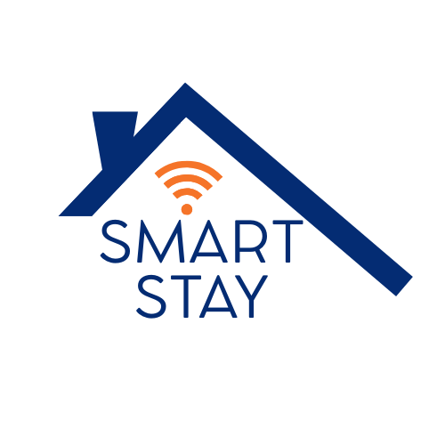

- **Logo Modo Oscuro:** Se trata de una variante diseñada para utilizarse sobre fondos oscuros, favoreciendo el contraste visual, el descanso de la vista y, además, el ahorro de batería en ciertos dispositivos.


- **Logo Plus:** Es una versión del logotipo con una tonalidad que transmite mayor sofisticación y se utiliza para identificar a los usuarios que optan por la suscripción plus del servicio.

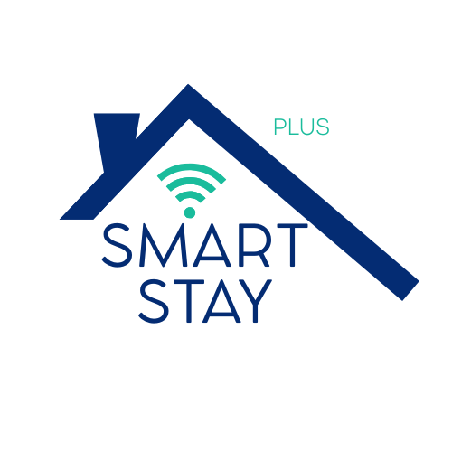

- **Logo Plus Modo Oscuro:** Mantiene la misma finalidad del logo en modo oscuro, pero adaptado específicamente para la versión plus del servicio.

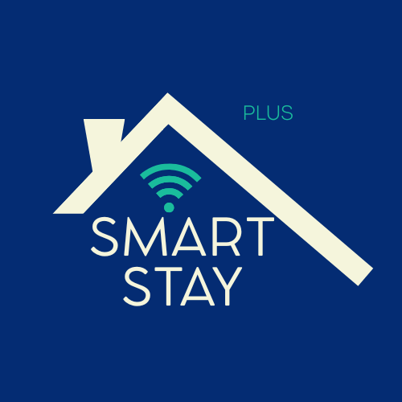

- **Logos Monocromáticos:** Son versiones en blanco y negro pensadas para usos especiales, como impresiones o documentación formal.

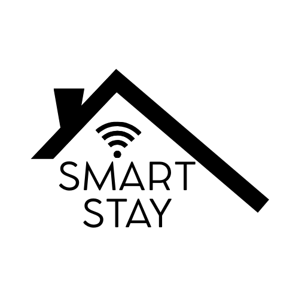
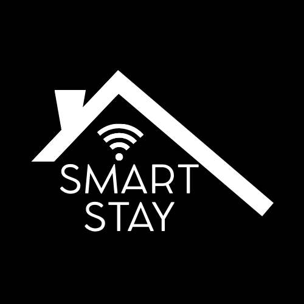

**Colores**

La paleta toma como referencia el logotipo y los mockups de Smart Stay. Cada color tiene una función definida y no debe utilizarse como único indicador de estado.

| Rol | Aplicación |
|---|---|
| Azul corporativo | Identidad, navegación, encabezados y superficies que requieren énfasis. |
| Naranja de acento | Llamadas a la acción y elementos interactivos prioritarios; se reserva para no competir con el contenido. |
| Blanco y neutros claros | Fondos de lectura y separación de secciones. |
| Colores semánticos | Estados como disponible, ocupado, pendiente o mantenimiento; siempre acompañados por etiqueta o icono. |

Los contrastes de texto y controles deben cumplir los criterios de accesibilidad indicados en la sección 6.1.2. Los colores exactos se deben mantener como tokens compartidos, tomando los archivos de marca como referencia y evitando variaciones locales entre plataformas.

**Espaciado y composición**

Se utilizará una escala base de 8 px, con un paso auxiliar de 4 px para ajustes pequeños. Los valores de referencia son **4, 8, 16, 24, 32 y 48 px**: 4–8 px para elementos relacionados, 16–24 px entre controles y bloques, y 32–48 px para separar secciones. La escala se adapta al tamaño de pantalla sin reducir el área táctil ni la legibilidad.

**Tono de comunicación**

Smart Stay se comunica de manera **profesional y cálida**, con un tono respetuoso, sereno y directo. El lenguaje debe ser claro y cercano, sin expresiones irreverentes ni alarmistas. Los mensajes dirigidos al staff priorizan brevedad y acción; los dirigidos al huésped son acogedores y tranquilizadores. Los errores indican qué ocurrió y qué puede hacer la persona para continuar.

**Repositorio visual compartido**

Los logotipos, wireframes y mockups de este capítulo se mantienen centralizados en `assets/images/cap6/`, que funciona como referencia común del equipo. Las fuentes Cocomat Pro, Open Sans o Lato y los tokens de color y espaciado deben documentarse y reutilizarse en web y móvil; los archivos tipográficos solo se incorporarán al repositorio cuando se cuente con permiso de distribución.

**Tipografía**

- **Fuente principal (Brand & Titles):**  
  **Cocomat Pro**  
  **Uso:** Logo, encabezados y títulos principales dentro de la app o la web.  
  **Razón:** Aporta una apariencia moderna y premium, con una estética limpia que fortalece la identidad visual de la marca.

- **Fuente secundaria (Text & Paragraphs):**  
  **Open Sans o Lato**  
  **Uso:** Textos descriptivos, botones, menús, correos y cualquier bloque de contenido extenso.  
  **Razón:** Son fuentes muy legibles en pantalla, versátiles y complementan la elegancia de Cocomat Pro sin restarle protagonismo.

- **Jerarquía de uso**
1. Títulos (H1, H2): Cocomat Pro Bold.
2. Subtítulos / énfasis: Cocomat Pro Medium.
3. Texto general / párrafos: Open Sans Regular.
4. Botones y menús: Open Sans SemiBold. 

- **Sistema Tipográfico**
  - **H1 (Títulos principales):** Cocomat Pro Bold – 32px  
  - **H2 (Subtítulos / secciones):** Cocomat Pro Medium – 24px  
  - **H3 (Bloques / cards):** Cocomat Pro Medium – 20px  
  - **Texto cuerpo (párrafos):** Open Sans Regular – 16px  
  - **Texto secundario / notas:** Open Sans Regular – 14px  
  - **Botones primarios:** Open Sans SemiBold – 16px (MAYÚSCULAS)

#### 6.1.2. Web, Mobile & Devices Style Guidelines 

Smart Stay ofrece una experiencia coherente en tres puntos de contacto: la Landing Page desarrollada para web, la aplicación web administrativa y las aplicaciones móviles nativas. La interfaz de cada canal se adapta a las tareas y al contexto de uso de sus usuarios, manteniendo los mismos principios de marca, lenguaje visual y retroalimentación.

| Canal | Usuario y contexto principal | Criterio de diseño |
|---|---|---|
| Landing Page web (HTML5/JS) | Visitantes que buscan conocer la propuesta de Smart Stay desde distintos dispositivos. | Diseño responsive, navegación simple y llamadas a la acción visibles sin desplazar contenido esencial. |
| Aplicación web administrativa | Administradores que consultan reportes y gestionan reservas, habitaciones e incidencias. | Priorizar la lectura rápida, la comparación de datos y la ejecución eficiente de tareas; adaptar tablas y navegación a pantallas estrechas. |
| Aplicación Android nativa (Kotlin) | Personal operativo que consulta habitaciones, recibe alertas y actualiza tareas durante sus recorridos. | Acciones frecuentes accesibles con una mano, estados operativos reconocibles de inmediato y controles apropiados a Android. |
| Aplicación móvil multiplataforma (Flutter) | Huéspedes que gestionan su estancia y solicitan servicios desde su teléfono. | Flujos breves y guiados, controles de habitación comprensibles y acceso directo a servicios, preferencias y comunicación con el hotel. |

**Principios visuales compartidos**

- **Identidad consistente:** utilizar las variantes del logotipo, la paleta cromática y las familias tipográficas definidas en la sección 6.1.1. Cocomat Pro se reserva para encabezados y títulos; Open Sans o Lato se utiliza en contenido, formularios, navegación y controles.
- **Jerarquía y legibilidad:** presentar primero la información necesaria para la tarea actual. Mantener títulos, etiquetas y acciones con jerarquías consistentes y evitar bloques extensos de texto en pantallas operativas.
- **Componentes y estados coherentes:** botones, campos, avisos, navegación y estados de reserva o habitación deben conservar el mismo significado en web y móvil, aunque su disposición se adapte al dispositivo.
- **Color con significado accesible:** emplear los colores de marca para identidad y énfasis, y colores semánticos para estados como disponible, ocupado, pendiente o mantenimiento. Acompañar siempre el color con texto, icono o forma; nunca comunicar el estado únicamente mediante color.
- **Modo claro y oscuro:** utilizar las variantes de logotipo apropiadas para el fondo y conservar contraste suficiente en ambos modos. La información, los estados y las acciones disponibles deben ser equivalentes.

**Diseño responsive para web**

La web se plantea con enfoque *mobile-first*: el contenido se organiza primero para espacios reducidos y luego se amplía cuando existe más área disponible. Los siguientes rangos son referencias de composición, no dimensiones rígidas; el diseño debe responder al espacio real del contenido.

| Referencia de ancho | Adaptación esperada |
|---|---|
| Menos de 600 px | Una columna; navegación compacta; acciones principales visibles; formularios apilados; tablas administrativas convertidas en listas o tarjetas con los datos prioritarios. |
| De 600 a 1023 px | Dos columnas cuando mejoren la lectura; filtros y paneles secundarios pueden agruparse o colapsarse; conservar controles con área táctil suficiente. |
| Desde 1024 px | Aprovechar el espacio para navegación persistente, tablas comparativas y paneles de resumen, sin estirar innecesariamente líneas de texto ni controles. |

En la Landing Page, las secciones y los elementos visuales deben reordenarse sin perder el acceso a la navegación ni a las llamadas a la acción. En la aplicación administrativa, filtros, reportes y tablas deben mantener etiquetas visibles, permitir identificar rápidamente cada registro y ofrecer una alternativa usable cuando no haya espacio para mostrar todas las columnas.

**Aplicaciones móviles y dispositivos**

- Mantener la navegación principal y las acciones frecuentes en posiciones predecibles. En la app del huésped, priorizar la estancia activa, los servicios y el control de la habitación; en la app del staff, priorizar tareas, habitaciones, incidencias y notificaciones.
- Diseñar objetivos táctiles de al menos **48 × 48 dp** en Android y proporcionar separación entre acciones cercanas. No depender de gestos ocultos: toda acción importante debe contar con un control visible.
- Solicitar permisos del dispositivo (por ejemplo, notificaciones o Bluetooth, cuando una función lo requiera) en el contexto de uso y explicar su propósito antes de abrir el diálogo del sistema. La denegación de un permiso no debe bloquear funciones que no dependan de él.
- Adaptar las vistas a orientación vertical y horizontal cuando aporte valor, especialmente en paneles o reportes. En teléfonos pequeños, priorizar el contenido esencial; en tabletas, aprovechar el espacio adicional sin convertir cada pantalla en una versión ampliada del teléfono.
- Respetar las convenciones de cada plataforma para navegación, teclado, áreas seguras, retroceso y controles del sistema, manteniendo los patrones de marca y la terminología comunes a Smart Stay.

**Referencias visuales de las aplicaciones móviles nativas**

Los siguientes mockups muestran cómo se aplican la identidad compartida y la navegación táctil a las tareas diferenciadas de cada perfil.

*Smart Stay Staff: acceso, tareas, reservas y perfil operativo.*

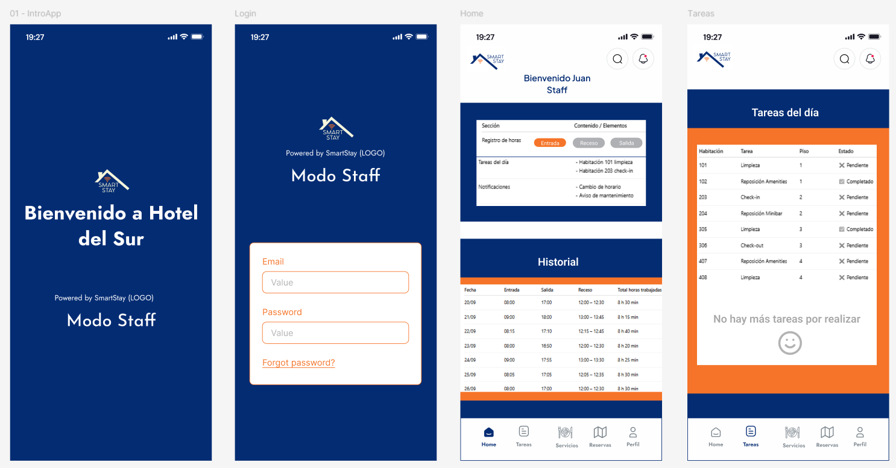
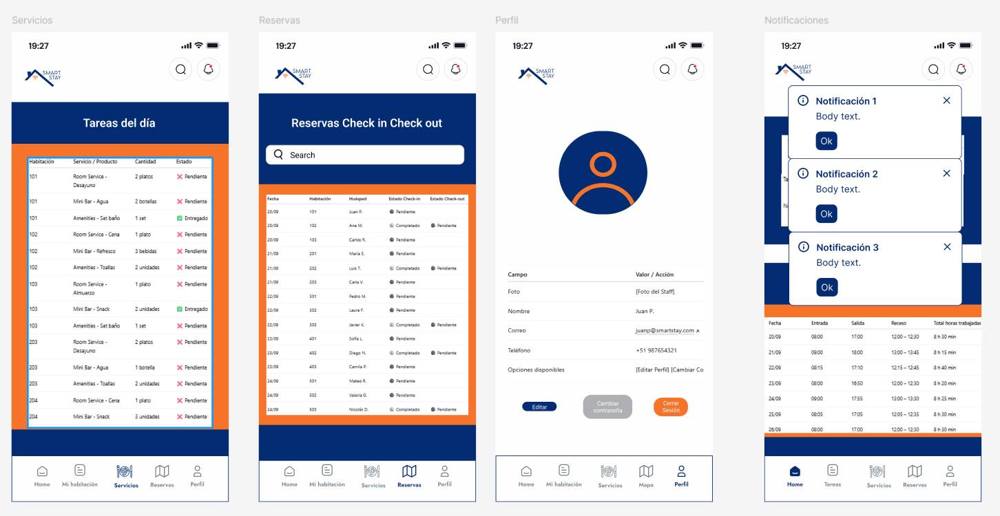

*Smart Stay Guest: búsqueda, habitación, servicios y perfil del huésped.*

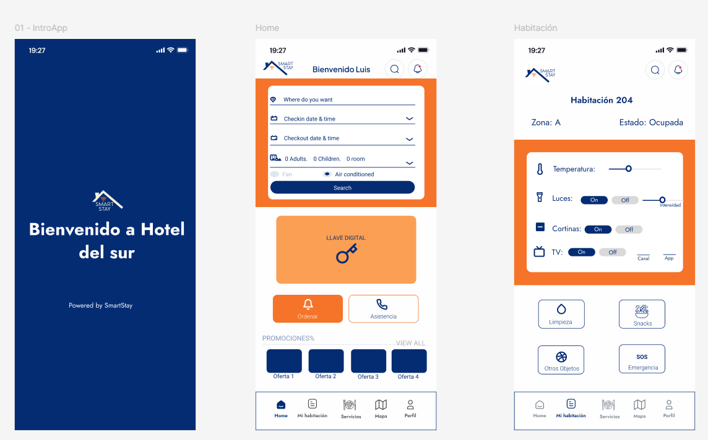
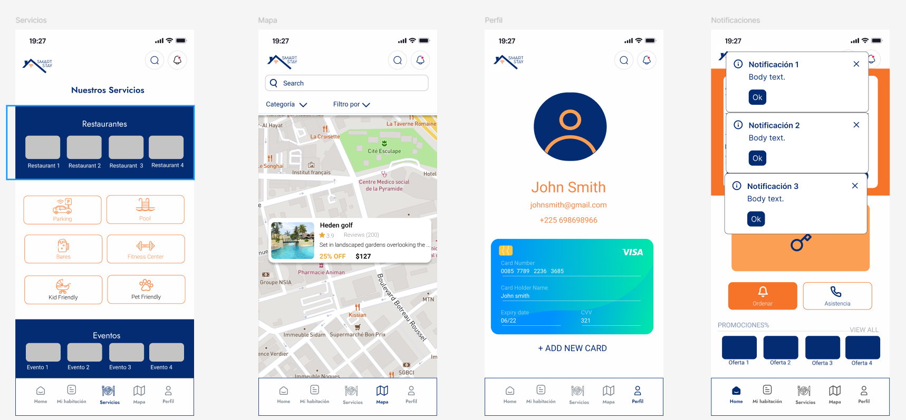

**Interacción con habitaciones y dispositivos IoT**

Los controles de iluminación, temperatura, acceso y conectividad deben mostrar el valor o estado actual del dispositivo y distinguir claramente entre la acción solicitada y la confirmación recibida. Al enviar un comando, la interfaz informa que está procesándolo; solo indica que se completó cuando recibe confirmación. Si el dispositivo no responde o la conexión se interrumpe, se presenta un mensaje comprensible, el último estado conocido con su hora de actualización y una opción para reintentar cuando corresponda. Las acciones de acceso y otras operaciones sensibles requieren confirmación explícita y retroalimentación visible.

**Accesibilidad y retroalimentación**

- Mantener como objetivo de conformidad **WCAG 2.2 nivel AA** para las interfaces web: contraste mínimo de 4.5:1 para texto normal y 3:1 para texto grande, además de navegación por teclado y foco visible.
- Proporcionar etiquetas accesibles a iconos y controles, orden de lectura lógico y compatibilidad con lectores de pantalla. No usar el placeholder como única etiqueta de un campo.
- Permitir ampliación de texto y evitar que el contenido o las acciones se recorten al aumentar el tamaño de fuente. Usar lenguaje claro para explicar errores, sus causas cuando se conozcan y el siguiente paso disponible.
- Dar respuesta perceptible a acciones como iniciar sesión, confirmar check-in, enviar una solicitud, cambiar el estado de una habitación o controlar un dispositivo. Las notificaciones deben indicar el evento y su relevancia sin interrumpir tareas no relacionadas.

Estas directrices se aplican a los wireframes y mockups de la sección 6.3 y sirven como referencia compartida para evolucionar la Landing Page, la aplicación administrativa y las aplicaciones móviles sin perder consistencia ni adecuación a cada contexto de uso.

### 6.2 Information Architecture

#### 6.2.1 Organization Systems

La organización combina jerarquía de navegación, secuencias para tareas y vistas matriciales para comparar datos. La categorización depende del tipo de información y del perfil que la consume, de modo que Landing Page, staff y huésped encuentran primero lo más relevante para su objetivo.

| Grupo de información | Organización visual | Esquema de categorización | Justificación |
|---|---|---|---|
| Landing Page: Home, Products, Solutions, Prices, Success Stories y Resources | Jerárquica: navegación principal, secciones y contenido de cada sección. | Por tópicos y orientada a la audiencia visitante. | Facilita explorar la propuesta desde información general hasta productos, planes y recursos. |
| Módulos de staff: Dashboard, Rooms, Bookings, Tasks, Reports y Notifications | Jerárquica por módulo; matricial en listados de habitaciones, reservas y tareas. | Según audiencia (staff) y por estado operativo. | Permite supervisar varias entidades y comparar su estado sin perder el contexto del hotel. |
| Funciones del huésped: Check-in, My Room, Services, Requests y Check-out | Secuencial en check-in/check-out y solicitud de servicios; jerárquica para acceder a la estancia y sus funciones. | Según audiencia (huésped) y por tópicos de estancia. | Acompaña tareas con un inicio, confirmación y estado final claros. |
| Reservas, tareas y notificaciones | Listas cronológicas, ordenadas por fecha o vencimiento; filtros por estado y prioridad cuando corresponda. | Cronológico y por estado. | Ayuda a identificar primero llegadas próximas, tareas pendientes y eventos recientes. |
| Catálogos extensos de servicios o recursos | Categorías por tema; orden alfabético como alternativa dentro de una categoría extensa. | Por tópicos y, secundariamente, alfabético. | Reduce el esfuerzo de exploración y permite localizar elementos conocidos. |

En pantallas pequeñas se conserva el mismo orden lógico, pero se reemplazan matrices densas por listas o tarjetas; los flujos secuenciales muestran el paso actual y permiten volver sin perder los datos ya ingresados.

### UX Heuristics & Principles Evaluation

### Usability – Inclusive Design – Information Architecture

- **CARRERA:** Ingeniería de Software  
- **CURSO:** Aplicaciones para Dispositivos Móviles  
- **SECCIÓN:** 7454  
- **PROFESOR:** Jorge Luis Mayta Guillermo  
- **AUDITOR:** Equipo Smart Stay  
- **CLIENTE(S):** Administradores de Hoteles Boutique y Huéspedes de Hoteles  
- **SITE o APP A EVALUAR:** Smart Stay Mobile Application  

---

### TAREAS A EVALUAR

#### Segmento Objetivo #1: Staff Operativo de Hoteles (Administradores y Personal)

- Gestión de habitaciones: visualización en tiempo real del estado (disponible, ocupado, mantenimiento).
- Coordinación de tareas de limpieza: asignación rápida y seguimiento de housekeeping.
- Notificaciones operativas: alertas sobre incidencias, check-in/check-out y solicitudes de huéspedes.
- Reportes operativos: acceso a métricas de ocupación y estado del hotel.
- Control de incidencias: registro y seguimiento de problemas técnicos en habitaciones.

---

#### Segmento Objetivo #2: Huéspedes de Hoteles

- Check-in / Check-out digital: proceso rápido y sin contacto desde la aplicación.
- Control de habitación: manejo de dispositivos IoT (iluminación, temperatura, Wi-Fi).
- Solicitud de servicios: acceso a room service, limpieza y soporte técnico.
- Personalización de la experiencia: configuración de preferencias durante la estancia.
- Comunicación con el hotel: contacto directo mediante canales digitales.

---

### No incluidas en esta versión de la evaluación:

- Integración con sistemas financieros avanzados (facturación completa).
- Conexión con plataformas externas (marketplaces o agencias de viaje).
- Funcionalidades de marketing interno del hotel.

---

### ESCALA DE SEVERIDAD

| Nivel | Descripción |
|------|------------|
| 1 | Problema leve: no afecta significativamente la experiencia. |
| 2 | Problema moderado: genera fricción ocasional en el uso. |
| 3 | Problema grave: afecta la eficiencia del usuario de forma recurrente. |
| 4 | Problema crítico: impide completar tareas principales dentro de la app. |

---

### TABLA RESUMEN

| # | Problema | Escala de severidad | Heurística/Principio violado |
|--|----------|---------------------|-----------------------------|
| 1 | Dificultad para visualizar el estado de habitaciones en tiempo real | 3 | Visibilidad del estado del sistema |
| 2 | Notificaciones poco configurables para el staff | 2 | Flexibilidad y eficiencia de uso |
| 3 | Navegación poco clara entre módulos principales | 3 | Consistencia y estándares |
| 4 | Exceso de pasos en el proceso de check-in digital | 2 | Minimizar carga cognitiva |
| 5 | Falta de retroalimentación inmediata en acciones del usuario | 3 | Feedback del sistema |
| 6 | Opciones de personalización poco visibles para huéspedes | 2 | Reconocimiento antes que recuerdo |

---

### ANÁLISIS GENERAL

La arquitectura de información de Smart Stay presenta una estructura basada en tareas y roles, lo que facilita la segmentación entre usuarios internos (staff) y externos (huéspedes). Sin embargo, se identifican oportunidades de mejora en la claridad de navegación, visibilidad del estado del sistema y optimización de flujos críticos como el check-in digital.

Se concluye que una correcta reorganización de la jerarquía de información y mejora en la retroalimentación visual permitirá reducir la carga cognitiva del usuario y mejorar la eficiencia operativa del sistema.

#### 6.2.2 Labeling Systems

El sistema de etiquetado define cómo se nombran las secciones, botones y funcionalidades dentro de la aplicación, permitiendo que el usuario comprenda rápidamente el propósito de cada elemento. En Smart Stay, las etiquetas se diseñan bajo principios de claridad, consistencia y orientación al usuario, adaptándose tanto al Staff Operativo como a los Huéspedes.

---

| Etiqueta | Ubicación / Componente | Función |
|----------|------------------------|--------|
| Home | Header / Navegación principal | Redirige a la pantalla principal o dashboard. Permite acceso rápido al inicio. |
| Rooms | Menú principal / App | Acceso a la gestión de habitaciones (estado, disponibilidad, mantenimiento). |
| Services | Menú principal | Muestra los servicios disponibles (limpieza, room service, soporte). |
| Dashboard | Pantalla principal | Vista general del estado del sistema y resumen de operaciones. |
| Bookings | Módulo de reservas | Permite gestionar reservas activas y futuras. |
| Check-in | Flujo principal | Permite registrar la entrada del huésped de forma digital. |
| Check-out | Flujo principal | Permite finalizar la estancia del huésped de forma rápida. |
| Login | Pantalla de acceso | Inicio de sesión del usuario. Término estándar y reconocido. |
| Sign Up | Pantalla de acceso | Registro de nuevos usuarios. Corto, claro y amigable. |
| Try Demo | Landing Page (CTA) | Llamada a la acción principal para probar la aplicación. |
| My Room | App Huésped | Acceso al control de la habitación (IoT, temperatura, iluminación). |
| Requests | App Huésped | Permite solicitar servicios del hotel desde el móvil. |
| Tasks | App Staff | Gestión de tareas operativas (limpieza, mantenimiento). |
| Notifications | Icono / App | Muestra alertas en tiempo real sobre eventos importantes. |
| Profile | Menú usuario | Configuración de cuenta y preferencias del usuario. |
| Settings | Menú secundario | Ajustes generales del sistema. |
| Reports | App Staff | Acceso a métricas y reportes operativos del hotel. |
| Contact | Landing / App | Permite comunicación con el hotel o soporte técnico. |

Las etiquetas se mantienen cortas, consistentes y vinculadas al lenguaje habitual de cada perfil. Se evita usar dos términos distintos para la misma función y se prefiere nombrar las secciones con sustantivos y las acciones con verbos claros.

| Etiqueta principal | Etiquetas asociadas | Relación |
|---|---|---|
| Rooms | Availability, Occupied, Maintenance | Estados que describen la condición actual de una habitación. |
| Bookings | Check-in, Check-out, History | Acciones y consultas asociadas a una reserva. |
| My Room | Lighting, Temperature, Wi-Fi | Controles del ambiente y conectividad de la habitación. |
| Services | Room Service, Cleaning, Technical Support | Categorías de solicitudes disponibles para el huésped. |
| Tasks | Cleaning, Maintenance, Priority, Status | Tipo y seguimiento de una actividad asignada al staff. |

---

#### 6.2.3 Searching Systems

El sistema de búsqueda de Smart Stay permite a los usuarios localizar información, reservas, servicios y funcionalidades de manera rápida y eficiente. En la Landing Page, la búsqueda está orientada a descubrir contenido general sobre la plataforma, utilizando accesos directos, enlaces destacados y navegación guiada hacia secciones clave como “Try Demo” o “Benefits”.

En la aplicación móvil, el sistema de búsqueda es más funcional y está enfocado en la gestión de información específica. Permite a los usuarios filtrar y ordenar datos como habitaciones, reservas, servicios o tareas operativas, utilizando autocompletado, filtros dinámicos y persistencia de resultados. El diseño se basa en principios de usabilidad, consistencia y eficiencia, asegurando que el usuario encuentre lo que necesita sin dificultad.

---

| Search Type | Location / Component | Function |
|-------------|---------------------|----------|
| General Search | Landing Page / Header | Permite buscar información general sobre la plataforma y sus servicios (ej. "servicios", "demo", "beneficios"). Incluye autocompletado básico. |
| Try Demo / Benefits Links | Landing Page / Hero & Value Sections | Funciona como búsqueda indirecta, guiando al usuario hacia contenido relevante sin necesidad de ingresar texto. |
| Rooms Search | Mobile App / Rooms Section | Permite buscar habitaciones por número, estado (disponible, ocupado, mantenimiento) o tipo. |
| Bookings Search | Mobile App / Bookings Section | Filtrado por fechas, estado de reserva (pendiente, confirmada, cancelada) y tipo de cliente. |
| Services Search | Mobile App / Services Section | Permite buscar servicios disponibles (limpieza, room service, soporte técnico) mediante filtros y categorías. |
| Tasks Search | Mobile App / Staff Module | Permite al staff localizar tareas asignadas por prioridad, estado o tipo de actividad. |
| Notifications Search | Mobile App / Notifications Panel | Permite revisar alertas y eventos importantes mediante filtrado por tipo o fecha. |

**Presentación de resultados**

Los resultados conservan los filtros aplicados, muestran un conteo y permiten ordenar por el criterio más útil para la tarea. En móvil se presentan como listas o tarjetas; en la web administrativa pueden mostrarse como tablas con encabezados persistentes.

| Tipo de resultado | Datos visibles para reconocer cada resultado |
|---|---|
| Rooms | Número, tipo, estado y, cuando aplique, tarea activa. |
| Bookings | Huésped, habitación, fechas de estancia y estado de la reserva. |
| Services | Nombre, categoría, disponibilidad y acción para solicitar el servicio. |
| Tasks | Tipo de tarea, habitación, prioridad, vencimiento y estado. |
| Notifications | Fecha y hora, evento, habitación relacionada y estado de lectura. |

Cuando no haya coincidencias, la interfaz indica que no encontró resultados y permite limpiar o ajustar los filtros; no presenta una pantalla vacía sin explicación.

---

#### 6.2.4 SEO Tags, Meta Tags y ASO Elements

Los SEO tags y meta tags son elementos fundamentales dentro de la Landing Page de Smart Stay, ya que permiten mejorar la visibilidad del sistema en motores de búsqueda, facilitar su indexación y optimizar la forma en que se presenta tanto en resultados de búsqueda como en redes sociales.

Además, estos elementos son clave para garantizar una correcta visualización en dispositivos móviles, mejorar la experiencia del usuario y aumentar la tasa de interacción (CTR).

La Landing Page de Smart Stay implementa etiquetas esenciales como: charset, viewport, title, description, keywords y favicon, las cuales permiten estructurar correctamente la información del sitio.

---

### Meta charset

```html
<meta charset="UTF-8">
```

- Define la codificación de caracteres de la página.
- Permite que el contenido se muestre correctamente, incluyendo tildes, símbolos y caracteres especiales.
- Es fundamental para evitar errores de visualización en distintos navegadores.

---

### Meta viewport

```html
<meta name="viewport" content="width=device-width, initial-scale=1.0">
```

- Permite que la página sea responsive.
- Ajusta automáticamente el contenido al tamaño de la pantalla del dispositivo.
- Mejora la experiencia de usuario en smartphones y tablets.

---

### Title

```html
<title>Smart Stay</title>
```

- Define el título de la página que aparece en la pestaña del navegador.
- Es uno de los factores más importantes para SEO.
- Se muestra como encabezado principal en los resultados de búsqueda.

---

### 1. Meta Tags principales

- **charset:** Define la codificación del documento. UTF-8 es el estándar actual.
- **viewport:** Permite adaptar la página a diferentes dispositivos y resoluciones.
- **description:** Proporciona un resumen del contenido de la página. Es el texto que aparece debajo del título en los resultados de búsqueda.
- **keywords:** Lista de palabras clave relacionadas con el sistema (ej. hotel management, mobile app, IoT hotel).
- **author:** Identifica al creador del contenido (Smart Stay Team).

---

### 2. Meta Tags para Redes Sociales (Open Graph)

```html
<meta property="og:title" content="Smart Stay">
<meta property="og:description" content="Solución móvil para gestión hotelera con IoT">
<meta property="og:image" content="assets/logo.png">
<meta property="og:url" content="https://smartstay.com">
```

- Permiten controlar cómo se muestra la página al compartirla en redes sociales.
- Mejoran la apariencia visual del enlace (imagen, título y descripción).
- Aumentan la probabilidad de interacción del usuario.

---

### 3. Otros elementos importantes

**Favicon:**

```html
<link rel="icon" href="assets/favicon.png">
```

- Representa el icono del sitio en la pestaña del navegador.
- Refuerza la identidad visual de la marca.

**Canonical URL:**

```html
<link rel="canonical" href="https://smartstay.com">
```

- Evita problemas de contenido duplicado en buscadores.

Los siguientes valores son una propuesta para la publicación. Se debe reemplazar `smartstay.com` por el dominio definitivo antes del despliegue y emplear las descripciones y palabras clave correspondientes a cada página.

### Valores SEO por página

| Página | Title | Description | Keywords |
|---|---|---|---|
| Home | Smart Stay | Gestión hotelera inteligente | Gestión hotelera para hoteles boutique: habitaciones, servicios y control IoT desde una plataforma digital. | Smart Stay, gestión hotelera, hotel boutique, IoT hotelero |
| Products | Productos para hoteles | Smart Stay | Conoce las herramientas de Smart Stay para reservas, habitaciones, servicios y operación hotelera. | software hotelero, PMS, reservas, housekeeping, Smart Stay |
| Solutions | Soluciones hoteleras | Smart Stay | Optimiza la operación del hotel y mejora la estancia de tus huéspedes con soluciones conectadas. | soluciones hoteleras, automatización hotel, experiencia huésped, IoT |
| Prices | Planes y precios | Smart Stay | Compara los planes de Smart Stay y encuentra las funcionalidades que necesita tu hotel. | planes software hotelero, precios, gestión hotel boutique |
| Success Stories | Casos de éxito | Smart Stay | Conoce cómo hoteles y huéspedes aprovechan Smart Stay durante la operación y la estancia. | casos de éxito hoteleros, testimonios, Smart Stay |
| Resources | Recursos para hoteles | Smart Stay | Guías y contenidos sobre gestión hotelera, experiencia del huésped y tecnología IoT. | recursos hoteleros, guías hotel, gestión hotelera, IoT |
| Register / Login | Acceso a Smart Stay | Regístrate o inicia sesión para acceder a los servicios de Smart Stay. | No se prioriza su indexación; aplicar `noindex` a las páginas de acceso. |
| Aplicación administrativa | Smart Stay Admin | Dashboard | Acceso privado para la operación y administración del hotel. | Página privada; aplicar `noindex, nofollow` y excluirla del sitemap público. |

En cada página pública se definen también `author` como “Equipo Smart Stay” y `robots` como `index,follow`. Para páginas de acceso y áreas autenticadas, se usa `noindex` para evitar exponer contenido privado o de escaso valor de búsqueda.

```html
<meta name="description" content="Gestión hotelera para hoteles boutique: habitaciones, servicios y control IoT desde una plataforma digital.">
<meta name="keywords" content="Smart Stay, gestión hotelera, hotel boutique, IoT hotelero">
<meta name="author" content="Equipo Smart Stay">
<meta name="robots" content="index,follow">
```

### ASO para aplicaciones móviles

Los textos siguientes son propuestas para las fichas de las aplicaciones nativas. Las palabras clave se incorporan a la descripción y a los campos que permita cada tienda; si la tienda no ofrece un campo específico de keywords, no se debe asumir que existe una etiqueta equivalente.

| Elemento ASO | Smart Stay Staff (Android/Kotlin) | Smart Stay Guest (Flutter) |
|---|---|---|
| App Title | Smart Stay Staff | Smart Stay Guest |
| App subtitle | Gestión hotelera en movimiento | Tu estancia, a tu manera |
| App keywords | gestión hotelera, habitaciones, housekeeping, tareas, reservas | hotel, huésped, check-in digital, room service, habitación inteligente |
| App description | Aplicación para que el personal del hotel consulte habitaciones, coordine tareas, atienda incidencias y reciba notificaciones operativas. | Aplicación para que los huéspedes gestionen su estancia, realicen check-in, controlen funciones IoT de su habitación y soliciten servicios al hotel. |

---

#### 6.2.5 Navigation Systems

El sistema de navegación de Smart Stay define cómo los usuarios se desplazan dentro de la plataforma, permitiendo acceder a las distintas secciones de forma clara, rápida e intuitiva. Este sistema está diseñado bajo principios de consistencia, accesibilidad y eficiencia, adaptándose tanto a la Landing Page como a la aplicación móvil.

---

### Landing Page Navigation

| Navigation Item | Location / Component | Function |
|-----------------|----------------------|----------|
| Home | Header | Enlace a la página principal. Permite regresar al inicio desde cualquier sección. |
| Services | Header | Acceso directo a la sección de servicios ofrecidos por la plataforma. |
| Benefits | Header / Value Section | Redirige a la sección donde se explican las ventajas del sistema. |
| Contact | Header | Permite acceder al formulario de contacto o soporte. |
| Sign Up | Header (button) | Registro de nuevos usuarios. Botón destacado visualmente. |
| Login | Header (button) | Acceso a la cuenta del usuario. Fácil de localizar. |
| Try Demo | Hero Section (CTA principal) | Llamada a la acción principal para probar la plataforma. |
| About | Footer / Company | Información institucional de Smart Stay. |
| Privacy Policy | Footer / Legal | Acceso a políticas de privacidad del sistema. |
| Terms & Conditions | Footer / Legal | Información sobre condiciones de uso de la plataforma. |

---

### Mobile Application Navigation

| Navigation Item | Location / Component | Function |
|-----------------|----------------------|----------|
| Dashboard | Bottom Navigation | Vista general del sistema con información resumida. |
| Rooms | Bottom Navigation | Acceso a la gestión y estado de habitaciones. |
| Services | Bottom Navigation | Permite visualizar y solicitar servicios disponibles. |
| Profile | Bottom Navigation | Configuración del usuario y preferencias personales. |
| Notifications | Top Bar / Icon | Acceso a alertas y eventos importantes en tiempo real. |
| Tasks | Staff Module | Permite gestionar tareas operativas asignadas al personal. |
| Bookings | App Module | Acceso a reservas activas, historial y gestión de huéspedes. |
| Back Navigation | App Screens | Permite regresar a la pantalla anterior de forma intuitiva. |

**Recorridos principales**

- **Visitante de la Landing Page:** Home → Products o Solutions → Prices / Success Stories / Resources → Try Demo o Sign Up. La navegación del encabezado permite saltar directamente a cada sección y el footer da acceso a información institucional y legal.
- **Staff:** Login → Dashboard → Rooms o Tasks → detalle de habitación/tarea → actualización de estado o registro de incidencia. Las notificaciones enlazan con el evento relacionado y la navegación persistente permite volver a los módulos principales.
- **Huésped:** Login o Check-in → estancia activa → My Room o Services → control IoT o solicitud → confirmación y seguimiento → Check-out. En cada flujo se muestra el estado actual y una acción visible para volver o continuar.

---

### 6.3 Landing Page UI Design

El diseño de la interfaz de la Landing Page de Smart Stay tiene como objetivo principal presentar de manera clara y atractiva la propuesta de valor del sistema, captando la atención del usuario desde el primer contacto. Esta página funciona como el punto de entrada al producto, por lo que su diseño está orientado a la conversión, usabilidad y comprensión inmediata del servicio.

Se aplican principios de diseño centrado en el usuario, jerarquía visual y accesibilidad, permitiendo que tanto potenciales clientes (hoteles) como usuarios finales (huéspedes) comprendan rápidamente los beneficios de la solución.

La propuesta traduce la arquitectura de información en una navegación pública orientada al descubrimiento (Home, Products, Solutions y Prices) y en acciones claras de conversión (Try Demo y Sign Up). Los wireframes y mockups mantienen esta jerarquía y aplican el sistema visual de la sección 6.1.1. La experiencia privada se diferencia por perfil: la solución Android para staff prioriza la operación y la solución Flutter para huéspedes prioriza la estancia, los servicios y el control IoT; ambas consumen los servicios de Smart Stay definidos en las decisiones arquitectónicas.

#### 6.3.1 Landing Page Wireframe

Los wireframes de la Landing Page de Smart Stay definen la estructura base de navegación, asegurando que cada sección tenga un propósito claro dentro de la experiencia del usuario. Cada pantalla está diseñada para guiar al usuario desde el descubrimiento hasta la acción (registro o uso del sistema).

Los recursos gráficos disponibles no contienen pares de capturas etiquetados para Desktop Web Browser y Mobile Web Browser. La siguiente matriz especifica la adaptación de los wireframes para ambos tamaños; las imágenes existentes son referencias de estructura y no se deben interpretar como dos variantes visuales.

| Elemento | Desktop Web Browser | Mobile Web Browser |
|---|---|---|
| Header y navegación | Logotipo, enlaces principales y acciones Sign Up/Login en una barra horizontal. | Logotipo y menú compacto; abrir la navegación con un control visible y conservar Try Demo como acción prioritaria. |
| Home y hero | Mensaje, imagen y CTA pueden distribuirse en columnas; las secciones siguen una jerarquía vertical clara. | Apilar mensaje e imagen; presentar el valor y el CTA antes del contenido secundario. |
| Products, Solutions, Success Stories y Resources | Organizar módulos en una cuadrícula y permitir comparar tarjetas en paralelo. | Convertir la cuadrícula en una columna, con títulos y acciones visibles sin desplazamiento horizontal. |
| Prices | Comparar planes y funcionalidades en columnas con encabezados persistentes. | Mostrar planes como bloques verticales; cada funcionalidad debe permanecer asociada a su plan. |
| Register y Login | Formulario centrado y acotado, con etiquetas y ayuda junto a cada campo. | Formulario de una columna, controles de ancho disponible, etiquetas persistentes y teclado adecuado al dato solicitado. |
| Footer | Enlaces agrupados en columnas por categoría. | Grupos apilados o plegables, manteniendo visibles contacto y enlaces legales. |
| Inclusión | Navegación por teclado, foco visible, orden de lectura lógico y contraste accesible. | Las mismas etiquetas y jerarquía, texto ampliable, objetivos táctiles suficientes y sin depender solo del color. |

---

### 1. Home

- **Propósito:** Página principal de presentación de Smart Stay.

- **Elementos clave:**
  - Encabezado con menú de navegación.
  - Hero con nombre de la plataforma y botón de llamada a la acción (CTA: Try Demo).
  - Sección “¿Quiénes somos?” con breve descripción.
  - Bloques de beneficios y características principales.
  - Footer con enlaces de contacto, políticas y redes sociales.

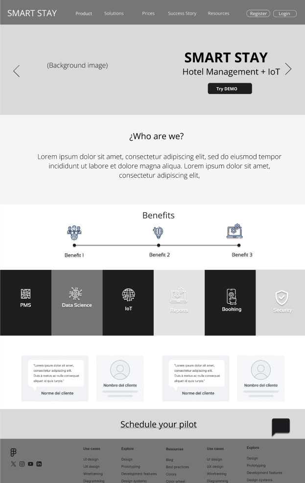

---

### 2. Products

- **Propósito:** Mostrar los productos principales que ofrece Smart Stay.

- **Elementos clave:**
  - Listado de productos o módulos del sistema.
  - Descripción breve de cada funcionalidad.
  - Íconos o ilustraciones representativas.
  - Enlaces para explorar cada producto.

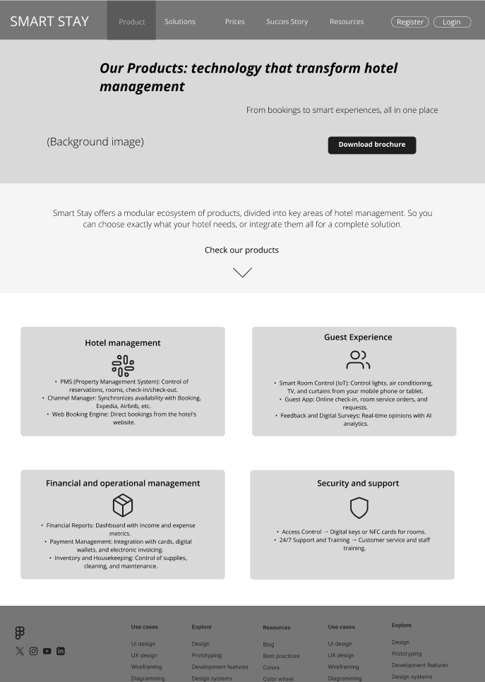

---

### 3. Solutions

- **Propósito:** Explicar cómo la plataforma resuelve problemas específicos del sector hotelero.

- **Elementos clave:**
  - Casos de uso del sistema.
  - Beneficios aplicados a situaciones reales.
  - Explicación de soluciones para gestión, automatización e IoT.


---

### 4. Prices

- **Propósito:** Presentar los planes o modelos de precios del sistema.

- **Elementos clave:**
  - Tabla de precios o planes.
  - Comparación de funcionalidades.
  - Botones de acción para suscripción.

---

### 5. Success Stories

- **Propósito:** Generar confianza mediante casos reales o testimonios.

- **Elementos clave:**
  - Opiniones de clientes.
  - Resultados obtenidos.
  - Fotografías o elementos visuales de respaldo.

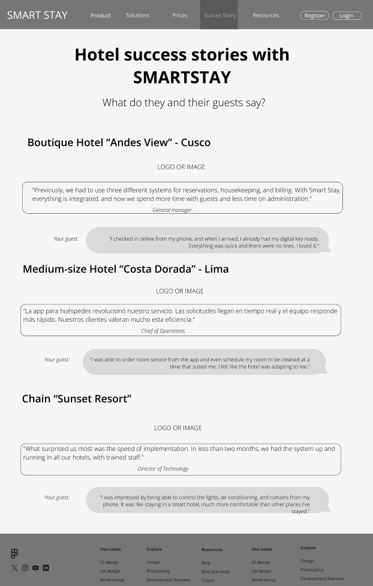

---

### 6. Resources

- **Propósito:** Proporcionar contenido de apoyo para el usuario.

- **Elementos clave:**
  - Guías o documentación.
  - Artículos o blogs.
  - Material informativo sobre el sistema.

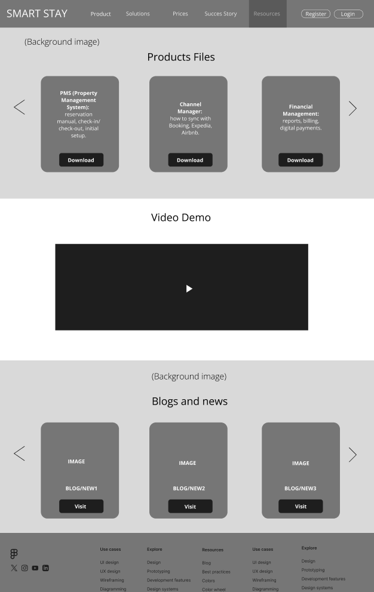

---

### 7. Register

- **Propósito:** Permitir el registro de nuevos usuarios.

- **Elementos clave:**
  - Formulario de registro.
  - Campos básicos (nombre, correo, contraseña).
  - Botón de creación de cuenta.

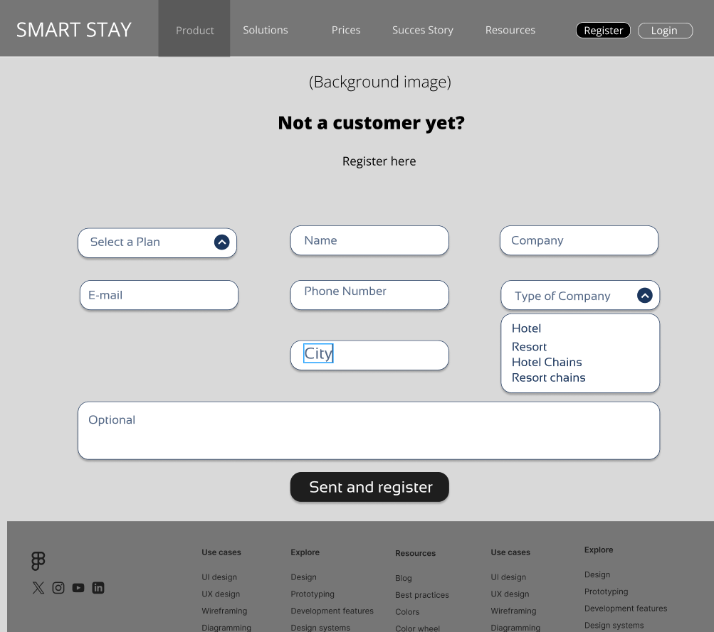

---

### 8. Login

- **Propósito:** Permitir el acceso a usuarios registrados.

- **Elementos clave:**
  - Formulario de inicio de sesión.
  - Campos de usuario y contraseña.
  - Opción de recuperación de contraseña.

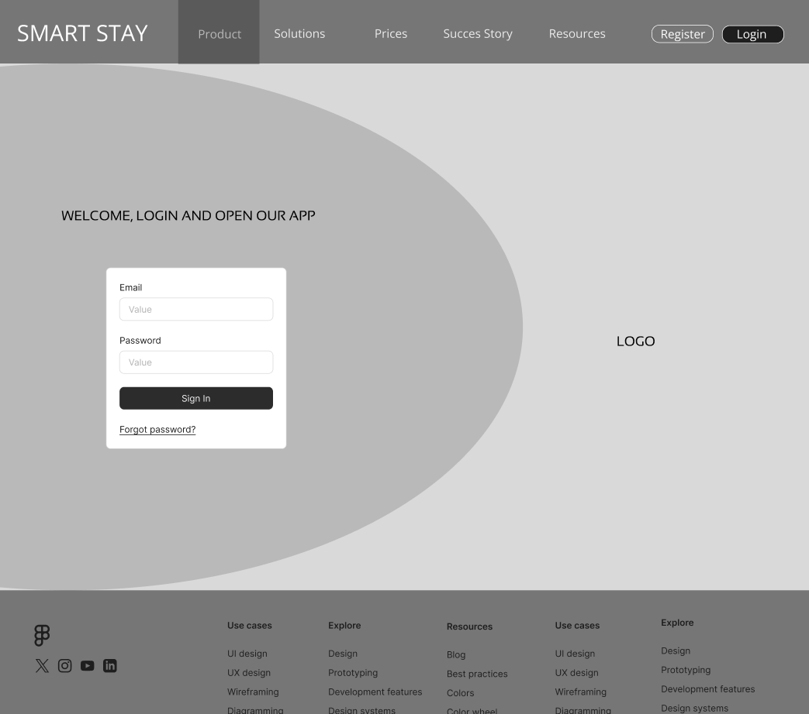

Los wireframes definen la base de navegación de Smart Stay, asegurando que cada sección tenga un propósito claro:

  - Home: captar atención y presentar la plataforma.
  - Productos, Soluciones, Precios: comunicar valor y opciones.
  - Casos de Éxito, Recursos: generar confianza y soporte.
  - Registro y Login: habilitar el acceso a la app.
---

### 6.3.2 Landing Page Mock-up

Los mockups aplican el branding, la tipografía y los colores definidos en la guía general, además de materializar la jerarquía del Landing Page. Para la versión móvil se conserva el mismo contenido y prioridad de acciones, adaptando la composición según la siguiente matriz.

| Sección | Desktop Web Browser | Mobile Web Browser |
|---|---|---|
| Home | Navegación horizontal y hero con contenido e imagen en paralelo cuando el ancho lo permita. | Navegación compacta, hero apilado y Try Demo visible antes de las secciones secundarias. |
| Products y Solutions | Tarjetas y bloques comparables en varias columnas. | Tarjetas en una columna y contenido resumido antes del detalle. |
| Prices | Planes comparables en columnas, con diferencias y CTA alineados. | Planes apilados, diferencias descritas dentro de cada bloque y CTA asociado a cada plan. |
| Success Stories y Resources | Testimonios y recursos organizados en cuadrículas o bloques paralelos. | Lectura secuencial, tarjetas de ancho completo y títulos descriptivos. |
| Register y Login | Formularios centrados, con ancho limitado y ayuda contextual. | Formularios de una columna, campos de ancho disponible y acciones fáciles de alcanzar. |

Las imágenes actualmente disponibles para Landing Page no incluyen un par de mockups web Desktop/Mobile para cada página, y tampoco hay archivos de mockup para Home y Login en esta carpeta. Por ello, esta matriz define el comportamiento de la adaptación pero no sustituye esas capturas; los mockups nativos de staff y huésped mostrados en 6.1.2 corresponden a aplicaciones móviles, no a la Landing Page.

1. Landing Page

- **Cambios respecto al wireframe:**
  - Se añadió el logotipo de Smart Stay en el header.
  - Paleta de colores aplicada (azul corporativo + tonos complementarios).
  - Imagen de fondo en el Hero con llamada a la acción resaltada (“Try demo”).
  - Iconografía personalizada para los beneficios.

---

2. Product

- **Cambios respecto al wireframe:**
  - Se añadieron tarjetas visuales para cada producto.
  - Uso de iconos representativos para mejorar la comprensión.
  - Aplicación de colores para diferenciar funcionalidades.
  - Mejor organización del contenido en bloques visuales.

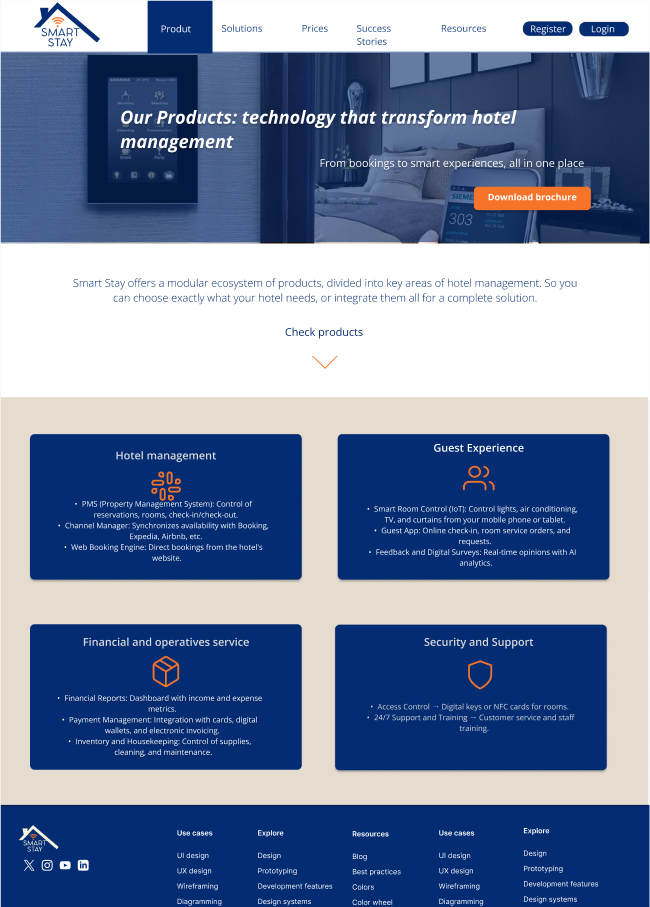

---

3. Solutions

- **Cambios respecto al wireframe:**
  - Se incorporaron secciones visuales para explicar soluciones específicas.
  - Uso de imágenes e iconografía para reforzar el contenido.
  - Reducción de texto y enfoque en contenido visual.
  - Mejora en la jerarquía de información.

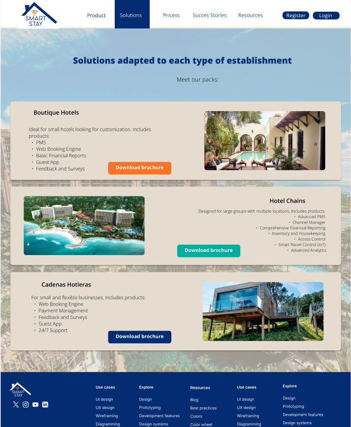

---

4. Prices

- **Cambios respecto al wireframe:**
  - Se implementaron tarjetas de precios con diseño diferenciado.
  - Inclusión de botones de acción para suscripción.
  - Mejora en la comparación entre planes.
  - Uso de colores para destacar el plan principal.

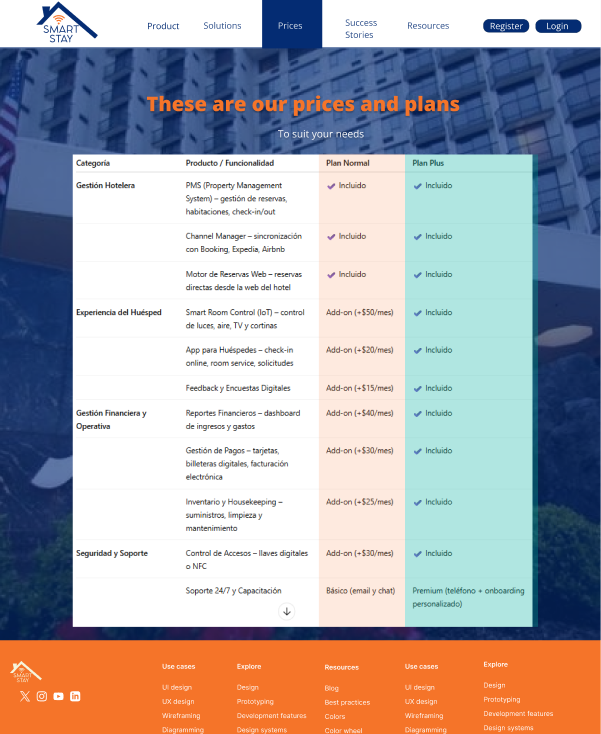

---

5. Success Stories

- **Cambios respecto al wireframe:**
  - Se añadieron testimonios con diseño visual.
  - Inclusión de imágenes o avatares de usuarios.
  - Mejora en la presentación para generar confianza.
  - Organización en bloques claros y legibles.

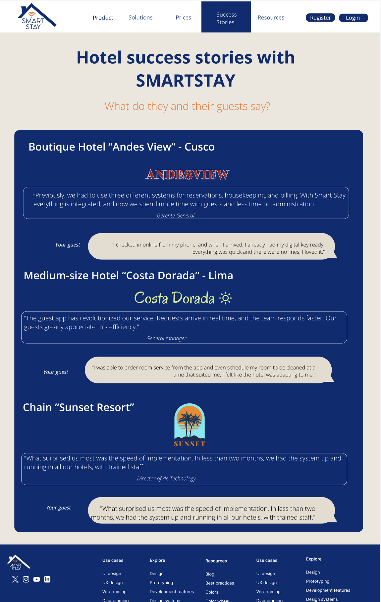

---

6. Resources

- **Cambios respecto al wireframe:**
  - Se estructuraron los recursos en tarjetas visuales.
  - Inclusión de iconos para cada tipo de contenido.
  - Mejora en la accesibilidad a la información.
  - Optimización del diseño para navegación rápida.

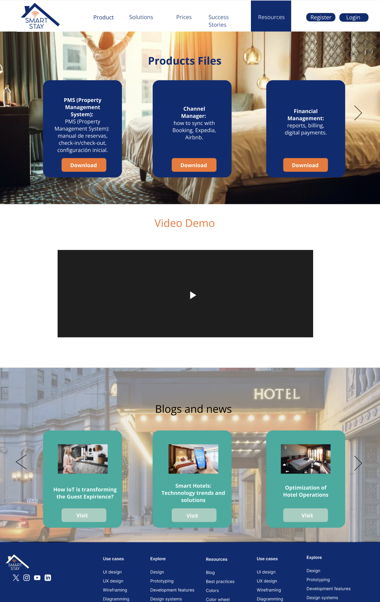

---

7. Register

- **Cambios respecto al wireframe:**
  - Mejora en el diseño del formulario de registro.
  - Aplicación de estilos a los campos de entrada.
  - Botón de registro visualmente destacado.
  - Optimización para dispositivos móviles.

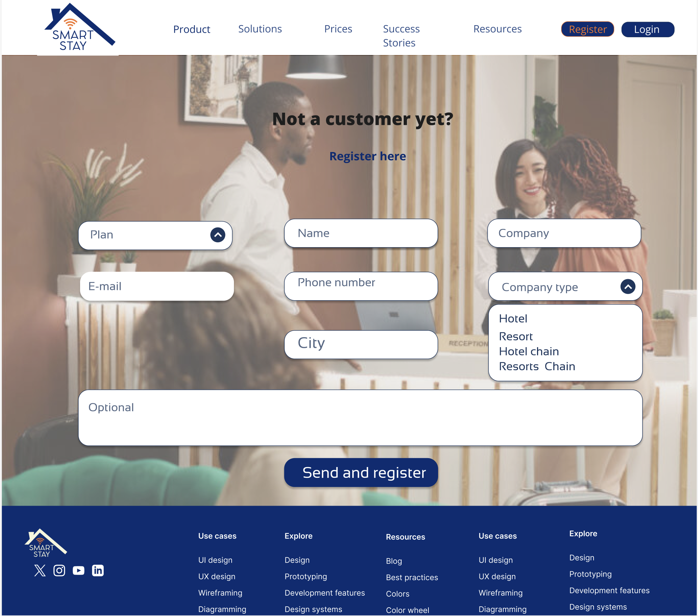

---

8. Login

- **Cambios respecto al wireframe:**
  - Simplificación del formulario de inicio de sesión.
  - Mejora en la visibilidad de los campos.
  - Inclusión de opción de recuperación de contraseña.
  - Diseño optimizado para acceso rápido.


